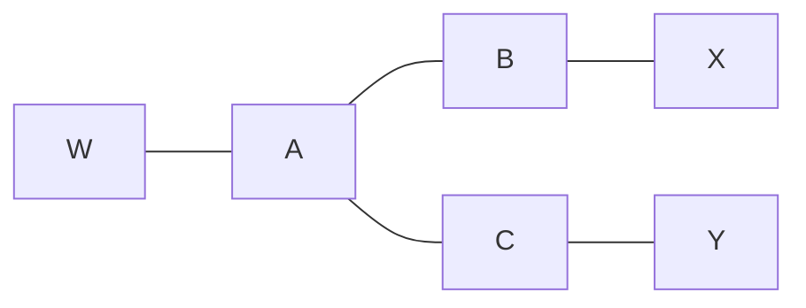

# 计算机网络第四次课后作业

**班级：2021 级软件工程（普通）2 班**

**学号：222021321262043**

**姓名：杨锦烨**

[toc]

## P3

| 步骤 | N'      | D(t),p(t)  | D(u),p(u)  | D(v),p(v)  | D(w),p(w)  | D(y),p(y)  | D(z),p(z)  |
| ---- | ------- | ---------- | ---------- | ---------- | ---------- | ---------- | ---------- |
| 0    | x       | $\infty$   | $\infty$   | <u>3,x</u> | 6,x        | 6,x        | 8,x        |
| 1    | xv      | 7,v        | <u>6,v</u> |            | 6,x        | 6,x        | 8,x        |
| 2    | xvu     | 7,v        |            |            | <u>6,x</u> | 6,x        | 8,x        |
| 3    | xvuw    | 7,v        |            |            |            | <u>6,x</u> | 8,x        |
| 4    | xvuwy   | <u>7,v</u> |            |            |            |            | 8,x        |
| 5    | xvuwyt  |            |            |            |            |            | <u>8,x</u> |
| 6    | xvuwytz |            |            |            |            |            |            |

算法工作描述：

+ D(x)：起点到x点的权值和
+ p(x)：从起点到x点的上一个节点
+ N'：已经确定最短路径的节点集合

Dijkstra算法是一种用于在赋权图中寻找最短路径的贪心算法。在得到赋权图后，先遍历起点能直接到达的节点，标出权值，不能到达的标为无穷大。然后找出权值最小的节点放入集合N'，并从该节点出发，更新它能到达的节点和已经知道的点的权值。不断循环直到集合N'包括赋权图中所有的节点。

## P4

### a

对于t节点：

| 步骤 | N'      | D(u),p(u)  | D(v),p(v)  | D(w),p(w)  | D(x),p(x)  | D(y),p(y)  | D(z),p(z)   |
| ---- | ------- | ---------- | ---------- | ---------- | ---------- | ---------- | ----------- |
| 0    | t       | <u>2,t</u> | 4,t        | $\infty$   | $\infty$   | 7,t        | $\infty$    |
| 1    | tu      |            | <u>4,t</u> | 5,u        |            | 7,t        |             |
| 2    | tuv     |            |            | <u>5,u</u> | 7,v        | 7,t        |             |
| 3    | tuvw    |            |            |            | <u>7,v</u> | 7,t        |             |
| 4    | tuvwx   |            |            |            |            | <u>7,t</u> | 15,x        |
| 5    | tuvwxy  |            |            |            |            |            | <u>15,x</u> |
| 6    | tuvwxyz |            |            |            |            |            |             |

### b

对于u节点：

| 步骤 | N'      | D(t),p(t)  | D(v),p(v)  | D(w),p(w)  | D(x),p(x)  | D(y),p(y)  | D(z),p(z)   |
| ---- | ------- | ---------- | ---------- | ---------- | ---------- | ---------- | ----------- |
| 0    | u       | <u>2,u</u> | 3,u        | 3,u        | $\infty$   | $\infty$   | $\infty$    |
| 1    | ut      |            | <u>3,u</u> | 3,u        | $\infty$   | 9,t        | $\infty$    |
| 2    | utv     |            |            | <u>3,u</u> | 6,v        | 9,t        | $\infty$    |
| 3    | utvw    |            |            |            | <u>6,v</u> | 9,t        | $\infty$    |
| 4    | utvwx   |            |            |            |            | <u>9,t</u> | 14,x        |
| 5    | utvwxy  |            |            |            |            |            | <u>14,x</u> |
| 6    | utvwxyz |            |            |            |            |            |             |

### c

对于v节点：

| 步骤 | N'      | D(t),p(t)  | D(u),p(u)  | D(w),p(w)  | D(x),p(x)  | D(y),p(y)  | D(z),p(z)   |
| ---- | ------- | ---------- | ---------- | ---------- | ---------- | ---------- | ----------- |
| 0    | v       | 4,v        | <u>3,v</u> | 4,v        | 3,v        | 8,v        | $\infty$    |
| 1    | vu      | 4,v        |            | 4,v        | <u>3,v</u> | 8,v        | $\infty$    |
| 2    | vux     | <u>4,v</u> |            | 4,v        |            | 8,v        | 11,x        |
| 3    | vuxt    |            |            | <u>4,v</u> |            | 8,v        | 11,x        |
| 4    | vuxtw   |            |            |            |            | <u>8,v</u> | 11,x        |
| 5    | vuxtwy  |            |            |            |            |            | <u>11,x</u> |
| 6    | vuxtwyz |            |            |            |            |            |             |

### d

对于w节点：

| 步骤 | N'      | D(t),p(t)  | D(u),p(u)  | D(v),p(v)  | D(x),p(x)  | D(y),p(y)   | D(z),p(z)   |
| ---- | ------- | ---------- | ---------- | ---------- | ---------- | ----------- | ----------- |
| 0    | w       | $\infty$   | <u>3,w</u> | 4,w        | 6,w        | $\infty$    | $\infty$    |
| 1    | wu      | 5,u        |            | <u>4,w</u> | 6,w        | $\infty$    | $\infty$    |
| 2    | wuv     | <u>5,u</u> |            |            | 6,w        | 12,v        | $\infty$    |
| 3    | wuvt    |            |            |            | <u>6,w</u> | 12,v        | $\infty$    |
| 4    | wuvtx   |            |            |            |            | <u>12,v</u> | 14,x        |
| 5    | wuvtxy  |            |            |            |            |             | <u>14,x</u> |
| 6    | wuvtxyz |            |            |            |            |             |             |

### e

对于y节点：

| 步骤 | N'      | D(t),p(t)  | D(u),p(u)  | D(v),p(v)  | D(w),p(w)   | D(x),p(x)  | D(z),p(z)   |
| ---- | ------- | ---------- | ---------- | ---------- | ----------- | ---------- | ----------- |
| 0    | y       | 7,y        | $\infty$   | 8,y        | $\infty$    | <u>6,y</u> | 12,y        |
| 1    | yx      | <u>7,y</u> | $\infty$   | 8,y        | 12,x        |            | 12,y        |
| 2    | yxt     |            | $\infty $  | <u>8,y</u> | 12,x        |            | 12,y        |
| 3    | yxtv    |            | <u>9,t</u> |            | 12,x        |            | 12,y        |
| 4    | yxtvu   |            |            |            | <u>12,x</u> |            | 12,y        |
| 5    | yxtvuw  |            |            |            |             |            | <u>12,y</u> |
| 6    | yxtvuwz |            |            |            |             |            |             |

### f

对于z节点：

| 步骤 | N'      | D(t),p(t)   | D(u),p(u)   | D(v),p(v)   | D(w),p(w)   | D(x),p(x)  | D(y),p(y)   |
| ---- | ------- | ----------- | ----------- | ----------- | ----------- | ---------- | ----------- |
| 0    | z       | $\infty$    | $\infty$    | $\infty$    | $\infty$    | <u>8,z</u> | 12,z        |
| 1    | zx      | $\infty$    | $\infty$    | <u>11,x</u> | 14,x        |            | 12,z        |
| 2    | zxv     | 15,v        | 14,v        |             | 14,x        |            | <u>12,z</u> |
| 3    | zxvy    | 15,v        | <u>14,v</u> |             | 14,x        |            |             |
| 4    | zxvyu   | 15,v        |             |             | <u>14,x</u> |            |             |
| 5    | zxvyuw  | <u>15,v</u> |             |             |             |            |             |
| 6    | zxvyuwt |             |             |             |             |            |             |

## P7

### a

+ x对w的距离向量$D_x(w)$ = 2

+ x对y的距离向量$D_x(y)$   = 4

+ x对u的距离向量$D_x(u)$  = 7

### b

对于x到u的最低开销路径：$d_x(u) = min\{  c(x,w) + d_w(u),c(x,y) + d_y(u)  \}$ = 7

此时$c(x,w)$ = 2,$d_w(u)$ = 5,$c(x,y)$ = 5,$d_y(u)$ = 6，

对于$c(x,w)$的变化，如果对于$c(x,w)$改变为1-6之间的正整数a，那么$d_x(u)$仍为$c(x,w) + d_w(u)$ = a+5，x通知邻居$d_x(u)$的变化，此时最低开销路径仍是通过w的。如果对于$c(x,w)$改变为大于6的正整数a，那么$d_x(u)$为$c(x,y) + d_w(y)$ = 11，x通知邻居$d_x(u)$的变化，此时最低开销路径是通过y的。

所以$c(x,w)$的任何变化在执行了DV算法后都会通知它的邻居。

对于$c(x,y)$的变化，由于所有链路开销均为正整数，所以$c(x,y)$最低为1时$c(x,y) + d_y(u)$为7，与当前$d_x(u)$相等，所以c(x,y)的改变不会使x通知其邻居。

### c

对于$c(x,w)$的变化，如果对于$c(x,w)$改变为1-6之间的正整数a，那么$d_x(u)$仍为$c(x,w) + d_w(u)$ = a+5，x通知邻居$d_x(u)$的变化，此时最低开销路径仍是通过w的。如果对于$c(x,w)$改变为大于6的正整数a，那么$d_x(u)$为$c(x,y) + d_w(y)$ = 11，x通知邻居$d_x(u)$的变化，此时最低开销路径是通过y的。

所以$c(x,w)$的任何变化在执行了DV算法后都会通知它的邻居。

对于$c(x,y)$的变化，由于所有链路开销均为正整数，所以$c(x,y)$最低为1时$c(x,y) + d_y(u)$为7，与当前$d_x(u)$相等，所以c(x,y)的改变不会使x通知其邻居。

## P11

### a

因为使用了毒性逆转的方案，如x到w经过了y，所以x通知y:$D_x(w)$ = $\infty$，所以节点互相之间的通知如下：

| 路由器 | 通知w                                                | 通知x                                  | 通知y                                                | 通知z                                  |
| ------ | ---------------------------------------------------- | -------------------------------------- | ---------------------------------------------------- | -------------------------------------- |
| w      |                                                      |                                        | $D_w(x)$ = $\infty$,$D_w(y)$ = 1,$D_w(z)$ = 1        | $D_w(x)$ = 5,$D_w(y)$ = 1,$D_w(z)$ = 1 |
| x      |                                                      |                                        | $D_x(w)$ = $\infty$,$D_x(y)$ = 4,$D_x(z)$ = $\infty$ | $D_x(w)$ = 5,$D_x(y)$ = 4,$D_x(z)$ = 6 |
| y      | $D_y(x)$ = 4,$D_y(w)$ = 1$D_y(z)$ = $\infty$         | $D_y(x)$ = 4,$D_y(w)$ = 1,$D_y(z)$ = 2 |                                                      | $D_y(x)$ = 4,$D_y(w)$ = 1,$D_y(z)$ = 2 |
| z      | $D_z(x)$ = $\infty$,$D_z(w)$ = 1,$D_z(y)$ = $\infty$ | $D_z(x)$ = 6,$D_z(w)$ = 1,$D_z(y)$ = 2 | $D_z(x)$ = 6,$D_z(w)$ = 1,$D_z(y)$ = 2               |                                        |

### b

会存在无穷计数的问题。因为毒性逆转计数只能检测到2个直接相连的节点的无穷计数问题，此时到w，y，z在计算路由器x的开销时形成循环。

对于y，$D_z(x)$ = 6，而c(y,z) = 3，所以y选择路由到z，修改$D_y(x)$ = 9，通知w和z，w修改$D_w(x)$ = 10，z不作修改（因为毒性逆转），w通知z$D_w(x)$ = 10，z修改$D_z(x)$ = 11，所以一轮$D_z(x)$增长5，如此循环增长直到$D_z(x)$+c(y,z)之和大于60，所以一共要如此循环11轮，则报文在环路中循环传播了31次后才稳定，迭代了31次。

### c

修改c(y,z) = $\infty$。

## P14

### a

因为是跨越两个AS之间的连接，所以对于3c是eBGP。

### b

因为是AS内部的连接，所以对于3a是iBGP。

### c

因为是跨越两个AS之间的连接，所以对于1c是eBGP。

### d

因为是AS内部的连接，所以对于1d是iBGP。

## P17

对于W，由P262内容可知，因为X为了防止转发B，C之间的流量，并没有通告B，C自己能连接C，B，从而W也不知道该信息，所以从W的信息来看网络拓扑如图：

对于X，由P262内容可知，B向它的客户X报告了路径BAW的存在，而C为了为了防止转发W的流量到C，并没有向X报告路径WABC和WAC的存在，所以从X的信息来看网络拓扑如图：

(老师，本题我用mermaid画图自动变成直线了，本来应该是跟原图一样X,C,Y之间有个弯折)
