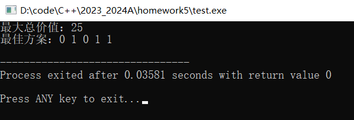
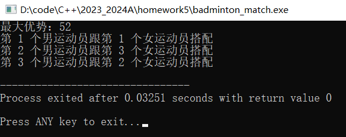

# 第四次作业

[toc]

姓名：杨锦烨

学号：222021321262043


## 0/1背包

### 思路

每次回溯记录当前重量和当前价值以及回溯的深度。每个物品选择装或不装，解空间为完全n叉树，但之前装入的物品不在对应的节点分叉。回溯直到深度大于等于物品的数量就更新最大价值和对应的放置方案并返回上一层，直到遍历完。

### C++代码实现

```C++
int maxValue = 0; // 最大总价值
vector<int> bestSolution; // 最佳解决方案

// 回溯
void backtrack(vector<int>& weights, vector<int>& values, int capacity, int curWeight, int curValue, vector<int>& solution, int index) {
	// 当达到背包容量或者所有物品都遍历完时，更新最大总重量和最佳解决方案
	if (index >= (int)weights.size() || curWeight >= capacity) {
		if (curWeight <= capacity && curValue > maxValue) {
			maxValue = curValue;
			bestSolution = solution;
		}
		return;
	}
	
	// 放入背包
	if (curWeight + weights[index] <= capacity) {
		solution[index] = 1; // 标记物品放入背包
		backtrack(weights, values, capacity, curWeight + weights[index], curValue + values[index], solution, index + 1);
		solution[index] = 0; // 恢复物品未放入背包状态
	}
	
	// 不放入
	backtrack(weights, values, capacity, curWeight, curValue, solution, index + 1);
}
```

### 测试与结果

测试数据：

```c++
int main() {
	vector<int> weights = {3, 5, 7, 8, 9};
	vector<int> values = {4, 6, 7, 9, 10};
	int capacity = 22;
	
	int n = (int)weights.size();
	vector<int> solution(n, 0); 
	
	backtrack(weights, values, capacity, 0, 0, solution, 0);
	
	cout << "最大总价值：" << maxValue << endl;
	cout << "最佳方案：";
	for (int i = 0; i < n; i++) {
		cout << bestSolution[i] << " ";
	}
	cout << endl;
	
	return 0;
}
```

结果：

 

放入第2，4，5个物品

### 复杂度分析

n:物品个数


时间复杂度:$O(2^n)$   

解空间为完全n叉树，有$2^n$个节点，最大需要遍历$2^n$次。


空间复杂度:$O(n) $  

额外大小为n的数组空间。


## 运动员最佳配对问题

### 思路

读进数据后将p[i] [j]和q[j] [i]相乘得到新矩阵matrix_pq，matrix_pq[i] [j]：第i个男运动员跟第j个女运动员组合时的总优势。问题的解空间是一个排列树，依次对每名男运动员，选择一名女运动员排列搭配。找出最大的优势。当回溯深度大于运动员个数时，更新最大优势和最佳方案并返回上一层。直到遍历完毕。

### C++代码实现

```C++
#include <iostream>
#include <cstdio>
#include <fstream>
#include <vector>
#include <string>

using namespace std;

void analyseLine(string str_line, int n, vector<int> &nums){
	int space_num = 0;//用空格个数判断一行的数是否读完
	vector<string> nums_str(n,"");
	for(int i = 0;i < (int)str_line.size();i++){
		if(str_line[i] == ' '){
			space_num++;
			continue;
		}
		if(space_num >= n){
			break;
		}
		nums_str[space_num].push_back(str_line[i]);
		
	}
	for(int i = 0;i < n;i++){
		nums[i] = atoi(nums_str[i].c_str());
	}
}

void backTrack(vector<vector<int>> &matrix_pq, vector<bool> &has_partner, vector<pair<int,int>> &arrangement, 
	vector<pair<int,int>> &final_arrangement,	int &max_advantage, int &now_advantage, int depth){
	if(depth >= (int)matrix_pq.size()){//遍历到了叶节点的下一层，修改max_advantage后直接返回
		if(now_advantage > max_advantage){
			max_advantage = now_advantage;
			final_arrangement.erase(final_arrangement.begin(),final_arrangement.end());
			for(int i = 0;i < (int)arrangement.size();i++){
				final_arrangement.push_back(arrangement[i]);
			}
		}
		
		return;
	}
	for(int i = 0;i < (int)matrix_pq[0].size();i++){//遍历任务
		if(has_partner[i]){//第i个任务已经被分配了，跳过
			continue;
		}else{//第i个任务没有被分配
			now_advantage += matrix_pq[depth][i];//给第depth个人做第i个工作
			has_partner[i] = true;
			arrangement.push_back(make_pair(depth,i));
			backTrack(matrix_pq, has_partner, arrangement, final_arrangement, max_advantage, now_advantage, depth+1);
			now_advantage -= matrix_pq[depth][i];
			has_partner[i] = false;
			arrangement.erase(arrangement.begin()+arrangement.size()-1);
		}
	}
}

int main(){
	//读写初始化
	ifstream input_file;
	input_file.open("input.txt",ios::in);
	string str_line;
	
	//读矩阵大小
	getline(input_file,str_line);
	int n = atoi(str_line.c_str());
	
	//矩阵初始化
	vector<vector<int>> matrix_p;
	vector<vector<int>> matrix_q;
	vector<vector<int>> matrix_pq(n,vector<int>(n,0));//matrix_pq[i][j]：第i个男运动员跟第j个女运动员组合时的总优势
	
	//读每一行内容到矩阵
	int line_index = 1;
	while(getline(input_file,str_line)){
		vector<int> nums(n,0);
		analyseLine(str_line, n, nums);//读每行的数到nums中
		if(line_index < 4){
			matrix_p.push_back(nums);
		}else{
			matrix_q.push_back(nums);
		}
		line_index++;
	}
	input_file.close();
	
	//求乘积矩阵
	for(int i = 0;i < n;i++){
		for(int j = 0;j < n;j++){
			matrix_pq[i][j] = matrix_p[i][j] * matrix_q[j][i];
		}
	}
	
	//回溯
	vector<bool> has_partner(n,false);
	vector<pair<int,int>> arrangement;
	vector<pair<int,int>> final_arrangement;
	int max_advantage = INT_MIN;
	int now_advantage = 0;
	backTrack(matrix_pq, has_partner, arrangement, final_arrangement, max_advantage, now_advantage, 0);
	cout<<"最大优势："<<max_advantage<<endl;
	for(int i = 0;i < (int)final_arrangement.size();i++){
		cout<<"第 "<<final_arrangement[i].first+1<<" 个男运动员跟第 "<<final_arrangement[i].second+1<<" 个女运动员搭配"<<endl;
	}
	
	//输出到output.txt
	ofstream output_file;
	output_file.open("output.txt", ofstream::app);
	output_file <<max_advantage;
	output_file.close();
	
	return 0;
}
```

### 测试与结果

测试数据：

```
3
10 2 3
2 3 4
3 4 5
2 2 2
3 5 3
4 5 1
```

结果：

  

结果：52

### 复杂度分析

n：男女运动员各自的数量

时间复杂度:$O(n!)$   

解空间为排列树，一个叶子节点代表根节点的其中一个孩子的所有排列的可能。所有叶子节点的总和就是原序列的全部排列方式。原始序列的元素个数是n个，有n!个叶子节点。从上到下，依次少1叉，直到叶子节点是1叉。


空间复杂度:$O(n)$   

需要额外大小为n的数组空间。
