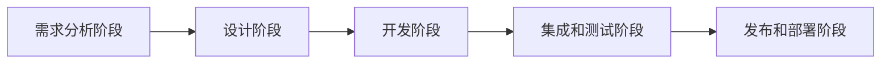
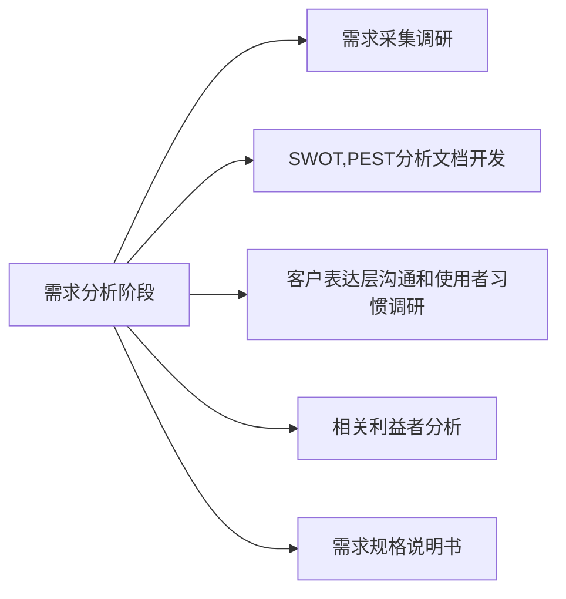
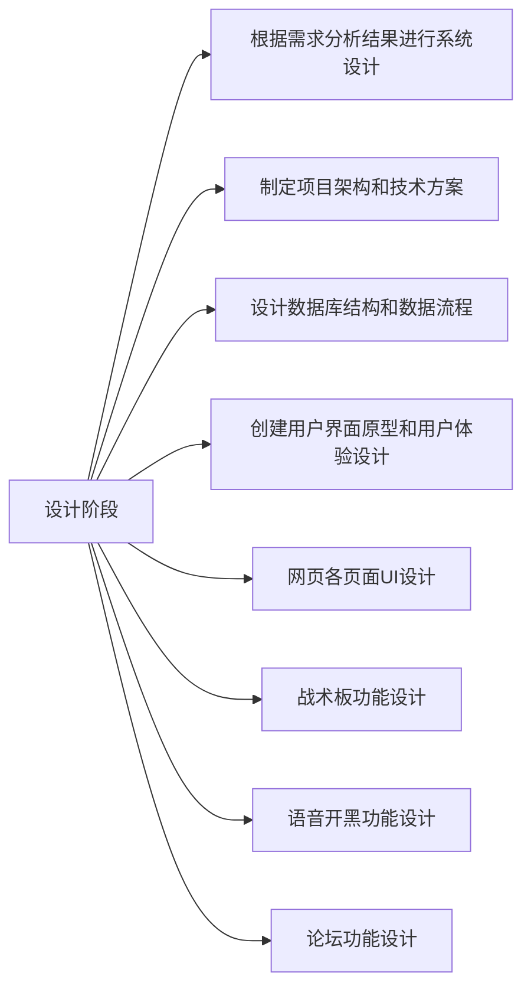
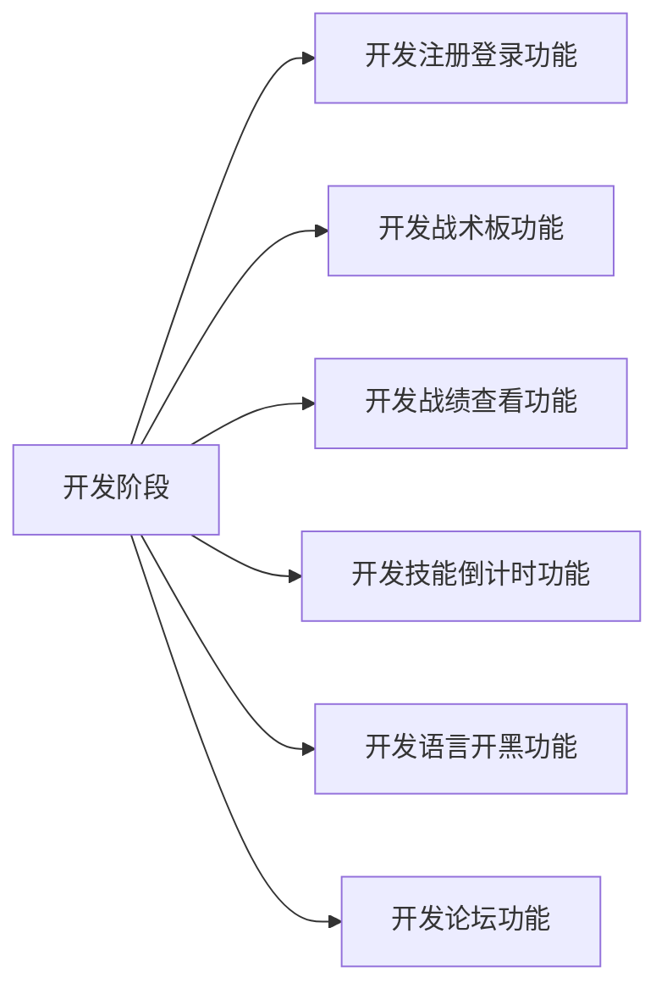
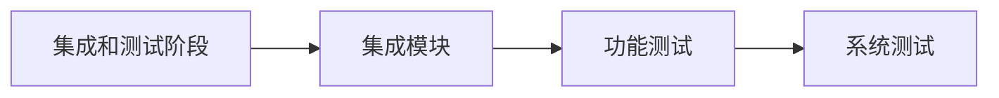

# 项目开发流程设计

## 阶段流程

项目开发的阶段流程可以描述为需求分析阶段，设计阶段，开发阶段，集成和测试阶段，发布和部署阶段五个阶段。这些阶段按照顺序进行，每个阶段我们都有其特定的目标和活动。实际项目开发我们可能会根据具体情况有所调整和适应。

项目开发的阶段流程图如下：

## 需求分析阶段

在需求分析阶段我们需要收集并理解项目的需求和目标，与利益相关者进行沟通和讨论，澄清需求细节，定义项目的范围和功能，编写需求文档明确用户的项目需求。

所以我们将需求分析阶段工作流程图规划如下：

## 项目设计阶段

根据需求分析阶段的分析进行项目系统设计，我们分为以下步骤进行

### 制定项目架构和技术方案

- 确定适合项目的技术栈和框架。
- 设计系统的整体架构，包括前端、后端和数据库等组件的划分和交互。
- 考虑系统的可扩展性、性能和安全性等方面。

### 设计数据库结构和数据流程

- 根据需求定义系统的数据模型，包括实体、关系和属性等。
- 设计数据库的表结构和字段。
- 设计数据流程，包括数据的输入、处理和输出过程。

### 创建用户界面原型和用户体验设计

- 使用原型工具（如Sketch、Adobe XD等）创建用户界面的草图或线框图。
- 设计用户界面的布局、交互和导航结构。
- 确定用户界面的样式、颜色和字体等。

### 网页各页面UI设计

- 根据用户界面原型和用户体验设计，进行具体的页面设计。
- 设计页面的各个元素、组件和布局。
- 确定页面的样式、颜色和字体等。

### 战术板功能设计

- 确定战术板的基本功能，如放置技能、技能计时、队友位置分配等。
- 设计战术板的交互方式和用户操作流程。
- 考虑战术板的可视化效果和实时性要求。

### 语音开黑功能设计

- 确定语音开黑功能的基本需求，如公共房间连麦、私人房间连麦等。
- 设计语音开黑的通信协议和数据传输方式。
- 考虑语音开黑功能的音频质量和实时性要求。

### 论坛功能设计

- 确定论坛的基本功能，如发帖、评论、签到等。
- 设计论坛的帖子结构、分类和标签等。
- 考虑论坛功能的用户权限和管理需求。

### 项目分析流程图

## 开发阶段

开发阶段我们根据项目分析阶段的分析，将功能细分如下进行开发。

### 开发注册登录功能

- 创建用户数据库表，包含用户名、密码等字段。
- 开发注册页面，提供用户输入信息并验证。
- 实现登录功能，验证用户输入的用户名和密码是否匹配。
- 使用加密算法对用户密码进行加密存储。
- 设置会话管理，保持用户登录状态。

### 开发战术板功能

- 设计战术板的界面，包括地图、队友位置等元素。
- 实现在战术板上放置技能图标的功能。
- 开发技能计时功能，根据设定的冷却时间显示倒计时。
- 实现队友位置分配的功能，允许玩家拖动队友图标。
- 添加保存和分享战术板的功能。

### 开发战绩查看功能

- 与游戏数据接口对接，获取玩家的战绩数据。
- 设计战绩查看页面，展示玩家的胜率、击杀数等数据。
- 实现筛选和排序功能，允许按时间、地图等条件查看战绩。
- 添加图表或图形化展示，使战绩数据更直观。

### 开发技能倒计时功能

- 根据游戏设定的冷却时间，记录玩家使用技能的时间点。
- 实现倒计时功能，根据当前时间和技能使用时间计算剩余时间。
- 在界面上展示技能图标和倒计时时间。
- 更新倒计时时间，确保准确显示技能冷却情况。

### 开发语音开黑功能

- 集成语音通信库或API，实现语音通信功能。
- 设计语音开黑界面，包括创建房间、加入房间等功能。
- 实现语音通话的功能，允许玩家进行实时语音对话。
- 添加静音、调整音量等功能，提供用户友好的语音体验。

### 开发论坛功能

- 设计论坛的帖子结构和分类，包括主题、内容、回复等。
- 创建数据库表，存储论坛帖子和回复的相关信息。
- 开发发帖、评论、回复的功能，允许用户进行交流和讨论。
- 实现帖子的浏览、搜索和排序功能。
- 添加用户权限管理，限制发帖和评论的权限。

### 开发阶段流程图

## 集成和测试阶段

之后我们进行集成和测试阶段，用于确保各个模块的正确集成和整体系统的功能正常运作。

### 集成模块

- 根据系统设计和需求分析，将开发完成的各个模块进行集成。
- 逐步将模块按照依赖关系进行组合，确保模块之间的接口和数据传递正确无误。
- 进行模块间的接口测试和数据流测试，验证集成后的模块是否能够正常协同工作。

### 功能测试

- 针对系统的各个功能模块，制定相应的测试用例。
- 根据测试用例，对系统的功能进行逐一测试，检查功能是否按照需求规格说明书的要求进行实现。
- 验证系统的输入输出是否正确，功能是否满足预期，错误处理是否合理等。

### 系统测试

最后我们进行系统测试，让同组同学试用软件功能，然后收集问题进行一定的反馈。

### 集成和测试阶段流程图

