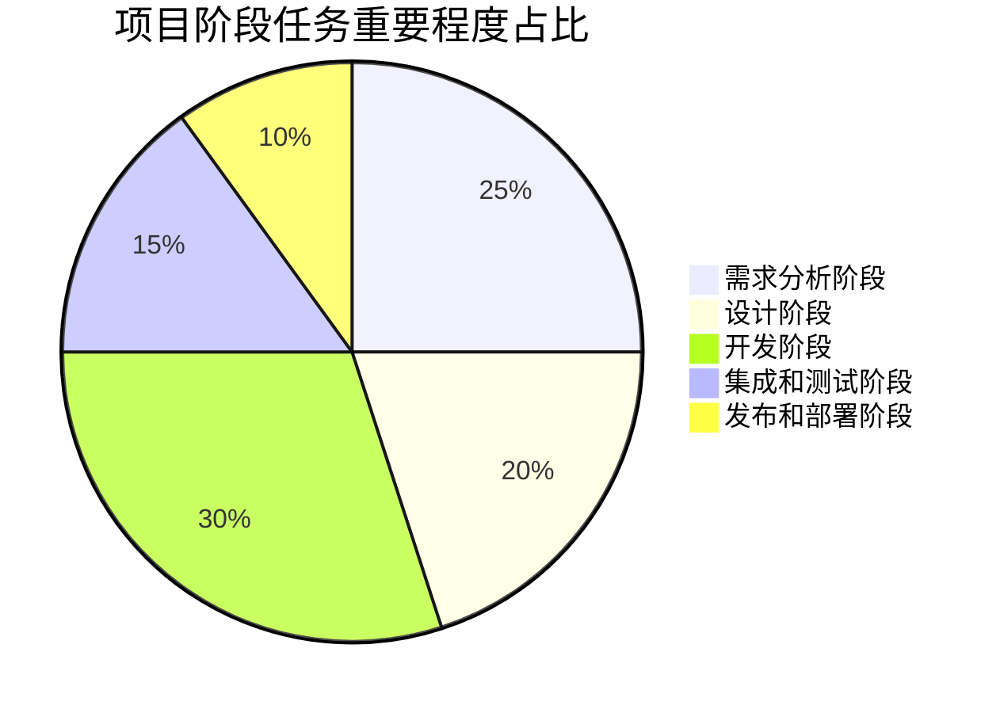

# 时间管理和流程管理分析

[toc] 

## 时间管理

### 制定时间表

制定一个详细的时间表，包括每个任务的时间和人员安排。时间表中应考虑到项目开发中各项功能的复杂度和优先级，确保时间表详细而合理。

### 划分项目阶段任务优先级

我们将项目阶段任务划分为5个主要部分：需求分析阶段，设计阶段，开发阶段，集成和测试阶段。为这些任务进行排序，可以让我们更好地掌握可能出现的延迟或时间超支从而对于部分复杂的部分功能，可以提前预留相应的时间来处理开发过程中的难点。

#### 一览图

#### 项目阶段任务优先级分析

| 阶段名称（按重要程度降序排列） | 重要程度 | 分析                                                         |
| ------------------------------ | -------- | ------------------------------------------------------------ |
| 需求分析阶段                   | 高       | 需求分析阶段是软件开发过程的基础，它确定了软件开发项目的目标、范围和功能需求。通过充分了解用户需求和业务需求，可以确保开发出符合用户期望和业务需求的软件。如果需求分析不充分或存在错误，后续的设计、开发和测试工作可能会偏离用户的真实需求，导致项目失败或需要大量的修改和调整。 |
| 软件设计阶段                   | 高       | 设计阶段将需求转化为具体的系统架构和模块设计。良好的设计能够确保软件的可扩展性、可维护性和可重用性，以及满足性能和安全等方面的需求。在设计阶段，开发团队需要仔细考虑系统的结构、组件之间的交互和数据流程，确保设计合理、逻辑清晰。良好的设计有助于减少后续开发过程中的问题和错误，并提高软件的质量和效率。 |
| 软件开发阶段                   | 高       | 开发阶段是将设计转化为实际代码的阶段。在开发阶段，开发团队根据设计文档编写代码、进行单元测试，并逐步实现软件的各个功能和模块。开发阶段的质量和效率直接影响到项目的进度和交付质量。高质量的代码和规范的开发流程可以减少后续的修复和调整工作，提高开发效率和软件的可维护性。 |
| 集成测试阶段                   | 中       | 集成和测试阶段是将各个模块和组件进行整合，验证系统的功能和性能是否满足需求。在这个阶段，团队需要进行系统集成测试、性能测试、安全测试等，以确保软件的整体功能和质量。集成和测试阶段的目标是发现和解决软件中的问题和错误，以及验证系统的稳定性和可靠性。 |
| 发布部署阶段                   | 低       | 发布和部署阶段是将软件交付给用户并部署到生产环境中的阶段。尽管这个阶段的重要性不可忽视，但在整个软件开发过程中，它可能是相对较短的一个阶段。在发布和部署阶段，团队需要确保软件的正确部署和配置，以及用户能够顺利地使用软件。此外，还需要考虑用户培训、技术支持和持续的维护等方面，以确保软件的长期稳定运行。 |

### 分配任务

基于团队成员能力和职务，我们明确规定所有成员任务要求和时间限制如下：

| 姓名   | 职务       | 任务                                                 | 任务截止时间         |
| ------ | ---------- | ---------------------------------------------------- | -------------------- |
| 陈馗   | 项目经理   | 确定项目的目标和范围，明确需求                       | 需求分析阶段前完成   |
|        |            | 制定项目计划和时间表                                 | 需求分析阶段前完成   |
|        |            | 管理团队资源和进度                                   | 所有阶段贯穿始终     |
| 李凯   | 产品经理   | 研究瓦洛兰特游戏的规则和机制，确定辅助工具的功能需求 | 需求分析阶段前完成   |
|        |            | 收集用户需求和反馈，进行需求分析和优先级排序         | 需求分析阶段前完成   |
|        |            | 编写产品需求文档                                     | 需求分析阶段前完成   |
| 杨锦烨 | 前端工程师 | 设计用户界面和交互流程                               | 设计阶段前完成       |
|        |            | 实现前端页面和功能，包括数据展示、用户输入和操作     | 开发阶段前完成       |
|        |            | 进行前端测试和调试                                   | 集成和测试阶段前完成 |
| 曹航   | 后端工程师 | 架构整个系统的后端逻辑和数据存储                     | 设计阶段前完成       |
|        |            | 开发后端接口和业务逻辑                               | 开发阶段前完成       |
|        |            | 进行后端测试和调试                                   | 集成和测试阶段前完成 |

### Measurable Milestones

基于任务优先级和时间表，我们设置 Measurable Milestones（可以按照时间顺序追踪的里程碑）如下：

 

###  团队沟通与反馈

为了帮助团队成员之间协调时间表和及时沟通任何问题，我们团队举行了定期会议。这样的及时反馈加强了团队成员之间的合作和理解，提高了对产品需求的分析和认知力，以确保实现项目中所有功能的质量和准时性。

我们的部分会议纪要如下：

 

## 流程管理

为了清晰地定义各个阶段的任务和目标，合理分配资源和时间，确保团队成员之间的有效沟通和协作，以达到按时完成项目的目标，我们将开发流程拆分为5个阶段并考虑了后期的软件运维，最终总结软件开发流程如下：

### 需求定义和分析阶段

- 确定项目的功能需求，包括战术板、技能倒计时、语言开黑、心得交流、赛后总结等功能。
- 分析用户需求并制定详细的功能规格说明文档。
- 风险管理：识别和评估项目可能面临的风险，并制定应对措施

### 设计阶段

- 基于功能规格说明文档，设计游戏的架构和界面。
- 确定战术板、技能倒计时、语言开黑、心得交流、赛后总结等功能的工作流程和实现方式。

### 开发阶段

- 根据设计要求，分阶段进行开发，实现各项功能。
- 进行软件编码和测试，修复漏洞和功能缺陷。

### 集成和测试阶段

- 将开发完成的各项功能进行整合，确保它们能够协同工作。
- 进行系统性能测试和负载测试，保证系统的稳定性和可靠性。

### 部署和发布阶段

- 将游戏部署到服务器或云平台上，确保游戏能够在线上环境中顺利运行。
- 发布游戏，供玩家下载和体验。

### 运维和优化阶段

- 定期监控游戏服务器和数据库的运行状态，保证游戏的稳定性。
- 收集用户反馈并进行持续性能优化，改进战术板、技能倒计时、语言开黑、心得交流、赛后总结等功能的体验和功能。
- 根据用户需求和团队决策，进行游戏功能、内容和安全性的更新和迭代。

