# 项目开发流程和产品使用流程设计

[toc]

## 项目开发流程设计

### 阶段流程

项目开发的阶段流程可以描述为需求分析阶段，设计阶段，开发阶段，集成和测试阶段，发布和部署阶段五个阶段。这些阶段按照顺序进行，每个阶段我们都有其特定的目标和活动。实际项目开发我们可能会根据具体情况有所调整和适应。

项目开发的阶段流程图如下：

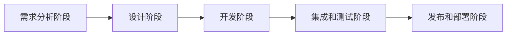

### 需求分析阶段

在需求分析阶段我们需要收集并理解项目的需求和目标，与利益相关者进行沟通和讨论，澄清需求细节，定义项目的范围和功能，编写需求文档明确用户的项目需求。

所以我们将需求分析阶段工作流程图规划如下：

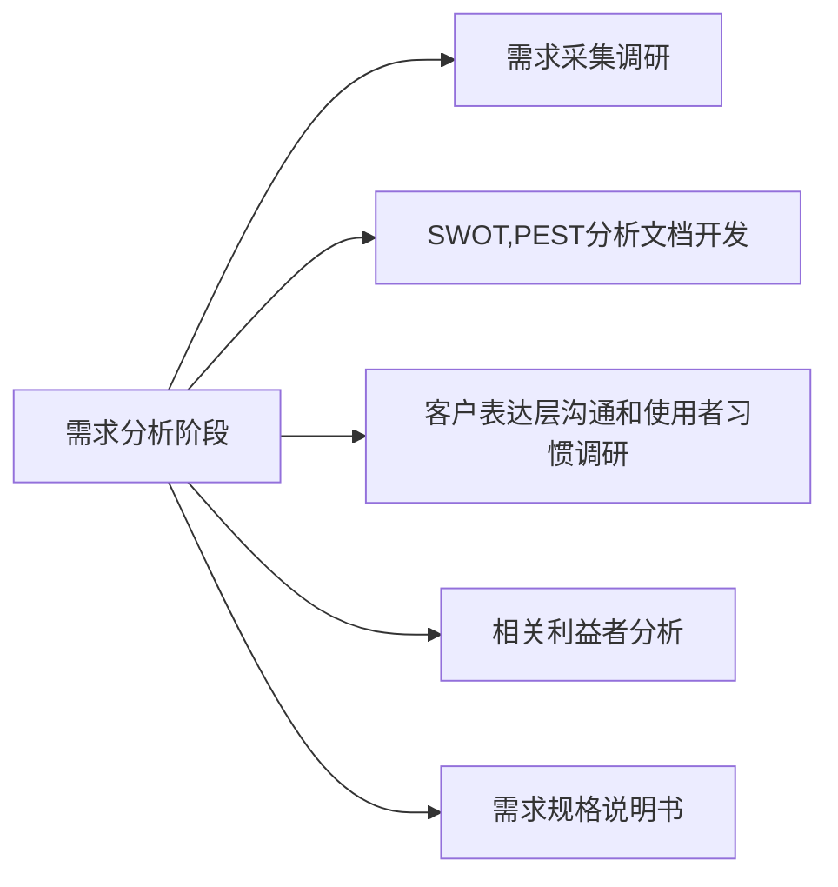

### 项目设计阶段

根据需求分析阶段的分析进行项目系统设计，我们分为以下步骤进行

#### 制定项目架构和技术方案

- 确定适合项目的技术栈和框架。
- 设计系统的整体架构，包括前端、后端和数据库等组件的划分和交互。
- 考虑系统的可扩展性、性能和安全性等方面。

#### 设计数据库结构和数据流程

- 根据需求定义系统的数据模型，包括实体、关系和属性等。
- 设计数据库的表结构和字段。
- 设计数据流程，包括数据的输入、处理和输出过程。

#### 创建用户界面原型和用户体验设计

- 使用原型工具（如Sketch、Adobe XD等）创建用户界面的草图或线框图。
- 设计用户界面的布局、交互和导航结构。
- 确定用户界面的样式、颜色和字体等。

#### 网页各页面UI设计

- 根据用户界面原型和用户体验设计，进行具体的页面设计。
- 设计页面的各个元素、组件和布局。
- 确定页面的样式、颜色和字体等。

#### 战术板功能设计

- 确定战术板的基本功能，如放置技能、技能计时、队友位置分配等。
- 设计战术板的交互方式和用户操作流程。
- 考虑战术板的可视化效果和实时性要求。

#### 语音开黑功能设计

- 确定语音开黑功能的基本需求，如公共房间连麦、私人房间连麦等。
- 设计语音开黑的通信协议和数据传输方式。
- 考虑语音开黑功能的音频质量和实时性要求。

#### 论坛功能设计

- 确定论坛的基本功能，如发帖、评论、签到等。
- 设计论坛的帖子结构、分类和标签等。
- 考虑论坛功能的用户权限和管理需求。

#### 项目分析流程图

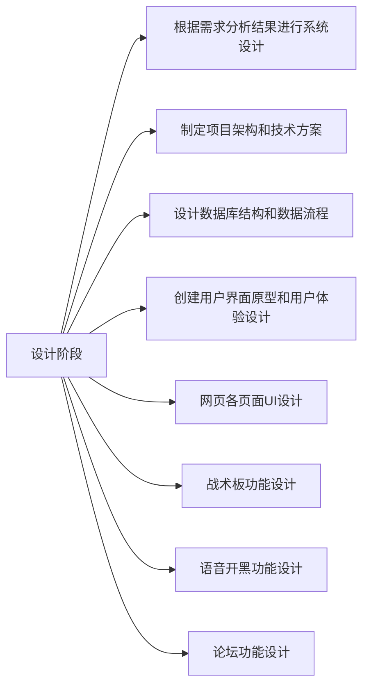

### 开发阶段

开发阶段我们根据项目分析阶段的分析，将功能细分如下进行开发。

#### 开发注册登录功能

- 创建用户数据库表，包含用户名、密码等字段。
- 开发注册页面，提供用户输入信息并验证。
- 实现登录功能，验证用户输入的用户名和密码是否匹配。
- 使用加密算法对用户密码进行加密存储。
- 设置会话管理，保持用户登录状态。

#### 开发战术板功能

- 设计战术板的界面，包括地图、队友位置等元素。
- 实现在战术板上放置技能图标的功能。
- 开发技能计时功能，根据设定的冷却时间显示倒计时。
- 实现队友位置分配的功能，允许玩家拖动队友图标。
- 添加保存和分享战术板的功能。

#### 开发战绩查看功能

- 与游戏数据接口对接，获取玩家的战绩数据。
- 设计战绩查看页面，展示玩家的胜率、击杀数等数据。
- 实现筛选和排序功能，允许按时间、地图等条件查看战绩。
- 添加图表或图形化展示，使战绩数据更直观。

#### 开发技能倒计时功能

- 根据游戏设定的冷却时间，记录玩家使用技能的时间点。
- 实现倒计时功能，根据当前时间和技能使用时间计算剩余时间。
- 在界面上展示技能图标和倒计时时间。
- 更新倒计时时间，确保准确显示技能冷却情况。

#### 开发语音开黑功能

- 集成语音通信库或API，实现语音通信功能。
- 设计语音开黑界面，包括创建房间、加入房间等功能。
- 实现语音通话的功能，允许玩家进行实时语音对话。
- 添加静音、调整音量等功能，提供用户友好的语音体验。

#### 开发论坛功能

- 设计论坛的帖子结构和分类，包括主题、内容、回复等。
- 创建数据库表，存储论坛帖子和回复的相关信息。
- 开发发帖、评论、回复的功能，允许用户进行交流和讨论。
- 实现帖子的浏览、搜索和排序功能。
- 添加用户权限管理，限制发帖和评论的权限。

#### 开发阶段流程图

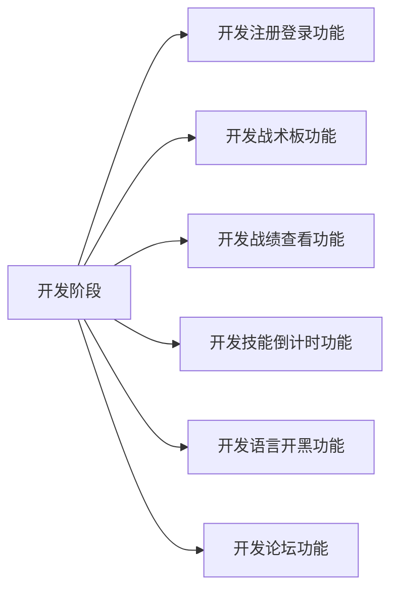

### 集成和测试阶段

之后我们进行集成和测试阶段，用于确保各个模块的正确集成和整体系统的功能正常运作。

#### 集成模块

- 根据系统设计和需求分析，将开发完成的各个模块进行集成。
- 逐步将模块按照依赖关系进行组合，确保模块之间的接口和数据传递正确无误。
- 进行模块间的接口测试和数据流测试，验证集成后的模块是否能够正常协同工作。

#### 功能测试

- 针对系统的各个功能模块，制定相应的测试用例。
- 根据测试用例，对系统的功能进行逐一测试，检查功能是否按照需求规格说明书的要求进行实现。
- 验证系统的输入输出是否正确，功能是否满足预期，错误处理是否合理等。

#### 系统测试

最后我们进行系统测试，让同组同学试用软件功能，然后收集问题进行一定的反馈。

#### 集成和测试阶段流程图

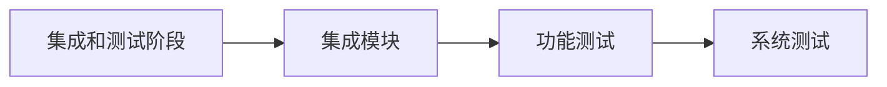

## 产品使用流程

### 流程总览

用户使用产品的使用流程图如下：

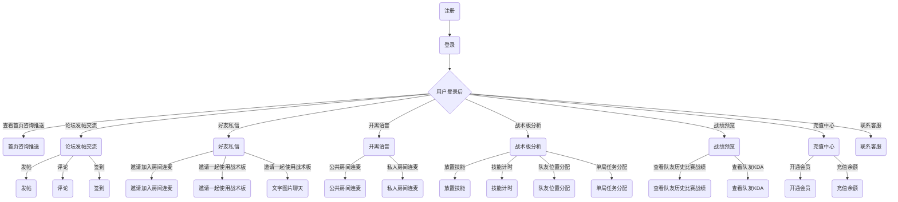

### 用户注册阶段

用户通过填写注册表格、提供必要信息和创建账号来成为该系统的合法用户，之后便进行登录等功能。

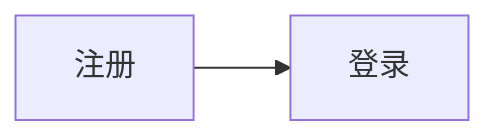

### 用户登录阶段

用户登录后，在首页咨询推送部分，用户可以使用战术板分析，开黑语音等功能。

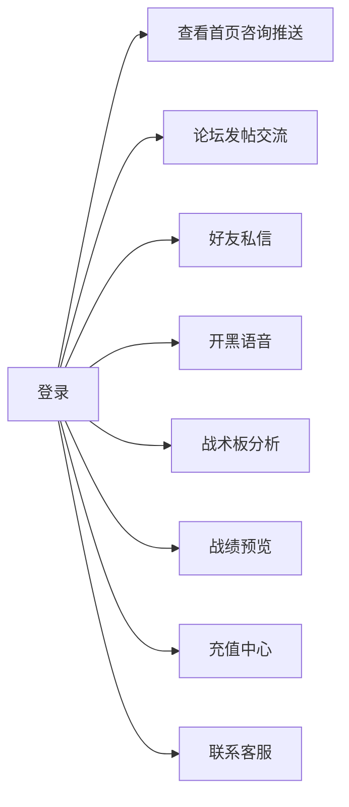

### 使用查看首页咨询推送功能

用户登录后，在首页的咨询推送部分，用户可以看到一系列的推送内容，这些内容可能是最新的游戏赛事新闻、版本改动等。

### 使用论坛功能

用户登陆后，还可以通过论坛发帖交流。用户可以在上面发表自己的游戏观点、针对某个英雄的使用提问问题、分享经验等。用户可以浏览其他用户的帖子，与他们进行评论和互动。这样的交流能够促进用户之间的互动和知识的共享。

同时，增加论坛功能有利于培养软件的社交属性，加强用户粘性。

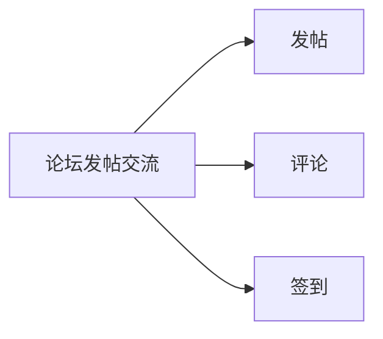

### 使用好友私信功能

好友私信功能可以与自己的好友进行一对一的私密交流。在好友私信中，用户可以发送文字、图片、语音、视频等信息，并进行实时的交流和互动。

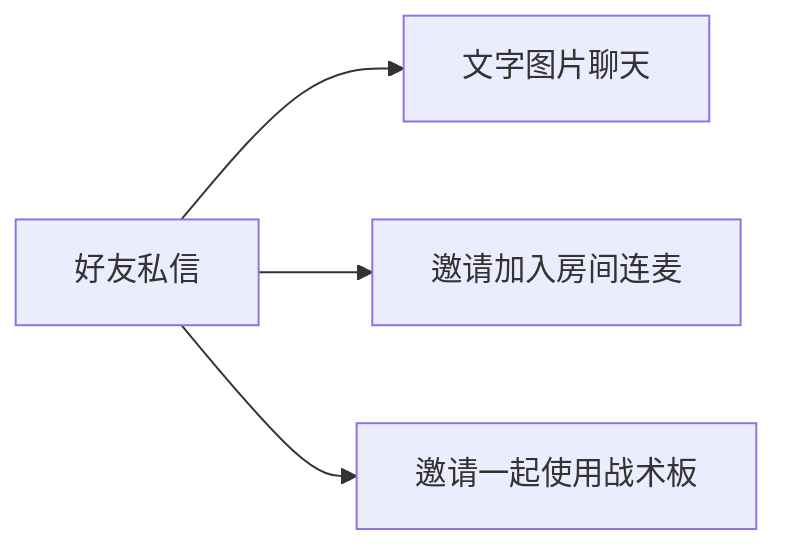

### 使用开黑语音功能

用户可以选择用开黑语音，实时与队友或其他玩家进行沟通，协调游戏策略，提高游戏的配合性和沟通效率。

开黑语音功能分为两种，公共房间连麦和私人房间连麦。

公共房间连麦：公共房间是指开放给所有玩家使用的语音聊天房间。游戏平台或游戏内部设有公共语音房间，玩家可以在游戏中选择加入这些房间进行语音交流。公共房间连麦可以让玩家与陌生人组队游玩，提高合作效果。在公共房间连麦中，玩家可以通过麦克风和耳机或者其他设备进行语音交流，互相协作，讨论战术和策略。

私人房间连麦（会员专属）：私人房间是指玩家自己或者会员专属的语音聊天房间。在私人房间连麦中，玩家可以邀请自己的好友或会员专属的用户加入，进行私密的语音交流。私人房间连麦通常需要玩家拥有一定的权限或特定条件（例如会员身份），才能够创建或加入。私人房间连麦可以提供更加私密、安全的语音交流环境，让玩家与熟悉的朋友或团队成员进行更深入的协作和交流。

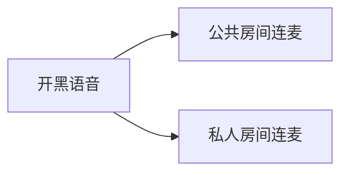

### 使用战术板分析功能

战术板是一个虚拟的地图战术板，用于规划和分析战斗策略。队伍可以使用战术板来标记重要位置、路径、目标等，以便更好地协调战斗和控制地图。

战术板分析可细分为如下用法：

1. 放置技能：每个角色或队员通常具有独特的技能和能力。放置技能是指在适当的时机和位置使用这些技能，以获得战斗优势。例如，在攻击型角色可以放置陷阱或炸弹来控制敌人的移动。

2. 技能计时：许多游戏中，技能和能力具有冷却时间，也就是技能使用后需要经过一段时间才能再次使用。在团队战斗中，队伍需要协调好技能的使用，以充分利用每个队员的技能，并避免同时冷却导致无法应对敌人的情况。

3. 队友位置分配：在团队战斗中，队友的位置分配非常重要。不同的角色可能有不同的职责和能力，例如前线进攻、后方支援、控制敌人等。队伍需要在游戏中根据局势和策略，合理地分配队友的位置和角色，以达到最佳的团队协作效果。

4. 单局任务分配：在某些游戏中，每局游戏可能会有特定的任务或目标。这些任务可能包括占领指定区域、护送载具、摧毁特定目标等。在团队中，需要根据任务的特点和队员的能力，合理分配任务，以确保团队能够高效地完成任务并取得胜利。

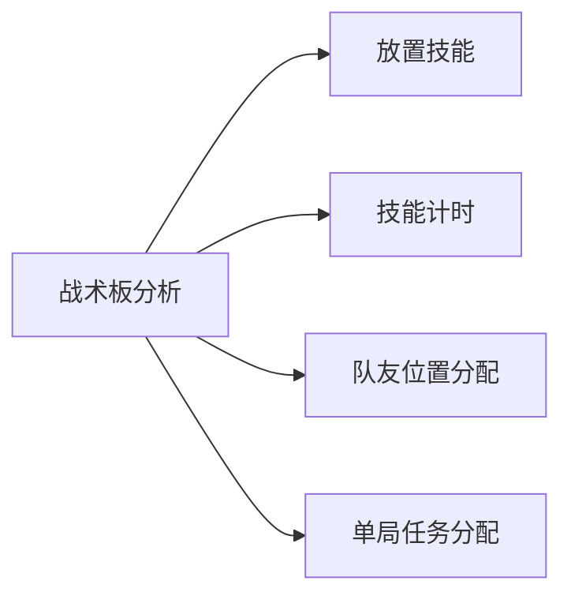

### 其它功能

我们将一些非核心功能统归为其它功能，分别为战绩预览，充值中心和联系客服。

#### 战绩预览

1. 了解自己的表现：通过查看战绩预览，玩家可以了解自己在游戏中的表现和成绩。包括击杀数、死亡数、助攻数、承受伤害等指标，可以帮助玩家评估自己的技术水平和游戏能力。
2. 分析游戏数据：战绩预览提供了游戏数据和统计信息，可以帮助玩家分析游戏过程中的问题和优势。比如，玩家可以看到自己在不同地图或角色下的胜率，从而了解自己擅长和不擅长的领域，以便针对性地改进。
3. 对比其他玩家：通过战绩预览，玩家可以对比自己和其他玩家的表现和成绩。这可以激发竞争意识和进步动力，也可以学习其他玩家的策略和技巧，以提升自己的游戏水平。
4. 观察队友或对手：战绩预览可以帮助玩家根据队友或对手的战绩和角色选择，进行更有效的协作和配合。

#### 充值中心

充值中心主要为用户解锁功能和特权。我们准备在软件运营的后期将战术板中提供一些特殊的功能转变为付费功能，只有通过充值才能获得，从而获得一定的收入。

#### 联系客服

联系客服主要用于用户与我们进行联系，目前我们只准备提供邮箱收集用户的问题。

