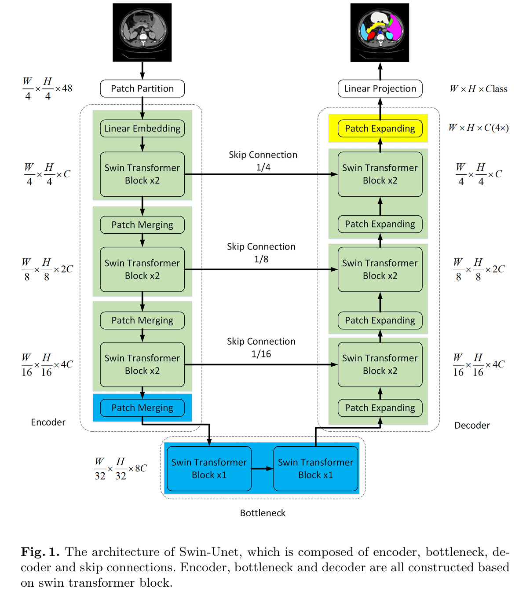

# Abstract

在过去几年中，卷积神经网络（CNNs）在医学图像分析领域取得了里程碑式的成就。特别是基于U形结构和跳跃连接的深度神经网络已被广泛应用于各种医学图像任务。然而，尽管CNN取得了卓越的性能，但由于卷积操作的局部性，它不能很好地学习全局和长距离语义信息交互。在本文中，我们提出了Swin-Unet，这是一个用于医学图像分割的类似Unet的纯Transformer。被标记的图像块被输入到基于Transformer的U形编码器-解码器架构中，通过跳跃连接进行局部-全局语义特征学习。具体来说，我们使用具有移位窗口的层次化Swin Transformer作为编码器来提取上下文特征。并且设计了一个对称的基于Swin Transformer的解码器，带有块扩展层，以执行上采样操作，恢复特征图的空间分辨率。在输入和输出通过4倍直接下采样和上采样的实验中，多器官和心脏分割任务的实验表明，基于纯Transformer的U形编码器-解码器网络优于那些全卷积或结合了变换器和卷积的方法。代码和训练好的模型将在https://github.com/HuCaoFighting/Swin-Unet上公开提供。

## Introduction

现有的医学图像分割方法主要依赖于具有U形结构的全卷积神经网络（FCNN）[3,4,5]。典型的U形网络，U-Net[3]，由对称的编码器-解码器和跳跃连接组成。在编码器中，一系列卷积层和连续的下采样层被用来提取具有大感受野的深度特征。然后，解码器将提取的深度特征上采样到输入分辨率，以进行像素级语义预测，并且不同尺度的高分辨率特征通过跳跃连接与编码器融合，以减轻下采样引起的空间信息丢失。凭借如此优雅的结构设计，U-Net在各种医学影像应用中取得了巨大成功。沿着这一技术路线，许多算法如3D U-Net[6]、Res-UNet[7]、U-Net++[8]和UNet3+[9]已经被开发用于各种医学影像模态的图像和体积分割。这些基于FCNN的方法在心脏分割、器官分割和病变分割中的卓越性能证明了CNN具有学习区分特征的强大能力。

目前，尽管基于CNN的方法在医学图像分割领域取得了卓越的性能，但它们仍然不能完全满足医学应用对分割精度的严格要求。图像分割仍然是医学图像分析中的一个挑战性任务。由于卷积操作的固有局部性，基于CNN的方法很难学习到明确的全局和长距离语义信息交互[2]。一些研究尝试通过使用扩张卷积层[10,11]、自注意力机制[12,13]和图像金字塔[14]来解决这个问题，但这些方法在建模长距离依赖性方面仍有局限性。最近，受到Transformer在自然语言处理（NLP）领域取得的巨大成功[15]的启发，研究人员尝试将Transformer引入到视觉领域[16]。在[17]中，提出了视觉变换器（ViT），它采用2D图像块和位置嵌入作为输入，并在大型数据集上进行预训练，ViT实现了与基于CNN的方法相当的性能。此外，数据高效图像变换器（DeiT）在[18]中被提出，它表明Transformer可以在中等大小的数据集上进行训练，并且通过与蒸馏方法结合可以获得更鲁棒的Transformer。在[19]中，开发了一个分层的Swin Transformer。以Swin Transformer作为视觉主干，[19]的作者在图像分类、目标检测和语义分割等各项视觉任务上取得了最先进的性能。ViT、DeiT和Swin Transformer在图像识别任务中的成功证明了Transformer在视觉领域的应用潜力。

受到Swin Transformer[19]成功的激励，我们在这项工作中提出了Swin-Unet，以利用Transformer的力量进行2D医学图像分割。据我们所知，Swin-Unet是第一个基于纯Transformer的U形架构，包括编码器、瓶颈、解码器和跳跃连接。编码器、瓶颈和解码器都是基于Swin Transformer块[19]构建的。输入的医学图像被分割成不重叠的图像块。每个块被视为一个标记，并输入到基于Transformer的编码器中以学习深度特征表示。然后，通过解码器中的块扩展层对提取的上下文特征进行上采样，并通过跳跃连接与编码器的多尺度特征融合，以恢复特征图的空间分辨率，并进一步进行分割预测。在多器官和心脏分割数据集上的广泛实验表明，所提出的方法具有出色的分割精度和稳健的泛化能力。具体来说，我们的贡献可以总结为：（1）基于Swin Transformer块，我们构建了一个对称的编码器-解码器架构和跳跃连接。在编码器中，实现了从局部到全局的自注意力；在解码器中，全局特征被上采样到输入分辨率，以进行相应的像素级分割预测。（2）开发了一个块扩展层，以实现上采样和特征维度增加，而无需使用卷积或插值操作。（3）实验发现跳跃连接对Transformer同样有效，因此最终构建了一个基于纯Transformer的U形编码器-解码器架构，并带有跳跃连接，命名为Swin-Unet。

## Related work

基于CNN的方法：早期的医学图像分割方法主要是基于轮廓和传统机器学习算法[20,21]。随着深度CNN的发展，U-Net被提出用于医学图像分割[3]。由于U形结构的简单性和优越性能，各种类似Unet的方法不断涌现，如Res-UNet[7]、Dense-UNet[22]、U-Net++[8]和UNet3+[9]。它也被引入到3D医学图像分割领域，如3D-Unet[6]和V-Net[23]。目前，基于CNN的方法在医学图像分割领域取得了巨大成功，这得益于其强大的表征能力。

视觉变换器：变换器最初是为机器翻译任务提出的[15]。在NLP领域，基于Transformer的方法在各种任务中取得了最先进的性能[24]。受Transformer成功的推动，研究人员引入了开创性的视觉变换器（ViT）[17]，在图像识别任务上取得了令人印象深刻的速度-准确性权衡。与基于CNN的方法相比，ViT的缺点是它需要在自己的大型数据集上进行预训练。为了减轻训练ViT的困难，DeiT[18]描述了几项训练策略，允许ViT在ImageNet上训练得很好。最近，基于ViT的一些优秀工作已经完成[25,26,19]。值得一提的是，一个高效有效的分层视觉变换器，称为Swin Transformer，被提出作为视觉主干[19]。基于移位窗口机制，Swin Transformer在包括图像分类、目标检测和语义分割在内的各种视觉任务上取得了最先进的性能。在这项工作中，我们尝试使用Swin Transformer块作为基本单元来构建一个带有跳跃连接的U形编码器-解码器架构，为Transformer在医学图像领域的发展提供基准比较。

自注意力/Transformer补充CNN：近年来，研究人员尝试将自注意力机制引入CNN以提高网络性能[13]。在[12]中，跳跃连接与加性注意力门集成在U形架构中，以执行医学图像分割。然而，这仍然是基于CNN的方法。目前，一些努力正在将Transformer和CNN结合起来，打破CNN在医学图像分割中的主导地位[2,27,1]。在[2]中，作者将Transformer与CNN结合起来，构成一个强大的编码器用于2D医学图像分割。与[2]类似，[27]和[28]利用Transformer和CNN的互补性来提高模型的分割能力。目前，Transformer与CNN的各种组合已应用于多模态脑肿瘤分割[29]和3D医学图像分割[1,30]。与上述方法不同，我们尝试探索纯Transformer在医学图像分割中的应用潜力。

## Method

### Architecture overview

提出的Swin-Unet的整体架构如图1所示，它由编码器（encoder）、瓶颈（bottleneck）、解码器（decoder）和跳跃连接（skip connections）组成。Swin-Unet的基本单元是Swin Transformer块。为了将输入转换为序列嵌入，医学图像被分割成不重叠的4×4大小的图像块。通过这种分割方法，每个图像块的特征维度变为4×4×3=48。此外，应用一个线性嵌入层将特征维度投影到任意维度（表示为C）。转换后的图像块标记通过几个Swin Transformer块和图像块合并层（patch merging layers）来生成层次化的特征表示。具体来说，图像块合并层负责下采样和增加维度，而Swin Transformer块负责特征表示学习。

受到U-Net[3]的启发，我们设计了一个对称的基于Transformer的解码器。解码器由Swin Transformer块和图像块扩展层（patch expanding layers）组成。通过跳跃连接，将编码器中的多尺度特征与解码器中的上采样特征融合，以补充下采样引起的空间信息丢失。与编码器中使用的图像块合并层不同，解码器中特别设计了图像块扩展层来执行上采样。图像块扩展层将相邻维度的特征图重塑为具有2倍分辨率提升的大特征图。最后，最后一个图像块扩展层用于执行4倍上采样，以恢复特征图的分辨率至输入分辨率（W×H），然后应用一个线性投影层在这些上采样的特征上输出像素级分割预测。我们将在接下来的部分详细阐述每个模块。

图1展示了Swin-Unet的架构，它由编码器、瓶颈、解码器和跳跃连接组成。编码器、瓶颈和解码器都是基于Swin Transformer块构建的。在编码器中，输入图像首先被分割成小块，然后通过线性嵌入层转换为具有C维度的特征。接着，这些特征通过多个Swin Transformer块进行处理，并通过图像块合并层进行下采样，同时增加特征维度。在瓶颈部分，使用两个连续的Swin Transformer块来学习深层特征表示，而不改变特征维度和分辨率。在解码器中，使用图像块扩展层来上采样提取的深层特征，并通过跳跃连接与编码器中的多尺度特征融合。最终，通过线性投影层输出分割结果。

### Swin Transformer block

与传统的多头自注意力（MSA）模块不同，Swin Transformer块[19]是基于移位窗口构建的。在图2中，展示了两个连续的Swin Transformer块。每个Swin Transformer块由LayerNorm（LN）层、多头自注意力模块、残差连接和具有GELU非线性的两层MLP（多层感知机）组成。在两个连续的Transformer块中，分别应用了基于窗口的多头自注意力（W-MSA）模块和基于移位窗口的多头自注意力（SW-MSA）模块。基于这样的窗口划分机制，连续的Swin Transformer块可以被公式化为：

$$ \hat{z}^{l} = W\text{-}MSA(LN(z^{l-1})) + z^{l-1}, $$

$$ z^l = MLP(LN(\hat{z}^l)) + \hat{z}^l, $$

$$ \hat{z}^{l+1} = SW\text{-}MSA(LN(z^{l})) + z^{l}, $$

$$ z^{l+1} = MLP(LN(\hat{z}^{l+1})) + \hat{z}^{l+1}, $$

其中， $$\hat{z}^{l}$$和$$z^{l}$$分别表示第$$l$$个块的$$SW-MSA$$模块和$$MLP$$模块的输出。与之前的工作[31,32]类似，自注意力的计算如下：

$$ \text{Attention}(Q, K, V) = \text{SoftMax}\left(\frac{Q K^{T}}{\sqrt{d}} + B\right) V, $$

其中， $Q, K, V \in \mathbb{R}^{M^{2} \times d}$ 表示查询（query）、键（key）和值（value）矩阵。$M^{2}$ 和d 分别表示窗口中的块数和查询或键的维度。而且， B 中的值取自偏置矩阵  $\hat{B} \in \mathbb{R}^{(2M-1) \times (2M+1)}$ 。

图2展示了Swin Transformer块的结构。这个块通过LayerNorm层对输入进行标准化，然后通过W-MSA模块进行自注意力计算，接着通过MLP进行非线性变换，最后通过残差连接将输入与输出相加。在下一个Swin Transformer块中，SW-MSA模块被用来进一步提取特征，然后再次通过MLP和残差连接进行处理。这种结构允许模型在保持计算效率的同时，有效地捕获图像的局部和全局特征。

