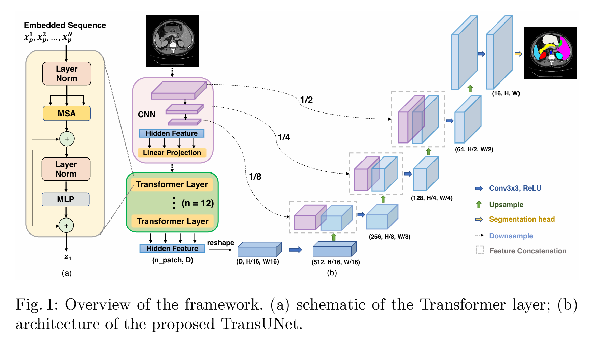
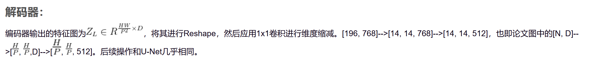

https://zhuanlan.zhihu.com/p/454164808

https://zhuanlan.zhihu.com/p/657901979

https://blog.csdn.net/baidu_41896327/article/details/122487169

[toc]

# abstract

医疗图像分割是开发医疗保健系统的基本前提，特别是在疾病诊断和治疗规划中。在各种医疗图像分割任务中，U形结构，也称为U-Net，已成为事实上的标准，并取得了巨大成功。然而，由于卷积操作的内在局部性，U-Net通常在显式建模长期依赖关系方面存在局限性。Transformer，为序列到序列预测而设计，作为替代架构出现，具有先天的全局自注意力机制，但由于缺乏低级细节，可能导致局部化能力有限。在本文中，我们提出了TransUNet，它融合了Transformer和U-Net的优点，成为医疗图像分割的强大替代方案。一方面，Transformer将卷积神经网络（CNN）特征图中的标记图像块编码为输入序列，以提取全局上下文。另一方面，解码器上采样编码特征，然后与高分辨率CNN特征图结合，以实现精确定位。我们认为Transformer可以作为医疗图像分割任务的强大编码器，通过与U-Net结合来增强细节，恢复局部空间信息。TransUNet在不同的医疗应用中，包括多器官分割和心脏分割，都取得了优于各种竞争方法的卓越表现。代码和模型可在https://github.com/Beckschen/TransUNet找到。

## introduction

卷积神经网络（CNN），特别是全卷积网络（FCNs）[8]，在医疗图像分割中已成为主导。在不同的变体中，U-Net[12]，由对称的编码器-解码器网络和跳跃连接组成，以增强细节保留，已成为事实上的选择。基于这种方法，已在广泛的医疗应用中取得了巨大成功，例如从磁共振（MR）[16]中进行心脏分割，从计算机断层扫描（CT）[7,17,19]中进行器官分割，以及从结肠镜视频[20]中进行息肉分割。

尽管CNN方法具有非凡的表征能力，但由于卷积操作的内在局部性，这些方法通常在建模显式长距离关系方面存在局限性。因此，这些架构通常在目标结构在纹理、形状和大小方面表现出大的患者间变异时表现不佳。为了克服这一局限性，现有研究提出了基于CNN特征建立自注意力机制[13,15]。另一方面，Transformer，为序列到序列预测而设计，作为替代架构出现，完全依赖注意力机制，而不是卷积操作[14]。与以前的基于CNN的方法不同，Transformer不仅在建模全局上下文方面强大，而且在大规模预训练下对下游任务表现出优越的迁移能力。在机器翻译和自然语言处理（NLP）[3,14]领域取得了广泛的成功。最近，对于各种图像识别任务，也达到了或甚至超过了最先进的性能[4,18]。

在本文中，我们提出了第一个探索Transformer在医疗图像分割背景下潜力的研究。然而，有趣的是，我们发现直接使用（即，使用Transformer对标记化的图像块进行编码，然后直接将隐藏特征表示上采样到全分辨率的密集输出）不能产生令人满意的结果。这是因为Transformer将输入视为1D序列，并在所有阶段专注于建模全局上下文，因此导致低分辨率特征，缺乏详细的局部化信息。这些信息不能通过直接上采样到全分辨率来有效恢复，因此导致粗糙的分割结果。另一方面，CNN架构（例如，U-Net[12]）提供了一种提取低级视觉线索的途径，可以很好地补救这种精细的空间细节。

为此，我们提出了TransUNet，这是第一个建立在序列到序列预测视角上的自注意力机制的医疗图像分割框架。为了补偿Transformer带来的特征分辨率损失，TransUNet采用了混合CNN-Transformer架构，以利用CNN特征的详细高分辨率空间信息和Transformer编码的全局上下文。受U形建筑设计的启发，由Transformer编码的自注意力特征随后被上采样，并与编码路径中跳过的不同的高分辨率CNN特征结合，以实现精确定位。我们展示了这种设计使我们的框架能够保留Transformer的优势，同时也受益于医疗图像分割。实证结果表明，我们的基于Transformer的架构与以前的基于CNN的自注意力方法相比，提供了一种更好的利用自注意力的方式。此外，我们观察到更密集地结合低级特征通常会导致更好的分割精度。广泛的实验证明了我们的方法在各种医疗图像分割任务中的优越性，与其他竞争方法相比。

## related works

卷积神经网络（CNN），特别是全卷积网络（FCNs）[8]，在医疗图像分割中已成为主导。在不同的变体中，U-Net[12]，由对称的编码器-解码器网络和跳跃连接组成，以增强细节保留，已成为事实上的选择。基于这种方法，已在广泛的医疗应用中取得了巨大成功，例如从磁共振（MR）[16]中进行心脏分割，从计算机断层扫描（CT）[7,17,19]中进行器官分割，以及从结肠镜视频[20]中进行息肉分割。

尽管CNN方法具有非凡的表征能力，但由于卷积操作的内在局部性，这些方法通常在建模显式长距离关系方面存在局限性。因此，这些架构通常在目标结构在纹理、形状和大小方面表现出大的患者间变异时表现不佳。为了克服这一局限性，现有研究提出了基于CNN特征建立自注意力机制[13,15]。另一方面，Transformer，为序列到序列预测而设计，作为替代架构出现，完全依赖注意力机制，而不是卷积操作[14]。与以前的基于CNN的方法不同，Transformer不仅在建模全局上下文方面强大，而且在大规模预训练下对下游任务表现出优越的迁移能力。在机器翻译和自然语言处理（NLP）[3,14]领域取得了广泛的成功。最近，对于各种图像识别任务，也达到了或甚至超过了最先进的性能[4,18]。

在本文中，我们提出了第一个探索Transformer在医疗图像分割背景下潜力的研究。然而，有趣的是，我们发现直接使用（即，使用Transformer对标记化的图像块进行编码，然后直接将隐藏特征表示上采样到全分辨率的密集输出）不能产生令人满意的结果。这是因为Transformer将输入视为1D序列，并在所有阶段专注于建模全局上下文，因此导致低分辨率特征，缺乏详细的局部化信息。这些信息不能通过直接上采样到全分辨率来有效恢复，因此导致粗糙的分割结果。另一方面，CNN架构（例如，U-Net[12]）提供了一种提取低级视觉线索的途径，可以很好地补救这种精细的空间细节。

为此，我们提出了TransUNet，这是第一个建立在序列到序列预测视角上的自注意力机制的医疗图像分割框架。为了补偿Transformer带来的特征分辨率损失，TransUNet采用了混合CNN-Transformer架构，以利用CNN特征的详细高分辨率空间信息和Transformer编码的全局上下文。受U形建筑设计的启发，由Transformer编码的自注意力特征随后被上采样，并与编码路径中跳过的不同的高分辨率CNN特征结合，以实现精确定位。我们展示了这种设计使我们的框架能够保留Transformer的优势，同时也受益于医疗图像分割。实证结果表明，我们的基于Transformer的架构与以前的基于CNN的自注意力方法相比，提供了一种更好的利用自注意力的方式。此外，我们观察到更密集地结合低级特征通常会导致更好的分割精度。广泛的实验证明了我们的方法在各种医疗图像分割任务中的优越性，与其他竞争方法相比。

## method

给定一个图像 $x \in \mathbb{R}^{H \times W \times C}$，其空间分辨率为 $H \times W$，C个通道。我们的目标是预测相应的像素级标签图，大小为 $H \times W$。最常见的方法是直接训练一个CNN（例如，U-Net）首先将图像编码成高级特征表示，然后解码回全空间分辨率。与现有方法不同，我们的方法通过使用Transformer引入自注意力机制到编码器设计中。我们将首先介绍如何在第3.1节中直接应用Transformer来编码分解图像块的特征表示。然后，在第3.2节中详细阐述TransUNet的整体框架。

### Transformer as Encoder

**Image Sequentialization** 遵循[4]，我们首先通过重塑输入 $x$ 为一系列平铺的2D块 $\{x_{p}^{i} \in \mathbb{R}^{P^{2} \cdot C} | i = 1, .., N\}$ 来执行标记化，其中每个块的大小为 $P \times P$，并且 $N = \frac{HW}{P^{2}}$ 是图像块的数量（即输入序列长度）。

**Patch Embedding** 我们将向量化的块 $x_{p}$ 映射到一个潜在的 $D$ 维嵌入空间中，使用一个可训练的线性投影。为了编码块的空间信息，我们学习特定的位置嵌入，这些嵌入被添加到块嵌入中以保留位置信息，如下所示：
$$
z_{0}=\left[x_{p}^{1} E; x_{p}^{2} E;\cdots; x_{p}^{N} E\right]+E_{pos}, \qquad (1)
$$

其中 $E\in \mathbb{R}^{\left(P^{2}\cdot C\right)\times D}$ 是块嵌入投影，而 $E_{\text{pos}}\in \mathbb{R}^{N\times D}$ 表示位置嵌入。

Transformer编码器由 $L$ 层的多头自注意力（MSA）和多层感知器（MLP）块组成。因此，第 $\ell$ 层的输出可以写成如下：

$$
z_{\ell}^{\prime}=MSA\left(LN\left(z_{\ell-1}\right)\right)+z_{\ell-1}, \qquad (2)
$$

$$
z_{\ell}=MLP\left(LN\left(z_{\ell}^{\prime}\right)\right)+z_{\ell}^{\prime}, \qquad (3)
$$

其中 $LN(\cdot)$ 表示层归一化操作符，$z_{L}$ 是编码后的图像表示。Transformer层的结构在图1(a)中说明。

### TransUNet

对于分割目的，一个直观的解决方案是简单地上采样编码的特征表示 $z_{L} \in \mathbb{R}^{\frac{HW}{P^{2}} \times D}$ 到全分辨率，以预测密集输出。在这里，为了恢复空间顺序，编码特征的大小应该首先从 $\frac{HW}{P^{2}}$ 重塑为 $\frac{H}{P} \times \frac{W}{P}$。我们使用一个 $1 \times 1$ 的卷积来减少重塑特征的通道数到类别数，然后特征图直接双线性上采样到全分辨率 $H \times W$ 以预测最终的分割结果。在第4.3节的后续比较中，我们将这种简单的上采样基线在解码器设计中称为“None”。

尽管结合Transformer和简单上采样已经产生了合理的性能，但如上所述，这种策略并不是Transformer在分割中的最优使用，因为 $\frac{H}{P} \times \frac{W}{P}$ 通常远小于原始图像分辨率 $H \times W$，因此不可避免地导致低级细节（例如，器官的形状和边界）的丢失。因此，为了补偿这种信息丢失，TransUNet采用了混合CNN-Transformer架构作为编码器以及级联上采样器来实现精确定位。所提出的TransUNet的概述如图1所示。

**CNN-Transformer混合编码器。** 而不是使用纯粹的Transformer作为编码器（第3.1节），TransUNet采用了CNN-Transformer混合模型，其中CNN首先用作特征提取器，为输入生成特征图。块嵌入应用于从CNN特征图中提取的 $1 \times 1$ 块，而不是原始图像。

我们选择这种设计是因为：1）它允许我们在解码路径中利用中间的高分辨率CNN特征图；2）我们发现混合CNN-Transformer编码器的性能比简单地使用纯粹的Transformer作为编码器更好。

**级联上采样器（CUP）。** 我们引入了一个级联上采样器（CUP），它由多个上采样步骤组成，用于解码隐藏特征以输出最终的分割掩码。在将隐藏特征序列 $z_{L} \in \mathbb{R}^{\frac{HW}{P^{2}} \times D}$ 重塑为 $\frac{H}{P} \times \frac{W}{P} \times D$ 的形状后，我们通过级联多个上采样块来实例化CUP，以达到从 $\frac{H}{P} \times \frac{W}{P}$ 到 $H \times W$ 的全分辨率，每个块由一个2倍上采样操作符、一个3×3卷积层和一个ReLU层依次组成。

我们可以看到，CUP与混合编码器一起形成了一个U形架构，通过跳跃连接在不同分辨率级别上实现特征聚合。CUP的详细架构以及中间跳跃连接可以在图1(b)中找到。

## 总结

就是在原本基于卷积的UNet架构的最底层，也就是特征size最小的位置，并了一个Transformer通路进去。

 

首先是正常的CNN，CNN输出一个p\*p大小的patch，然后按给它flatten成一个p\*p\*c（后文直接说是1\*1\*c的patch）的向量放进预训练好的vit里面去

n_patch是输入的patch数量

https://blog.csdn.net/baidu_41896327/article/details/122487169

 

输出[HW/P^2, D]的大小

