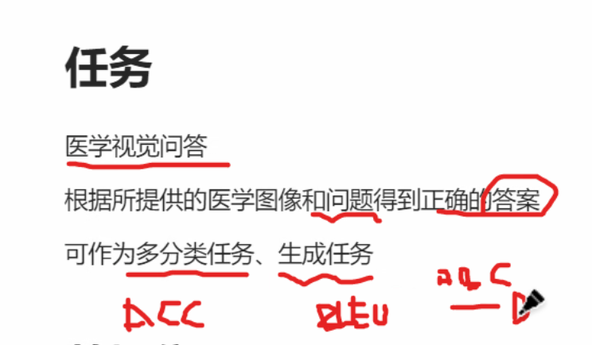
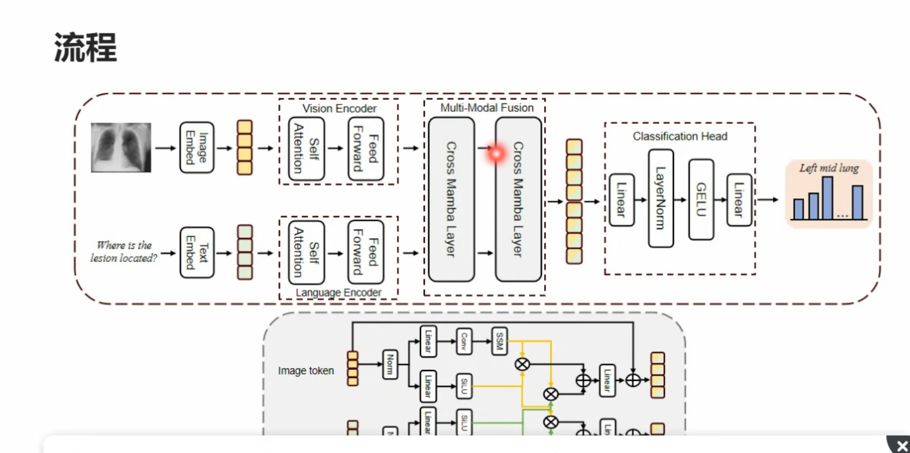

## 知识蒸馏

softmax得0-1连续的标签，对学生模型有指导性

教师模型是大数据预训练的，再训练学生模型，省事儿

距离类型可以替换

欧氏距离好处：样本适用面广

协方差：样本异常值多就波动大

## 医学视觉问答

 

一个是有标准答案来分类 （YES/NO）

一个是用NLP的BLUE来计算生成回答和标准的loss

 

两条道输入文本图像的token，然后分别进model并融合（concat？），分类头分类医学问答结果

## 多分支融合

可以多个分支融合再concat
