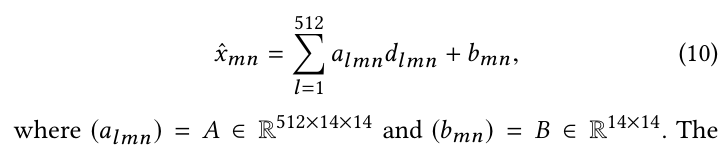

[toc]

# ABSTRACT

传统上，青光眼的诊断是基于视野敏感度（VF）的测量。然而，视野测试耗时、成本高且噪声大。目前，使用视网膜厚度（RT）进行青光眼诊断是理想的选择。因此，我们提出了一种新方法，用于从青光眼眼睛的视网膜厚度估计视野。关键思想是使用我们新提出的基于模式正则化（PBR）和基于模式可视化（PBV）的方法，结合卷积神经网络（CNN）。PBR有效地结合了无监督学习从非配对视野数据中学习，并通过监督学习结合RT-VF关系，从而避免了CNN对小尺寸数据的过拟合。PBV以保留其非线性的方式可视化RT和VF之间的功能对应关系。我们用真实数据集实证证明，使用PBR的CNN实现了迄今为止最高的估计精度，而使用PBV的CNN在眼科背景下对知识发现非常有效。

## INTRODUCTION

### Motivation

青光眼是一种进行性眼病，会导致视网膜神经纤维死亡和视觉感知障碍。它最终可能导致永久性失明。这种进展是不可逆的，但可以通过药物和/或手术治疗来减缓。因此，早期检测青光眼的进展非常重要。视野（VF）是诊断青光眼和监测青光眼进展的主要指标。视野通常使用Humphrey视野分析仪（HFA，卡尔·蔡司医疗，美国加州都柏林）进行测量。然而，视野测试非常劳动密集，非常耗时，并且噪声很大。有报告显示，视网膜厚度（RT）与视野密切相关。RT是使用光学相干断层扫描（OCT）测量的。与视野测试相比，这种测量的费用更低，耗时更少，噪声也更小。因此，开发能够从OCT测量的RT准确估计视野的技术非常重要。这将大幅降低目前青光眼的诊断成本，并最终对眼科产生巨大影响。Uesaka等人提出基于仿射结构非负矩阵分解（ASNMF）和卷积神经网络（CNN）的两种方法来实现这一估计任务。他们展示了ASNMF方法对于相对较小的数据尺寸效果更好，而基于CNN的方法对于更大的数据尺寸效果更好。他们还展示了ASNMF方法对眼科知识发现有用。据我们所知，[30]是第一篇关于从RT数据估计视野的论文。以前方法的主要缺点是1）估计精度还不够高，无法在实际的临床实践中使用，以及2）获得的知识未能反映VF和RT之间的非线性关系。关于1），这些方法估计的均方根误差（RMSE）为6.8-7.3，这不足以在实际临床实践中使用。这种不准确的原因是需要大量的VF和RT配对数据进行训练，但可用的数据是不平衡的。也就是说，**少量的配对数据是可用的，而大量的非配对VF数据没有相应的RT数据**。这是不平衡的非配对数据问题。关于2），Uesaka等人使用线性模型获得了关于RT和VF之间功能关系的知识。然而，真正的功能关系本质上是非线性的。也就是说，VF值可以随着RT值的平滑变化而突然变化。这种非线性是早期检测青光眼的关键。CNN可以学习这样的非线性关系。然而，如何可视化非线性关系一直是个开放问题。这是RT-VF非线性问题。本文的目的有两个。首先，我们提出了一种通过解决不平衡非配对数据问题和RT-VF非线性问题来估计RT数据的VF的新型通用方法。其次，我们通过实证证明了我们提出的方法的有效性和有用性，以获得该领域最佳记录的性能。

#### 理解

提出   少量的配对数据是可用的，而大量的非配对VF数据没有相应的RT数据

引出SSL

### Contribution and Significance

我们的论文贡献可以总结如下：A）开发基于模式的正则化学习：解决不平衡非配对数据问题的关键思想是首先使用无监督方法从未配对的非配对数据（VF数据）中学习模式，然后使用获得的模式对配对数据（RT+VF数据）的监督学习进行正则化。我们将这种方法称为基于模式的正则化（PBR）。请注意，PBR与传统的半监督学习（SSL）方法完全不同。设x为RT，y为VF。在SSL中，用于生成x的无监督学习用于学习条件概率模型p(y|x)。在我们的方法中，用于生成y的无监督学习用于相同的目的。在这里，我们使用CNN进行监督学习，而我们可能使用非负矩阵分解（NMF）、主成分分析（PCA）或自编码器（AEs）进行无监督学习。因此，我们可以充分利用PBR中的非配对和配对数据。我们将PBR应用于青光眼患者的真实数据集，并表明我们的方法实现了6.0的RMSE，这是迄今为止从RT估计VF的最高精度。B）开发了一种新的“基于模式的可视化”方法：解决RT-VF非线性问题的关键思想是首先使用NMF提取VF和RT域中的特征模式，然后表示CNN相对于这些模式的梯度信息。这种方法称为基于模式的可视化（PBV）。PBV能够表示RT和VF之间的非线性关系。也就是说，随着青光眼的开始损害VF，PBV图的边缘突然出现。因此，PBV中的边缘检测有助于我们理解青光眼的进展。这与ASNMF不同，ASNMF只能可视化域之间的线性依赖性。我们实证证明了PBV可以检测到未来可能发生的潜在VF缺陷。

### Related Work

已经有很多研究致力于从视野数据（例如[12, 22]）预测青光眼的进展。然而，大多数研究都面临着相关患者数据不足的问题。许多最新的研究通过利用其他患者的类似数据克服了这个问题[10, 19-21]。其他关于青光眼进展预测的研究不仅使用视野数据，还使用其他特征，如眼内压[29]和围绕视盘的眼科视网膜神经纤维层（RNFL）数据[32]。最近，Hood等人[14]和Ajtony等人[1]显示了视野和视网膜厚度之间统计上显著的关联。Eura等人[6]证明了视网膜神经节细胞和内层丛状层（GCIPL）的平均厚度与视野相关。然而，这些先前的研究并没有指出任何从视网膜厚度估计视野的方法。Uesaka等人[30]首次进行了从HFA（SITA-Standard模式10-2）测量的视野数据估计视野的工作。这种方法基于两种不同领域：视野和视网膜厚度的多视图学习。然而，如前所述，这种方法受到了不平衡非配对数据问题和RT-VF非线性问题的困扰。我们本文提出的方法论旨在克服这些困难。我们提出的PBR方法与SSL密切相关，因为两者都结合监督学习和无监督学习来获得更好的结果[4]。然而，问题设置彼此不同，如前所述。SSL的方法不能直接应用于我们的问题。本文的其余部分组织如下：第2节介绍了VF、RT、CNN和NMF的基本概念作为预备知识。第3节和第4节分别介绍了PBR和PBV。第5节展示了在真实青光眼数据集上的实验结果。第6节总结了本文。

## PRELIMINARIES

### Visual Field Data

视野数据用一个整数值表示视觉敏感度阈值，属于集合{0, · · · , 40}。该阈值使用HFA的SITA-Standard模式和10-2程序进行测量。视野位置的光感受性阈值越高，意味着阈值越高。有关SITA-Standard的详细信息，请参见[25]。在我们的数据集中，视野在中央10度视野区域内测量了68个位置。这些位置分布在视野的每2度位置。图1（d）展示了一个真实的视野数据示例。它表明视野的下半部分存在缺陷。视野测试的问题在于它非常耗时，测量也非常嘈杂。测试通常需要超过20分钟才能完成两只眼睛。

### Retinal Thickness Data

研究人员已经表明，视野与视网膜厚度（RT）密切相关[2, 6, 14, 16]。在青光眼眼中，随着病情的进展，某些视网膜层会变薄。我们数据集中的视网膜厚度数据包括视盘周围视网膜神经纤维层（RNFL）、视网膜神经节细胞层和内层丛状层（GCIPL）以及棒状和锥状层（RCL）。这些数据是使用光学相干断层扫描（OCT）[15]测量的，并以512×128像素的分辨率获得。图1（a）-（c）展示了一个具有结构异常的代表性视网膜厚度数据示例。通常情况下，使用OCT进行的视网膜厚度测试比使用HFA进行的视野测试要省时得多。前者只需要几秒钟，并且对测量噪声不太敏感。因此，基于视网膜厚度测试的青光眼诊断是期望的，以减少成本。本研究的目的是开发一种有效的方法，从视网膜厚度（RT）估计视野（VF）（见图2）。

### Estimation with Convolutional Neural Networks

我们采用卷积神经网络（CNN）[17, 27, 28]作为基本模型，根据[30]从RT估计VF。CNN是一种深度神经网络，由交替的卷积和池化层组成。CNN接受RNFL、GCIPL和RCL图像作为输入，并估计视野。在临床可用的青光眼数据集通常不够大，无法训练CNN。因此，我们利用迁移学习[31]的框架。在这个框架内，网络参数用另一个大型数据集训练的网络参数进行初始化。具体来说，我们使用VGG16[27]进行自然图像分类[24]。在预训练架构的最后一层卷积的顶部，堆叠了一个位置线性回归层来估计[30]中的VF。我们使用这种架构作为基线之一。设hl(x) ∈ RM是第l个输出通道（即第l个特征图）的卷积层，那么VF的估计如下：

$ y_{pred}(x) = \sum_{m=1}^{M} \left( \sum_{l=1}^{L} a_{lm} h_l(x) + b_m \right) \odot \delta_m$

其中L是最后一层卷积中滤波器的数量（对于VGG16，L = 512），(alm) ∈ RL×M和(bm) ∈ RM是回归参数，⊙是逐元素乘积的操作符，δm ∈ RM是第m个位置的指示向量，即其第m个元素为1，其他元素为0。这些回归参数是随机初始化的，并且像网络的其他参数一样从头开始优化。M是VF位置的数量；对于本文中处理的所有数据集，M = 68。该模型通过在青光眼数据集上的训练，最小化平方回归误差

$ \frac{1}{N} \sum_{n=1}^{N} \|y_{pred} (x_n) - y_n \|_2 $

其中{yn}是真实值，N是配对数据的数量，∥ · ∥2是L2范数。这里可以使用标准技术如反向传播。

### Extracting Characteristic Patterns with Non-negative Matrix Factorization

我们使用非负矩阵分解（NMF）来从非负数据点矩阵 $$Y = [y_1, \dots, y_N]^\top \in \mathbb{R}_+^{N \times M}$$ 中提取特征模式。NMF尝试将 $$Y$$ 近似分解为两个非负矩阵的乘积，即：

$$
Y \approx W \Theta,
$$

其中 $$W \in \mathbb{R}_+^{N \times K}$$ 和 $$\Theta \in \mathbb{R}_+^{K \times M}$$。矩阵 $$\Theta$$ 的行 $$\{\theta_k\}$$，表示数据特征模式。数据点可以近似表示为这些模式的线性组合。通过解决以下优化问题来获得这种分解：

$$
\min_{W \geq 0, \Theta \geq 0} \| Y - W \Theta \|_F^2,
$$

其中 $$\| \cdot \|_F$$ 表示弗罗贝尼乌斯范数。由于视野（VF）和视网膜厚度（RT）数据都是非负的，NMF非常适合于提取这些域中的特征模式。实际上，已经证明NMF能够提取出有医学意义的青光眼数据模式。

#### 理解

文章中强调已经证明NMF能够提取出有医学意义的青光眼数据模式。

## PBR (PATTERN-BASED REGULARIZATION)

当我们将第2.3节中的CNN应用于实际的青光眼数据集时，它经常面临一个问题，即没有足够的配对数据（视野和视网膜厚度）供其训练。然而，大量的非配对数据（即只有视野数据）是可用的。配对数据的不足可能导致如果仅从配对数据训练具有许多参数的CNN时出现过拟合。这就是不平衡的非配对数据问题。为了解决这一问题，我们引入了一种新的学习方法，称为基于模式的正则化（PBR）。关键思想是通过利用从未配对视野数据中获得的特点模式来规范CNN学习。请注意，以前的研究[30]并未使用非配对视野数据来训练CNN。

我们为PBR提出了两种技术：
(A) 规范目标函数，
(B) 规范网络结构。
两种技术都使用视野模式来规范CNN学习。我们在下面详细介绍它们。

### Regularizing Objective Functions

规范目标函数是通过两个步骤进行的。首先，我们使用无监督学习方法提取特征视野模式。大多数视野数据都位于这些模式形成的一个低维流形上。其次，我们规范模型，使其估计值靠近流形，如图3所示。然后，我们可以在不降低其表示能力的情况下规范模型。我们通过以下方式实现这两个步骤，对目标函数进行规范：

假设已经通过无监督学习方法获得了一个低维流形。我们定义规范后的目标函数为：

$$
\frac{1}{N} \sum_{n=1}^{N} \|y_{pred} (x_n) - y_n \|_2 +  \frac{\beta}{2} R(y_{pred}(x_n)),
$$

其中 $$R(y_{pred})$$ 是一个新的规范项，如果估计结果 $$y_{pred}$$ 远离流形，则对模型进行惩罚。$$\beta (> 0)$$ 是一个超参数，用于调整规范项的强度。请注意，PBR与传统的半监督学习（SSL）[33]类似，两者都利用无监督学习的结果进行监督学习。然而，它们之间有所不同，因为PBR利用无监督学习的目标变量（即非配对视野数据）来监督学习RT-VF关系，而SSL利用无监督学习对解释变量（即非配对视网膜厚度数据）进行监督学习以学习关系。规范项 $$R(y_{pred})$$ 的具体形式可能取决于所选择的无监督学习算法。下面，我们给出了对应于三种无监督学习方法：NMF、PCA和AEs的 $$R(y_{pred})$$ 示例。

**问题**

不懂什么是低维流形，不明白R的意义

#### Pattern-Based Regularization with Non-negative Matrix Factorization and Principal Component Analysis

由于NMF和PCA都是线性降维算法，我们可以以一般形式计算规范项 $$R(y_{pred})$$。假设通过NMF或PCA获得了一个嵌入在 $$\mathbb{R}^M$$ 中的K维仿射子空间：

$$
\{ \Theta^\top w + b \mid w \in \mathbb{R}^K \},
$$

其中 $$\Theta \in \mathbb{R}^{K \times M}$$，$$b \in \mathbb{R}^M$$。然后，我们可以通过以下方式计算规范项 $$R(y_{pred})$$：

$$
R(y_{pred}) = \frac{1}{M} \|y_{pred} - y_{proj}\|^2,
$$

其中 $$y_{proj}$$ 是 $$y_{pred}$$ 在低维子空间上的投影：

$$
y_{proj} = \Theta^\top (\Theta \Theta^\top)^{-1} \Theta (y_{pred} - b) + b.
$$

一旦在**非配对视野数据**上执行了NMF，我们就可以在式(3)  （原有的Y=FG，即Y=W \* theta）中将得到的 $$\Theta$$ 和后面得到的 $$b = 0$$ 插入，从而实现基于NMF的PBR。PCA是最典型的降维方法之一。它从数据 $$Y$$ 计算方差-协方差矩阵，然后计算其特征值和正交归一化基。对应于较大特征值的基称为主成分。设 $$\Theta$$ 为对应于前 $$K$$ 个最大特征值的基，$$b$$ 为样本均值。然后，我们可以通过将这样的 $$\Theta$$ 和 $$b$$ 插入式(7)来实现基于PCA的PBR。

##### 理解

这里多的数据是VF的

小写w是W(N\*K)的一行(1\*K)的转置(K\*1)，即第一篇中的G矩阵，保存潜在的贡献比率

theta是第一篇中的F矩阵，这里就是表示，通过NMF或PCA将原来的N\*M的保存有RNFL、TH值的矩阵降维，theta存降维后的信息，W是还原用的

注意！！！

第一篇中描述的Y = FG，Y的每一行是每个眼睛的TH值展平

这里由NMF分解或PCA得到的theta、w、b是由没有配对的VF数据分解来的一个定值，对于每一个

$y_{pred}$和$y_{proj}$的shape都是$R^M$的即M\*1，M是一个眼睛的TH值的点数。$y_{proj}$的前面一坨的是M\*M的，最后处理出来的大小也是M\*1的

也就是说，计算一个大多数眼睛的视野分布的低维度表示即theta、w、b等，通过计算$y_{pred}$和$y_{proj}$在低维子空间上的投影的距离来规范预测出来的视野分布

#### Auto Encoder-based Regularization

我们可以使用非线性无监督学习算法来进行基于模式的正则化（PBR）。下面给出了一个使用自编码器（AEs）的PBR示例。自编码器是一种神经网络，它计算函数 $$f: \mathbb{R}^M \to \mathbb{R}^M$$ 如下所示：

$$
f(y; \Theta) = f_2(W_2^\top f_1(W_1^\top y + b_1) + b_2),
$$

其中 $$\Theta = \{W_1, b_1, W_2, b_2\}$$，$$W_1 \in \mathbb{R}^{M \times K}$$，$$W_2 \in \mathbb{R}^{K \times M}$$，$$b_1 \in \mathbb{R}^K$$，和 $$b_2 \in \mathbb{R}^M$$ 是参数，而 $$f_1(\cdot)$$ 和 $$f_2(\cdot)$$ 分别是编码器和解码器的非线性函数。假设我们有一个非配对的视野数据集 $$\{y_1, \dots, y_N\}$$。可以通过解决以下优化问题来训练自编码器：

$$
\Theta = \arg\min_\Theta \frac{1}{N} \sum_{n=1}^N \|y_n - f(y_n; \Theta)\|^2.
$$

自编码器可以学习输入数据所在的低维流形。数学上，这个流形被定义为递归映射 $$y_{t+1} \leftarrow f(y_t)$$ 的不变集合。$$y_t$$ 越接近流形，$$y_{t+1} - f(y_t)$$ 就越小。这个观察启发我们为基于自编码器的PBR定义 $$R(y_{pred})$$ 如下：

$$
R(y_{pred}) = \|y_{pred} - f(y_{pred}; \Theta)\|^2.
$$

##### 理解

训练一个神经网络来模拟上面NMF等投射到低维度空间来正则化的操作

### Regularizing Network Structures

规范网络结构是一种通过减少参数数量来避免过拟合的技术。如果没有这种规范，我们将不得不进行逐位置的估计，即逐个位置地估计视野值。这将需要大量的参数：$$ML = 68 \times 512 = 34816$$。因此，逐位置估计可能会导致过拟合问题，因为数据量最多为600，远小于这些参数的数量。为了避免这个问题，我们提出通过进行分组估计而不是逐位置估计来大幅减少所需参数数量。前者意味着我们首先根据位置的功能相似性将视野位置分为多个组；然后在这些组的基础上构建估计模型，其中每个组内的参数是共享的，如图4所示。假设总组数为$$K$$，则分组估计所需的总参数数量为$$K \times 512$$，这可能远小于逐位置估计所需的参数数量。

从医学角度来看，对视野位置进行分组是合理的[7, 14]。非负矩阵分解（NMF）可以用来对功能相似的视野位置进行分组。设$$\theta_k = [\theta_{k1}, \dots, \theta_{kM}]^\top$$是由NMF从未配对的视野数据中提取的特征视野模式。$$\theta_{km}$$中的大值倾向于分配给每个模式中的相似视野位置。因此，一个模式以软方式（即，用连续值）指示一组视野位置。规范网络结构可以通过使用$$\theta_k$$代替公式(1)中的定位指示器$$\delta_m$$来实现：

$$
y_{pred}(x) = \sum_{k=1}^{K} \left( \sum_{l=1}^{L} \tilde{a}_{kl} h_l(x) + \tilde{b}_k \right) \odot \theta_k,
$$

其中$$\tilde{a}_{kl}$$和$$\tilde{b}_k$$是分配给第$$k$$个模式的参数。

#### 理解

在第一篇中，a的参数的512\*14\*14有10w左右，过于大了（每个通道的每个位置都要有参数）

 

即便只对68个点做计算也有68\*512个，特别容易过拟合（论文中总共就600个配对数据）

现在引入对视野位置进行分组

如果视野位置被分成K组，每组需要512个参数，总参数数量就减少到K×512，这通常远小于逐位置估计所需的参数数量。

**功能相似性分组**

- **分组依据**：分组是基于视野位置的功能相似性进行的，这是从医学角度来看是合理的。
- **NMF分组**：使用非负矩阵分解（NMF）**从未配对的视野数据中提取特征模式**，这些模式可以指示哪些视野位置是功能相似的。

理解为分为了K个模式，每个点有K组theta值，其中的大值决定了它属于的模式。

L：512

这个$y_{pred}(x)$的x是68个点所有位置的预测值，相当于是每一个点被指定了一个组别（小写的k），它只与对应组别的theta k相乘

theta_k的k是NMF里的超参，即人为指定k组

然后M（68）个位置中的第i个位置都有theta km里面对应的i的位置，由k个theta-i的值相乘求和

所以最终的步骤就是，对于网络传来的512\*14\*14的feature map，其上每个点都对应k个模式，每个模式内部直接把512个通道的值累加成一张14\*14的map，然后第i个模式的map再与theta_i相乘（逐元素相乘），然后k个模式得到k张map再累加。  （多余的点在与theta_i相乘时就丢掉了）

原来是每一个通道对应的点都有可学习参数，这次改进后就分为k组，组内直接共享参数然后通道累加，组外再累加

## PATTERN-BASED VISUALIZATION

在本节中，我们介绍了基于模式的可视化（PBV）。由卷积神经网络（CNNs）提取的特征模式在PBV中扮演着关键角色。我们首先给出使用CNNs的微分信息的动机。然后，我们总结了传统基于CNN的可视化技术的问题。最后，我们提出了PBV来解决这些问题。

### Motivation

已知在某个位置的视网膜厚度（RT）与功能上对应的视野（VF）之间存在显著的相关性[6, 14]。这种关系被认为是非线性的[14]。换句话说，除非RT超过某个阈值，否则VF不会受到太大影响。一旦超过这个阈值，VF就会突然变化。图5展示了这种关系。

图5：早期青光眼检测与RT–VF梯度

这种非线性关系表明，与VF本身相比，VF相对于RT的导数对于早期青光眼的检测提供了更多信息（见图5）。这是因为在青光眼的早期阶段，尽管VF值接近正常水平，VF的绝对导数可能很大。如果仅检查VF值，可能会忽略这些早期阶段。

我们提出的基于模式的可视化（PBV）就是基于这一观察。我们可以从训练好的CNNs中提取导数信息，这些信息可以用来可视化RT和VF之间的对应关系。

### Visualization Technique of CNNs

4.2 CNNs的可视化技术

观察CNN的反向传播梯度是深度学习中用于解释网络功能的一种广泛使用的技巧。由CNN表示的函数 \($f(\cdot)$\) 可以在数据点 \(x\) 处相对于数据域的局部变化 \($\Delta x$\) 和 \($\Delta y$\) 进行线性化，如下所示：

$$\Delta y = A \Delta x,$$

其中 \($A = (a_{ml}) = [a_1, \dots, a_M]^\top$\) 是雅可比矩阵：

$$a_{ml} \text{ def}= \frac{\partial f_m(x;\theta)}{\partial x_l} \bigg|_x.$$

行向量 \($a_m$\) 可以作为图像进行可视化。这表明输入 \(x\) 的哪一部分对估计结果有贡献。

将这种可视化技术应用于我们的情况时存在两个问题。首先，CNN的RT-VF梯度与医学上关于RT进展的既定知识大相径庭。图6比较了一个眼睛的 \($a_{22}$\) 和用NMF提取的医学上可理解的RT模式。它们显然不同；像 \($a_{22}$\) 这样的RT变薄模式在医学上是不可信的。因此，直接应用现有技术不能作为青光眼进展的可靠预测器。其次，就VF域的粒度而言，可视化的粒度太细了。直接应用现有技术，我们需要检查每个VF位置的 \($a_m$\)。然而，从眼科的角度来看，我们对个别VF位置的进展不太感兴趣。我们更感兴趣的是跨越整个VF的进展模式。这表明我们应该考虑VF模式，而不仅仅是个别VF位置。

#### 理解

看了输入x对VF其中一个点的贡献图，与NMF分解出来的贡献做比较，认为不合理

然后说逐个点预测VF是不合理的，还是要分模式

### Proposed Method: Pattern-Based Visualization

我们已经展示了使用非负矩阵分解（NMF）可以提取出医学上可信的视野（VF）和视网膜厚度（RT）的青光眼损伤模式。在这里，我们也采用NMF来提取这些模式。在基于模式的可视化（PBV）中，NMF是在假设VF和RT可以表示为这些模式的线性组合的情况下进行的。这个假设在数学上意味着VF或RT数据位于高维欧几里得空间中的一个线性子空间上。PBV的过程如下：首先，我们对非配对的RT和VF数据进行NMF，以提取各自领域中的青光眼损伤模式。我们将这些模式表示为 \(\{b_1^{RT}, \dots, b_{L'}^{RT}\}\) 和 \(\{b_1^{VF}, \dots, b_{M'}^{VF}\}\)。然后我们限制局部平移如下：

$$\Delta x = B_{RT} z_{RT}, \Delta y = B_{VF} z_{VF},$$

其中 \(z_{RT}\) 和 \(z_{VF}\) 是相对于NMF基（即青光眼模式）的局部变化向量。\(B_{RT}\) 和 \(B_{VF}\) 是由RT和VF基组成的矩阵：\(B_{RT} = [b_1^{RT}, \dots, b_{L'}^{RT}]^\top\) 和 \(B_{VF} = [b_1^{VF}, \dots, b_{M'}^{VF}]^\top\)。图7展示了这个概念。将方程（14）代入方程（12）并使用Moore-Penrose逆求解 \(z_{VF}\)，得到：

$$z_{VF} = Dz_{RT},$$

其中

$$D \text{ def}= (B_{VF}B_{VF}^\top)^{-1}B_{VF}AB_{RT}^\top.$$

请注意，局部平移向量被限制在低维线性子空间内。因此，可视化的粒度不再过于细致。此外，得到的对应关系可以很容易地检查是否与现有的医学知识相匹配。此外，PBV能够可视化VF和RT模式之间的非线性关系。由于这种非线性，当青光眼开始损害VF时，即使VF接近正常水平，PBV图中的边缘也可能突然显现。这意味着PBV中的边缘检测有助于我们检测青光眼的早期损伤。

由于NMF基的非负性以及RT和VF之间的正相关性，\( D \)矩阵中的大多数元素是正数。因此，我们忽略\( D \)中的负值。这使我们能够将方程（16）中的关系可视化为图8所示的二分图。边的厚度与\( D \)中对应的元素成比例。因此，边越厚表示RT基和VF基之间的相关性越强。基的连接性显示了视网膜的哪一部分与PBV检测到的缺陷或潜在缺陷相关。边连接的图的外观因此指示了眼睛的健康状况。

图9展示了使用NMF提取的VF模式。红色表示高VF值，而蓝色表示低VF值。在图9中，(a)中VF仅保留在上方区域，(b)中VF仅保留在上方近中央区域，(c)中VF仅保留在下方近中央区域，(d)中VF仅保留在下方区域，(e)中VF仅保留在中央区域。这些结果表明，从医学角度来看，VF位置的分组是合理的。

#### 理解

就是在证明需要分模式

还有VF随RT变化可能是分阶段突变的，提供了一种预测早期青光眼的方法，与任务无关

