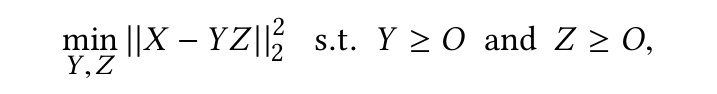
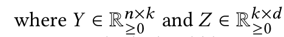
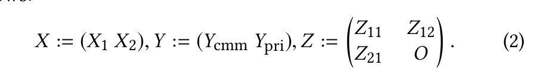
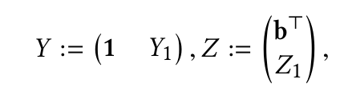
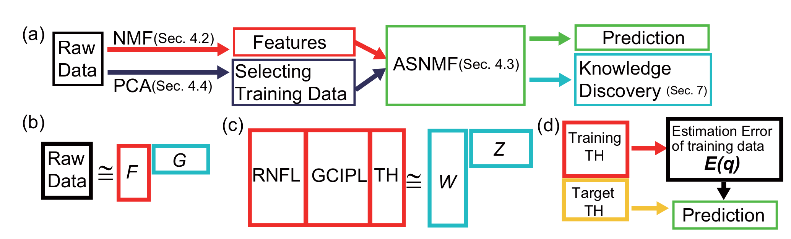
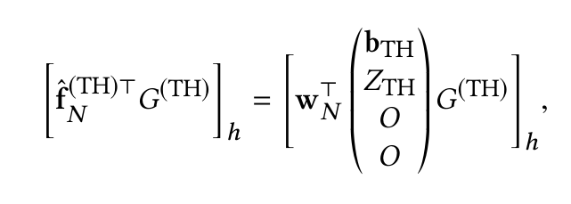
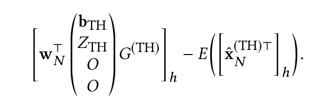
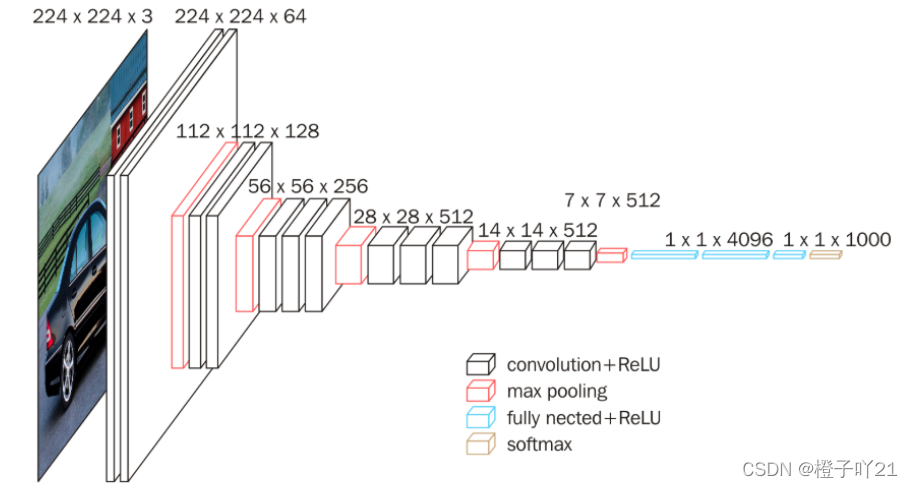
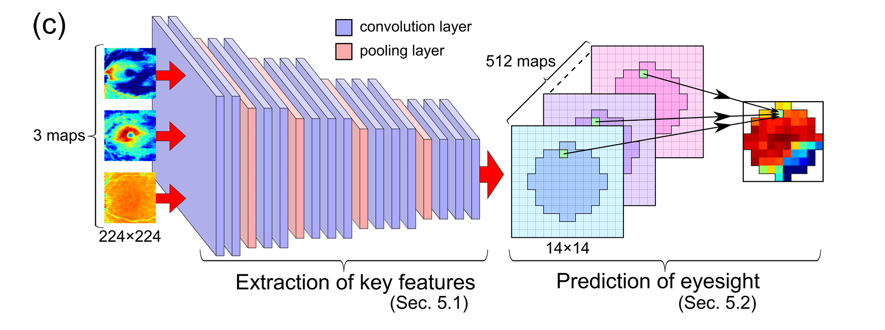

[toc]

# abstract

视觉场的密集测量，这对于检测青光眼是必要的，已知成本非常高且劳动密集。最近，视网膜厚度的测量成本比视觉场的测量要低。因此，人们非常希望将视网膜厚度数据以某种方式转化为视觉敏感度数据。在本文中，我们提出了两种新的方法，使用光学相干断层扫描（OCT）测量的视网膜厚度数据来估计SITA-Standard模式10-2分辨率下的视觉场敏感度。第一种方法称为仿射结构非负矩阵分解（ASNMF），能够同时处理视觉场的估计和深度青光眼知识的发现。第二种方法基于卷积神经网络（CNNs），显示出非常高的估计性能。这些方法属于多视图学习方法，因为它们同时使用视觉场和视网膜厚度数据。我们从多个角度实验性地测试了我们方法的性能。我们发现ASNMF在相对较小的数据大小时效果更好，而CNNs在相对较大的数据大小时效果更好。此外，通过ASNMF发现了一些临床知识。据我们所知，这是第一篇基于视网膜厚度数据进行视觉场密集估计的论文。

## introduction

### Background of This Study

青光眼是一种眼部疾病，是全球第二大致盲原因。随着疾病的进展，视网膜层的厚度会减少，最终导致视场的不可逆损害。早期发现青光眼需要能够精确测量视场。研究表明，中央10度视场内的密集测量对于检测青光眼非常有效，因为该区域的敏感度与视力质量密切相关。然而，这种密集测量通常使用Humphrey Field Analyzer (HFA)进行，成本非常高且劳动密集。与此同时，视网膜层的厚度可以使用光学相干断层扫描(OCT)来测量。这种测量比使用HFA测量视场要容易得多，成本也更低。因此，人们非常希望能够以某种方式将视网膜厚度数据转化为视觉敏感度数据。在眼科领域，已经发现视网膜厚度与视场的敏感度是相关的，但它们之间的定量关系尚未明确。据我们所知，如何从视网膜厚度估计视觉敏感度一直是一个未解决的问题。如果这个问题得到解决，将对眼科领域产生重大影响。

在本文中，我们提出了一种基于OCT获得的视网膜厚度数据来估计中央10度视场的方法。我们提出的方法基于两种数据挖掘技术：仿射结构非负矩阵分解（ASNMF）和卷积神经网络（CNNs），这些将在本文后面详细描述。我们建议根据目的和数据大小使用ASNMF或CNNs。也就是说，ASNMF在相对较小的数据大小时效果更好，而CNNs在相对较大的数据大小时效果更好。此外，ASNMF适合于提取青光眼眼的视觉模式特征，而CNNs适合于尽可能准确地预测视觉敏感度。

### Novelty and Significance

本文的新颖性和重要性如下：（1）提出了一种从OCT数据中进行视场密集估计的新方法。所提出的方法能够从OCT数据中估计出SITA-Standard模式10-2分辨率的视场，这对于将在实际临床场所使用的估计非常重要。据我们所知，这是第一项提出从OCT数据中估计SITA-Standard模式10-2分辨率视场的方法。因此，我们提出的框架将有助于改善视场预测。（2）高估计精度使其能够在实践中使用。为了实现单个患者的高准确性，两种方法都利用了其他患者的数据来构建OCT数据和视场之间的关系模型。对于CNNs来说，这种关系可以通过多层自动检测，这些层是用预学习初始化的。对于更大的数据集，CNNs的准确性使其可以在实践中使用。（3）估计的可靠性是可控的。在实际的临床应用中，进行准确性差的估计比什么都不做更糟糕。在所提出的方法中，我们建立了一个标准，根据数据是否可预测来分类数据，使用支持向量机（SVM）模型来确定计算估计的可靠性。（4）成功提取了青光眼眼的OCT-视场模式。ASNMF从ASNMF矩阵的分解中提取了视场和视网膜层数据之间的潜在关系，这与临床知识一致。

### Related Works

在本文中，我们探讨了如何利用视网膜厚度和视觉敏感性数据来研究青光眼。许多研究致力于提高青光眼进展预测的准确性[9, 26]；然而，这些研究大多因临床测量的高成本而受到相关患者数据不足的限制。近期的分析通过利用其他患者的相似数据克服了这一问题[8, 20, 23, 24, 32]。我们也利用数据间的相似性来提高准确性。此外，还有研究基于眼底照片和/或视网膜层厚度测量来确定眼睛是否患有青光眼[35, 36]。最近，从视网膜层厚度估计视场的研究得到了深入探讨。Hood等人[10]和Ajtony等人[1]表明，视场的敏感度与OCT测量的视网膜层厚度之间存在统计学上显著的相关性。Eura等人[5]使用多元线性回归表明，黄斑区的节细胞和内丛状层（GCIPL）的平均厚度与视场的平均敏感度相关。然而，这些先前的工作无法估计特定局部视场点的敏感度，也无法推断视场和视网膜层厚度之间的相互作用。我们提出的方法克服了这些困难。据我们所知，这是第一篇展示如何估计SITA-Standard模式10-2全分辨率视场的论文。在开发我们的方法时，我们同时分析了不同领域的数据。因此，我们的方法可以被认为是一种多视图学习技术[34]。

### Organizationof This Paper

本文的其余部分组织如下。第2节介绍了青光眼数据集。我们在第3到5节中概述了我们提出的方法。第6节讨论了预测精度的控制。第7节提供了如何获得青光眼知识的概述。第8节展示了四次数值实验的结果。最后，第9节对本文进行了总结。

## GLAUCOMA DATA

### Data of Visual Field

在我们的数据集中，视场的状态由一个整数值TH表示，该值是使用Humphrey Field Analyzer（HFA）和SITA-Standard模式10-2测量得到的。TH的范围在[0, 40]之内。当视场中某个局部点的光敏度增加时，TH值也随之增加。有关SITA-Standard的详细信息，请参见[28]。我们的TH数据集测量了中央10度视场区域内的68个点，这些点间隔2度。图1(a)展示了左眼的点分布。右眼的图像为了使用相同的分析方法，在水平方向上进行了翻转。这种测量比通常的视场测试设置（如24-2（中央24度）和30-2（中央30度））要密集得多。因此，我们的数据集更好地代表了对视力至关重要的领域。图1(b)展示了真实的TH数据示例：。

### Data of the Retinal Layers

我们的视网膜厚度数据涉及视网膜神经纤维层（RNFL）、节细胞-内丛状层（GCIPL）和视杆细胞-视锥细胞层（RCL）。这些数据是通过光学相干断层扫描（OCT）以512×128像素的图像形式测量得到的。我们的数据集中重点关注黄斑区域，因为它是中心区域，对眼睛的功能起着主导作用。图1中展示了GCIPL、RNFL和RCL图像的例子。在青光眼患者眼中，视网膜细胞的死亡导致视网膜层变薄。视网膜层厚度与视场光敏度之间的关系在文献[2, 10, 13]中进行了研究。

## OVERVIEW OF NOVEL METHODS

两种提出方法将在接下来的章节中介绍。图2总结了ASNMF和CNNs之间的比较。如第4节所述，ASNMF具有复杂的结构，包括公共特征和私有特征以及排除偏置的部分。由于这种精细的框架，ASNMF在数据量相对较小的情况下也能提供良好的性能。如第5节所述，CNNs有大量的参数需要学习，这需要大量的数据来学习。因此，对于我们青光眼数据集来说，预学习是必不可少的。这就是为什么CNNs在数据集相对较大的情况下表现出良好性能的原因。

## NMF-BASED PROPOSED METHOD

### Background of Our Proposed Method

NMF非负矩阵分解

通过ML将X分解为YZ两个矩阵（XYZ均非负），k是超参

#### SNMF

符号：

1. **$X$**: 原始数据矩阵，其元素来自实数域，通常表示为 $X \in \mathbb{R}^{n \times d}$，其中 $n$ 表示行数（样本数），$d$ 表示列数（特征数）。

2. **$Y$**: 公共特征矩阵，其元素为非负数，表示为 $Y \in \mathbb{R}^{n \times k}_{\geq 0}$，其中 $k$ 是分解后特征空间的维度。

3. **$Z$**: 私有特征矩阵，其元素同样为非负数，表示为 $Z \in \mathbb{R}^{k \times d}_{\geq 0}$。

4. **$Y_{\text{cmn}}$**: 公共特征矩阵中的公共部分，表示不同领域（或样本）共有的特征。

5. **$Y_{\text{pri}}$**: 公共特征矩阵中的私有部分，表示特定领域（或样本）独有的特征。

6. **$Z_{\text{11}}$**: 私有特征矩阵中与公共特征矩阵中的公共部分相对应的部分。

7. **$Z_{\text{12}}$**: 私有特征矩阵中与公共特征矩阵中的私有部分相对应的部分。

8. **$Z_{\text{21}}$**: 公共特征矩阵中的私有部分与私有特征矩阵中的公共部分相对应的部分。

9. **$O$**: 零矩阵，其所有元素都为0，用于在矩阵 $Z$ 中排除某些部分的贡献。

10. **$\geq$**: 符号表示矩阵元素的非负性，即矩阵 $Y$ 和 $Z$ 中的所有元素都必须大于或等于0。

11. **$\min$**: 表示最小化目标函数。

12. **$\|\cdot\|_2$**: 表示Frobenius范数，用于度量矩阵元素差异的大小。

13. **$\|\cdot\|_2^2$**: 表示Frobenius范数的平方，即矩阵元素差异的平方和。

14. $X_1$: 通常代表数据的一个子集或一组特征，这些特征在不同领域或样本中是共享的。换句话说，\(X_1\) 包含了数据的公共部分。

15. $X_2$: 代表数据的另一个子集或一组特征，这些特征是特定于某个领域或样本的。换句话说，\(X_2\) 包含了数据的私有部分。

0矩阵是为了排除Ypri对X2的影响

在结构化非负矩阵分解（SNMF）中，矩阵 $Y$ 和 $Z$ 的结构被设计为能够捕捉数据中的公共和私有特征。让我们重新审视一下 $Y$ 和 $Z$ 的结构以及它们如何与 $X_1$ 和 $X_2$ 相关联。

给定：
$$Y := \begin{bmatrix} Y_{\text{cmn}} & Y_{\text{pri}} \end{bmatrix},$$

$$Z := \begin{bmatrix} Z_{11} & Z_{12} \\ Z_{21} & O \end{bmatrix},$$

其中：
- $Y_{\text{cmn}}$ 是公共特征矩阵。
- $Y_{\text{pri}}$ 是私有特征矩阵。
- $Z_{11}$ 表示公共特征对 $X_1$ 的贡献。
- $Z_{12}$ 表示公共特征对 $X_2$ 的贡献。
- $Z_{21}$ 表示私有特征对 $X_1$ 的贡献。
- $O$ 是零矩阵，表示私有特征不对 $X_2$ 有贡献。

当我们将 $Y$ 和 $Z$ 相乘时，我们得到：
$$YZ = \begin{bmatrix} Y_{\text{cmn}} & Y_{\text{pri}} \end{bmatrix} \begin{bmatrix} Z_{11} & Z_{12} \\ Z_{21} & O \end{bmatrix} = \begin{bmatrix} Y_{\text{cmn}}Z_{11} + Y_{\text{pri}}Z_{21} & Y_{\text{cmn}}Z_{12} \end{bmatrix}.$$

因此，$X_1$ 和 $X_2$ 可以表示为：
$$X_1 = Y_{\text{cmn}}Z_{11} + Y_{\text{pri}}Z_{21},$$
$$X_2 = Y_{\text{cmn}}Z_{12}.$$

这种分解方式允许 $X_1$ 包含来自公共和私有特征的贡献，而 $X_2$ 只包含来自公共特征的贡献。这反映了数据中不同部分的复杂性和多样性，其中 $X_1$ 可能包含更综合的信息，而 $X_2$ 包含更特定的信息。

在青光眼数据的背景下，$X_1$ 可能代表那些受多种因素影响的视场区域，而 $X_2$ 可能代表那些主要受共同视场属性影响的区域。通过这种结构化的方法，研究人员可以更精确地分析和理解数据中的不同组成部分。

在SNMF中，通过最小化 $X$ 和 $YZ$ 之间的Frobenius范数平方，我们可以找到 $Y$ 和 $Z$ 矩阵，使得 $Y$ 包含数据的公共特征，而 $Z$ 包含数据的私有特征。这种分解有助于揭示数据中的潜在结构和模式。

如果我们有一个包含多个不同医学成像视图（如MRI、CT扫描和X射线）的数据集，X1*X*1 可能代表所有视图中都存在的共同成像特征，而 X2*X*2 可能代表特定于某个成像技术的独特特征。通过这种分解，我们可以分别识别和分析数据的共享和特定特征，从而提高我们对数据的理解并提高分析的准确性。

#### ANMF

其中1是一个所有分量都为1的向量。我们发现 X可以被近似为$1b^T + Y_1Z_1$

b是bias，缓解预测0为正的情况的

在ASNMF的情况下，非负性限制了重构的表示能力。例如，该方法经常将实际TH值为零的视场点预测为正的TH值，因为为了正确估计零TH值，相应的分解矩阵的组件必须全部为零。因此，在这种情况下，估计的TH值往往比实际的TH值大。在TH值较大的情况下，也会出现这种倾向。从训练数据中观察到这些倾向，我们利用训练数据的残差来缓解这些缺陷。

图3：（a）ASNMF的流程。临床知识在图3（b）和（c）中的浅蓝色矩形内发现。（b）特征 \(F\) 和基 \(G\) 通过NMF生成。（c）矩阵 \(W\) 和 \(Z\) 通过ASNMF生成。（d）训练数据的估计误差 \(E(q)\) 提高了目标TH的预测准确性。

### Generating Low-dimensional Features

当NMF家族的方法应用于原始青光眼数据时，由于原始数据维度非常高，分解得到的矩阵难以解读。在进行数据分析之前，我们必须先将数据转换成低维特征，涵盖三个领域（详见第2节）。如图3(b)所示，对于每个领域，我们分别使用普通的NMF（如等式（1）所定义）来获得低维特征。原始数据矩阵 $X_{\text{TH}}$ 定义为 $X_{\text{TH}} \in \mathbb{R}^{N_{\text{TH}} \times d_{\text{TH}}}$，其第 $i$ 行向量 $x_i^\top$ 是第 $i$ 个眼睛的TH数据。注意 $N_{\text{TH}}$ 是眼睛的数量，$d_{\text{TH}}$ 是数据的维度。我们将 $X_{\text{TH}}$ 分解为 $F_{\text{TH}} \times G_{\text{TH}}$ 的乘积，其中 $F_{\text{TH}} \in \mathbb{R}^{N_{\text{TH}} \times k_{\text{TH}}}_{\geq 0}$ 和 $G_{\text{TH}} \in \mathbb{R}^{k_{\text{TH}} \times d_{\text{TH}}}_{\geq 0}$。$G_{\text{TH}}$ 的第 $i$ 行向量提供了数据的特征基。$F_{\text{TH}}$ 的第 $i$ 行向量 $f_{\text{TH},i}^\top$ 表示第 $i$ 个眼睛对基的贡献比率。因为 $F_{\text{TH}}$ 与原始数据相比是低维的，我们可以使用 $F_{\text{TH}}$ 而不是原始数据来分析ASNMF。我们可以通过乘积 $f_{\text{TH},i}^\top G_{\text{TH}}$ 获得原始维度的数据。对于RNFL和GCIPL，我们将这些2维图像视为1维向量。因此，我们可以以相同的方式获得RNFL和GCIPL的特征。注意上述变量中的索引TH被RNFL和GCIPL分别替换。我们定义 $k_{\text{sum}} = k_{\text{TH}} + k_{\text{RNFL}} + k_{\text{GCIPL}}$。最后，我们得到一个特征矩阵 $F \in \mathbb{R}^{N \times k_{\text{sum}}}$，其中 $F$ 的第 $i$ 行向量表示为 $f_i^\top$，定义为 $f_i^\top := (f_{\text{RNFL},i}^\top \ f_{\text{GCIPL},i}^\top \ f_{\text{TH},i}^\top)$ 对应于第 $i$ 个眼睛的数据。第 $i$ 行（$i = 1, \ldots, N-1$）对应于训练眼睛数据，第 $N$ 行对应于目标眼睛。因为目标眼睛的目标TH是未知的，所以 $f_{\text{TH},N}^\top$ 部分留空。

> 意思是将TH、RNFL、GCIPL三个数据的二维图像视为一维向量然后展平，X_TH等三个矩阵第i行存的第i个眼睛的数据。将三个矩阵分解为对应的F、G矩阵之后，F的第i行仍然对应第i个眼睛的信息。k为三个F矩阵分别的宽，将三个F矩阵拼接起来，则第i行仍对应第i个眼睛的数据。对于RNFL和GCIPL对应的F矩阵的行数应该是比TH对应的F矩阵长一维的，多的一维对应训练眼睛的数据，所以最后一行f_TH,N留空

### Proposed ASNMF

当然，下面是优化问题的公式和矩阵定义，转换成Markdown支持的格式：

优化问题可以写成：

$$
\min_{W,Z} \|(F - WZ) \odot \bar{M}\|_2^2 \quad \text{s.t.} \quad W \geq O \text{ 和 } Z \geq O,
$$

其中 $\bar{M}$ 是一个掩码矩阵，定义为 $\bar{M}_{ij} = 0$ 如果 $F_{ij}$ 是空白的，$\bar{M}_{ij} = 1$ 否则。注意 $(A \odot B)_{ij} := A_{ij}B_{ij}$。

矩阵 $W$ 定义为：

$$
W := [1 \quad W_{\text{cmn}} \quad W_{\text{RNFL}} \quad W_{\text{GCIPL}}],
$$

其中 $$W_{\text{cmn}} \in \mathbb{R}^{N \times l_{\text{cmn}}}_{\geq 0}$$，$W_{\text{RNFL}} \in \mathbb{R}^{N \times l_{\text{RNFL}}}_{\geq 0}$，和 $W_{\text{GCIPL}} \in \mathbb{R}^{N \times l_{\text{GCIPL}}}_{\geq 0}$。

矩阵 $Z$ 定义为：

$$
Z := \begin{bmatrix}
b_{\text{RNFL}}^\top & b_{\text{GCIPL}}^\top & b_{\text{TH}}^\top \\
Z_{\text{RNFL}} & Z_{\text{GCIPL}} & Z_{\text{TH}} \\
V_{\text{RNFL}} & O & O \\
O & V_{\text{GCIPL}} & O \\
\end{bmatrix},
$$

其中 $b_{\text{RNFL}} \in \mathbb{R}^{k_{\text{RNFL}}}_{\geq 0}$，$b_{\text{GCIPL}} \in \mathbb{R}^{k_{\text{GCIPL}}}_{\geq 0}$，和 $b_{\text{TH}} \in \mathbb{R}^{k_{\text{TH}}}_{\geq 0}$，$Z_{\text{RNFL}} \in \mathbb{R}^{l_{\text{cmn}} \times k_{\text{RNFL}}}_{\geq 0}$，$Z_{\text{GCIPL}} \in \mathbb{R}^{l_{\text{cmn}} \times k_{\text{GCIPL}}}_{\geq 0}$，和 $Z_{\text{TH}} \in \mathbb{R}^{l_{\text{cmn}} \times k_{\text{TH}}}_{\geq 0}$，$V_{\text{RNFL}} \in \mathbb{R}^{l_{\text{RNFL}} \times k_{\text{RNFL}}}_{\geq 0}$，和 $V_{\text{GCIPL}} \in \mathbb{R}^{l_{\text{GCIPL}} \times k_{\text{GCIPL}}}_{\geq 0}$。

获得 $W$ 和 $Z$ 后，我们重构特征矩阵 $\hat{F} = WZ$ 以获得重构数据 $\hat{X} = \hat{F}G$。然而，正如第4.1节末尾所提到的，重构矩阵 $\hat{X}_{\text{TH}}$ 并不足以用于预测。我们现在展示了一种通过利用训练数据的残差来缓解这种强结构带来的缺陷的方法。见图3(d)了解ASNMF的流程。

然而，正如第4.1节最后一句话提到的，重构的矩阵 $\hat{X}_{\text{TH}}$ 并不足以用于预测。我们现在展示了一种通过利用训练数据的残差来缓解上述程序中强结构带来的缺陷的方法（见图3(d)）。对于重构矩阵 $\hat{X}_{\text{TH}}$ 和原始数据矩阵 $X_{\text{TH}}$，我们得到以下函数：

$$
E(q) := \frac{\sum_{i=1}^{N-1} \sum_{j=1}^{d_{\text{TH}}} \{\hat{X}_{\text{TH}}(i,j) - X_{\text{TH}}(i,j)\} \delta(\hat{X}_{\text{TH}}(i,j) - q)}{\sum_{i=1}^{N-1} \delta(\hat{X}_{\text{TH}}(i,j) - q)},
$$

其中 $\delta(\cdot)$ 是克罗内克函数。$E(q)$ 的值提供了当估计值为 $q$ 时矩阵重构的平均误差。因此，目标向量 $\hat{x}_{\text{TH},N}^\top$ 的第 $h$ 个元素可以通过 $E(q)$ 来修改。$\hat{x}_{\text{TH},N}^\top$ 的第 $h$ 个元素由下式给出：

$$
\hat{x}_{\text{TH},N}^\top(h) = \sum_{i=1}^{N} w_{i}^\top \begin{bmatrix} b_{\text{TH}} & Z_{\text{TH}} & O  & O\end{bmatrix} G_{\text{TH}}(h),
$$

其中 $[a]_{i}$ 是向量 $a$ 的第 $i$ 个元素。第 $h$ 个局部视场点的预测可以写成：

$$
\hat{x}_{\text{TH},N}^\top(h) = \sum_{i=1}^{N} w_{i}^\top \begin{bmatrix} b_{\text{TH}} & Z_{\text{TH}} & O \end{bmatrix} G_{\text{TH}}(h) - E\left(\hat{x}_{\text{TH},N}^\top(h)\right).
$$

我们注意到，基矩阵 $G_{\text{TH}}$ 是通过第4.1节中描述的NMF得到的。对于这个过程，我们使用除了目标眼以外的所有眼的TH数据。我们提出的ASNMF方法通过解决上述优化问题来预测TH，使用EM算法。

#### 理解

就是缝合了SNMF和ANMF

Z里面每个基与W相乘，首先是加上偏置b防止TH值一直大于0，然后是Z_RNFL与共有特征W_cmn相乘，然后是私有的V_RNFL与W_RNFL相乘，最后0向量占位，其余类似

**size：**

N = NTH + 1
l_sum = l_RNFL + l_GCIPL + l_cmn

XTH:NTH\*dTH
F:NTH\*k_sum
G:k_sum\*dTH
W:N\*(l_sum + 1)
Z:(l_sum + 1)\*k_sum

F为RNFL和GCIPL和TH三个分解为各自的F和G后拼成的，然后原始的RNFL和GCIPL添加了一维即待预测数据的维度分解后它们的F矩阵会多一维，然后这样拼接后就需要将TH的补0。然后再分解新的F为WZ，然后重构WZ为新的F-hat，再通过F-hat重构为x-hat。再分解F是因为分解出的W和Z等会在后面的数学处理上用到。

X = FG，F = WZ

F在X分解为FG后添加了一维即待预测数据的维度，然后再乘G得到预测的那一行的TH

后面加了一个修正误差的函数 delta是克罗内克积

### Selecting Training Data with PCA

疾病数据，包括青光眼，通常具有很大的异质性。这意味着一些训练数据与预测目标数据相似，而其他数据则完全不同。因此，我们选择了适当的训练数据，以增强应用ASNMF时的预测准确性。这种方法在青光眼研究中被使用过[20, 23, 24, 32]。我们的方法基于对RNFL和GCIPL原始数据的PCA分析，如图3(a)所示。通过将PCA应用于训练和目标数据，我们为RNFL获得了MR个主成分，为GCIPL获得了MG个主成分。注意，这些主成分是从顶部获得的。从每个眼睛的数据中，我们获得这些主成分的标志，并生成一个标签s ∈ {+, −}MR+MG，其元素是每个主成分的标志。这个标签表明了数据的相似性，并允许我们只使用与目标数据标签一致的训练数据。当MR = MG = 0时，我们使用所有数据而不进行选择。

### Combined Features

除了使用第4.2节中提出的特征外，我们还可以使用另一种称为组合特征（combined features）的特征。我们首先将RNFL和GCIPL的数据组装成一个数据向量，其中左侧部分来自RNFL，右侧部分来自GCIPL。然后，我们对这个矩阵应用NMF方法，生成我们称之为组合特征的 $f_{\text{cmn}}^i$。与其单独使用 $f_{\text{RNFL}}^i$ 和 $f_{\text{GCIPL}}^i$，不如使用 $f_{\text{cmn}}^i$ 作为OCT数据的特征。当使用组合特征时，我们也以类似的方式应用ASNMF。方程（6）中的不同之处在于我们使用 $Z_{\text{cmn}} \in \mathbb{R}^{l_{\text{cmn}} \times k_{\text{cmn}}}$ 代替 $\begin{bmatrix} Z_{\text{RNFL}} & Z_{\text{GCIPL}} \end{bmatrix}$，并使用 $V_{\text{cmn}} \in \mathbb{R}^{l_{\text{cmn}} \times k_{\text{cmn}}}$ 代替 $\begin{bmatrix} V_{\text{RNFL}} & O \end{bmatrix}$。

#### 理解

就是把几个数据组合成一个维度

## CNNs-BASED PROPOSED METHOD

在本节中，我们描述基于卷积神经网络（CNNs）的第二种提出的方法[16, 29, 31]。CNN是一种具有独特结构的深度神经网络，它交替使用卷积层和池化层。卷积层通过一组滤波器对输入进行卷积来提取特征，而池化层则对输入进行空间粗化，以使输出对输入中的平移或变形具有鲁棒性。这种方法使用输入处理RNFL、GCIPL和RCL图像的CNN来预测TH。图4概述了提出的方法，它有两个部分：

第一部分提取图像的关键特征，第二部分从跨通道混合中预测TH。

### Extraction of Key Features

首先，从三个RNFL、GCIPL和RCL的512×128像素图像中，生成了512张14×14像素的图像。因为这些数据需要被翻转以匹配视觉功能关系，所以我们对它们进行了垂直翻转。然后，我们采用了VGG16[29]，它已经在一个包含130万幅图像的LSVRC14数据集[27]上针对1000个类别的对象分类进行了预训练。我们的青光眼数据集太小，无法进行适当的训练；然而，我们使用了迁移学习[6]，并根据已经在与青光眼数据集无关的大型数据集上预训练的VGG16网络初始化网络参数。我们提出的方法的第一部分与VGG16具有相同的结构，除了移除了最后的池化层、三个全连接层和softmax层。因此，我们的网络有13个卷积层、4个最大池化层和一个输出层（见图4(c)）。我们还使用了来自VGG16相应部分的初始网络参数。请注意，三个输入图像被水平上采样和垂直下采样，以适应VGG16的设计，从512×128调整到224×224。通过第一个卷积层，生成了224×224像素的64张图像（来自同时输入的224×224像素的RNFL、GCIPL和RCL的3张图像）。然后，这些图像经过类似的卷积和池化过程。此外，所有图像像素值大于255的像素被替换为一个常数255。

#### 理解

迁移学习，用VGG16，移除了最后的池化层、三个全连接层和softmax层

原始数据是RNFL、GCIPL和RCL的512×128像素图像

1. 水平上采样和垂直下采样来适应VGG16的224×224大小的输入
2. 然后通过VGG16的前面几层直到512×14×14这一层

### Prediction of Eyesight

其次，通过线性混合第一个部分输出的 $d_{lmn}$= D ∈ $\mathbb{R}^{512 \times 14 \times 14}$，来预测 TH。这种预测基于空间对应关系，因为临床知识表明视网膜厚度与视场之间存在位置相关的联系。换句话说，预测的视场点 $\hat{x}_{mn}$ 在视网膜位置 $(m,n)$ 的 TH 是通过混合不同通道的线性方式计算的，如下所示：

$\hat{x}_{mn} = \sum_{l=1}^{512} a_{lmn} d_{lmn} + b_{mn}$

其中 $(a_{lmn}) = A \in \mathbb{R}^{512 \times 14 \times 14}$ 和 $(b_{mn}) = B \in \mathbb{R}^{14 \times 14}$。初始参数是根据 Xavier 的规则[7]确定的。这种架构允许与流行的全连接层相比，参数数量减少，从而抑制了方法对青光眼数据集的过拟合。注意，我们**只基于 $14 \times 14$ 可能的视场位置中的内圈 $68$ 个位置进行预测，因为 TH 的目标值只在这些位置可用，其他位置的 $d_{lmn}$ 值被丢弃**。通过反向传播技术，可以在青光眼数据集上通过最小化平方回归损失 $\sum_{(m,n) \in \text{inner}} \|\hat{x}_{mn} - x_{\text{TRUE}, mn}\|^2$ 来训练模型。注意，网络是在中心目标信号上训练的，其中训练集的目标信号均值被减去。模型的预测是通过将模型的输出加上均值得到的。使用动量随机梯度下降（SGD）和 L2 正则化来训练网络。我们提前停止训练过程以解决过拟合问题，其中训练周期的数量是通过交叉验证确定的。

`网络是在中心目标信号上训练的，其中训练集的目标信号均值被减去。模型的预测是通过将模型的输出加上均值得到的`

在训练神经网络时，网络的目标是最小化预测值和实际观测值之间的差异。为了达到这个目标，训练数据集中的目标信号（即实际的视场敏感度值）的均值会被计算出来，并在训练过程中从每个目标信号中减去。这样做的目的是为了让模型学习到的数据分布是以零为中心，这有助于模型更好地泛化到未见过的数据上。

#### 理解

再用A和B两个tensor，直接对通道的值进行累加，然后得到14\*14大小的map，最后只用中心内圈的68个位置，其它位置预测出来的值被丢弃（所以其实30-2，24-2，10-2都是可以的，点数不同也没关系）

其它：

​	损失函数：MSE

​	SGD

​	L2正则化

## GUARANTEE ON ACCURACY

在这篇论文中，我们提出了基于OCT数据预测视场质量的方法。考虑到预测的可靠性非常重要，因为如果预测的可靠性低或者预测误差变化很大，那么就需要重新测量视场。在我们的框架中，我们可以通过使用支持向量机（SVM），这是一种众所周知的分类模型[4]，来保证预测的准确性。眼睛的特征是RNFL和GCIPL数据的主成分。标签表示视场预测误差是高于还是低于阈值θ。通过使用这个数据集，我们可以确定目标眼睛的预测误差是否高于或低于θ。因此，我们可以通过改变单一参数θ来控制可接受的预测误差。为了提高预测准确性，对于预测误差被认为不可预测的视场，我们不应该进行预测，而应该由医生手动进行这些测量。

在本文中，作者提出了一种基于光学相干断层扫描（OCT）数据来预测青光眼患者视场（visual field）敏感度的方法。这种方法的准确性对于临床决策至关重要，因为如果预测的准确性不高，可能会导致对病情的错误评估，从而影响治疗计划的制定。

为了保证预测的准确性，作者引入了一种质量控制机制，该机制利用支持向量机（SVM）这一分类模型。在这个机制中，每个眼睛的数据被用作特征输入到SVM模型中。这些特征是通过对视网膜神经纤维层（RNFL）和节细胞-内层丛状层（GCIPL）的OCT图像数据进行主成分分析（PCA）得到的。每个眼睛的数据被赋予一个标签，这个标签指示了该眼睛的视场预测误差是高于还是低于一个预设的阈值θ。

通过这种方式，SVM模型可以学习区分哪些眼睛的数据会导致高预测误差，哪些不会。当模型被训练后，它可以用来预测新眼睛数据的预测误差是否可能高于或低于θ。如果模型预测某个眼睛的预测误差会高于θ，那么这个眼睛的视场数据就不应该被用于进一步的预测分析，而应该由医生进行手动测量，以确保数据的准确性。

这种方法的优势在于，它提供了一种量化的方式来评估预测的可靠性，并允许临床医生在决定是否信任模型预测之前，对数据进行预筛选。这有助于提高整体诊断的准确性，并确保患者接受到适当的治疗。

### 理解

将RNFL和GCIPL的数据作为特征输入SVM，然后给一个标签（是否高于误差阈值theta）

然后训练SVM

如果用来预测的眼睛的RNFL和GCIPL的数据被SVM分类为可能会引起高误差的眼睛，那么就由医生手动测量

（感觉得再明确一点呢，SVM也可能不准）

## DISCOVERING GLAUCOMA KNOWLEDGE

在这里，我们展示了如何使用ASNMF从青光眼数据中发现深层知识。**这些知识来自于两个矩阵，即$G$和$Z$（见图3）**。第一个矩阵$G$通过NMF（见第4.1节）得到，它展示了原始青光眼数据的基本信息。然而，这个结果缺乏描述这些青光眼知识之间关系的信息。我们可以通过$Z$来解决这个问题，$Z$是通过ASNMF分解原始矩阵得到的（见第4.3节）。我们的模型学习了$Z$中关于三个领域：$TH$、$RNFL$和$GCIPL$之间的潜在关系。除了偏差$b$，$Z$的每一行向量都提供了特征矩阵$F$的潜在基础。$Z_{RNFL}$和$V_{RNFL}$对应于$RNFL$特征的重建；$Z_{GCIPL}$和$V_{GCIPL}$对应于$GCIPL$特征的重建；$Z_{TH}$对应于$TH$特征的重建。为了避免优化问题（4）的解不收敛的情况，我们在方程（6）中没有包含$TH$的私有部分（即，$V_{TH}$）。因此，我们可以通过挖掘矩阵$Z$来发现深层知识。我们注意到，矩阵$W$也包含了丰富的个体眼睛的特征信息，尽管我们在本文中没有使用$W$。矩阵$W$显示了潜在基础的贡献比率。$W$的第一部分对应于$W_{cmn}$的重建，它通常用于$RNFL$、$GCIPL$和$TH$的重建。$W$的中心部分和右部分分别对应于$W_{RNFL}$和$W_{GCIPL}$的重建，它们仅用于$RNFL$和$GCIPL$的重建。对于第$i$个眼睛，$w_i$提供了视场和OCT数据之间的联系。因此，在未来的研究中，应该讨论$W$在发现青光眼知识中的作用。

### 理解

提了下w的作用，明天可以复习整理下

