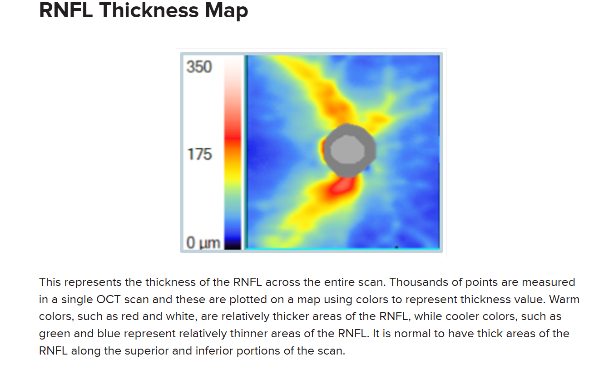

[toc]

## RNFL

[Retinal Nerve Fiber Layer (RNFL) - EyeCarePD](https://eyecarepd.com/glaucoma-glossary/retinal-nerve-fiber-layer-rnfl/)

[视盘Oct| 视盘的测量和分析（干货）_临床_厚度_进行](https://www.sohu.com/a/614590648_121124548)

不同报告的类型

[Interpretation of Imaging Data from Spectralis OCT | SpringerLink](https://link.springer.com/chapter/10.1007/978-3-319-94905-5_6)

### RNFL thickness map

 

这代表了整个扫描中RNFL的厚度。在单个OCT扫描中测量数千个点，这些点在地图上用颜色来表示厚度值。暖色调，如红色和白色，代表RNFL相对较厚的区域，而较冷的颜色，如绿色和蓝色，则代表RNFL相对较薄的区域。在扫描的上方和下方部分有RNFL较厚的区域是正常的。

### RNFL deviation map

  

这是一个从RNFL厚度图中派生出来的统计图表，它将患者的RNFL与一组年龄匹配的对照组进行比较。在统计上处于正常范围（和/或比正常厚）的区域在地图上没有标记。比正常薄的区域用黄色或红色标记，以表示统计异常的程度。

 

但是已有数据集没有

 

### RNFL Pie Charts

这里有两个饼图，它们以不同的方式展示了相同的RNFL圆形层析成像数据。一个将数据分成四个象限，另一个将相同的数据分成时钟小时。这两种不同的显示方式（相同数据）允许用户使用象限饼图寻找弥漫性变化，使用时钟小时饼图寻找局部变化。这些数据的组合限制了过度诊断疾病的风险。同时，每个部分都进行了颜色编码，以便进行统计解释。

### RNFL Graph: Basics

绿色代表正常范围，黄色和红色不正常范围

OD是右眼，OS是左眼

对视神经视网膜缘（NRR）、视网膜神经纤维层（RNFL）和神经节细胞复合体（GCC）的分析是通过将患者与大量“正常”人群的数据库进行比较来进行的，这些“正常”人群作为对照组。每个OCT（光学相干断层扫描）设备都包含了从不同年龄组的临床研究中收集的数据。然后，它可以将你的患者与适当的年龄匹配对照组进行比较。这很重要，因为NRR、RNFL和GCC组织通常会随着年龄的增长而衰退。为了增加特异性，在定量解释OCT数据时，区分与年龄相关的组织损失和真正的青光眼损伤非常重要。

可以将种族数据库甚至基于屈光度的数据库添加到OCT设备中。然而，从实际角度来说，没有添加种族/屈光度的年龄匹配对照组已经在许多临床试验中得到了很好的研究，因此它们是目前的治疗标准。

人口通常遵循趋势。大多数人是相似的，两端只有少数异常值。例如，大多数特定年龄段的人的身高都在一定的范围内，但肯定有一些人相对较矮，另一些人则相对较高。NRR、RNFL和GCC厚度分布也是如此。虽然大多数同龄人的厚度轮廓相似，但有些人的轮廓要厚得多，另一些人则要薄得多。你的OCT设备用颜色编码厚度轮廓，以便于识别。

绿色：测量值与年龄匹配对照组相比实际上是正常的概率为95%。
黄色：患者的测量值相对较薄，测量值实际上是正常的概率只有5%。
红色：患者的测量值相对较薄，测量值实际上是正常的概率不到1%。
白色：患者的值比95%的年龄匹配对照组要厚。
注意：RNFL和GCC厚度图使用颜色编码来表示RNFL/GCC的实际测量值。但是RNFL和GCC偏差图使用颜色编码来表示将患者与年龄匹配对照组进行比较的统计分析。

这是一个图形化的RNFL图表，展示了沿着RNFL圆形层析成像测量的每个点的RNFL。图表下方是色彩曲线，可以用来确定每个点的统计显著性。

#### Blunted Peaks

这个术语用来表示一个图形曲线，该曲线有一个细的片段。它并不是统计显著性的标志，而是作为一个快速的概念，用来理解患者的RNFL与年龄匹配对照组相比的情况。

#### Shifted Peaks

这是一个在高度和形状上看似正常的图形曲线，但它并没有与典型的显示对齐。这可能是由于视神经倾斜或解剖结构改变所致，这些并不被认为是青光眼性质的。这个发现的推论是，任何统计异常的区域（即那些用背景颜色黄色、红色或白色标示的区域）如果曲线仅仅是移动或转移到一个更正常的位置，就不会被认为是异常的。在这种情况下，所有的曲线都会落在绿色（正常）范围内。

### 眼底图像信息

眼底图像信息：红外反射（IR）图像是眼底的图像，其中描绘了围绕视盘的圆形扫描。应检查此图像是否均匀照明，圆形扫描的位置是否正确，以及黄斑到视盘对齐（或 FoDi）轴是否准确。应排除髓鞘化神经纤维、视盘周围萎缩和玻璃体混浊等异常。每个眼底图像上方的字符串注明了该图像使用的设置。在这个例子中：

(a)
“IR” 是成像方式。

(b)
“30°” 是视野范围。

(c)
“ART” 表示在图像捕获过程中自动实时功能是激活的。

(d)
“[HR]” 是分辨率设置（高速/高分辨率）。

 

### 视网膜神经纤维层（RNFL）轮廓图像

应检查 RNFL 轮廓（原始图像）的玻璃体视网膜界面异常以及分割错误。

每个 OCT 图像上方的字符串注明了该图像使用的设置。在这个例子中：

(a)
“ART” 表示在图像捕获过程中自动实时功能是激活的。

(b)
“(44)” 是平均帧数，即圆形扫描重复的次数。

(c)
“Q:28” 是按 1 到 40 的等级划分的质量得分。小于 20 的值被认为是质量差的图像。

(d)
“[HR]” 是分辨率设置（高速/高分辨率）。

 

### RNFL Thickness Profile

视网膜神经纤维层（RNFL）厚度轮廓：黑色线条表示患者扫描围绕视盘的厚度值，从颞侧象限的9点钟位置（左眼的3点钟位置）开始，依次经过上、鼻、下象限，最后回到颞侧象限（TSNIT）。背景颜色表示规范数据范围（见分类颜色）。深绿色线条描绘了规范数据库中的平均厚度值。厚度轮廓应具有沿着颞上和颞下象限的明显隆起，并且所有象限的值应落在正常范围内。

 

- 这是一种圆形的扫描模式，通常以视盘（Optic Disc，OD）为中心，覆盖一个特定的直径（如3.46毫米）。
- 它提供了围绕视盘的RNFL厚度的定量测量，通常以时间序列节点（TSNIT图）的形式展示，即从视盘的颞侧（Temporal）开始，经过上侧（Superior）、鼻侧（Nasal）、下侧（Inferior）回到颞侧。
- TSNIT的全称是“Temporal, Superior, Nasal, Inferior, Temporal”。这是一种用于描述视网膜神经纤维层（RNFL）厚度分布的方位标记系统，用于在光学相干断层扫描（OCT）中定位和评估RNFL的厚度变化。TSNIT系统按照时间钟面的方式，将视盘周围的区域分为四个象限：颞侧（Temporal）、上方（Superior）、鼻侧（Nasal）和下方（Inferior），每个象限又被进一步细分为六个部分，总共24个部分，以便于更精确地分析RNFL的厚度变化。

### Classification Chart

 

分类图表：RNFL 厚度在四个象限和六个扇区（颞侧、颞上、鼻上、鼻侧、鼻下、颞下）以及整体上被平均并和规范数据库进行比较。这个图表显示了每个眼睛每个扇区的平均 RNFL 厚度（以微米为单位）。全局（G）平均值显示在中心。扇区颜色表示与规范数据库的分类比较。黑色数字代表每个扇区的平均 RNFL 厚度。括号内的数字（绿色）是调整年龄后的预期正常值。分类条显示了饼图中最差扇区的分类。

### 分类颜色

表示与规范数据库的比较结果。绿色代表“在正常范围内”，即测量值在正常性的95%预测限内（p > 0.05）。黄色代表“边缘状态”，其值超出了95%但在正常分布的99%预测区间内（0.01 < p < 0.05）。红色代表“超出正常范围”，RNFL 厚度测量值低于健康人群的99%（p < 0.01）。

### 两只眼睛的RNFL

 

## 问题

1. 都是围绕视盘扫一圈。profile是360的，没有二维的位置信息，反映视盘各个方向上的厚度，未说明是最大厚度还是什么值。map是有二维图像信息的，扫一圈可以想象成一圈360度每个细线上的厚度信息，实际上是没有二维空间信息的。饼状图是大概厚度，字母代表各个部位的方向（鼻、颞等）
4. 没有找到互转的方法，因为两种报告仪器扫出来的时间成本都差不多，都远小于测VF的，而且profile相比热力图map少信息
5. 第一张眼底图片不包括厚度信息，类似drive等数据集
6. 截面没有二维位置信息，只能看出一个截面的厚度

其中一篇论文说可以申请它的thickness map的数据集

 

还有一篇用到了医院报告第二张图，但是它目标是之前的VF来预测现在的VF

 

