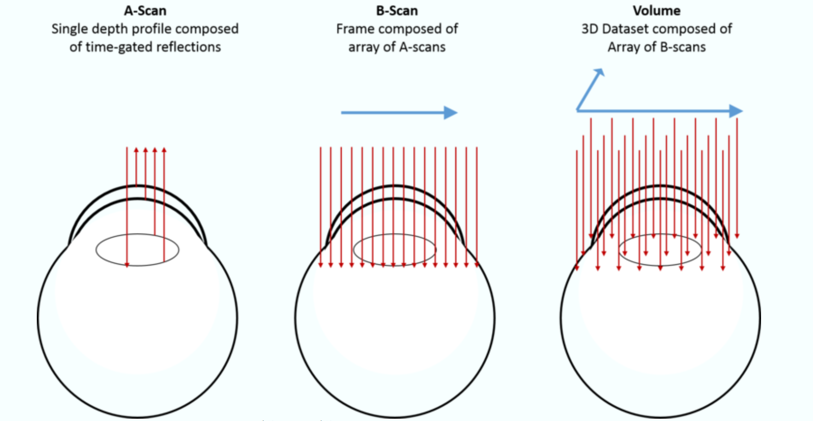

[toc]

## 资料

[Optical Coherence Tomography (OCT): Principle and Technical Realization | SpringerLink](https://link.springer.com/chapter/10.1007/978-3-030-16638-0_3)

[了解眼底图像，看这篇就够了！ - 知乎](https://zhuanlan.zhihu.com/p/384739958)

[直观感受眼球的结构——视网膜\视盘\黄斑\睫状体_哔哩哔哩_bilibili](https://www.bilibili.com/video/BV12e411L7V6)

[什么是OCT？它如何帮助眼科医生获取眼组织的高分辨率？](https://www.tengrant.com/content/?1387.html)

[08 Cirrus-ONH and RNFL OU Report视乳头与神经纤维层双眼分析报告介绍_哔哩哔哩_bilibili](https://www.bilibili.com/video/BV1153BeTEHC/?spm_id_from=333.337.search-card.all.click&vd_source=e0308ee1bfba7c59c7be0c563f5499c8)

[Humphrey Visual Field - StatPearls - NCBI Bookshelf](https://www.ncbi.nlm.nih.gov/books/NBK585112/)

## 结构

涂蓝表示对应的结构

### 总体

外面一圈是睫状肌，后面是眼底，视盘黄斑视网膜都是眼底图像

 

### 视网膜

 

 

从视盘黄斑等处延申出去变薄

对应thickness map边缘变蓝

 

### 黄斑

对应一个小凹陷

黄斑是视觉敏锐度最高的区域，负责处理中心视觉和色彩感知

 

### 视盘

也被称为视神经乳头，是**视网膜神经纤维（RNFL）**的汇集处。

没有色素层和视细胞层，因此它没有感光作用，在视野检查时，这个部位会形成一个生理盲点。

视盘的主要功能是作为视网膜神经节细胞轴突纤维汇集成视神经，向视觉中枢传递信号的部位。

总结：视盘就是传视觉信号的部位，最直接影响VF（视野拿RNFL厚度预测VF）

 

## 几张图OCT的原理

### OCT原理

A-Scan：

断层图是通过在要成像的对象上扫描光而产生的。在每个位置，计算后向散射光的时间延迟和强度得到深度分布图。每次A扫描都会提供有关对象的反射或散射特性的信息。

A扫描集合组成横截面图像，称为B扫描。通常认为B扫描是进入对象的平面切片的图像，类似于穿过组织的单个组织切片中观察到的图像（但是以非侵入方式获得）。

然后从B扫描集合中构建三维图像，主要是三种：

- 矩形或光栅体积扫描：一系列并行的B扫描
- 径向 体积扫描：以规则的角度间隔进行的一系列B扫描
- 环形 体积扫描：形成同心环的一系列B扫描

 

### RNFL thickness map

对**视盘矩形扫描**得到

### RNFL thickness profile

**对视盘径向扫描得到**

 

径向扫描得到，数值为一个方向上的**平均**厚度

字母为方向的缩写：

视盘周围的区域分为四个象限：颞侧（Temporal）、上方（Superior）、鼻侧（Nasal）和下方（Inferior）

六个扇区（颞侧、颞上、鼻上、鼻侧、鼻下、颞下）

全局（G）平均值显示在中心

 

### RNFL 剖面展开图

本质上与上一个是同一个东西

 

左上是视盘的切面图

左下是眼底图像，紫色的为最大的RNFL的检测环（即thickness map的最大范围）

右上RNFL计算环的剖面展开图

1:33开始旋转

[08 Cirrus-ONH and RNFL OU Report视乳头与神经纤维层双眼分析报告介绍_哔哩哔哩_bilibili](https://www.bilibili.com/video/BV1153BeTEHC/?spm_id_from=333.337.search-card.all.click&vd_source=e0308ee1bfba7c59c7be0c563f5499c8)

拖动检测环还可以得到不同的数据，估计医院导出数据直接会是RNFL thickness map

### 黄斑部神经节细胞-内丛状层厚度（GCIPL）

**黄斑**部神经节细胞-内丛状层厚度

矩形扫描黄斑区得到

 

### 视杆和视锥层（RCL）

普通视网膜的厚度

 

## 医院报告的视盘和黄斑

### 其它设备的系统数据示例

ONH是一种扫描协议，从获得数据的结果来看，医院很可能是有热力图的

 

### 报告里的视盘和黄斑

 

绿圈是视盘 

蓝线对过去的点是黄斑

连线用来对齐环形扫描的扇区

所有扫描都沿着这个黄斑-视盘轴对齐，扇区是相对于这个轴定义的

 

 

