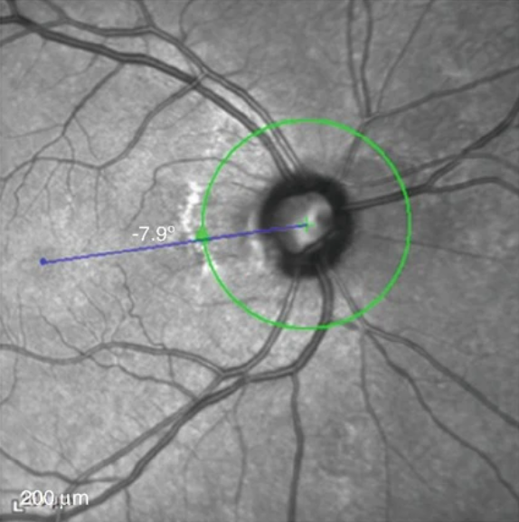
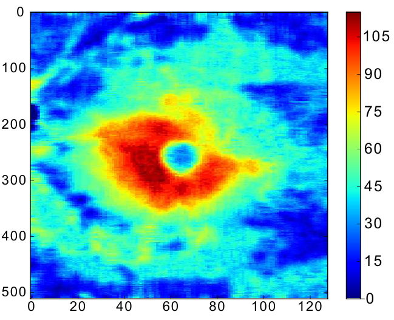
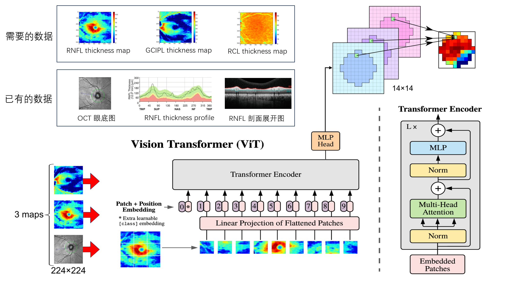

[toc]

## 已有数据

### 眼底图片

 

绿色环是以视盘中央为圆心的RNFL数据计算环

### RNFL thickness profile

 

对视盘径向扫描得到，数值为绿色RNFL计算环一个方向上的**平均**厚度

### RNFL 剖面展开图

 

为绿色RNFL计算环剖面展开图

## 需要数据

### RNFL thickness map

RNFL: Retinal Nerve Fiber Layer (视网膜神经纤维层)

对视盘周围矩形进行扫描得到的RNFL厚度热力图

  

### GCIPL thickness map

 GCIPL: Ganglion Cell-inner Plexiform Layer(黄斑区神经节细胞-内丛状层)

 

### RCL thickness map

RCL: Rod and  Cone Layer (视杆细胞和视锥细胞层)

 

## 模型草图

  

## 完成度估计

| 数据                                        | 完成度（%） |
| ------------------------------------------- | ----------- |
| 已有数据                                    | 20          |
| 已有数据 + RNFL thickness map               | 70          |
| 已有数据 + RNFL thickness map + GCIPL       | 90          |
| 已有数据 + RNFL thickness map + GCIPL + RCL | 100         |

