## 已有数据

### 眼底图片

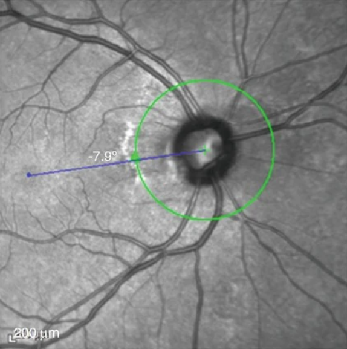 

绿色环是以视盘中央为圆心的RNFL数据计算环

### RNFL thickness profile

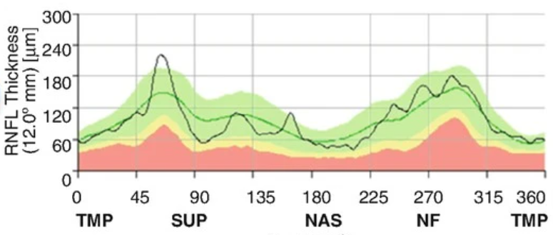 

对视盘径向扫描得到，数值为绿色RNFL计算环一个方向上的**平均**厚度

### RNFL 剖面展开图

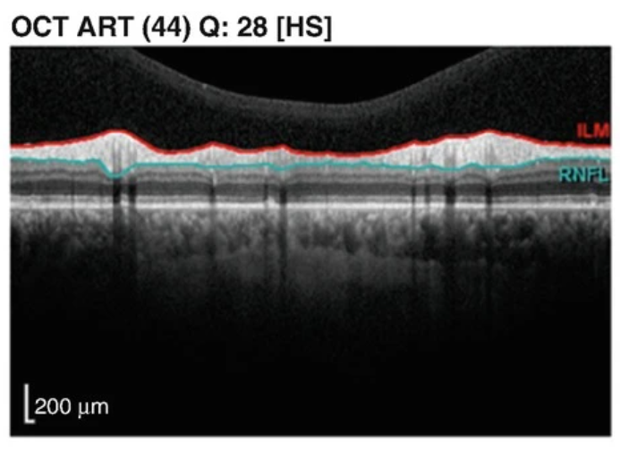 

为绿色RNFL计算环剖面展开图

### VF

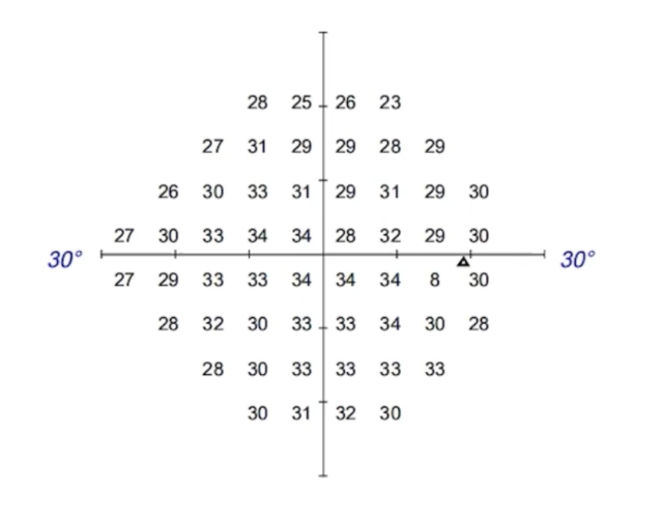  

与上述三种数据匹配的患者视野数据，由整数值TH表示。该值范围：[0, 40]，当视场中某个局部点的光敏度增加时，TH值也随之增加。

## 需要数据

### RNFL thickness map

RNFL: Retinal Nerve Fiber Layer (视网膜神经纤维层)

对视盘周围矩形进行扫描得到的RNFL厚度热力图

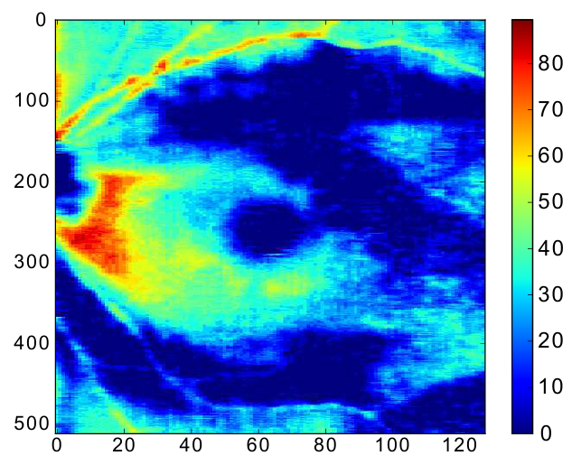  

### GCIPL thickness map

 GCIPL: Ganglion Cell-inner Plexiform Layer(黄斑区神经节细胞-内丛状层)

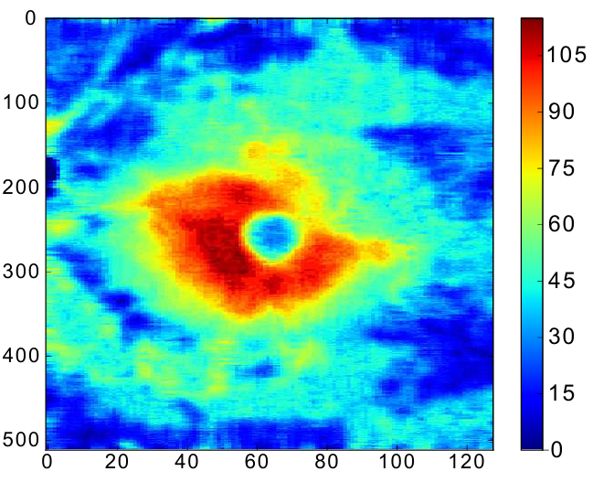 

### RCL thickness map

RCL: Rod and  Cone Layer (视杆细胞和视锥细胞层)

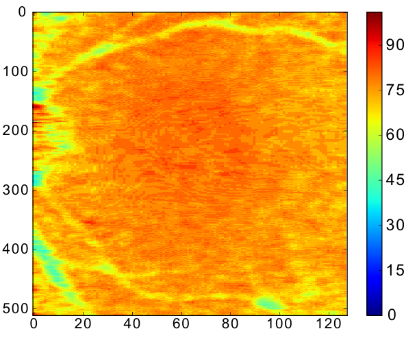 

​	

## 调研

### 主要调研范围

| 期刊/会议                          | 级别    |
| ---------------------------------- | ------- |
| CVPR                               | CCF-A   |
| ICCV                               | CCF-A   |
| ACM MM                             | CCF-A   |
| ICME                               | CCF-B   |
| MICCAI                             | CCF-B   |
| BIBM                               | CCF-B   |
| Nature                             | SCI-1区 |
| Nature  Medicine                   | SCI-1区 |
| Nature  Biomedical Engineering     | SCI-1区 |
| Computers  in Biology and Medicine | SCI-1区 |
| Nature Medicine                    | SCI-1区 |
| Nature Biomedical Engineering      | SCI-1区 |
| Nature Machine Intelligence        | SCI-1区 |
| Ophthalmology                      | SCI-1区 |
| American journal of Ophthalmology  | SCI-1区 |
| British Journal of Ophthalmology   | SCI-2区 |

### 调研发现

其中KDD’17一篇论文指出它是第一篇该方向（以OCT数据预测患者VF）的论文，目前相似工作较少。

| 期刊/会议                         | 级别    | 相似工作数量 |
| --------------------------------- | ------- | ------------ |
| Ophthalmology                     | SCI-1区 | 1            |
| ACM SIGKDD                        | CCF-A   | 4            |
| American journal of Ophthalmology | SCI-1区 | 3            |
| British Journal of Ophthalmology  | SCI-2区 | 1            |

### 已有方法

#### ASNMF

论文：Multi-view Learning over Retinal Thickness and Visual Sensitivity on Glaucomatous Eyes

会议：KDD’17

级别：CCF-A

方法概述：将已有的患者RNFL和GCIPL（均为thickness map）转化为特定矩阵形式后，通过使用了NMF（非负矩阵分解）的 传统机器学习方式预测患者的VF数据。

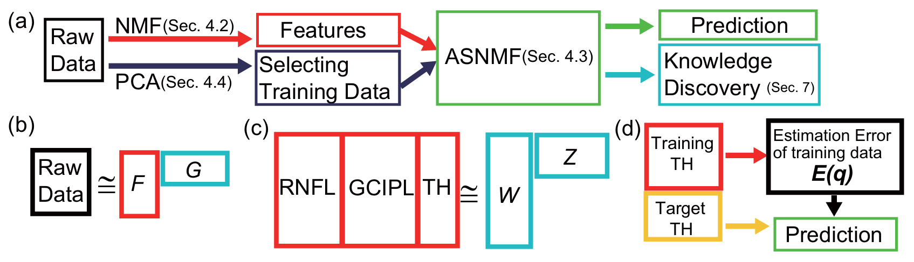

#### 卷积神经网络CNN

论文：Estimating Glaucomatous Visual Sensitivity from Retinal Thickness with Pattern-Based Regularization and Visualization

会议：KDD’18

级别：CCF-A

方法概述：使用计算机视觉中常见的卷积神经网络对患者VF数据进行预测。

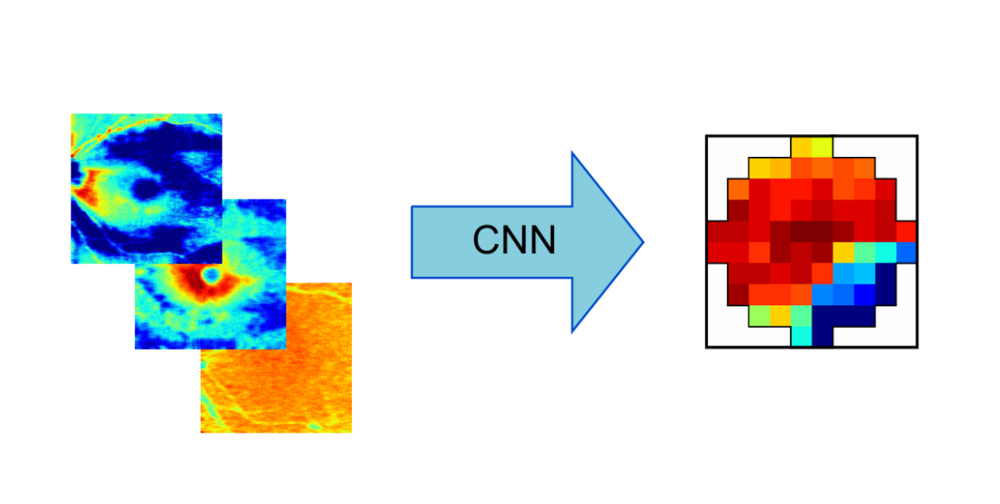 

#### 基于CNN的拓展工作

论文：Pami a computational module for joint estimation and progression prediction of glaucoma

会议：KDD’21

级别：CCF-A

方法概述：针对预测VF的实际问题对CNN结构进行相应改进。

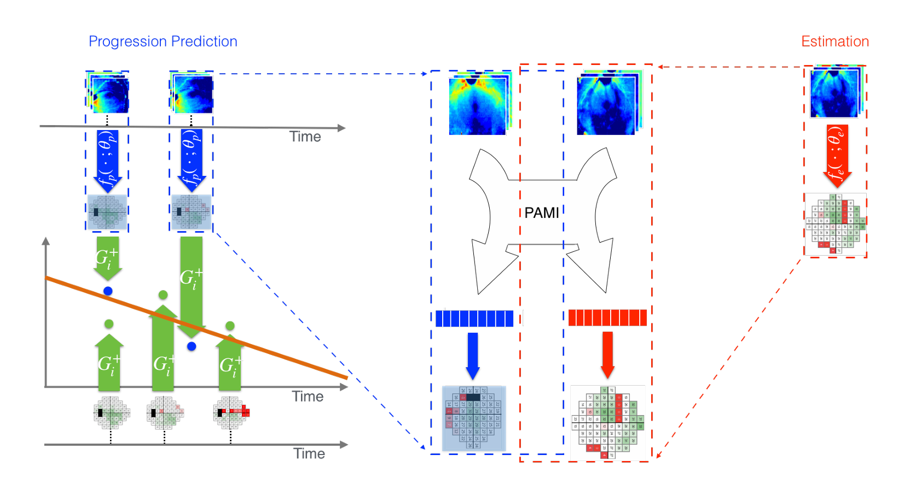 

### OCT成像原理

A-Scan：

断层图是通过在要成像的对象上扫描光而产生的。在每个位置，计算后向散射光的时间延迟和强度得到深度分布图。每次A扫描都会提供有关对象的反射或散射特性的信息。

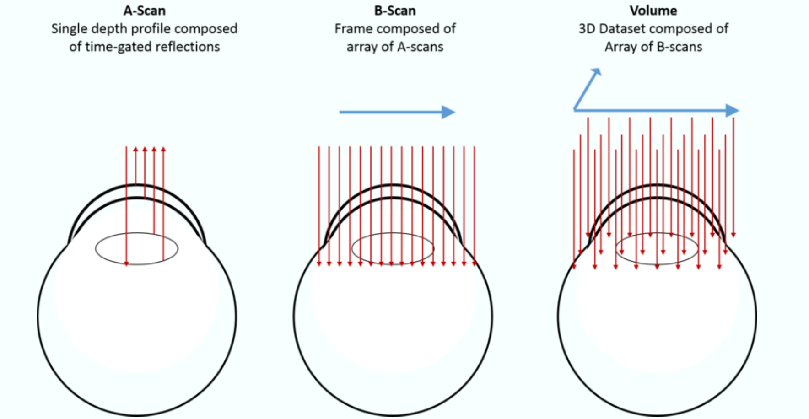

A扫描集合组成横截面图像，称为B扫描。通常认为B扫描是进入对象的平面切片的图像，类似于穿过组织的单个组织切片中观察到的图像（但是以非侵入方式获得）。

然后从B扫描集合中构建三维图像，主要是三种：

- **矩形**扫描：一系列并行的B扫描
- **径向**扫描：以规则的角度间隔进行的一系列B扫描
- **环形**扫描：形成同心环的一系列B扫描

### 常见OCT扫描结果

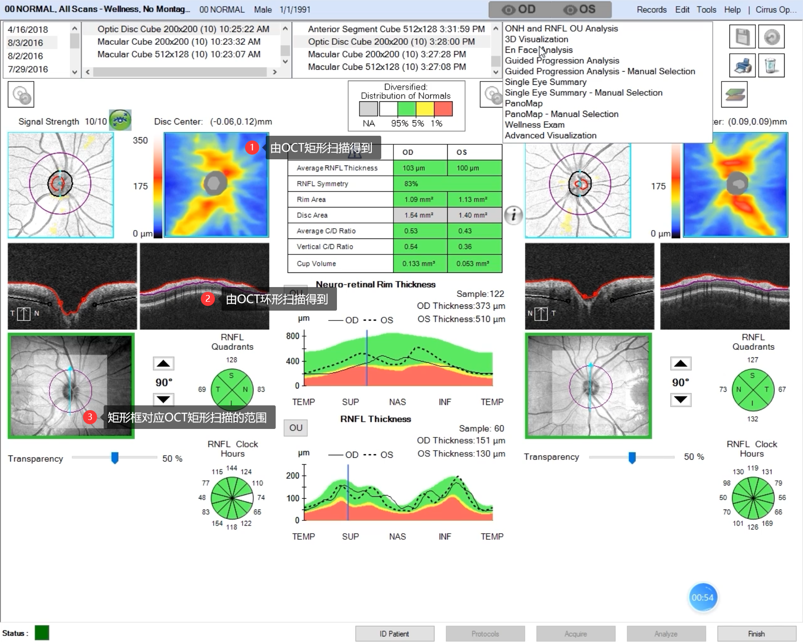 

 图1的RNFL热力值厚度图应为OCT矩形扫描得到，对图3的高亮矩形框。

图2的RNFL剖面展开图由图3中的紫色环的成像展开得到。

## 模型草图

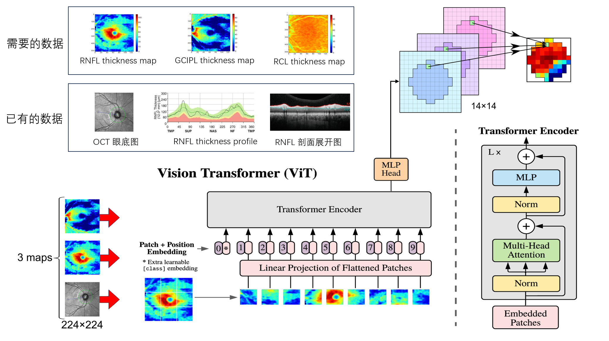  

## 完成度估计

| 数据                                        | 完成度(%)      |
| ------------------------------------------- | -------------- |
| 已有数据                                    | 分扇区预测VF值 |
| 已有数据 + RNFL thickness map               | 70             |
| 已有数据 + RNFL thickness map + GCIPL       | 90             |
| 已有数据 + RNFL thickness map + GCIPL + RCL | 100            |

## 其它

### 3Dmodel

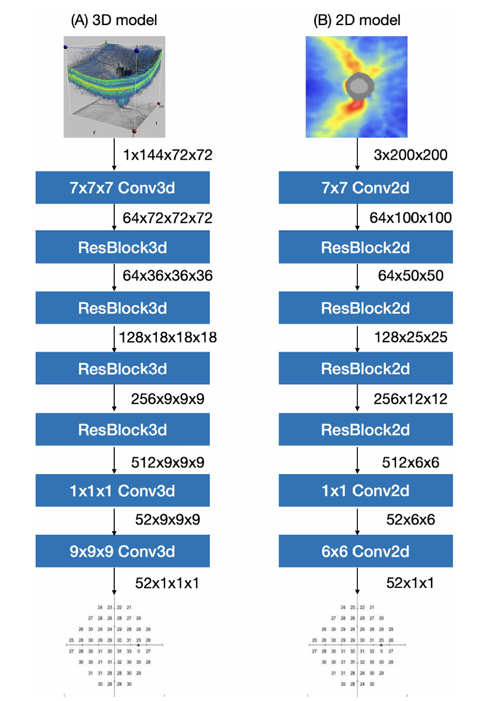 

### 预期效果

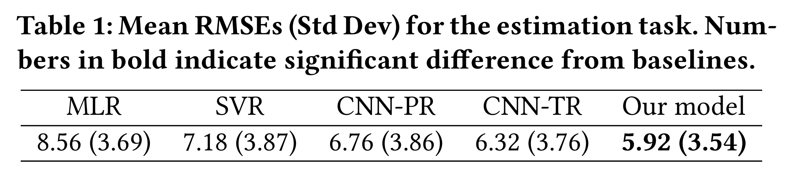 
