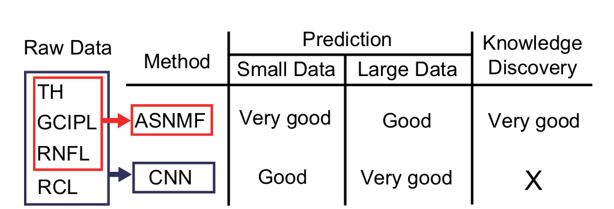

[toc]

## 已有

### RNFL thickness profile

**对视盘径向扫描得到**

 

径向扫描得到，数值为一个方向上的**平均**厚度

### RNFL 剖面展开图

本质上与上一个是同一个东西，但是多了一些ILM

内界膜 (ILM) 是眼玻璃体视网膜界面处的基底膜（调研没有发现医学文献证明过ILM跟VF有关）

### 眼底图片

医院给的眼底图包含了黄斑与视盘的二维信息，不包括厚度信息，但是与正常的RNFL thickness map范围相近

**总结**

从报告看，只有眼底图片和绿圈的thickness数据

 

## 数据重要程度

调研发现有医学文献证明过GCIPL跟VF有关

第一篇论文传统机器学习方法没有用到RCL

RNFL＞GCIPL＞RCL

## 方案草案

### 原论文模型图

### 估计

| 数据                                        | 完成度（%） |
| ------------------------------------------- | ----------- |
| 已有数据                                    | 20          |
| 已有数据 + RNFL thickness map               | 70          |
| 已有数据 + RNFL thickness map + GCIPL       | 90          |
| 已有数据 + RNFL thickness map + GCIPL + RCL | 100         |

