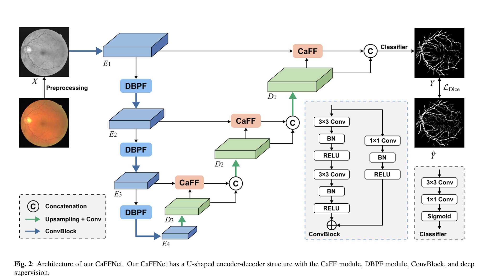
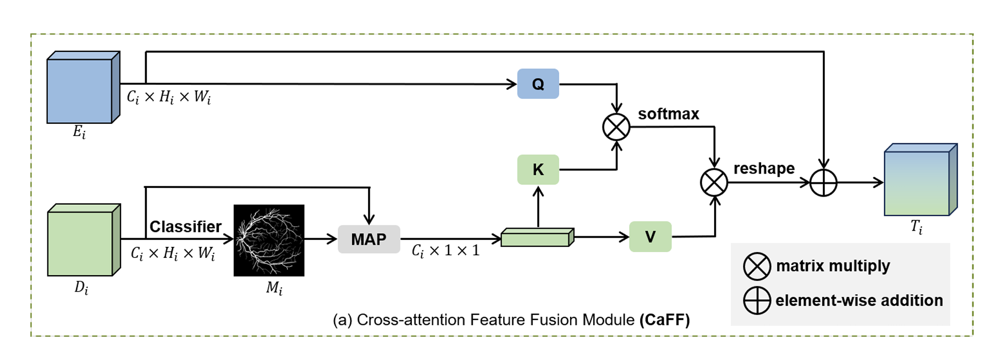
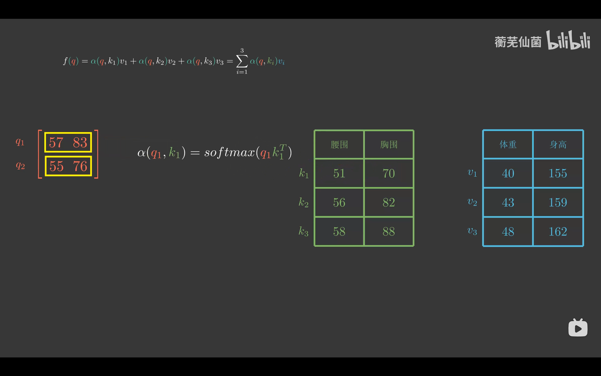

[toc]

## INTRODUCTION

视网膜血管分割对于诊断众多与眼睛相关的疾病至关重要，包括高血压、糖尿病视网膜病变和动脉硬化[1]。视网膜血管的形态特征，包括厚度、曲率和密度等属性，作为检测和诊断上述疾病的指标具有相当的价值。例如，高血压的诊断可以从测量血管直径中受益[2,3]。在目前的临床实践中，眼底图像中的视网膜血管是由眼科医生手动描绘的，但这种方法既费力又繁琐，且容易出错。因此，迫切需要在临床实践中采用自动且准确的视网膜血管分割方法，以减轻眼科医生的工作负担并协助诊断。

近年来，在基于深度学习的视网膜血管分割领域取得了巨大进展。鉴于U-Net[4]的显著成功，已经提出了一系列U形编码器-解码器网络用于视网膜血管分割，并取得了有希望的结果[5-7]。这些U-Net的变体通常采用两种策略来提高分割性能：多尺度设计和注意力机制。由于细小血管很容易被遗漏，因此一些方法采用多尺度设计来增强它们分割不同尺寸血管的能力。例如，CE-Net[8]使用扩张卷积和多核池化来提取多尺度特征；MFI-Net[6]遵循了一种基于补丁级别的金字塔设计，创建了一个金字塔挤压激励（PSE）模块，以实现多尺度特征交互。同时，注意力机制及其变体已被广泛应用于获取高质量的特征表示。例如，SA-UNet[9]在U-Net中引入了空间注意力，以更好地分割血管；FANet[5]采用了轻量级的双向注意力模块来模拟全局依赖关系，减少类内不一致性；AACA-MLA-DUNet[10]利用多尺度注意力机制来细化解码器特征，以实现精确的视网膜血管分割。

上述方法显著提高了眼底图像视网膜血管分割的性能，但尚未解决以下问题：(1) 对称编码器和解码器的特征图之间存在一定的语义差距。因此，简单的跳跃连接可能不利于解码阶段空间信息的恢复，导致分割性能下降。**如图1所示，我们观察到在三个数据集上，移除一些跳跃连接层后U-Net的性能甚至可能提高（例如，在DRIVE数据集上移除第二跳跃连接层）`其实感觉这里有点牵强，，，`。**(2) 在下采样过程中，许多细小而精致的血管可能会被忽略。尽管下采样操作可以减小特征图的大小，增加网络的感受野并减少计算量，但高分辨率的空间信息在下采样过程中很容易丢失。丢失的高分辨率空间信息对细小血管的分割构成了不可忽视的挑战。

为解决上述问题，我们提出了CaFFNet，这是一种新型的交叉注意力特征融合网络，旨在从两个方面提高血管分割性能。一方面，我们设计了一个交叉注意力特征融合（CaFF）模块，以减少编码器特征和解码器特征之间的语义差距，更好地帮助跳跃连接期间空间分辨率的恢复。另一方面，为了减少池化过程中丢失的血管空间信息，我们将下采样阶段的数量减少到3，并提出了一个双分支池化融合（DBPF）模块，以保留细小血管的特征。**上述两个模块是即插即用的**，可以用于所有U形网络。本文的主要贡献可以总结如下：
- 我们利用交叉注意力机制，允许编码器特征与解码器特征的语义信息融合，解决了跳跃连接期间它们之间的语义不兼容性问题。
- 我们通过双分支池化融合减轻了由于多次池化操作引起的血管空间结构信息丢失的影响。
- 我们在三个眼底图像数据集上进行了广泛的实验，结果表明，所提出的方法在视网膜血管分割方面超越了代表性的最新方法，并且是轻量级的。

### 总结

1. 认为skip-connection有问题，自己搞了个交叉注意力（caff）模块，替代了直接连接
2. 不再直接卷积，而是自己搞了个DBPF

## METHOD

### Architecture

如图2所示，所提出的方法遵循了具有对称编码器和解码器组件的U-Net架构。我们的CaFFNet输入一个预处理过的单通道灰度图像X，并输出一个分割掩码Y。它由三个主要模块组成：ConvBlock、CaFF模块和DBPF模块。ConvBlock的详细结构也在图2中给出。在收缩路径中，DBPF模块被用来减轻在下采样期间通常发生的血管空间信息丢失。在相应的扩展路径中，在跳跃连接之前，编码器特征通过CaFF模块与解码器特征的语义信息融合，以减少它们之间的语义差距。

####  盒子代表含义

蓝色盒子为下采样过程中的ConvBlock，将通道数倍加，不改变形状

DBPF将高宽减半，不改变通道数

最底下的蓝色盒子应该还是跟U-net一样，倍加一次通道数

绿色盒子为上采样过程中的ConvBlock，从CaFF部分可以知道Ei和Di是一样的，说明绿色盒子是减半了通道数，倍加了高宽

### CAFF

鉴于交叉注意力机制能够促进不同特征图之间的信息交互，我们设计了交叉注意力特征融合模块（CaFF模块），以融合编码器和解码器的特征图，减少它们之间的语义差异，其结构在图3(a)中进行了说明。我们的CaFF模块接收来自第$i$层编码的特征图$E_i$和来自第$i$层解码的特征图$D_i$作为输入（$i = 1, 2, 3$）。给定编码器的特征图$E_i \in R^{C_i \times H_i \times W_i}$和解码器的特征图$D_i \in R^{C_i \times H_i \times W_i}$，其中$C_i$表示通道数，$H_i$和$W_i$分别表示高度和宽度。CaFF模块首先使用线性分类器对$D_i$进行处理，以获得粗略的掩码$M_i \in R^{H_i \times W_i}$：

$$ M_i = Classifier(D_i) $$

这里的分类器包括一个3×3的卷积层、一个1×1的卷积层和一个Sigmoid激活函数。随后，粗略掩码$M_i$和$D_i$被用来通过掩码平均池化（Masked Average Pooling, MAP）生成血管原型：

$$ P = Fpool(M_i \odot D_i) $$

其中$Fpool$代表全局平均池化操作，"$\odot$"表示哈达玛积（即元素级别的乘法），$P \in R^{C_i \times 1}$指的是血管原型，它包含了来自解码器特征图中的丰富血管信息。同时，CaFF模块将编码器的相应特征图$E_i$投影到查询空间$Q$，将血管原型$P$投影到键（Key）空间$K$和值（Value）空间$V$，如下所示：

$$ Q_i = W_{Q_i}E_i, \quad K_i = W_{K_i}P, \quad V_i = (W_{V_i}P)^T $$

$Q_i^T \in R^{H_i  W_i \times C_i}$

$Q_i \in R^{C_i \times H_i  W_i   \times 1}$

这里$W_{Q_i} \in R^{C_i \times C_i}, W_{K_i} \in R^{C_i \times C_i}, W_{V_i} \in R^{C_i \times C_i}$, $Q_i \in R^{C_i \times H_i W_i}$, $K_i \in R^{C_i \times 1}$, $V_i \in R^{1 \times C_i}$。最后，CaFF模块采用交叉注意力机制和残差连接来输出融合后的特征图$T_i$：

$$ T_i = E_i + reshape(\sigma(Q_i^T K_i) /\sqrt{C_i} *V_i) $$

其中$\sigma(\cdot)$代表softmax函数，$T_i \in R^{C_i \times H_i \times W_i}$。输出的$T_i$融合了来自解码器特征$D_i$的语义信息，因此它与$D_i$更加兼容，并能在跳跃连接期间更好地帮助恢复空间分辨率。

#### 思路

$W_{Q_i}$、$W_{K_i}$、$W_{V_i}$，即待训练的参数，对应attention里面的QKV那三个矩阵，初始化应该随机（或者看文章）

经过Fig2的线性分类器classifer之后，得到的M与D做哈达玛积（M没有channel维度，用广播实现），做完哈达玛积后再求全局平局池化，即每个通道都求平均得出一个值，得到一个一维向量P

K、V都是一维向量，与P同大小，三个W则是二维，Q是三维表查询，做了一个缩放点积的attention操作，Ci是通道数

将QK做softmax得到注意力分数

得到的Ti再与上采样的Di做跳跃连接

#### 个人理解

通过存，将下采样过程中编码的Ei映射为Q，再与上采样过程中的Di搞出来的粗略掩码Mi得到的P（P是每个通道对应的一维血管信息）进行映射的K和V，查看跳跃连接的Ei中的哪些信息与现在的粗略掩码相关性大，然后重点跳跃连接这些像素

Q转置成(N,HW,C)，理解为每个像素的C个通道的值，对K（K.shape:(C, 1)）进行查询，得到每个像素一个值（每个像素对应的通道向量与K做点积），然后做softmax再除以根号C，再通过V映射回来

#### 疑惑

方向1：按文中结构，对Qi转置（Q转置的理解，Q转置后的[3, 32768, 64]即原来每个位置的像素对应的通道的值，即32768个像素对应tensor有64个通道的值）之后与Ki相乘，即每个像素对应的channel（即查询）与Ki做内积，这样只能得到一个值，因为键K相当于只有一个。要么他的意思所有像素的维度上做softmax，得到的是一张图中每个像素的一个0-1的值，然后再通过V映射到Ci个通道去。但是这样没有什么意义感觉，caff中的softmax的值会特别特别小，因为是在H\*W大小的tensor内做softmax。要么意思就是不做softmax，因为对1做softmax没有效果，直接将1通过V映射回各个通道，得到查询到的各个通道的信息

方向2：把Qi扩展一维，这样一个单独的q只是一个值，与Ki做内积相当于二数相乘。对K转置做softmax（attention is all you need里面写的缩放点积也是这样的，先对K做转置），这样理解为Q每个通道有H\*W个像素级别的查询，查询的q向量只有一个值，再与K做内积（乘以k的转置，torch还要补充k的维度才行），得到(N,C,HW,C)，除以dk（即1）过后再与Vi相乘

### DBPF

下采样广泛用于编码，然而，它可能导致高分辨率空间信息的丢失。这种现象对细小视网膜血管的分割是不利的。为了解决这个问题，我们策略性地减少了下采样操作的次数，并提出了双分支池化融合模块（DBPF）来最小化由于下采样导致视网膜血管细节丢失的问题。

如图3(b)所示，我们的DBPF模块接收输入\( $E_i $\)并输出一个融合后的特征图\( $E'_i$ \)。为了利用不同的池化函数的优势，平均池化层和最大池化层分别被用于特征下采样，它们的结果被连接起来进行特征融合，以模拟上下文信息。与此同时，融合后的特征被送入一个1×1的卷积层，用以调整特征图的通道数：

$ F_i = F_{1 \times 1}(\text{concat}(F_{\text{avgpool}}(E_i), F_{\text{maxpool}}(E_i)))$ 

这里，\( $F_{1 \times 1}$ \) 表示1×1的卷积操作，\( $F_{\text{avgpool}}$ \) 和 \( $F_{\text{maxpool}}$ \) 分别表示平均池化层和最大池化层。通过这种方式，我们能够在保留不同池化操作的优势的同时，调整特征图的通道数以适应后续的处理步骤。

**解释公式：**

- \($ F_i$ \)：这是通过1×1卷积调整后的特征，它是平均池化和最大池化结果的融合。
- \($ \text{concat} $\)：这是连接操作，它将平均池化和最大池化的结果在通道维度上进行合并。
- \($ F_{\text{avgpool}}(E_i)$ \) 和 \( $F_{\text{maxpool}}(E_i) $\)：分别表示对输入特征图 \( $E_i $\) 进行平均池化和最大池化的结果。

通过这种设计，DBPF模块旨在减少下采样过程中可能丢失的重要血管细节，同时通过不同池化操作的结合，增强特征图捕捉上下文信息的能力。

为了实现全局感知场并模拟血管主干与毛细血管之间的上下文关系，在两个方向（即x方向和y方向）上对\( $F_i$ \)进行平均池化，其结果在1×1卷积和扩展操作后进行逐元素相加。DBPF模块输出的融合特征图\($ E'_i $\)可以被公式化如下：

$F_{\text{ix}} = \text{expand}(\text{conv}(F_{\text{Xpool}}(F_i)))$

$F_{\text{iy}} = \text{expand}(\text{conv}(F_{\text{Ypool}}(F_i)))$

$E'_i = \text{conv}(F_{\text{ix}} \oplus F_{\text{iy}})) \oplus F_i$

解释公式：
- \($ F_{\text{Xpool}}(F_i)$ \) 和 \( $F_{\text{Ypool}}(F_i) $\)：分别表示在x方向和y方向上对\( F_i \)进行平均池化操作的结果。
- \($ \text{conv} $\)：表示卷积操作，用于在池化后进一步加工特征图。
- \( $\text{expand} $\)：通常指的是在卷积操作后对特征图进行空间维度上的上采样或扩展，以匹配原始特征图的尺寸。
- \( $F_{\text{ix}}$ \) 和 \( $F_{\text{iy}}$ \)：分别表示在x方向和y方向上经过卷积和扩展操作后得到的特征图。
- \($ \oplus$ \)：表示逐元素相加操作，用于将特征图在空间维度上进行合并。
- \($ E'_i $\)：最终的融合特征图，它通过将x方向和y方向上经过处理的特征图逐元素相加，并与原始特征图\( $F_i$ \)进行逐元素相加得到。

这个过程的目的是保留更多的上下文信息，并通过不同方向的池化捕捉血管结构的更多细节，最终通过卷积和逐元素相加的方式将这些信息融合到最终的特征图中，以提高视网膜血管分割的性能。

这里的“⊕”表示逐元素相加。将 \($ E'_i$ \) 输入到 ConvBlock 后，通过调整其通道数来获得第 \( i+1 \) 层编码器特征 \($ E_{i+1} \in R^{C_{i+1} \times H_{i+1} \times W_{i+1}}$ \)。

翻译如下：

其中“⊕”代表逐元素相加。在将 \( $E'_i$ \) 送入 ConvBlock 之后，会调整其通道数，以获得 \( i+1 \) 层的编码器特征 \( $E_{i+1}$ \)，其大小为 \( $C_{i+1} \times H_{i+1} \times W_{i+1}$ \)。

#### 思路

假设池化都2\*2，开头max和avg池化层将高宽减半，通道数叠加之后倍增

通过1\*1conv减半通道数

从x方向和y方向池化后，宽高分别减半，再通过1\*1卷积层（不调节大小和通道数），再expand（bilinear或者转置卷积）成Fi的高宽，然后逐元素相加，再与Fi逐元素相加

整体通道数不变，等进入ConvBlock后再改变通道数

这里几个1\*1卷积，除了第一个，应该都是不改变高宽和输入输出通道数的，推测主要作用是通道混合

**通道混合**：1×1卷积可以有效地混合不同通道的特征，即使输出通道数与输入相同，它也可以重新分配通道之间的信息，增强特征的表达能力。

#### 问题

Ei+1的通道数，大小完全没说

ConvBlock的改变的内容也没说

###  Deep Supervision

考虑到眼底图像中显著的前景-背景不平衡，我们采用Dice损失函数来构建损失函数，并引入深度监督来防止梯度消失并提高网络的鲁棒性。损失函数的公式如下：

 $L = \frac{1}{3} \sum_{i=1}^{3} \lambda_i L_{\text{Dice}}(M_i, \hat{Y}) + L_{\text{Dice}}(Y, \hat{Y}) $

翻译：
损失 \( L \) 是通过对三层CaFF模块生成的粗略掩码 \( $M_i $\) 以及最终的分割掩码 \( Y \) 应用Dice损失，并为每层分配权重 \($ \lambda_i$ \) 后求和得到的。此外，最终的分割掩码 \( Y \) 与真值 \( $\hat{Y}$ \) 之间的Dice损失也被加入到总损失中。

解释公式：

- L ：总损失。
- $ \lambda_i$ ：第  i 层的权重，用于平衡不同层的Dice损失贡献。
- $ L_{\text{Dice}}(M_i, \hat{Y}) $：第 i 层粗略掩码 $M_i$ 和真值 $ \hat{Y}$ 之间的Dice损失。
-  $L_{\text{Dice}}(Y, \hat{Y})$ ：最终分割掩码 Y 和真值 $\hat{Y}$ 之间的Dice损失。

Dice损失是一种常用的损失函数，特别是在医学图像分割领域，因为它对前景和背景的不平衡比较敏感，并且能够更好地处理类别不平衡问题。Dice损失计算的是两个样本之间的相似度，通常定义为两倍的交集与并集的总和的比例。

深度监督是一种技术，通过在网络的不同深度层次上添加额外的损失计算，来确保网络在训练过程中的梯度流动和特征学习。这种方法有助于防止深层网络训练中的梯度消失问题，并且可以提高网络对特征的学习能力和分割精度。

在实验中，作者设置了权重 \( $\lambda_1 = 0.5$ \)，\( $\lambda_2 = 0.3$ \) 和 \( $\lambda_3 = 0.2$ \)，这表明作者为不同层的损失分配了不同的重视程度，可能是为了平衡网络对不同尺度特征的学习能力。

公式中的 \( $M_i$ \) 指的是在网络的第 \( i \) 层CaFF模块生成的粗略分割掩码（coarse mask）。在深度监督的上下文中，这些粗略掩码是在从编码器到解码器的每个跳跃连接处产生的中间分割结果。这些中间结果被用于：

- 提供在训练过程中的额外监督信号，有助于网络在不同层次上学习特征。
- 通过在多个阶段引入损失计算，帮助梯度在网络中的流动，从而缓解梯度消失问题。

具体来说，\( $M_i$ \) 是由CaFF模块中的分类器产生的，分类器通常包含一系列卷积层，用于将编码器的特征图转换为与目标分割掩码相同尺寸的粗略分割图。这些粗略掩码 \( $M_i $\) 反映了网络在不同深度层次上对视网膜血管分割的理解，它们与最终的分割掩码 \( Y \) 一起，在整个网络的训练过程中共同优化。

在Dice损失函数中，\( $M_i$ \) 与对应的地面真实值 \( $\hat{Y} $\) 之间的相似度被用来计算损失，并通过这种方式将深度监督整合到网络的训练中。通过这种方式，网络在训练时不仅关注最终的输出，还关注中间层的特征表示和分割结果，从而提高了网络的整体性能和鲁棒性。

#### 问题

没说Mi和Yhat尺寸不一样怎么算dice

### 总结

下采样减少了一层（没说卷积大小，通道数量这些超参，可能还是跟U-net一样）

Fig2 里面蓝盒子应该是ConvBlock

主要是在U-net上面改的

#### CAFF

$E_i$：编码器下采样过程中的特征图

下面：

CaFF模块首先使用线性分类器对Di进行处理，以获得粗略的掩码M

M再和D一起通过掩码平均池化生成血管原型P

将血管原型P投影到键（Key）空间K和值（Value）空间V

上面：

将Ei投影到查询空间Q

Q和K、V通过数学处理得到T

#### DBPF

左边：

将下采样阶段的Ei经过平均和最大池化层，得到两倍通道数的中间输出，然后用1\*1卷积再融合通道得到Fi

通过这种设计，DBPF模块旨在减少下采样过程中可能丢失的重要血管细节，同时通过不同池化操作的结合，增强特征图捕捉上下文信息的能力。

右边：

中间对Fi从X、Y两个方向进行池化(池化窗口有一个方向大小就是1)，这样得到的结果形状与Fi不一样，再用转置卷积（文章里面写的expand，没细说）整成大小一样的

这样的结果逐元素相加后再与Fi逐元素相加，得到Ei’

#### loss

给三个层的lambda权重，然后i层的caff输出的Mi与Y-hat做dice，然后最后的Y与Y-hat做dice，得到loss，这样可能会更关注中间过程一些

## EXPERIMENTS

### Datasets and Evaluation Metrics

我们在三个广泛使用的公共眼底图像数据集上评估了所提出的CaFFNet：DRIVE、STARE和CHASE DB1。
DRIVE：DRIVE数据集包含40张分辨率为565×584的眼底图像。这些图像被分为训练集和测试集，每集包含20张图像。
STARE：STARE数据集包含20张大小为700×604的眼底图像。原始的STARE数据集没有分配训练和测试集。按照顺序，我们将数据集分割，前10张图像作为训练集，另外10张图像作为测试集。
CHASE DB1：CHASE DB1数据集由28张大小为990×960的眼底图像组成。按照顺序，我们取前20张图像用于训练，剩余的8张图像用于测试。
我们使用四个广泛使用的指标来评估我们的模型：准确率（Acc）、敏感度（Sen）、特异性（Spe）和ROC曲线下面积（AUC）。其中，AUC和Acc衡量整体性能，而Sen和Spe分别反映分割模型检测血管像素和背景像素的能力。

### Experiment details

我们在NVIDIA RTX A5000上使用Pytorch框架实现了我们的CaFFNet。使用Adam优化器，初始学习率为5e-4，来优化模型参数，并在训练过程中采用余弦退火学习率（LR）。批量大小设置为32，总的训练周期（epoch）设置为50。遵循先前的研究，我们对图像执行了三步预处理。中间处理结果在图4中展示。首先，原始的RGB图像被转换为单通道灰度图像。在整个数据集上使用标准化和对比度受限的自适应直方图均衡化（CLAHE）来增强前景和背景的对比度。最后，引入伽马校正以进一步提高图像质量。在训练阶段，我们从每张图像中随机裁剪1000个48×48大小的图像块。为了防止过拟合，我们应用了数据增强技术，包括水平翻转、垂直翻转和随机旋转（角度为90度、180度、270度）。在测试阶段，我们从每个测试图像中提取大小为64、步长为16的重叠图像块，并将它们输入到训练好的模型中进行分割。然后，将图像块的分割结果拼接成完整的分割结果，以计算性能指标。

###  ComparisonwithState-of-the-artMethods

我们将所提出的CaFFNet与几种最新技术的方法进行了比较，包括U-Net、JL-UNet、Attention-UNet、SA-UNet、CE-Net、AACA-MLA-DUNet、MFI-Net和OCE-Net。比较结果和每种方法的模型参数显示在表1中。U-Net、SA-UNet、Attention-UNet和CE-Net的实验结果在我们CaFFNet相同的实验设置下获得。其他方法的比较数据引用自原始文献。"–"表示原始文献中没有提供实验数据。正如表1所示，在大多数情况下，CaFFNet的性能超越了以前的最新技术方法。具体来说，我们的CaFFNet在CHASE DB1上与OCE-Net相比，在Sen（敏感度）上提高了0.26%；在DRIVE和STARE上，CaFFNet的改进大约是1.24%和0.38%，这表明CaFFNet在分割血管像素方面具有更好的能力。此外，对于ACC（准确率）指标，CaFFNet在三个数据集上都取得了最佳性能。对于AUC（ROC曲线下面积）指数，CaFFNet在CHASE DB1和DRIVE上取得了最佳性能，在STARE上取得了第二好的成绩（仅降低0.03%）。在Spe（特异性）指标方面，CaFFNet在三个数据集上也取得了第二好的成绩。值得注意的是，我们模型的参数数量也非常少，仅比SA-UNet多0.5百万参数。图5展示了三个数据集中一些典型的分割示例。对于视网膜血管分割来说，在低对比度区域分割细小血管一直是一个巨大的挑战。从图表中可以看出，对于粗大血管的分割，各种方法之间的结果差异并不明显。然而，CaFFNet可以比其它方法分割更多的细小血管，展示了其在具有挑战性情况下的有效性。

### Fig5

图5：三个视网膜血管数据集的实验结果。第1-2行是CHASE DB1数据集的图像，第3-4行是DRIVE数据集的图像，第5-6行是STARE数据集的图像。典型的细血管位于划定的黄色框内。

### Ablation Experiments

为了验证所提出的CaFF和DBPF模块的有效性，我们在CHASE DB1数据集上进行了消融研究。表2显示了不同模型设置的定量结果。我们移除了CaFF模块和DBPF模块，然后使用简单的跳跃连接构建了基线模型。从表2中，我们可以清楚地观察到，在引入CaFF模块或DBPF模块后，分割性能显著提高，证明了它们的有效性。而且，当这两个模块联合使用时，达到了最佳结果。

## CONCLUSION

在本文中，为了减轻现有U形网络中编码器和解码器提取特征之间的语义不兼容性，我们引入了一个新颖的交叉注意力特征融合（CaFF）模块，旨在提高视网膜血管分割的性能。此外，我们设计了一个双分支池融合（DBPF）模块，以最小化在下采样过程中细小血管空间信息的丢失。消融研究证明了两个模块的有效性。广泛的实验表明，结合了CaFF和DBPF模块的CaFFNet能够与其他最新技术方法相媲美。将来，我们旨在解决不同视网膜数据集之间存在的领域差异，专注于实现高质量的跨领域视网膜血管分割。

## 顺序

1. 注意力
2. 看懂caff的部分
4. 预处理的三步Fig4可以用albumentations库
5. caff实现
6. DBPF实现
7. 损失函数看懂
8. 损失函数大小不符合的问题
9. 拼接整个网络
10. 将图像分割并拼接地训练
11. 打印两项数据
12. 画图

## 缺点

位图不是矢量图

Fig 3图中Fi’标错了，是Fi

y-hat表示了真值，不太合常理

caff中维度不对，不能直接相乘很多地方

softmax位置错误

caff中的Q和K相乘后做softmax会特别特别小，因为是在H\*W大小的tensor内做softmax

## 我的问题

gamma值是根据论文里面给的示例图片选的