[toc]

## ARTICLE INFO

关键词： 异常检测 异常分期 异常分割 视网膜图像

## ABSTRACT

无监督异常检测（UAD）是通过学习正常数据的分布来检测异常，无需标签，因此在医学图像中具有广泛的应用，可以减轻收集标注医学数据的负担。当前的UAD方法大多通过原始输入的重建来学习正常数据，但通常缺乏对具有语义意义的任何先验信息的考虑。在本文中，我们首先提出了一个通用的无监督异常检测框架SSL-AnoVAE，该框架利用自监督学习（SSL）模块根据视网膜图像中待检测的异常提供更细粒度的语义。我们还探讨了SSL模块中采用的数据转换与视网膜图像异常检测质量之间的关系。此外，为了充分利用提出的SSL-AnoVAE并将其应用于视网膜相关疾病的计算机辅助诊断，我们进一步提出了一种无监督的方法，用于分期和分割SSL-AnoVAE检测到的视网膜图像中的异常。实验结果证明了我们提出的方法在视网膜光学相干断层扫描图像和彩色眼底照相图像上进行无监督异常检测、分期和分割的有效性。

在这段话中，"stage"一词指的是将异常进行分类或分组的过程，特别是指根据异常的严重程度或特征将它们分配到不同的阶段或类别中。在医学图像分析的背景下，"staging"通常用于描述疾病或病变的不同严重程度或发展阶段。因此，"stage and segment the anomalies"意味着对检测到的异常进行分类（分期）并确定它们在图像中的具体位置（分割）。这有助于医生更好地理解病变的严重程度或疾病的进展，并为治疗决策提供支持。

## Introduction

眼病是导致视力损害和失明的最常见原因，全球超过3亿人患有各种眼病，如糖尿病性视网膜病变（DR）、年龄相关性黄斑变性（AMD）和脉络膜新生血管（CNV）（Alqudah, 2020）。光学相干断层扫描（OCT）B扫描图像和彩色眼底照相（CFP）是眼科检查中最广泛使用的两种方法，因为它们具有多种优点，如无创、快速和高度可重复（Trichonas 和 Kaiser, 2014）。**OCT** 成像能够描绘视网膜的**多层结构**，并在大范围内可视化视网膜的结构变化，而**CFP**图像可以展示眼底**彩色**的表面信息（Li 等人，2021）。然而，对于异常检测算法来说，从日常临床检查积累的大量正常OCT和CFP图像中准确检测出异常图像仍然是一个巨大的挑战。

无监督异常检测（UAD）通常基于正常数据的重建来识别异常、新奇或不可见的数据（Zimmerer等人，2018年；Chen和Konukoglu，2018年；Schlegl等人，2019年）。它的目的是学习正常数据的分布，因此**仅使用正常图像进行训练**。在测试阶段，具有高重建误差的测试图像被视为检测到的异常。由于正常数据相对容易收集且不需要注释，UAD非常适合医学图像的应用，这可以解决许多疾病中缺乏标签的问题，并避免耗时且劳动密集的标记过程（Mahapatra等人，2021年）。此外，正常（健康）医学图像**通常具有相同的解剖结构、纹理特征和颜色分布**，这有利于学习正常数据的相同共享分布。例如，在与视网膜相关的图像中，**CFP视网膜图像具有相似的血管纹理和颜色分布**，而OCT视网膜图像具有相似的层结构（Zhou等人，2020年）。相反，异常图像通常在病变区域遵循明显不同的分布，因此，它们不能适应正常数据的分布。例如，在图1中，水肿区域可以破坏OCT图像的层结构；对于CFP图像，某些区域的颜色分布（例如，软性渗出物）和血管结构（例如，新生血管和出血）可能被相应的异常所干扰。

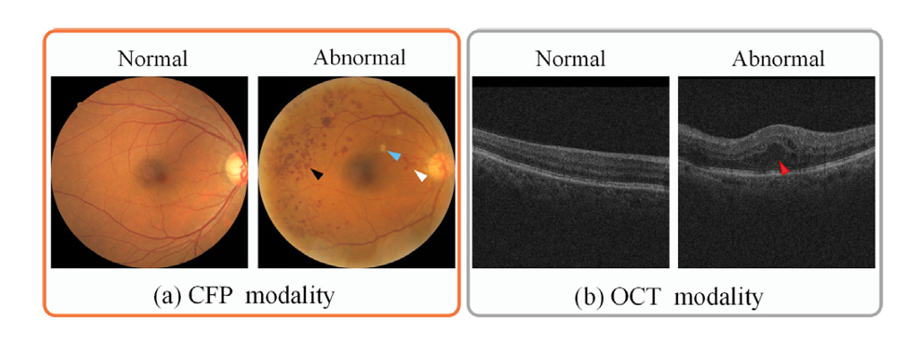

`图 1. 两种常见的视网膜成像方式：CFP（彩色眼底照相）和OCT（光学相干断层扫描）视网膜图像。
在异常的CFP图像中，黑色箭头指示的是出血；白色箭头表示的是新生血管；蓝色箭头指向的是软性渗出物。在右侧，OCT图像的异常是视网膜水肿区域（红色箭头）。`

大多数现有的无监督异常检测（UAD）方法直接将原始正常图像输入到图像重建模型中，而没**有考虑任何能提供语义意义的先验信息**。然而，在实践中，当专业医生诊断视网膜病变时，会使用各种信息，如纹理、结构特征和颜色区域的变化，作为诊断标准。为了克服这种限制，提出了P-Net（Zhou等人，2020年），其中**视网膜图像的结构作为先验信息被预先提取出来**，以提高随后的异常检测性能。然而，我们认为仍然存在几个限制。首先，以前的方法不能普遍应用于所有不同类型的图像，例如OCT和CFP图像，因为不同模态之间的结构信息可能不同，而且在使用该方法解决新问题之前需要新的结构提取网络。此外，以前的方法只考虑结构信息作为先验信息，这可能仅适用于某些类型的异常，而**忽略了其他同样重要的先验信息，如纹理、与颜色**相关的信息等。`(这段话强调了在异常检测中考虑多维度先验信息的重要性，指出了现有方法的局限性，并提出了P-Net作为一种改进措施，但同时指出了P-Net本身的一些不足之处，比如它不能普遍适用于所有类型的图像，且它主要关注结构信息，而没有充分利用其他类型的先验信息。)`

在这项工作中，我们首先提出了一个通用的无监督异常检测框架SSL-AnoVAE，其中我们引入了一个自监督学习（SSL）模块来参与异常检测。该SSL模块通过原始图像的转换获得“免费”标签进行训练，无需任何手动注释，能够提供更有用的语义特征（例如，纹理、结构和与颜色相关的特征）作为先验信息，以实现更好的图像重建，因为这些“免费”标签能够代表图像的各种颜色、结构和上下文信息（Koohbanani等人，2021）。此外，所提出的框架也非常灵活，可以应用于不同模态的任何异常检测，因为SSL模块可以利用不同的“免费”标签提取具有不同语义含义的特征信息，这取决于待检测的异常。此外，我们还探索了SSL模块如何集成到异常检测策略中，我们发现通过变分自编码器（VAE）从SSL模块和原始图像编码器采样的表示的连接为视网膜图像提供了最佳的异常检测性能。`(这段话进一步阐述了SSL-AnoVAE框架的核心思想，即通过自监督学习模块来增强异常检测的能力。该模块能够自动从图像中提取语义特征，而无需依赖于人工标注的数据。这种方法不仅提高了异常检测的准确性，还增加了模型的通用性和灵活性，使其能够适应不同类型的图像和异常情况。最后，作者提到了他们发现的一种有效的特征集成策略，即结合SSL模块和原始图像编码器的采样表示，这在视网膜图像的异常检测中表现出了优异的性能。)`

最后，为了充分利用所提出的SSL-AnoVAE框架，并将其应用于临床，用于辅助诊断视网膜相关疾病，我们进一步提出了基于SSL-AnoVAE检测到的异常的异常分期和分割方法。也就是说，根据它们的聚类和异常分数，将异常的视网膜CFP图像分类到不同的严重阶段，以及使用我们提出的逐层灰度比较方法来分割OCT图像中的水肿区域。我们在两个公开可用的视网膜图像数据集上评估了所提出的异常检测、分期和分割方法，实验结果表明，所提出的方法达到了最先进的性能。总结起来，我们的主要贡献如下：

1. 提出了一个新颖的异常检测框架SSL-AnoVAE，我们采用了自监督学习模块来**获取更多的先验语义特征**，然后将这些特征与原始编码器的表示连接起来，以实现更好的图像重建。所提出的SSL-AnoVAE在无监督异常检测方面取得了最先进的性能，显著超过了现有的最佳方法。

2. 我们探讨了SSL模块中使用的**数据转换与异常检测之间的关系**，这可以根据不同模态中待检测的异常灵活调整。据我们所知，这是第一个展示数据转换如何帮助无监督异常检测的研究。

3. 引入了一种基于训练好的SSL-AnoVAE模型的**残差聚类和异常分数**的**无监督异常分期**方法，这对于理解视网膜疾病的严重程度或进展非常有帮助。

4. 提出了一种基于**逐层灰度**比较的无监督异常分割方法，该方法基于训练好的SSL-AnoVAE模型的原始图像和重建图像之间的比较，大大改进了传统无监督异常分割的性能。

这些贡献展示了SSL-AnoVAE在视网膜图像异常检测、分期和分割方面的全面能力，以及其在临床应用中的潜力。

## Related work

###  Unsupervised Anomaly Detection (UAD)

无监督异常检测（UAD）的目标是找出不处于正常数据分布中的异常值。已经提出了许多UAD方法，包括基于密度估计的方法（Yang等人，2009年；Kim和Scott，2012年）、基于聚类的方法（He等人，2003年）以及单类支持向量机方法（Shyu等人，2003年）等。最近，由于深度神经网络（DNNs）的出色性能，更多的基于DNNs的工作被引入到UAD领域。其中，基于重建的方法（Zhou和Paffenroth，2017年；Zimmerer等人，2018年；Schlegl等人，2019年）通过重建误差来检测异常图像，并将具有高重建误差的图像视为检测到的异常。Zimmerer等人（2018年）提出了一种上下文编码变分自编码器，它结合了上下文编码和VAE，为医学图像中的异常检测增加了基于密度的异常评分。Zong等人（2018年）提出了DAGMM，使用压缩网络作为自编码器来获得潜在表示和重建误差，然后将其输入到高斯混合模型中以检测估计网络中的异常。此外，Schlegl等人（2017年）提出了AnoGAN，使用GAN框架（Goodfellow等人，2014年）来学习正常数据的潜在表示分布，而不适合的潜在表示在测试阶段则被区分为异常。Chen等人（2020c）提出了一种基于自编码器的异常检测网络，称为MAMA（具有哈希寻址的多尺度注意力记忆），结合了像素块注意力和通道注意力层，这可以轻松地参与到任何网络中。

然而，所有上述方法都有一个共同的缺点，即在重建过程中只利用了原始图像，而没有充分利用有助于异常检测的先验信息。周等人（2020年）提出使用图像结构的先验信息，但忽略了其他重要的先验信息，如图像纹理、与颜色相关的信息等，因此该方法仅适用于检测与结构相关的疾病，无法覆盖其他与特征相关的疾病。请注意，尽管周等人（2020年）提到了纹理信息，但它被融入到图像重建分支中，而没有被强调为先验信息。

### Self-supervised learning

自监督学习方法学习深度特征可以分为两类（Wang等人，2021年）。第一类是通过将输入和自定义信号之间的目标任务对齐来学习深度特征（Schlegl等人，2017年；Komodakis和Gidaris，2018年）。例如，在医学成像领域，Li等人（2020年）展示了一种自监督学习方法，该方法通过有效地利用多模态数据进行视网膜疾病诊断，并通过对齐基于特征的softmax嵌入目标来学习深度特征。另一类是对比学习（Komodakis和Gidaris，2018年；Chen等人，2020a；Grill等人，2020年），即通过最小化同一张图像的变换图像之间距离的两个对比网络来学习深度特征。例如，Azizi等人（2021年）首先在自然图像上应用了对比学习，然后在医学图像上采用了多实例对比学习。然而，尽管他们的深度特征学习阶段是无监督的，但在最终分类阶段仍然需要标签监督。

对于异常检测任务，Wang等人（2021年）在训练阶段使用SSL方法来约束深度神经网络（DNN），然后将其网络输出作为异常分数来检测异常。然而，仅使用来自自监督学习网络的深度特征信息作为异常分数。Zhao等人（2021年）提出了SALAD，它基于从原始图像和潜在的自监督空间中提取平移一致的特征。SALAD有助于提高模型的鲁棒性，但只考虑一致的特征，这可能会丢失图像和SSL特征空间中的一些其他关键特征。

许多对比学习SSL方法利用数据转换来学习深度特征（He等人，2020年；Chen等人，2020a；Chen和He，2021年）。他们通过使同一组中的转换图像更接近，而使不同组之间的图像更远离，来训练SSL网络。但这些方法需要许多异常图像（Arora等人，2019年）和大批量数据（Chen等人，2020a；Tian等人，2020年）。Grill等人（2020年）提出了一种对比学习SSL方法BYOL，它只使用正常图像，不依赖于异常对，因此更加稳健。在其他工作中，Tack等人（2020年）和Yoa等人（2021年）使用数据转换结合自监督学习模型来解决图像级别的异常检测任务。然而，他们没有考虑数据转换与病变检测之间的关系。

### Anomaly staging and segmentation

大多数异常检测工作通常要么对异常进行分类（例如，SLI2P（Wang等人，2021年）、E3Outlier（Wang等人，2019年）等），要么对异常进行分割（Hansen等人，2022年）。例如，Seeböck等人（2019年）首先以弱监督的方式训练了一个带有层标签的贝叶斯U-Net网络，然后在异常检测阶段加入认知不确定性以获得OCT分割结果。但很少有人关注将检测和分割过程串联到一个UAD模型中。幸运的是，近年来，一些基于重建的医学图像中的UAD任务不仅包括简单的检测，还包括异常区域的分割（Yao等人，2021年；Chen等人，2021年），这在脑MR图像中得到了广泛应用（Chen等人，2020b）。例如，Baur等人（2018年）提出了AnoVAEGAN，它在VAE框架的输出中添加了一个鉴别器来训练解码器，并最终使用重建图像和原始图像之间的残差作为分割的异常区域。此外，Baur等人（2021年）还通过使用残差比较了各种异常检测方法在脑MR图像分割性能。然而，这种基于重建的分割方法，利用像素级和块级残差，在应用于视网膜OCT图像时无法取得满意的结果，特别是对于视网膜水肿的分割。此外，上述方法只使用异常检测进行异常分割，但很少有探索异常图像的分期或区分疾病严重性的方法。

## Methodology

为了获得更多语义上的先验信息（例如，纹理、与颜色相关的等），以提高异常检测的性能，并允许网络灵活地应用于不同的模态，本文提出了一种通用的异常检测方法SSL-AnoVAE，该方法在异常检测模块中引入了一个自监督学习模块（见图2(A)）。SSL模块可以作为先验，并根据待检测的异常提供更细粒度的语义，例如光学相干断层扫描（OCT）图像中的结构异常，或者彩色眼底照相（CFP）图像中的颜色异常。

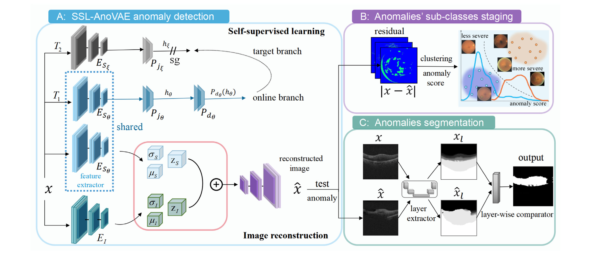

`图2. 我们提出的方法的示意图，由三部分组成：(A) SSL-AnoVAE异常检测，(B) 异常亚类分期，(C) 异常分割。所提出的SSL-AnoVAE由自监督学习(SSL)模块和图像重建模块组成。在SSL-AnoVAE的训练中，SSL模块训练𝑬𝑆𝜽以提取特征，并与图像重建模块共享在线编码器𝑬𝑆𝜽。然后我们将来自共享在线编码器𝑬𝑆𝜽和原始图像编码器𝑬𝑰的两个潜在表示𝒛𝑰和𝒛𝑺连接起来，用于图像重建。在异常亚类分期部分，将CFP异常图像输入到训练好的SSL-AnoVAE中，输出残差|𝒙−̂𝒙|被聚类到𝐾个簇中，例如，K=2表示较轻和较重。在异常分割部分，我们首先将重建图x-hat和原始图像x输入到层提取器中，然后引入逐层灰度比较器，它输出OCT图像中视网膜水肿区域的分割图（更多细节见图3）。`

同时，为了充分利用所提出的SSL-AnoVAE框架，并将其应用于临床，以辅助诊断视网膜相关疾病，我们进一步提出以无监督的方式对异常进行分类和分割。也就是说，根据它们的聚类和异常分数将异常的CFP图像分类到不同的阶段（见图2(B)），并使用逐层灰度比较方法来分割OCT图像中的水肿区域（见图2(C)）。

### The proposed SSL-AnoVAE

####  The self-Supervised Learning module of SSL-AnoVAE

为了通过自监督学习从正常图像中获取先验信息，我们采用了一个对比网络，该网络可以通过选择特定的图像转换作为网络输入来学习特定信息。受到Grill等人（2020年）的启发，我们在SSL模块中设计了一个具有两个不平衡分支的对比网络：在线分支和目标分支。这样，网络可以通过最大化这两个分支输出之间的相似性来学习正常图像的相似分布信息。值得注意的是，本研究中SSL模块的输入都是正样本对（即正常的视网膜图像），这有利于网络学习正常视网膜图像的共享特征，与学习UAD正常数据的分布相一致。此外，研究表明，仅输入正样本对的自监督学习网络比输入负样本对的网络在图像转换的扰动下更加稳健（Grill等人，2020年）。

我们同样使用**均方误差**来衡量两个$\ell_2$标准化输出 $ h'_\theta  $和$  h_\xi $ 之间的差异：

$L_{\theta,\xi} = \| \overline{h'_\theta} - \overline{h_\xi} \|_2^2 $

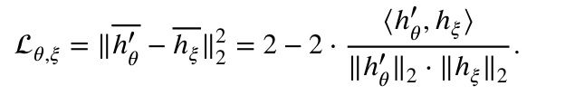

这里的公式表示损失函数$  L_{\theta,\xi}  $计算的是经过$ \ell_2 $标准化处理的输出向量 \( $h'_\theta$ \) 和 \( $h_\xi$ \) 之间的欧几里得距离的平方。\( $\| \cdot \|_2$ \) 表示\( $\ell_2 $\)范数，也就是向量的每个元素平方和的平方根，它衡量了向量的长度。

- \( $h'_\theta$ \) 是在线分支编码器和投影器的输出。
- \( $h_\xi$ \) 是目标分支编码器和投影器的输出。

通过最小化这个损失函数，网络学习到的特征表示能够确保同一图像的不同变换版本在特征空间中彼此接近，这是对比学习的核心目标之一。这种学习方式有助于提取图像的区分性特征，这些特征对于异常检测等任务非常有用。

然后是简化这个损失函数的结果，F表示online branch的结果，G表示target branch的结果，简化得到如下：

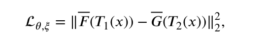

对于整个SSL模块的loss如下，就是对称的把T1和T2的位置交换一下，然后再求一遍两个归一化后的均方误差，然后这个式子只对$\theta$求梯度，不对$\xi$求梯度

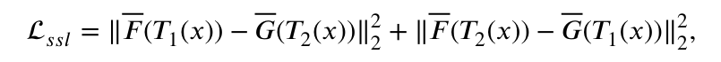

##### 解释

**E：**

两个E（Phi和Xi），是两个编码器encoder，编码器的具体结构（例如层数、神经元数量、激活函数等）会根据具体任务和数据集进行设计和优化。文中没有详细描述编码器的具体结构细节，但它们通常由多层卷积神经网络组成，以提取图像的层次结构特征。

在提供的文本中，并没有详细描述两个投影器（projectors）Pθ*P**θ* 和 Pξ*P**ξ* 的具体结构。然而，在自监督学习的对比网络中，投影器通常用于将编码器的输出转换成一个更适合进行比较的格式，这通常是为了降低特征的维度或者提取更关键的信息，以便在对比学习过程中使用。

**P：**

投影器 Pθ 和 Pξ 可能具有以下特点：

- **降维**：它们可能包含全连接层（fully connected layers），用于将编码器的输出从高维特征空间映射到低维特征空间。
- **非线性**：可能包含非线性激活函数，如ReLU或Sigmoid，以增加模型的表达能力。
- **规范化**：可能在投影过程中使用规范化技术，如L2规范化，以确保特征向量的单位长度，这有助于后续的比较和对比学习。

在某些实现中，投影器可能相对简单，比如只包含一个或几个全连接层，而在其他一些实现中，投影器可能更为复杂，包含多个层和不同类型的层（如卷积层、池化层等）。

**两个branch**

1. **Online Branch（在线分支）**：
	- 在线分支通常包含一个编码器和一个投影器，用于处理输入图像的转换版本（例如，通过图像增强或数据增强技术处理的图像）。
	- 编码器提取图像的特征表示，然后投影器将这些特征进一步映射到一个低维空间，以便于进行比较。
	- 在线分支的输出通常用于生成一个动态更新的特征表示，它参与到对比损失的计算中。
2. **Target Branch（目标分支）**：
	- 目标分支包含一个编码器，其结构与在线分支的编码器相同或相似，但它使用的是不同的图像转换版本作为输入。
	- 目标分支的目的是生成一个稳定的特征表示，这个表示与在线分支的特征表示相比较，以学习区分不同图像的能力。
	- 目标分支的参数在训练过程中通常是固定不变的，或者使用某种形式的动量更新（例如，使用指数加权平均值）。

在SSL-AnoVAE框架中，这两个分支协同工作，以学习图像的鲁棒特征表示。在线分支的输出（hθ′*h**θ*′）和目标分支的输出（hξ*h**ξ*）通过一个对比损失函数进行比较，该损失函数鼓励同一图像的不同转换版本的特征表示彼此接近，同时使不同图像的特征表示彼此远离。

`两个branch这个结构是自监督学习的一个框架`

在第一个公式中，加上平均符号的横线（通常表示为 \( $\overline{h}$ \)）表示对向量 \( h \) 进行了 \( $\ell_2$ \) 标准化（也称作单位规范化），使其成为单位向量，即向量的模长（或长度）变为1。这种规范化是一种常见的预处理步骤，用于确保向量在比较时不受其模长的影响，从而使得相似性度量更加稳定和一致。

\( $\ell_2$ \) 标准化的过程如下：

\[ $\overline{h} = \frac{h}{\| h \|_2}$ \]

其中：
- \( h \) 是原始的向量。
- \($ \| h \|_2$ \) 是 \( h \) 的 \( $\ell_2$ \) 范数，也就是向量 \( h \) 的欧几里得长度，计算为 \($ \sqrt{h_1^2 + h_2^2 + \ldots + h_n^2}$ \)，这里 \( $h_1, h_2, \ldots, h_n$ \) 是向量 \( h \) 的元素。
- \( $\overline{h}$ \) 是标准化后的向量。

在原始文本中提到的均方误差公式中：

\[$ L_{\theta,\xi} = \| h'_\theta - h_\xi \|_2^2$ \]

如果 \( $h'_\theta$ \) 和 \( $h_\xi $\) 已经通过 \( $\ell_2$ \) 标准化处理，那么公式中的 \( $h'_\theta$ \) 和 \($ h_\xi$ \) 应该表示为 \( $\overline{h'_\theta}$ \) 和 \( $\overline{h_\xi}$ \)，意味着它们已经被规范化，损失函数计算的是这两个单位向量之间的欧几里得距离的平方。这有助于在训练过程中平衡不同特征维度的贡献，使得每个维度对最终的损失值有相同的重要性。

#### Choices of transformations

为了通过自监督学习获得良好的表示，数据转换的选择至关重要（Chen等人，2020a）。常见的数据转换主要可以分为两类：空间/几何转换，如裁剪、翻转和旋转（Komodakis和Gidaris，2018），以及外观转换，例如与颜色相关的改变（例如，颜色抖动、颜色丢弃和Canny滤波）、高斯模糊等。对比网络可以通过最小化不同选定转换图像之间的距离来提取各种感兴趣的特征。例如，已经显示，使用与颜色无关的外观转换时，对比网络主要学习颜色表示（Chen等人，2020a）。类似地，当我们只使用与颜色相关的外观转换时，对比网络将更多地关注不变的结构信息（例如，血管、视网膜层），而较少关注变化的颜色信息。

这段话强调了在自监督学习中，选择合适的数据转换对于提取有用的特征表示是非常重要的。通过使用不同类型的转换，网络可以学习到图像的不同特征，如颜色、结构等。通过这种方式，自监督学习模型能够捕捉到图像中的关键信息，这些信息对于后续的图像分析任务，如异常检测，是非常有帮助的。

如表1所示，我们在这项工作中为SSL模块采用了不同的视网膜图像转换。具体来说，OCT和CFP数据集的数据转换是根据要检测的异常来选择的。OCT视网膜图像主要由层组成，其结构可能被异常区域（病变）破坏。因此，我们对OCT图像应用外观转换，以提供更多的结构和纹理信息。此外，由于某些疾病（例如，视网膜水肿）也可能引起病变周围的强度变化，我们增加了空间/几何转换作为补充。对于CFP数据集，CFP的异常区域主要是某些区域的颜色（例如，软性渗出物）和结构（例如，新生血管和出血）的变化。因此，为CFP数据集选择的数据转换旨在提供更多颜色和结构信息。我们将在稍后的实验中展示所选转换是最优的选择。

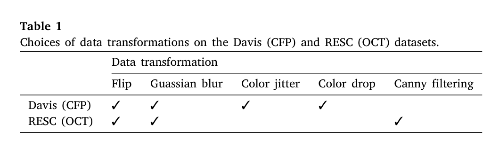

这段话解释了在自监督学习模块中，根据不同的视网膜图像数据集和要检测的异常类型，选择了不同的数据转换方法。OCT图像的转换侧重于提供结构和纹理信息，而CFP图像的转换则侧重于颜色和结构信息。这些选择都是为了使网络能够更好地学习和区分正常和异常的视网膜特征，从而提高异常检测的准确性。

#### The image reconstruction module of SSL-AnoVAE

为了更好地重建正常图像，我们结合了两个潜在表示来进行图像解码：一个来自SSL模块中的特征提取器 $E_{S \theta}$，另一个来自原始编码器 $E_I$。通过这样做，原始图像信息和来自SSL模块的先验信息都被整合起来了。具体来说，我们首先通过原始编码器 $E_I$和SSL模块中共享的编码器 $E_{S \theta}$将原始图像编X码成两个潜在表示$z_I$, $z_S$ `根据图里面和后面的过程来看，这应该是两个高维向量，符合VAE搞的分布`

公式 \($ \mathcal{L}_{prior}$ \) 表示的是先验正则化项，用于确保编码器输出的潜在表示 \( $z_I $\) 和 \( $z_S$ \) 分别符合特定的分布。这个公式中包含两个Kullback-Leibler ($KL$) 散度项，每个项都对应一个编码器输出的潜在表示与一个标准正态分布的先验分布之间的差异。具体来说：

\[ $\mathcal{L}_{prior} = \lambda_I D_{KL}(p(z_I) \| N(0,1)) + \lambda_S D_{KL}(p(z_S) \| N(0,1))$ \] 

`对于这个式子，首先p(zI)和p(zS)是VAE通过某种操作，得到zI和zS的分布，即两个p。然后用$D_{KL}$来衡量这两个分布与标准正态分布之间的差异，再加上lambda来确定权重。这个式子作为损失函数就是希望zI和zS能尽可能接近标准正态分布。`

这里的组成部分解释如下：

- \( $\mathcal{L}_{prior}$ \)：先验正则化项的总损失。
- \($ \lambda_I$ \) 和 \($ \lambda_S$ \)：分别是针对 \( $z_I$ \) 和 \( $z_S$ \) 的权重参数，用于平衡两个KL散度项在总损失中的贡献。
- \( $D_{KL}$ \)：Kullback-Leibler散度，是衡量两个概率分布差异的一种方法。它从概率论中定义了两个概率分布 \( p \) 和 \( q \) 之间的非对称距离，计算为：
  $D_{KL}(p \| q) = \sum p(x) \log \left(\frac{p(x)}{q(x)}\right) $
  其中，\( p \) 是真实分布，\( q \) 是模型分布或先验分布。
- \( $p(z_I)$ \) 和 \( $p(z_S)$ \)：分别是原始编码器 \( $E_I$ \) 和SSL模块编码器 \( $E_S^\theta$ \) 输出的潜在表示的分布。
- \( $N(0,1)$ \)：标准正态分布，即均值为0，方差为1的高斯分布。这是我们希望潜在表示 \( $z_I$ \) 和 \( $z_S$ \) 符合的先验分布。

通过最小化 \( $\mathcal{L}_{prior}$ \)，我们鼓励编码器输出的潜在表示的分布接近于标准正态分布，这有助于确保模型学习到的表示具有零均值和单位方差的统计特性，从而有助于模型的稳定性和泛化能力。在自监督学习中，这种正则化技术是常用的，因为它可以在没有显式监督信号的情况下引导模型学习有用的特征表示。

VAE（红框里面的）将$E_{S \theta}$和$E_I$的输出转化为了概率分布

然后将ZI和ZS连接起来（图中圆圈加号），输入VAE的解码器重构得到x-hat，用L1范数衡量两个图之间的损失

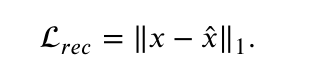

`损失函数 \( $L_{rec} = \| x - \hat{x} \|_1$ \) 用于衡量原始图像 \( x \) 和重构图像 \( $\hat{x}$ \) 之间的差异。这里的 \( $\ell_1$ \) 范数计算了两个图像在像素级的差异，对每个像素的绝对值差异求和。`

`这一步的主要目的是为了确保解码器能够生成与原始输入图像尽可能相似的图像。`

对于GAN来说，这个损失函数对于生成图像x-hat的前面的生成式网络来说，作用是希望它骗过判别器D，也就是D识别生成的x-hat为真，即D(x-hat)越大越好。这样log是单调递增的，所以期望的也会越小，后面的那一项对于前面的生成式网络来说就是个常数

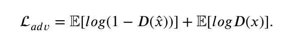

#####  解释

\( $p(z_S) $\) 和 \( $p(z_I) $\) 在变分自编码器（VAE）框架中通常表示潜在变量的分布，这些分布是由编码器网络参数化的。具体来说：

1. **编码器网络**：在VAE中，原始编码器 \( $E_I$ \) 和SSL模块的编码器 \( $E_S^\theta$ \) 是深度神经网络，它们将输入数据（例如图像）映射到潜在空间。这些编码器通常包含一系列层，如全连接层或卷积层，用于提取特征并生成潜在表示。

2. **参数化分布**：编码器网络的输出通常不是单一的潜在表示向量，而是一个参数化的概率分布的参数。对于VAE，这些通常是均值（\( $\mu$ \)）和方差（\( $\sigma^2$ \)）或者对数方差（\( $\log(\sigma^2) $\)），它们定义了潜在空间中的一个多元高斯分布。

3. **重参数化技巧**：VAE使用一种称为重参数化技巧（reparameterization trick）的方法来避免在反向传播中直接对随机性进行梯度计算。在这种方法中，潜在表示 \( z \) 是通过从标准正态分布中采样一个随机变量 \( $\epsilon$ \)，然后通过 \( $z = \mu + \sigma \odot \epsilon$ \) 来计算的，其中 \( $\odot$ \) 表示向量元素的Hadamard积（即元素乘法）。

4. **概率分布**：\( $p(z_S)$ \) 和 \( $p(z_I)$ \) 分别是编码器 \( $E_{S\theta}$ \) 和 \( $E_I$ \) 输出的潜在表示的概率分布。在实践中，这些分布通常是多元高斯分布，其均值和方差由编码器网络的输出给出。

5. **先验分布**：在VAE中，我们通常假设潜在变量的先验分布 \( $p(z) $\) 是标准正态分布 \( $N(0, I)$ \)，其中 \( $I $\) 是单位矩阵。这意味着我们希望编码器输出的潜在表示的分布接近于这个先验分布。

通过训练VAE，我们调整编码器和解码器的参数，使得重构的数据尽可能接近原始输入数据，并且编码器输出的潜在表示的分布尽可能接近先验分布。这样，\( $p(z_S)$ \) 和 \( $p(z_I)$ \) 是通过编码器网络从数据中学习得到的，并且通过最小化KL散度来使它们与先验分布对齐。

在变分自编码器（VAE）框架中，\( E_S^\theta \) 和 \( E_I \) 通常表示两个不同的编码器网络，它们分别对应于不同的输入和任务。VAE的操作流程和输入输出如下：

1. **输入**：
   - VAE的输入通常是原始数据 \( x \)，例如图像、音频或其他类型的数据。

2. **编码器 \( $E_I $\)**：
   - \( $E_I $\) 是VAE的主编码器，它接收原始数据 \( x \) 作为输入，并将其映射到一个潜在空间的表示 \( $z_I$ \)。这个过程通常涉及一个概率分布 \( $q(z_I | x) $\)，VAE通过这个分布来正则化编码过程。

3. **编码器 \( $E_S^\theta$ \)（SSL模块）**：
   - \( $E_S^\theta$ \) 是自监督学习（SSL）模块的一部分，它可能接收相同的输入 \( x \) 并产生另一个潜在表示 \( $z_S$ \)。这个表示旨在捕获输入数据的不同方面的信息，例如结构、纹理或颜色等。

4. **潜在表示的组合**：
   - 一旦得到 \( $z_I$ \) 和 \( $z_S$ \)，它们可以以不同的方式结合起来。在某些情况下，它们可以被连接或合并成一个单一的潜在表示，这个表示将被用于后续的解码过程。

5. **解码器**：
   - VAE包含一个解码器网络，它将潜在表示 \( z \)（无论是 \( $z_I$ \)、\( $z_S$ \) 还是它们的组合）映射回数据空间，尝试重构原始输入 \( x \)。这个过程通常表示为 \($ \tilde{x} \sim p(x | z) $\)，其中 \($ \tilde{x} $\) 是重构的数据。

6. **VAE的输出**：
   - VAE的输出是重构的数据 \( $\tilde{x}$ \)，它是从潜在表示 \( z \) 解码得到的。理想情况下，\( $\tilde{x}$ \) 应该尽可能接近原始输入 \( x \)。

7. **损失函数**：
   - VAE的训练涉及到最小化损失函数，该损失函数通常包括两部分：重构损失（例如，像素级重构损失）和KL散度项，后者衡量编码器输出的潜在表示分布与先验分布之间的差异。

8. **优化过程**：
   - 通过最小化损失函数，VAE学习如何编码输入数据到潜在空间，并从该空间重构数据，同时确保潜在表示遵循特定的分布（通常是标准正态分布）。

总结来说，VAE通过编码器将输入数据映射到潜在空间，然后通过解码器重构数据，并通过最小化损失函数来优化整个过程。在这个过程中，\( $E_S^\theta$ \) 和 \( $E_I$ \) 可以提供互补的信息，帮助VAE更好地学习和重构数据。

#### The overall loss of SSL-anovae

对于SSL-AnoVAE的整体框架，SSL模块和图像重建模块以端到端的方式同时训练。更准确地说，在\( $T_1$ \)和\( $T_2$ \)的两次转换之后，转换后的图像被输入到SSL模块中的\( $E_S^\theta$ \)和\( $E_S^\xi$ \)。同时，原始图像\( x \)也被分别输入到图像重建模块中的\( $E_S^\theta$ \)和\( $E_I$ \)。注意，SSL模块与图像重建模块共享在线编码器\( $E_S^\theta$ \)。因此，两个转换图像之间的相似性损失可以参与重建模块的训练，同时约束自监督学习。因此，整个训练过程的总体损失是：

\[ $\mathcal{L} = \lambda_1 \mathcal{L}_{ssl} + \lambda_2 \mathcal{L}_{rec} + \lambda_3 \mathcal{L}_{prior} + \lambda_4 \mathcal{L}_{adv}$ \]

这里的组成部分解释如下：

- \($ \mathcal{L}$ \)：整个模型的总损失函数。
- \( $\lambda_1, \lambda_2, \lambda_3, \lambda_4$ \)：超参数，用于平衡不同损失项的贡献。
- \( $\mathcal{L}_{ssl}$ \)：自监督学习模块的损失，基于两个转换图像之间的相似性。
- \( $\mathcal{L}_{rec}$ \)：图像重建损失，衡量重建图像与原始图像之间的差异。
- \( $\mathcal{L}_{prior}$ \)：先验损失，通常用于正则化潜在表示，确保它们遵循特定的分布（例如标准正态分布）。
- \( $\mathcal{L}_{adv} $\)：对抗性损失，用于训练生成器（在这里是图像重建模块的一部分）生成判别器难以区分真假的数据。

这种端到端的训练方法允许模型在学习重建图像的同时，通过自监督学习提取有用的特征表示，并通过对抗性训练提高生成图像的真实性。通过这种方式，SSL-AnoVAE框架旨在提高异常检测、图像重建和特征学习的性能。

`就是设置四个超参lambda，来设置之前四个loss function的比重`

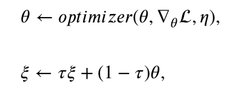

在SSL-AnoVAE模型的训练过程中，涉及的参数更新规则如下：

- \( $\theta$ \) 是在线分支的参数，它们会根据损失函数 \( $\mathcal{L}$ \) 的梯度进行优化。这里的优化器（例如Adam或SGD）用于根据损失函数的梯度来更新 \($ \theta $\)，学习率由 \( $\eta$ \) 决定。公式表示为：
  \[ $\theta \leftarrow \text{optimizer}(\theta, \nabla_\theta \mathcal{L}, \eta)$ \]

- \( $\xi$ \) 是目标分支的参数。它们不会直接从损失函数中获得梯度，而是通过一个动量更新规则来更新，该规则结合了当前的 \($ \theta$ \) 和之前的 \($ \xi $\)。这里的 \( $\tau$ \) 是一个超参数，用于控制先前参数 \( $\xi$ \) 在更新中的权重。公式表示为：
  \[ $\xi \leftarrow \tau \xi + (1 - \tau) \theta$ \]

这种更新机制确保了目标分支的参数 \($ \xi $\) 能够跟随在线分支的参数 \( $\theta$ \) 的更新，但以一种更加平滑和稳定的方式。这有助于避免训练过程中的不稳定性和潜在的梯度爆炸或消失问题。

在实践中，这种技术通常用于生成对抗网络（GAN）中判别器的训练，以确保判别器的更新不会过于激进，从而维持生成器和判别器之间的平衡。在SSL-AnoVAE框架中，这种更新策略可能用于确保自监督学习模块和图像重建模块之间的协同训练，提高模型整体的稳定性和性能。

`上面的总的loss function只对theta更新，xi在theta更新完后再由theta确定更新`

这里的 \($ \text{optimizer} $\) 表示一个优化器，\( $\eta$ \) 是学习率，而 \( $\tau$ \) 是权重超参数。`在测试中，我们使用重建误差作为异常检测的度量分数，即异常分数`，它可以表示为：

异常分数 \( A(x) \) 定义为原始图像 \( x \) 和重建图像 \( $\hat{x}$ \) 之间的 \( $\ell_1$ \) 范数，即：

 $A(x) = \| x - \hat{x} \|_1$ 

关于是否选择使用预训练模型来训练SSL模块，而不是端到端训练，我们也进行了比较实验。在这些实验中，我们首先通过自监督学习预训练在线编码器，然后将其集成到图像重建模块中，用于异常检测任务。然而，正如实验部分所示，我们的结果表明，与预训练策略相比，端到端训练更可取。

`感觉这里可以理解为，正常的图像才适配这个模型，生成的x和原始的x相差比较小，而异常的则会很大`

`预训练指先预先训练SSL模块，端到端则是模型的所有参数在整个网络中同时更新，以最小化从输入到期望输出的总体损失。这里选择端到端`

##### 解释

异常分数是一个衡量标准，用于异常检测任务中评估重建图像与原始图像之间的差异程度。在许多异常检测算法中，这个分数用于量化图像的异常程度，即图像偏离正常模式的程度。

在自监督学习（SSL）和变分自编码器（VAE）的上下文中，异常分数通常由以下几部分组成：

1. **重建误差**：原始图像和由模型重建的图像之间的差异。差异越小，表示模型重建的图像与原始图像越相似，异常分数越低。

2. **重构损失**：使用特定的损失函数（如 \( $\ell_1$ \) 范数或均方误差）来计算的重建误差。例如，异常分数 \( A(x) \) 可以定义为原始图像 \( x \) 和重建图像 \( $\hat{x}$ \) 之间的 \( $\ell_1$ \) 范数：

   \[ $A(x) = \| x - \hat{x} \|_1$ \]

3. **异常检测**：异常分数用于检测图像中的异常。如果分数高于某个阈值，图像可能被认为是异常的。

4. **特征空间中的距离**：异常分数也可以基于特征空间中的距离，其中原始图像和重建图像的特征表示被比较。

在实际应用中，异常分数有助于自动识别数据集中的异常值，这在诸如医疗影像分析、工业质量控制、金融欺诈检测等领域中非常有用。通过自监督学习，模型能够在没有标签数据的情况下学习数据的分布，并使用异常分数来识别那些不符合已学习分布的数据点。

### Unsupervised anomaly staging

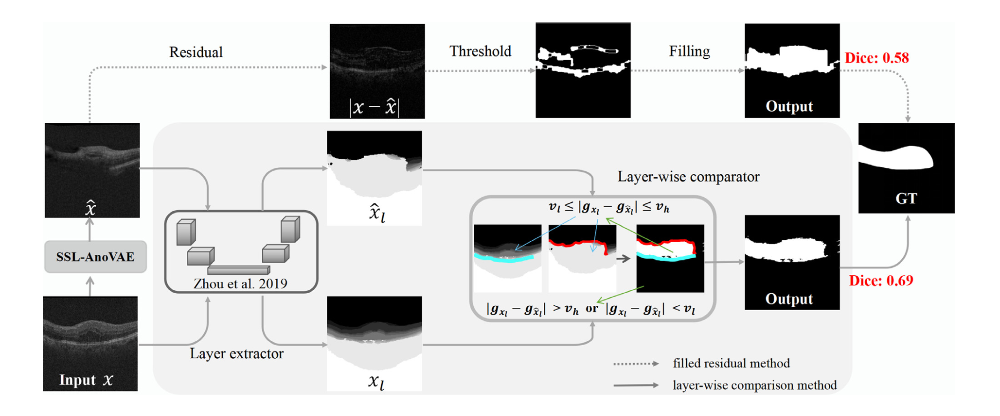

  `上面的是baseline方法，下面的是将原始图像和重构图像放进一个layer extractor，得到两个灰度图像，两个图像之间像素的灰度值差在两个阈值之间的被视为异常区域`

`异常检测模型检测到的异常残差，即重建图像与原始图像之间的差异，代表了异常图像中检测到的病变区域`（Schlegl等人，2019年；Baur等人，2021年）。通常，异常图像越严重，它检测到的病变就越大。为了通过识别疾病的严重程度或进展来更好地帮助患者进行诊断和治疗，即异常图像的亚类，在本项工作中，我们还以无监督的方式解决了异常分期的问题，即在没有标签的情况下对从异常图像中提取的残差进行分类。

视网膜疾病中最严重的病变之一是增殖性糖尿病视网膜病变（PDR）。通常建议，伴有玻璃体出血或纤维血管增殖膜的PDR患者需要进行玻璃体切割术（Takahashi等人，2017年）。因此，为了更好地诊断和治疗视网膜疾病，我们的目标是将PDR从其他类型的视网膜病变（即非PDR）中识别出来，包括单纯性糖尿病视网膜病变（SDR）和前增殖性糖尿病视网膜病变（PPDR）。我们在图2(B)中展示了视网膜疾病异常分期的整个过程。具体来说，我们首先使用提出的SSL-AnoVAE获得CFP图像的异常残差 \( $|x - \hat{x}|$ \)，然后使用K-means聚类将这些异常图像的残差聚类成K个簇，例如，在这种情况下K=2，分别代表PDR和非PDR。为了确定两个簇对应的类别，我们为每个簇中的样本分配异常分数A(x)（见公式(8)），并计算每个簇的质心的异常分数。异常分数较高的簇对应于更严重的病变组（例如，PDR），反之则对应于非PDR病变。

`对x和x-hat进行逐元素的取绝对值，K-means再对残差聚类，算出质心分数，分数高的那个簇为病变了的`

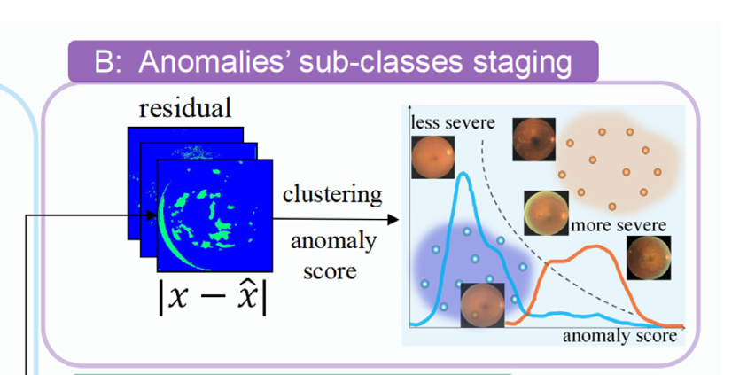

#### Unsupervised segmentation via layer-wise gray scale comparison

接下来，为了在临床应用中进一步定位和描绘病变区域，并充分利用我们提出的SSL AnoVAE，我们还提出了一种通过逐层灰度比较的无监督异常分割方法。基于重建的先前异常分割方法（Baur等人，2018年，2021年）依赖于原始图像及其重建之间的逐像素比较。然而，某些OCT视网膜图像中的疾病（例如，视网膜水肿）不能通过直接使用逐像素分割来实现满意的分割，因为水肿区域的组织是正常的。例如，在图3的顶部所示，如果我们通过简单地使用阈值和填充来转换残差以分割视网膜水肿的异常区域，这些逐像素比较方法只能在一定程度上改善分割结果（Dice：0.58），而视网膜水肿的形状仍然没有被很好地分割。

#### Unsupervised segmentation via layer-wise gray scale comparison

鉴于OCT视网膜图像由多层组成，异常区域（病变）可以破坏层结构，原始图像和重建图像之间的层结构中的异常区域（例如，视网膜水肿）可能存在相当大的差异，即在逐层比较中异常区域可以被放大。基于此，在我们提出的方法（如图3底部所示），引入了一个层提取器（Zhou等人，2020年）来提取SSL-AnoVAE的原始图像 \( x \) 和重建图像 \( $\hat{x}$ \) 的层。引入的层提取器在层分割方面具有良好的质量，因为它使用领域适应来减轻我们的数据集（即，RESC数据集）和源分割数据集（即，Zhou等人（2020年）使用的Toncon数据集）之间的领域差异。因此，层提取器可以以最高的保真度分割原始图像的层结构，并最小化层分割误差，以便更好地用于异常区域分割任务，以获得良好的分割性能。从图中可以看出，与 \( x \) 和 \( $\hat{x}$ \) 相比，病变区域的层结构 \( $x^l$ \) 和 \( $\hat{x}^l$ \) 之间的差异更大，因为病变在层提取器之后被放大。然后我们提出了一个灰度比较器，其中灰度差异在 \( $x^l$ \) 和 \( $\hat{x}^l$ \) 之间的区域大于 \($ v_l $\) 且小于 \( $v_h$ \) 被视为异常区域（即，视网膜水肿），其余的是背景。上限（即 \( $v_h$ \)）的设置基于这样的计算：`视网膜层之间的灰度差异通常落在一定的范围内，这是由于层提取器中每层的灰度定义`。此外，`非视网膜层（例如，层结构中的白色区域背景）与其他层相比具有更大的灰度差异。因此我们设置了一个上限 \( $v_h$ \) 来排除由背景区域导致的错误`。通过比较层提取器的 \( $x^l$ \) 和 \( $\hat{x}^l$ \) 的灰度值差异，即通过逐层灰度比较获得的最终分割图可以写成：

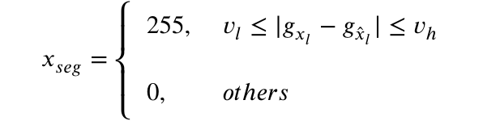

`在阈值vl以上的，说明灰度差异较大，需要标记为异常。但是如果超过了很多的话，就可能是背景区域导致的，将异常区域设为白色`

## 总得来说就是，前面生成一张重构图，然后比较和原始图的差异来看是否异常
