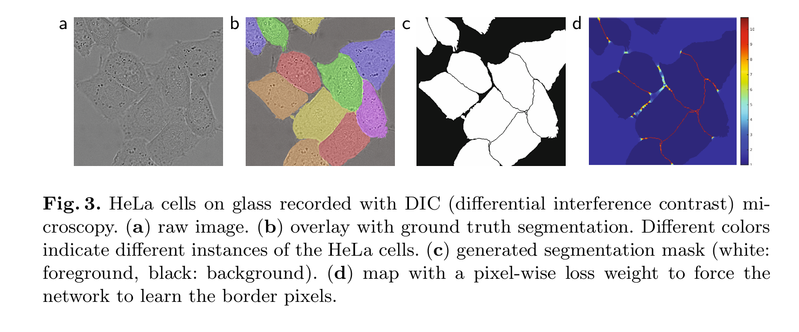

http://yzb.nwpu.edu.cn

[toc]

## introduction

Fig2：左边那个图，展示了用蓝框补充信息时，需要从外面推理，如果没有，可以镜像法，左图就是镜像得到的


提出了使用加权损失，其中接触细胞之间的分离背景标签在损失函数中获得较大的权重。 这句话啥意思

1. **在损失函数中获得较大的权重**：为了确保网络能够学习到如何正确地分割这些接触的细胞，损失函数会对这些细胞之间的边界像素赋予更高的权重。这意味着，如果在这些区域的预测分割与实际的分割（即“ground truth”）有偏差，网络会受到更大的惩罚。
2. **强制网络学习边界像素**：通过这种方式，网络被鼓励更加关注这些边界像素，从而提高分割的准确性，尤其是在区分紧密接触的对象时。

## Network Architecture

网络架构如图1所示。它由一个收缩路径（左侧）和一个扩展路径（右侧）组成。收缩路径遵循典型卷积网络的架构。它由两个3x3卷积（无填充卷积）的重复应用组成，每个卷积后面跟着一个修正线性单元（ReLU）和一个2x2的最大池化操作，步长为2进行下采样。在每次下采样步骤中，我们翻倍特征通道的数量。扩展路径的每一步都包括特征图的上采样，然后是一个2x2的卷积（“上卷积”），它将特征通道的数量减半，**与收缩路径中相应裁剪的特征图进行连接**，以及两个3x3的卷积，每个卷积后面跟着一个ReLU。裁剪是必要的，因为每次卷积都会丢失边界像素。在最后一层，使用1x1的卷积将每个64组分特征向量映射到所需的类别数（这里图中是2，因为就像Fig 3 c里面的，白色像素是细胞像素，黑色是其它）。总的来说，网络总共有23个卷积层。为了允许输出分割图的无缝平铺（见图2），选择输入瓦片大小非常重要，以使所有2x2最大池化操作都应用于具有偶数x和y大小的层。





## Train

输入图像及其相应的分割图用于使用Caffe[6]的随机梯度下降实现来训练网络。由于未填充的卷积，输出图像比输入图像小一个恒定的边界宽度。为了最小化开销并最大限度地利用GPU内存，我们倾向于选择较大的输入瓦片而不是较大的批量大小，因此将批量减少到单张图像。相应地，我们使用high momentum（0.99），这样之前看过的大量训练样本决定了当前优化步骤中的更新。

### softmax

$p_k(x)=\exp(a_k(x))/\left(\sum_{k^{\prime}=1}^K\exp(a_{k^{\prime}}(x))\right)$

$a_k(x)$：feature map的第k个channel的第x个像素（x是二维特征图中第一个像素）的激活值

$K$：类别总数，即像素对应的类别数

$p_k(x)$：第k个通道的第x个像素对应的概率，pkx越大，说明这个x像素属于k类别的可能越大


###  loss function

U-net把loss叫energy funtion

损失函数是通过在最终特征图上逐像素进行soft-max计算，并与交叉熵损失函数相结合来得到的。


公式：

$ E = \sum_{x \in \Omega} w(x) \log(p_{\ell}(x)) $

是交叉熵损失函数的一个实例，其中：
- \( E \) 表示损失函数的值，它是所有像素位置损失的总和。
- \( x \) 是像素位置，\($ \Omega $\) 是图像中所有像素位置的集合。
- \( w(x) \) 是权重函数，用于为不同位置的像素分配不同的权重，这可以反映某些像素在训练中的重要性。
- ( $p_{\ell}(x)$ )是Soft-max函数输出的概率，表示在位置 \( x \) 处像素属于真实标签 \( $\ell$ \) 的概率。
- $( \ell ) $是每个像素的真实标签，$( \ell : \Omega \rightarrow \{1, ..., K\} ) $表示将每个像素位置映射到类别标签。

这个损失函数计算了所有像素位置上的损失，其中权重 \( w(x) \) 可以用于增强某些像素的重要性，例如边界像素或难以分割的区域。权重 \( w(x) \) 的引入是为了解决类别不平衡或强调模型需要更精确学习的区域。

交叉熵损失函数是深度学习中常用的损失函数之一，特别是在分类和分割任务中，因为它能够清晰地量化预测的概率分布与真实标签之间的差异。通过最小化这个损失函数，模型可以学习如何更准确地预测每个像素的类别。

### w权重矩阵

论文是预先为每个真实标注的分割计算权重图，以补偿训练数据集中特定类别像素的不同的出现频率（某些特定的出现得多），并迫使网络学习我们在接触的细胞之间引入的微小分隔边界（见图3c和d）。


分离边界是通过形态学运算计算得出的

原文中提到的计算w的公式：

$ w(x) = w_c(x) + w_0 \cdot \exp\left(-\frac{(d_1(x) + d2(x))^2}{2\sigma^2}\right) $

这个公式用于计算每个像素位置 \( x \) 的权重 \( w(x) \)，其中：

- $( w_c(x) ) $是用于平衡类别频率的权重图。
- $( w_0 ) $是一个常数，用于控制下一项对总权重的贡献。
- $( \exp ) $表示指数函数。
- $( d_1(x) ) $是像素 \( x \) 到最近细胞边界的距离。
- $( d_2(x) ) $是像素 \( x \) 到第二近细胞边界的距离。
- $( \sigma ) $是一个参数，用于控制高斯分布的宽度，影响权重的分布。

这个公式的目的是为每个像素位置 \( x \) 分配一个权重，这样那些位于细胞接触边界附近的像素会有更高的权重。权重图 \( w(x) \) 通过结合 \( $w_c(x) $\) 和一个基于像素距离的高斯加权项来计算。高斯加权项确保了那些位于细胞边界附近的像素（\( $d_1(x)$ \) 和 \( $d_2(x)$ \) 小的像素）会被赋予更大的权重，从而在训练过程中更加强调这些区域的学习。这种方法有助于网络更好地学习区分接触的细胞，因为这些区域在图像分割中往往更加困难。


U-net初始w0为10，$( \sigma ) $为5个像素

### 权重初始化

然后给了卷积层和ReLU的初始化


## Data Augmentation

### 形变

在只有少量训练样本可用时。在显微镜图像的情况下，我们主要需要**平移和旋转不变性**，以及对**变形和灰度值变化**的鲁棒性。特别是对训练样本进行**随机弹性变形**似乎是用很少的标注图像来训练分割网络的关键概念。我们使用在粗糙的3x3网格上随机位移向量来生成平滑的变形。

位移是从标准差为10像素的高斯分布中采样得到的。然后使用双三次插值计算每个像素的位移。收缩路径末端的Drop-out层执行进一步的隐式数据增强。

这段翻译解释了数据增强过程中的两个关键步骤：

1. **位移采样**：位移数据是从一个高斯分布中采样的，该分布的标准差为10个像素，这意味着生成的位移在-10到10像素范围内变化，中心位于0。
2. **双三次插值**：对于每个像素，使用双三次插值方法来计算其位移，这是一种平滑且精确的插值方法，可以减少因插值引起的图像失真。

#### 例子


想象有一张100x100像素的图像，现在我们要通过数据增强来模拟一些微小的形变，比如模拟显微镜下细胞的微小移动。

1. **创建3x3网格**：首先，在这张图像上覆盖一个3x3的网格，这意味着整个图像被划分为9个较大的区域（3行3列）。

2. **随机位移**：然后，为网格中的每个控制点（每个网格单元的中心）随机选择一个位移向量。假设我们为每个控制点选择了一个水平和垂直方向上的位移，比如(2, -3)，这意味着这个控制点将向下移动3个像素，向右移动2个像素。

3. **应用位移**：每个控制点的位移向量被应用到它所在的网格单元上，这将影响该单元内所有像素的位置。

4. **双三次插值**：由于位移可能会导致像素位置不连续，我们使用双三次插值来计算每个像素的新值。这种插值方法可以平滑地调整像素值，避免出现明显的边缘或不连续。

5. **平滑变形**：通过这种方式，整个图像经历了一个平滑的变形，就像细胞在显微镜下因为微小的移动而发生的形变一样。

6. **增强效果**：通过在训练数据集中引入这样的变形，神经网络可以学习到即使在细胞位置有微小变化的情况下也能进行准确的分割。

举个例子，如果我们有一个细胞图像的中心位于网格的正中间，通过这种数据增强，细胞的边缘可能会稍微向右上方移动，而其他部分的细胞或背景像素也会相应地调整位置，从而生成一张经过平滑形变的图像。这样的图像可以提供给神经网络作为训练数据，帮助它学习到对细胞形变的鲁棒性。

### dropout

**Drop-out层**：在收缩路径的末端使用Drop-out层，这是一种正则化技术，通过在训练过程中随机丢弃一些网络层的输出来防止过拟合，同时也起到了隐式数据增强的作用，因为每次训练过程中网络的行为都会有微小的变化。


## Table

"Table 1" 展示了在电子显微镜图像分割挑战赛（EM Segmentation Challenge）的排名情况。这个表格列出了不同参赛团队或方法的名称，以及它们在挑战赛中的表现，具体是通过以下几个指标来衡量的：

1. **Warping Error**：形变误差，用来衡量分割结果与真实分割之间的差异。
2. **Rand Error**：随机误差，也称为调整兰德指数（Adjusted Rand Index），用来衡量两个数据分配的相似度。
3. **Pixel Error**：像素误差，表示分割错误的像素比例。

表格中的数据是按照形变误差从小到大排序的，"human values" 表示人类专家的表现，作为参考标准。接下来列出的是各个参赛队伍或算法的成绩，其中 "u-net" 代表的就是论文中介绍的U-Net网络，它在该挑战赛中取得了优异的成绩。


**不知道这几个误差咋算的**


## 数据集

数据集由EM分割挑战赛[14,1]提供，该挑战赛于2012年在ISBI开始，并且仍然对新的贡献开放。训练数据集由30幅图像（512x512像素）组成，这些图像来自果蝇一龄幼虫腹神经索（VNC）的连续切片透射电子显微镜。每个图像都有一个相应的完全标注的真实分割图，用于细胞（白色）和膜（黑色）。测试集是公开可用的，但其分割图保密。通过将预测的膜概率图发送给组织者，可以获得评估。评估是通过在10个不同的阈值上对图进行阈值处理，并计算“形变误差”、“随机误差”和“像素误差”[14]来完成的。


## Fig 4

图4. ISBI细胞追踪挑战赛的结果。
(a) "PhC-U373" 数据集输入图像的一部分。
(b) 分割结果（青色遮罩），并附有手动真实标注（黄色边界）。
(c) "DIC-HeLa" 数据集的输入图像。
(d) 分割结果（随机颜色遮罩），并附有手动真实标注（黄色边界）。


## 名词解释

### Seamless Tiling 无缝平铺

"无缝平铺"（Seamless Tiling）是一种图像处理技术，特别是在图像分割和拼接的上下文中使用。它指的是将图像分割成多个小的部分（通常称为“平铺”或“瓦片”），然后对这些部分进行处理或分析，使得最终的输出看起来像是没有被分割过一样，即各个部分之间的边界是平滑且连续的，没有明显的接缝或边缘。

在U-Net网络架构的上下文中，无缝平铺特别重要，因为它允许网络处理比GPU内存大得多的图像。具体来说：

1. **处理大型图像**：由于单个图像可能太大，无法一次性加载到GPU内存中，无缝平铺允许将图像分割成多个小块进行处理。
2. **重叠区域**：为了确保图像的边界区域也能获得足够的上下文信息，相邻的平铺之间会有重叠区域。
3. **镜像外推**：在处理平铺的边界区域时，如果缺少必要的上下文信息，可以通过镜像外推的方式来补充这些信息。
4. **连续性**：通过这种方式，最终的分割结果在平铺的边界处看起来是连续的，没有明显的接缝，从而实现“无缝”的效果。
5. **提高分割质量**：无缝平铺有助于提高分割的质量，尤其是在图像的边缘和角落区域，确保了分割的一致性和准确性。


在U-Net的实现中，无缝平铺通常不是由网络的特定层直接实现的，而是由整个网络架构和后处理步骤共同实现的。网络的每个部分都设计为能够处理小块图像，并且能够将这些小块的输出有效地组合起来，以形成对整个大型图像的分割结果。

### momentum

在机器学习和深度学习中，动量（Momentum）是一种优化算法的扩展，用于加速梯度下降方法，尤其是在训练深度神经网络时。动量方法的主要目的是减轻梯度下降过程中的振荡，并加速收敛到最小值。

具体来说，动量的作用包括：

1. **加速收敛**：在梯度下降的每一步中，动量方法不仅考虑当前步的梯度，还考虑之前步的梯度。这有助于网络更快地逃离局部最小值，从而加速收敛过程。
2. **减少振荡**：在某些情况下，梯度可能会在不同的方向上发生振荡，导致训练过程不稳定。动量方法通过平滑梯度的方向，减少了这种振荡现象。
3. **保持稳定性**：在高曲率的区域，使用动量的梯度下降可以更稳定地更新权重，避免因梯度突然变化导致的训练不稳定。


在上文提到的Caffe实现中，使用高动量（0.99）意味着网络在更新权重时，会更多地考虑之前的梯度信息，从而有助于提高训练的稳定性和效率。


李沐的批量归一化章节中设计BN时也用到了，设得高可以让BN的参数对之前的参数有更高的权重

```python
def batch_norm(X, gamma, beta, moving_mean, moving_var, eps, momentum):
    # 通过is_grad_enabled来判断当前模式是训练模式还是预测模式
    if not torch.is_grad_enabled():
        # 如果是在预测模式下，直接使用传入的移动平均所得的均值和方差
        X_hat = (X - moving_mean) / torch.sqrt(moving_var + eps) # moving-mean是全局的mean
    else:
        assert len(X.shape) in (2, 4)
        if len(X.shape) == 2: # X是全连接层的输入，第1维是输入特征的条数第2维是每个特征的数量
            # 使用全连接层的情况，计算特征维上的均值和方差
            mean = X.mean(dim=0) # 此处的mean是小批量的mean
            var = ((X - mean) ** 2).mean(dim=0)
        else: # dim：0是批量大小，dim：2，3是图片，dim：1是通道数量，即对每个通道求均值
            # 使用二维卷积层的情况，计算通道维上（axis=1）的均值和方差。
            # 这里我们需要保持X的形状以便后面可以做广播运算
            mean = X.mean(dim=(0, 2, 3), keepdim=True) # dim＝(0,2,3)，输出1*n*1*1的特征矩阵，通道的维度是保留着的
            var = ((X - mean) ** 2).mean(dim=(0, 2, 3), keepdim=True)
        # 训练模式下，用当前的均值和方差做标准化
        X_hat = (X - mean) / torch.sqrt(var + eps)
        # 更新移动平均的均值和方差
        moving_mean = momentum * moving_mean + (1.0 - momentum) * mean # 动态计算全局均值
        moving_var = momentum * moving_var + (1.0 - momentum) * var
    Y = gamma * X_hat + beta  # 缩放和移位
    return Y, moving_mean.data, moving_var.data
```

