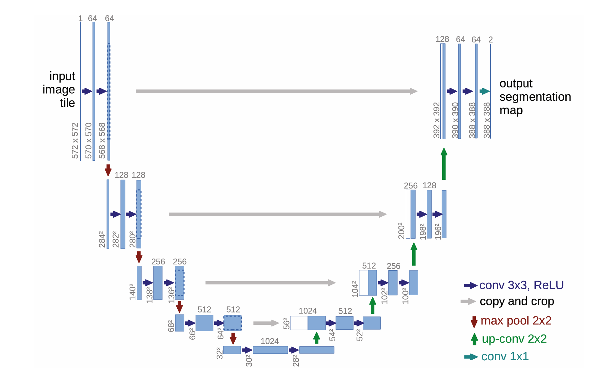
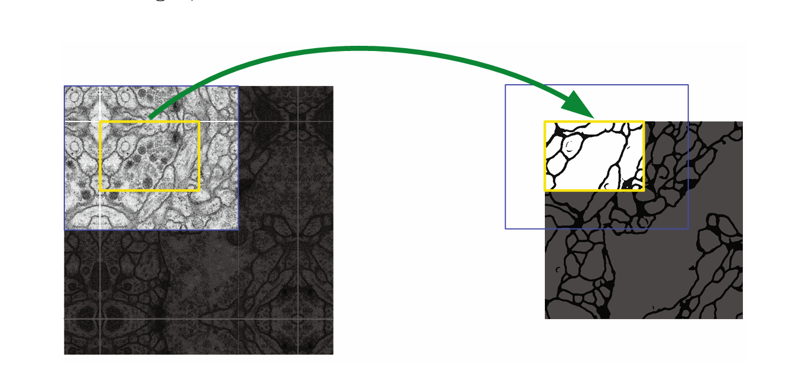
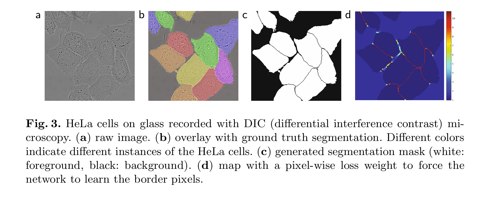

[toc]

##  语义分割

`在图像分割任务中，图像的语义信息指的是图像中不同区域或像素的含义或类别。这些类别通常是在训练数据中定义的，例如人、车、狗、树等。图像分割的目标是**为图像中的每个像素分配一个语义类别**，从而将图像分解成不同的对象或区域。` 

## U-net

### 模型结构

encoder-decoder结构

左边：encoder，下采样，特征提取

下采样：`比如池化操作，在最大池化层对原图像尺寸进行缩小的时候，就是用更少的编码信息来描述原图像，即获得了更加抽象的图片信息。这些低分辨率的feature maps反映了像素级的语义信息，我的理解为每个像素打上了类别标签。`

右边：decoder，上采样，接收左边跳跃连接，最后输出分割图

`将原来的浅层位置信息（每个像素对应回图片的位置）和深层的语义信息（由Encoder模块提取，每个像素的类别）进行融合`

`跳跃连接目的；下采样会损失一些信息，连接以保留更多的位置和细节信息`

不同颜色箭头对应操作的类型

论文中卷积层没有padding，所以尺寸减小。stride为1

没有加BN

`讲解的时候就是，左边maxpooling，然后3*3卷积层，这样重复几次。右边是上采样，然后concat拼接左边的跳跃连接，然后3*3卷积层融合通道。最后1*1卷积输出，分割成前景和背景，就两个通道。现在主流的实现方式是加padding和加BN`

### Fig 2

Overlap-tile

`Fig2中提到，高分辨率的图像直接放进显存可能放不下，可以把图片分割了放。 overlap是为了不丢失分割处的信息。 注意画图演示一下后面的tile跟前面重叠，然后边缘部分需要镜像（演示时说出来沿着哪条中心线对称）。`

`我也在想是不是因为这样作者才在卷积时不用padiing 因为特征融合那里对原图边缘切割了，相当于切掉了外围镜像`

### Fig 3

`也是一个novelty。在细胞分割时，给细胞之间的像素更大的损失权重`

### loss function

#### softmax

$p_k(x)=\exp(a_k(x))/\left(\sum_{k^{\prime}=1}^K\exp(a_{k^{\prime}}(x))\right)$

$a_k(x)$：feature map的第k个channel的第x个像素（x是二维特征图中第一个像素）的激活值

$K$：类别总数，即像素对应的类别数

$p_k(x)$：第k个通道的第x个像素对应的概率，pkx越大，说明这个x像素属于k类别的可能越大

#### loss function

公式：

$ E = \sum_{x \in \Omega} w(x) \log(p_{\ell}(x)) $

是交叉熵损失函数的一个实例，其中：

- \( E \) 表示损失函数的值，它是所有像素位置损失的总和。
- \( x \) 是像素位置，\($ \Omega $\) 是图像中所有像素位置的集合。
-  w(x) ：权重函数，用于为不同位置的像素分配不同的权重，反映某些像素在训练中的重要性。
- $p_{\ell}(x)$ ：Soft-max函数输出的概率，表示在位置  x 处像素属于真实标签 $\ell$ 的概率。
- $ \ell  $：是每个像素的真实标签，$( \ell : \Omega \rightarrow \{1, ..., K\} ) $表示将每个像素位置映射到类别标签。

`这个损失函数计算了所有像素位置上的损失，其中权重 \( w(x) \) 可以用于增强某些像素的重要性，例如边界像素或难以分割的区域。权重 \( w(x) \) 的引入是为了解决类别不平衡或强调模型需要更精确学习的区域。`

`用的交叉熵`

#### 权重的计算

分离边界是通过形态学运算计算得出的

原文中提到的计算w的公式：

$ w(x) = w_c(x) + w_0 \cdot \exp\left(-\frac{(d_1(x) + d2(x))^2}{2\sigma^2}\right) $

这个公式用于计算每个像素位置 \( x \) 的权重 \( w(x) \)，其中：

- $( w_c(x) ) $是用于平衡类别频率的权重图。
- $( w_0 ) $是一个常数，用于控制下一项对总权重的贡献。
- $( d_1(x) ) $是像素 \( x \) 到最近细胞边界的距离。
- $( d_2(x) ) $是像素 \( x \) 到第二近细胞边界的距离。
- $( \sigma ) $是一个参数，用于控制高斯分布的宽度，影响权重的分布。

这个公式的目的是为每个像素位置 \( x \) 分配一个权重，这样那些位于细胞接触边界附近的像素会有更高的权重。权重图 \( w(x) \) 通过结合 \( $w_c(x) $\) 和一个基于像素距离的高斯加权项来计算。高斯加权项确保了那些位于细胞边界附近的像素（\( $d_1(x)$ \) 和 \( $d_2(x)$ \) 小的像素）会被赋予更大的权重，从而在训练过程中更加强调这些区域的学习。这种方法有助于网络更好地学习区分接触的细胞，因为这些区域在图像分割中往往更加困难。

`Wc(x)是对于类别预先设置的权重，这里可以是不同的细胞不同的权重，血管分割的话就是前景和背景两个类别。W0是一个常数，控制后面形似正态分布的这一项的权重。然后d1和d2就是衡量到第一第二近的细胞的距离的。距离大则负得多则权重小。反之...		然后可以展示下热力图`

### 总结

**背景：**

- 深度学习在视觉识别任务中取得了显著的成功，但在生物医学图像分割领域，由于可用的标注样本数量有限，训练大型网络面临挑战。

**动机（Motivation）：**
- 生物医学图像分割对于理解复杂的生物结构至关重要，但通常缺乏大量精确标注的训练数据。因此，需要一种能够高效利用有限数据的网络架构。

**优点：**
1. **高效的数据利用**：通过数据增强技术，尤其是弹性变形，U-Net能够使用较少的标注样本进行有效训练。
2. **快速的分割速度**：U-Net能够在现代GPU上快速完成图像的分割任务。
3. **高精度的分割结果**：在多个生物医学图像分割挑战中取得了优异的成绩，超越了以往的方法。
4. **无缝分割大型图像**：通过重叠平铺策略，U-Net能够处理超出GPU内存限制的大型图像。

**创新点（Novelty）：**
1. **U形架构**：结合了收缩路径和对称的扩展路径，有效结合了上下文信息和精确定位。
2. **跳跃连接**：通过跳跃连接，网络能够在上采样过程中重用低层特征，增强了分割的细节信息。
3. **加权损失函数**：引入了加权损失函数，强调了接触细胞之间的边界，提高了分割的准确性。

**贡献（Contribution）：**
1. 提供了一种新的网络架构，适用于生物医学图像分割，尤其是在样本数量受限的情况下。
2. 开源了基于Caffe的完整实现和预训练网络，方便研究者和开发者使用和进一步研究。
3. 在多个公开的数据集上验证了U-Net的有效性，为生物医学图像分割领域提供了新的基准。

**缺点：**
- 文档中没有明确指出U-Net的缺点。然而，通常任何方法都可能有局限性，例如对某些特定类型的图像或噪声水平可能不够鲁棒，或者在某些情况下可能需要调整架构以适应不同的分割任务。

U-Net的提出是为了解决生物医学图像分割中标注数据稀缺的问题，并通过其创新的网络设计和策略，在该领域取得了显著的成果。

