[toc]

## 机器学习

### 监督/无监督学习

监督学习：使用标记 数据集 来训练算法，以便对数据进行分类或准确预测结果。

无监督学习：无监督学习是训练机器使用既未分类也未标记的数据的方法。这意味着无法提供训练数据，机器只能自行学习。机器必须能够对数据进行分类，而无需事先提供任何有关数据的信息。

[监督学习or无监督学习？这个问题必须搞清楚 - 知乎 (zhihu.com)](https://zhuanlan.zhihu.com/p/137042059)

### 符号

$(x^{(i)},y^{(i)})$：训练集中第i个输入x和第i个输出y

$\hat{y}$：预测出的y

m：训练集样本数量

### 超平面

 

 

[超平面（Hyperplane）浅谈 - 知乎 (zhihu.com)](https://zhuanlan.zhihu.com/p/263604941)


就是y，x这些换成x向量了了，如p1中w1，w2对应的A，B，x向量对应x，y

### Loss

#### 线性回归的代价函数

$J = \frac{1}{2m}\sum\limits_{i=1}^{m} (\hat{y} - y^{(i)})^2$

平方误差成本，即预测值和真实值差距的平方求个和再除以2m： 

#### 等高线图看代价函数


等高线中心对应最小的J， 

#### 均方误差

只看蓝色线和橙色线，蓝色线是l对y-y‘的函数，橙色线是梯度

坏处是远离原点的地方梯度下降太快，可能不稳定

 

#### L1 loss

好处是梯度一直很稳定

坏处是原点附近突变

 

#### huber-robust

取上面两个

 

### 降低舍入误差的方法

舍入误差即浮点数带来的误差，from_logits参数设置为true可以降低该误差


### 梯度下降

每一次把所有m个样本全部拿来算d_wi和d_b，然后更新wi和b，如指定迭代次数为n，则迭代n次后停止，或者设置其它来停止


主要看jupyter

虽然晓得了一元线性回归怎么求，但是实际上可以用梯度下降迭代出来。

学习率alpha，w和b的初始值，迭代次数是给定的，具体看吴恩达代码


二维上就是，对函数在x的位置求导，如果导数为正数则后退，负数则前进（都是下降，跟下梯子一样，所以梯度），慢慢蹭过去，从而找到一个函数的最小值（Loss函数）

多维上就是对w求导，即对w向量的每个分量求偏导

#### 学习率 

$\alpha$：学习率（$0<\alpha<1$）
所以不管某处偏导是正的还是负的，都是下降


随着梯度的下降，偏导数也变小，所以即使alpha固定影响也不大


#### 实现

$J = \frac{1}{2m}\sum\limits_{i=1}^{m} (f_{w,b}(x^{(i)}) - y^{(i)})^2$
$$
\begin{align*} \text{repeat}&\text{ until convergence:} \; \lbrace \newline
\;  w &= w -  \alpha \frac{\partial J(w,b)}{\partial w} \tag{3}  \; \newline 
 b &= b -  \alpha \frac{\partial J(w,b)}{\partial b}  \newline \rbrace
\end{align*}
$$


$$
\begin{align}
\frac{\partial J(w,b)}{\partial w}  &= \frac{1}{m} \sum\limits_{i = 0}^{m-1} (f_{w,b}(x^{(i)}) - y^{(i)})x^{(i)} \tag{4}\\
  \frac{\partial J(w,b)}{\partial b}  &= \frac{1}{m} \sum\limits_{i = 0}^{m-1} (f_{w,b}(x^{(i)}) - y^{(i)}) \tag{5}\\
\end{align}
$$
因为是对w和b求偏导，所以xi，yi是定值无所谓的

### 符号

$x_j$：第j个特征

n：特征总数

$x^{(i)}$：第i个输入的特征向量

 

箭头强调x是向量

### 多元线性回归

**Compute Cost With Multiple Variables**

The equation for the cost function with multiple variables $J(\mathbf{w},b)$ is:
$$J(\mathbf{w},b) = \frac{1}{2m} \sum\limits_{i = 0}^{m-1} (f_{\mathbf{w},b}(\mathbf{x}^{(i)}) - y^{(i)})^2 \tag{3}$$ 
where:
$$ f_{\mathbf{w},b}(\mathbf{x}^{(i)}) = \mathbf{w} \cdot \mathbf{x}^{(i)} + b  \tag{4} $$ 


In contrast to previous labs, $\mathbf{w}$ and $\mathbf{x}^{(i)}$ are vectors rather than scalars supporting multiple features.


**Gradient Descent With Multiple Variables**

Gradient descent for multiple variables:

$$\begin{align*} \text{repeat}&\text{ until convergence:} \; \lbrace \newline\;
& w_j = w_j -  \alpha \frac{\partial J(\mathbf{w},b)}{\partial w_j} \tag{5}  \; & \text{for j = 0..n-1}\newline
&b\ \ = b -  \alpha \frac{\partial J(\mathbf{w},b)}{\partial b}  \newline \rbrace
\end{align*}$$

where, n is the number of features, parameters $w_j$,  $b$, are updated simultaneously and where  

$$
\frac{\partial J(\mathbf{w},b)}{\partial w_j}  &= \frac{1}{m} \sum\limits_{i = 0}^{m-1} (f_{\mathbf{w},b}(\mathbf{x}^{(i)}) - y^{(i)})x_{j}^{(i)} \tag{6}  \\
\frac{\partial J(\mathbf{w},b)}{\partial b}  &= \frac{1}{m} \sum\limits_{i = 0}^{m-1} (f_{\mathbf{w},b}(\mathbf{x}^{(i)}) - y^{(i)})
$$
* m is the number of training examples in the data set

*  $f_{\mathbf{w},b}(\mathbf{x}^{(i)})$ is the model's prediction, while $y^{(i)}$ is the target value


就是对每个w向量分量求偏导，然后梯度下降

### 特征缩放

作用：使梯度下降更快

对于根据卧室数量和房屋平方来预测房价的线性模型，如果没有标准化特征，那么卧室数量的w0很大，房屋面积的w1很小，所以w1微小的变化对成本函数J的影响就很大，反正就是不好（因为w1小则导数大，实际影响感觉不会很大。。。）

但是查到的：多数的[分类器](https://baike.baidu.com/item/分类器/0?fromModule=lemma_inlink)利用两点间的距离计算两点的差异，若其中一 个特征具有非常广的范围，那两点间的差异就会被该特征左右


 

就是标准化x，使得每个x分量都在0-1之间

#### 均值归一化

 

#### Z-score


$\sigma$：标准差

#### 不同的缩放情况


### 判断梯度下降是否收敛

1. 看图，代价函数J随w，b迭代次数不动时就收敛
2. 设置一个epsilon，是某个小的值如0.001，J随迭代次数变化的值小于epsilon时就判断为收敛（很难找到合适的epsilon，不推荐）

### sigmoid function

将原来f的值映射到0 - 1之间，还是通过改变w和b的大小来拟合

Logistic Regression

 A logistic regression model applies the sigmoid to the familiar linear regression model as shown below:

$$ f_{\mathbf{w},b}(\mathbf{x}^{(i)}) = g(\mathbf{w} \cdot \mathbf{x}^{(i)} + b ) \tag{2} $$ 

  where

  $g(z) = \frac{1}{1+e^{-z}}\tag{3}$


### 函数

类似上面sigmoid函数里面的g(z)

### 逻辑回归loss function

#### Logistic Loss Function

选择这个loss函数，如y实际为1，但预测接近0的时候损失函数就非常非常大，如果预测也接近1，那么就很小（为什么选这个loss函数还是不清楚）


 

 

 

Logistic Regression uses a loss function more suited to the task of categorization where the target is 0 or 1 rather than any number. 

>**Definition Note:**   In this course, these definitions are used:  
>**Loss** is a measure of the difference of a single example to its target value while the  
>**Cost** is a measure of the losses over the training set


This is defined: 
* $loss(f_{\mathbf{w},b}(\mathbf{x}^{(i)}), y^{(i)})$ is the cost for a single data point, which is:

$$

$$


*  $f_{\mathbf{w},b}(\mathbf{x}^{(i)})$ is the model's prediction, while $y^{(i)}$ is the target value.

*  $f_{\mathbf{w},b}(\mathbf{x}^{(i)}) = g(\mathbf{w} \cdot\mathbf{x}^{(i)}+b)$ where function $g$ is the sigmoid function.

The defining feature of this loss function is the fact that it uses two separate curves. One for the case when the target is zero or ($y=0$) and another for when the target is one ($y=1$). Combined, these curves provide the behavior useful for a loss function, namely, being zero when the prediction matches the target and rapidly increasing in value as the prediction differs from the target. Consider the curves below:

可以简化为：

**逻辑回归的损失函数：**

$$loss(f_{\mathbf{w},b}(\mathbf{x}^{(i)}), y^{(i)}) = (-y^{(i)} \log\left(f_{\mathbf{w},b}\left( \mathbf{x}^{(i)} \right) \right) - \left( 1 - y^{(i)}\right) \log \left( 1 - f_{\mathbf{w},b}\left( \mathbf{x}^{(i)} \right) \right)$$

**注意：**

这里的f(w,b)函数为$f_{\mathbf{w},b}(\mathbf{x}^{(i)}) = g(\mathbf{w} \cdot\mathbf{x}^{(i)}+b)$ ，不是$\mathbf{w} \cdot\mathbf{x}^{(i)}+b$，求导的时候要带入sigmoid求导

#### sigmoid函数求导的特殊处

 

#### 求导过程

[机器学习——逻辑斯特回归（包含梯度下降推导） - 知乎 (zhihu.com)](https://zhuanlan.zhihu.com/p/109045510)

最后形式跟线性回归一模一样，但是

**注意：**

这里的f(w,b)函数为$f_{\mathbf{w},b}(\mathbf{x}^{(i)}) = g(\mathbf{w} \cdot\mathbf{x}^{(i)}+b)$ ，不是$\mathbf{w} \cdot\mathbf{x}^{(i)}+b$

#### 对w和b的偏导

$$\begin{align*}
\frac{\partial J(\mathbf{w},b)}{\partial w_j}  &= \frac{1}{m} \sum\limits_{i = 0}^{m-1} (f_{\mathbf{w},b}(\mathbf{x}^{(i)}) - y^{(i)})x_{j}^{(i)}  +  \frac{\lambda}{m} w_j  \\
\frac{\partial J(\mathbf{w},b)}{\partial b}  &= \frac{1}{m} \sum\limits_{i = 0}^{m-1} (f_{\mathbf{w},b}(\mathbf{x}^{(i)}) - y^{(i)}) 
\end{align*}$$

与线性回归一样，仅f(w,b)函数意义变化，此处增加了正则项

### 逻辑边界


g(z)的z == 0时，说明预测的y为1和0的概率各位50%，所以z = wx + b = 0时在图上对应的线为逻辑边界

### 过拟合和欠拟合

#### 预测

欠拟合：效果不好（左）

过拟合：在训练集效果特别好，但是可能不适用于其它值（右）


#### 分类

左边一次式逻辑边界为直线，欠拟合

中间二次式逻辑边界为椭圆，拟合得好

右边高次式逻辑边界可能完美包含了每个不同类别的，但是过拟合


#### 防止过拟合和正则化

1. 增多训练样本m
2. 减少特征向量的特征数（就没有那么多w了）
3. 正则化：通过让部分的w变小，从而达到近似于退化成第2种方法减少特征向量的特征数的效果，但是又没有完全失去这些特征

**正则化：**

线性回归的正则化式：

$$J(\mathbf{w},b) = \frac{1}{2m} \sum\limits_{i = 0}^{m-1} (f_{\mathbf{w},b}(\mathbf{x}^{(i)}) - y^{(i)})^2  + \frac{\lambda}{2m}  \sum_{j=0}^{n-1} w_j^2 \tag{1}$$ 

添加正则化项后，代价函数对该权重的偏导变大，即dj/dw变大。所以w更新时，即w=w-a(dJ/dw)时，w会变得更小，lambda是控制正则化的参数，类似学习率（lambda越大每次迭代后对应的w会更小），除以2m是为了在样本数量m变化时lambda能继续适用

多的lambda这项叫正则化项

#### 硬性限制

限制w的二范数平方来限制模型容量


#### 柔性限制

吴恩达讲的那种，lambda越大，则梯度对w关联越强，会使得w变小


#### 正则项的作用

罚项，即正则项，倾向于把最优解的点往原点拉（此处例子为y轴是w2，x轴是w1）

越靠近原点，LOSS对于罚项的导数越小，梯度就越小，越靠近原来LOSS的中心（绿圈中心），LOSS对于原来LOSS的导数就越小，梯度越小，二者为了平衡，罚项会把原来LOSS的最优点拉向原点，即会让模型的w值变小，降低模型复杂度


####  权重衰退

加入罚项后，W更新时原来的更新方式（李沐红字）变为了下面的形式，即将上面新梯度带入下面红字式子后整理得到的，多出1-ηλ的因数，

权重衰退通过L2正则项使得模型参数不会过大，从而控制模型复杂度


 

## 深度学习基本

分为三种

1. 输入层x
2. 隐藏层
3. 输出层y

每一个圆代表一个神经元，是由上一层的神经元推导来的，其上一层每个神经元对它的值的影响不同，权重不同，多次训练后权重逐渐变化

隐藏层可以有很多


### epoch iteration

https://blog.csdn.net/lcczzu/article/details/89259193

### 3B1B的例子

  

如单个数字识别的神经网络，对于28\*28的图像，可以拆成784个神经元作为输入训练的X中的一个向量，然后最后希望得到的是0-9中的某个神经元被激活（即对应的输出0-1的值很大（这里可以用sigmoid作为激活函数）），而上一层则神经元对应的是圈圈或竖线这种笔画，如9有圈圈，则圈圈对应的神经元激活的值很大，并且最后9激活的值也很大

  

对于每个输入的像素灰度构成的输入向量，那么第一层的每个神经元可以对应一个短边。如7的顶上的短边，重点关注的像素为红色和绿色区域，那么其它区域的像素可以赋值为0。对于wi，红色赋值为负数，绿色赋值为正数，此时输入784个灰度值，计算出w和输入的a的值，再通过sigmoid函数激活得到该图像存在这条短边的概率。

#### 偏置

如果不想加权和为正数就激发神经元，而是要大于10才激发，可以设置偏置
  

####  整理输出成矩阵乘法形式

 $a_i^{(0)}$是每个像素的灰度值输入，对应每个神经元都有w  

 

#### 神经元的理解

把神经元看作一个函数，输入是上一层所有神经元产生的输出，输出是0-1的值（如果激活函数是sigmoid）

#### ReLU和sigmoid

2017年用ReLU比较多

ReLU：

g(z) = max(0, z)

[深度学习笔记：如何理解激活函数？（附常用激活函数） - 知乎 (zhihu.com)](https://zhuanlan.zhihu.com/p/364620596)

#### cost function 和loss function

cost function：总体样本

loss function：单个样本

#### 反向传播

 

对于一开始每个神经元随机的w和b，如例子是输入一个形状像2的图片（即它的灰度值），现在0-9的激活值如右图。想要让2的激活值变大，其它变小，有三种方法：

1. 增大最后一层2的激活函数的偏置值b
2. 增大最后一层2的神经元中为正的值的w，减小最后一层2的神经元中为负的值的w
3. 改变倒数第二层的输入的ai

反向传播就是主要是第3种方法，对于每个最后一层激活的神经元，比如这次正确的是2，那么2的每个为正的w对应的上一层神经元（w对应ai，ai来自的那个上一层的神经元）就应该增大，对于负的则应该减小。同时对于其它9个值，每个为正的w对应的神经元就应该减小，为负的则应该增大（减少错误的本层神经元的激活值）

对上图中的大小箭头的解释：

​	如对于2来说，上一层激活值越大的神经元（越亮的神经元）对应的w改变同样的大小，对于2来说增加的激活值就比较暗的神经元对应的w大，所以应该重点增大对应的上一层激活值大的神经元对应的本层的w

 

左边所有值加起来，得到右边的对每个上一层的激活值应该调整的大小


 

每一轮迭代就是，根据下一层反向传播来的本层神经元应该变大或变小的指示（最后一层已知，每次输入的时候就知道要激活的目标神经元是哪个），对本层的每个神经元的各个w进行修改

如上面2 5 0 4 1 9 这6个数字图片对2的神经元的各个w的修改指示如上，最后要取个平均

#### 反向传播导数解释

 

符号：

$a_j^{(L)}$：第L层的第j个神经元的激活值

$y_i$：下一层希望这层的第j个神经元输出的0或1的值

$a_k^{(L-1)}$：第L-1层的第k个神经元的激活值

$w_{jk}^{L}$：第L层的第j个神经元的第k个w权重，对应$a_k^{(L-1)}$

$C_0$：第0个样本在第L层训练产生的代价，采用均方误差统计

$z_j^{L}$：对于L层的第j个神经元，线性计算出的要放在激活函数里的值

$n_L$：第L层的神经元数量

 

计算出$C_i$后，累加出C，然后C再对每个$w_{ij}$求偏导，然后$w_{ij}$在用学习率梯度下降，对b的梯度下降就是C对每个b求偏导即可。那么L层的w和b都知道怎么修正了。


 

对于L-1层的w和b，如上图求出$C_0$对$a_k^{(L-1)}$的偏导后，可以再求$a_k^{(L-1)}$对$w_{jk}^{L-1}$的偏导，从而得到对应的修正

求L-2，则是再求$a_k^{(L-1)}$对$z_j^{L-1}$的偏导，再求$z_j^{L-1}$对$a_k^{(L-2)}$的偏导，然后重复上面的步骤，得到L-2层的修正


**对单个w求导**

第一行好懂，直接照着上面式子推（第一行是下下张图片的第一行）

第二行是，总成本C对第l层第j个神经元的偏导

$n_{l+1}$是第l+1层的神经元数量

应修正$w_{jk}^{l+1}$为$w_{kj}^{l+1}$，第l+1层的第k个神经元的第j个w权重（对应$a_j^{l}$）

整个式子是C对$a_j^{l+1}$求偏导，然后$a_j^{l+1}$对$z_j^{l+1}$求偏导（即激活函数的导数），再是$z_j^{l+1}$对$a_j^{(l)}$求偏导即$w_{kj}^{l+1}$

最后$a_j^{l}$因为要传播到下一层所有单元去，所以对下一层所有神经元产生的该项求和（这里有点没解释明白，反正由下图来的，弹幕说多元偏导数，分叉要相加）

 

对于最后一层是or下面的式子

 


#### minibatch

每次迭代的时候，将所有样本打乱，然后取出其中部分个样本作为一个minibatch来计算梯度，减少计算量

### 层之间的关系


比如layer1的输出结果为向量[197,184,136,214]，layer1的结果作为layer2的输入，然后对于layer2的每个神经元w就有4个，然后分别输出一个值（这里根据sigmoid函数输出），这些值形成向量a[0.3,0.7,0.2]又作为下一层的输入

### 向前传播

一层一层地向前传播，上一层的输出作为下一层的输入，通常神经元数量逐层减少

 

### 代码实现

主要看jupyter

主要讲了在已经设置了w和b的参数的情况下，怎么用tensorflow预测

如

```python
model = Sequential(
    [
        tf.keras.layers.Dense(1, input_dim=1,  activation = 'sigmoid', name='L1')
    ]
)
```

这段代码是使用TensorFlow创建了一个包含逻辑回归层的模型，用于实现一个"逻辑神经元"。

首先，我们使用`tf.keras.layers.Dense`来创建一个密集层（全连接层）。在这里，我们设置该层的参数如下：

- `1`：表示该层输出的维度为1，即只有一个输出节点。
- `input_dim=1`：表示输入的维度为1，即只有一个输入特征。
- `activation='sigmoid'`：表示激活函数为sigmoid函数，即将输出压缩到0到1之间的概率值。

接下来，我们使用`Sequential`模型来包含这个逻辑回归层，以构建整个模型。`Sequential`模型是TensorFlow中一种方便的创建多层模型的方法。

通过这段代码，我们创建了一个TensorFlow模型，其中包含一个逻辑回归层。这个模型可以用于二分类任务，通过输入一个特征，输出一个0到1之间的概率值，表示属于正类的概率。

### 实现


输入的x的单个输入维度一般是大于25的，dense自动给x整x维度个的w


dense和sequential函数的简单实现

此处w，b，和sequential的参数都是写死的


### 反向传播

 

tensorflow里调fit函数，设置epochs则为梯度下降迭代次数

## activation函数

activation：激活值，如图像识别里面每个像素的灰度值可以作为activation值

不只有sigmoid函数，还可以ReLU

 

### 激活函数的选择

二分类问题首选sigmoid

ReLU比sigmoid的优势：

1. 计算快，sigmoid要额外取幂取倒数等等
2. sigmoid两边平坦，不利于梯度下降，计算慢

### 为什么需要激活函数

如果多个层之间的激活函数为线性函数，那么其实这多个层没有存在的意义，wx+b嵌套过后还是等于一个线性回归

## softmax

是逻辑回归的泛化，如指定分类成4种，那么$z_i$为第i种可能的线性函数，激活得到的结果$a_i$表示分类为第i种情况的可能性（百分比）

激活式子如右侧（无明确的解释）

通项为左下角的$a_j$

 

### 交叉熵

yi是真实概率的向量，yi-hat是预测概率的向量，交叉熵来衡量真实概率和预测概率之间的差距

因为此处y为一个one-hot编码，所以其实可以不管为0的部分，简写为对真实的y对应的预测的y-hat那个神经元的概率，求对数然后取负数

（$y_y$是1，所以省了）

 

实际上用的log的底数是e，是ln


### loss function

如实际y = 2，那么对于这个样本得到的loss为-loga2，总的成本函数J = (w,b)为所有loss的平均，即图中左下角

 

### 多分类与多标签分类的区别

多分类：一个输出可能是多个类中的一个，输出值为每个类的概率

多标签分类：一个输入，如一张图有橘子、苹果、香蕉，检测图中有哪些类，输出图中有的标签的概率

## 学习率优化

Adagrad、RMSprop、Adam等算法产生自适应学习率


## 交叉验证

### 泛化误差

泛化误差用来衡量一个学习机器推广未知数据的能力，如训练集上效果好，测试集上效果也好，泛化误差就小

### 例子

 

通过训练集，得到模型w，b

再通过测试集依次验证x为哪个维度的测试集误差最小，如果此时测出来5最小，那么选择5

但是没有结束！！！

因为对于模型的泛化，此时只是对于测试集来说误差很小，效果很好，此时的测试集就是检测泛化误差的训练集，所以还需要额外增加一个检测的数据集（称为交叉验证集）

用交叉验证集选出合适的维度，然后用测试集评估模型的泛化能力

 

验证数据集：确定超参数（学习率等等）

测试数据集：评估模型的泛化能力（只能用一次，不能用测试集结果来调参）

### K-则交叉验证

 

分成K块，计算K次，每次第i块作为验证集

### VC维

对于一个分类模型，VC等于一个最大的数据集的大小，不管如何给定标号，都存在一一个模型来对它进行完美分类


## weight decay

https://blog.csdn.net/zhaohongfei_358/article/details/129625803


## optimizer


梯度下降算法的参数更新方式取决于所使用的训练策略，主要有以下几种：

1. **批量梯度下降（Batch Gradient Descent）**：在这种方法中，模型参数的更新是在整个数据集上计算梯度后进行的。这意味着只有当整个数据集被遍历一次后，模型参数才会更新一次。
2. **随机梯度下降（Stochastic Gradient Descent, SGD）**：与批量梯度下降不同，随机梯度下降在每次训练一个样本后就会更新模型参数。这种方法的优点是可以在训练过程中快速适应数据的变化，但可能会导致训练过程不稳定。
3. **小批量梯度下降（Mini-batch Gradient Descent）**：这是一种折中的方法。它不是使用整个数据集，也不是单个样本，而是使用一个小批量的样本（batch）来计算梯度并更新模型参数。小批量的大小可以根据具体问题和计算资源进行调整。这种方法结合了批量梯度下降的稳定性和随机梯度下降的快速适应性。


### SGD

理想中是一个epoch对所有样本求导算梯度，但是计算量太麻烦，随机抽一个就行了。虽然随机，但是总的期望是一样的，是无偏的估计

全部梯度下降就是第一个式子

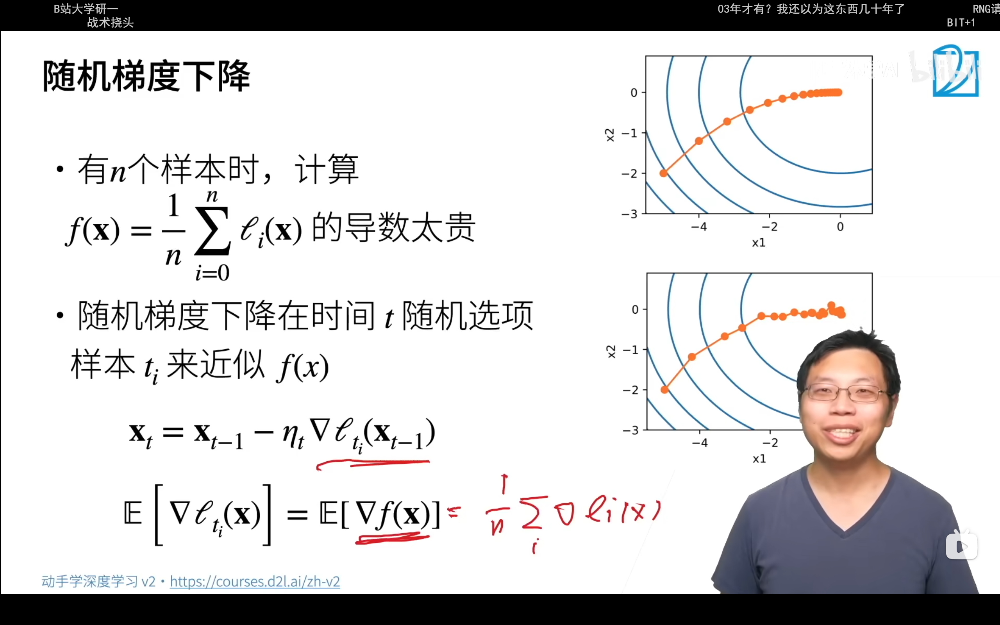

[随机梯度下降（stochastic gradient descent，SGD） - 知乎](https://zhuanlan.zhihu.com/p/357963858)

### 小批量随机梯度下降


### 指数优化平均


### momentum动量梯度下降

用了指数优化平均的思想，防止梯度过大震荡

Vw作为权重要减去的值

Vw更新由上一次的Vw和当前梯度得到


### RMSProp

防止每个参数的梯度大小不一样


### Adam

以上二者结合，更加平滑的优化器


第三行级数，beta1的i次方


[优化器介绍—SGD、Adam、Adagrad_adam和sgd-CSDN博客](https://blog.csdn.net/qq_36693723/article/details/130266578)

梯度大则动量占比小（学习率小，更新小），梯度小则相反

## 学习率

### 余弦退火

[学习率衰减之余弦退火(CosineAnnealing）-CSDN博客](https://blog.csdn.net/weixin_35848967/article/details/108493217)

每运行一定epoch后重启，使得学习率变大（为了跳出局部最优，退火），然后按余弦函数减小


## 丢弃法

 


在深度学习中，Dropout 是一种正则化技术，用于防止神经网络过拟合。Dropout 的基本思想是在训练过程中随机地丢弃（即暂时移除）网络中的一些神经元，包括它们的权重和偏置项，从而使得网络在每次训练迭代中都略有不同。Dropout 的主要作用包括：

1. **防止过拟合**：通过随机丢弃神经元，Dropout 减少了神经元之间复杂的共适应关系，使得单个神经元不能对训练数据过度依赖，从而提高模型的泛化能力。
2. **噪声注入**：Dropout 为网络引入了噪声，迫使网络学习更加鲁棒的特征表示，这些特征不依赖于任何单一的神经元。


SGD中使用 Dropout 时，梯度传播会中断。当某个神经元被丢弃时，它在前向传播中不会参与计算，因此在反向传播中也不会接收到梯度。这意味着与该神经元相连的上一层神经元的权重（即 𝑤）在这次迭代中不会更新。


 

## 梯度爆炸和梯度消失

网络过深的话，那么损失函数对较浅层的w的偏导会非常大或非常小


称为梯度爆炸和梯度消失


对于一个多层感知机：

$h^{t-1}$是第t-1层的输出，作为t层的输入，用了个链式求导就得到第二个式子

Wi不用转置,PPT错了


### 梯度爆炸

如对于relu


前面$\sigma$那一坨是一个对角阵，对角线上只有0，1。最后相当于会舍去一些行

### 梯度消失


## 数值稳定性和模型初始化

目标：让每层的梯度值都在合理的范围内


大概方法：


例子： 

首先是W(t,i,j)的含义，t指的是网络中间的t层，i指的是t层的神经元的标号，j指的是t-1层神经元的标号

$\gamma_t$是t层的输出ht的方差，即每个神经元输出值的方差


由于要控制每层输入和输出的方差，经如上式推理，得到$n_{t-1}\gamma_t = 1$，因为看最后一行的式子，项数$n_{t-1}\gamma_t$必须为1才满足


反向推一遍也能得到一个对$n_{t}和\gamma_t$的约束（没推，不晓得是不是）


在初始化时人为给定每一层的w的方差$\gamma _t$，就可以使得正向传播和反向传播时各层的输出（ht）的方差一致（可以看上面的那几张图）

然后如下图，可以选择用正态分布或者均匀分布来初始化第t层的w的值（根据nt和nt-1）

### xavier初始


总结就是，对于第t层，权重w初始化时的期望全弄成0（用torch里面调xx分布的库来定），方差可以通过该层和前一层的神经元数量来定（nt为第t层神经元数量）


理论上证明可以得到f(x) = x的激活函数会让每一层的输出的期望为0，方差不变（仍为gamma t）


所以relu比较好


## 卷积CNN

对于输入的X(二维的)到输出的H(二维的)，其中X(i, j)到H(i, j)的变化，跟之前一样，需要每一个H(i, j)与二维的X链接，所以即每一个H(i, j)对应了一张二维矩阵，所以卷积的权重是四维


这里可以理解为，对于一个(i, j)处的H点，需要扫描输入的X来得到输出，V是重新索引k，l，将其替换为a，b，ab可以为负值，来扫描X，方便管理下标


### 平移不变性

图像中有一只猫, 网络识别该猫的权重 不应该随着 猫的位置的改变而改变(即不管猫是在图像的左上角, 右下角, 都应该用一样的权重识别出来, 因为猫的样子没有改变)

*平移不变性*（translation invariance）：不管检测对象出现在图像中的哪个位置，神经网络的前面几层应该对相同的图像区域具有相似的反应，即为“平移不变性”。


### 局部性

*局部性*（locality）：神经网络的前面几层应该只探索输入图像中的局部区域，而不过度在意图像中相隔较远区域的关系，这就是“局部性”原则。最终，可以聚合这些局部特征，以在整个图像级别进行预测。


### 概括

综上就是，原来是每个H(i, j)都有一个完全的、对应每个X矩阵的所有参数的一个二维矩阵（所以原来是四维），现在就是每个H(i, j)都用一个固定的矩阵V（）来对应一定范围内($\Delta$)的X的参数，那个矩阵就是卷积核。


李沐：

卷积神经网络是包含卷积层的一类特殊的神经网络。 在深度学习研究社区中，𝑉被称为*卷积核*（convolution kernel）或者*滤波器*（filter），亦或简单地称之为该卷积层的*权重*，通常该权重是可学习的参数。 当图像处理的局部区域很小时，卷积神经网络与多层感知机的训练差异可能是巨大的：以前，多层感知机可能需要数十亿个参数来表示网络中的一层，而现在卷积神经网络通常只需要几百个参数，而且不需要改变输入或隐藏表示的维数。 参数大幅减少的代价是，我们的特征现在是平移不变的，并且当确定每个隐藏活性值时，每一层只包含局部的信息。 以上所有的权重学习都将依赖于归纳偏置。当这种偏置与现实相符时，我们就能得到样本有效的模型，并且这些模型能很好地泛化到未知数据中。 但如果这偏置与现实不符时，比如当图像不满足平移不变时，我们的模型可能难以拟合我们的训练数据。


### 例子

#### 实例

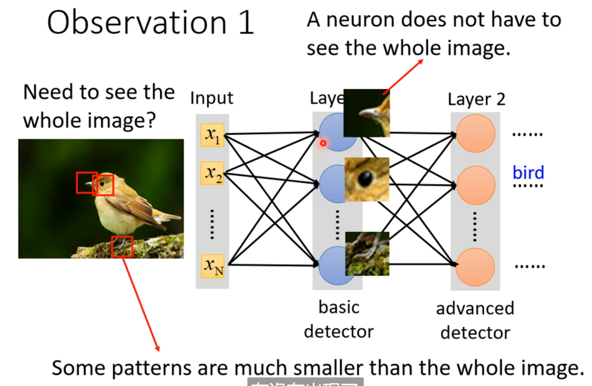

一个kernel对应一个输入通道，一组kernel（一组kernel就是一个filter）对应一个输出通道


深层网络中一个3\*3大小的filter侦测到的内容可能是原图的5\*5或者更多，所以3\*3的kernel也可以侦测到更大的patern


#### 二维交叉相关

对应乘再求和


### 填充

一般填充0

如图，32\*32的图像，5\*5的卷积核，7层就结束了，更深的模型就需要填充


填充大小：


这样填充输出大小也与输入一样

#### 步幅


### 多通道

#### 输入

如输入RGB三种颜色的通道


就是其它不变，分别执行卷积操作，最后再累加得到


#### 输出

i：input

o：output

Ci为RGB那种输入通道的类别，输Co为不同输出通道的类别，Co通常代表每一个输出通道

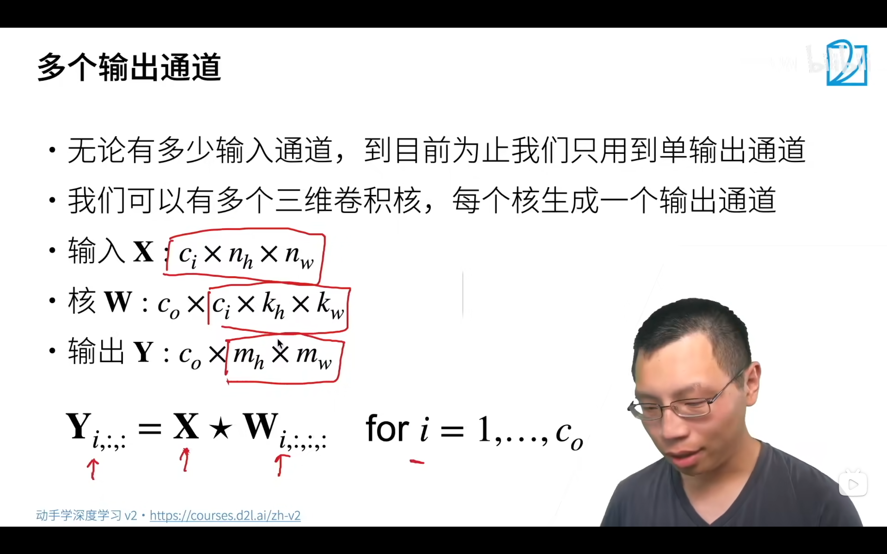

每个输出通道对应一个模式


#### 1\*1卷积层

作用：

##### 融合通道

相当于输入的矩阵扯成Ci条，然后与权重为Ci\*Co的全连接层相乘


##### 与全连接层一样

数学本质上一样，都是特征图中的元素乘以权重再求和。全连接是把特征图拆开组成一个一维向量，再乘以一个权重向量，这两个向量中的元素一一对应所以输出结果是一个值。而1\*1卷积，我们知道卷积核实质上就是权重，1\*1的卷积核那就是表明只由一个权重组成，如果特征图尺寸也是1\*1的话，那输出就是一个值，此时与全连接完全一样。但是如果特征图尺寸不是1\*1，而是w*h的话，那么1\*1的卷积输出就不是一个值而是w*h的一个矩阵。以上是数学本质上的异同。

由于输入有多个，每个卷积核又只对应1个权重（对应一个输入），所以相当于是大小与前一层一样的全连接层

```python
l1 = nn.Linear(5, 5)
c1 = nn.Conv1d(5, 5, 1)
```

如接受5个输入和5个输出的线性层和5个输入通道和5个输出通道的卷积核和特征图都是1\*1的情况下的卷积层，在权重初始化一样的情况下，输出也一样


### 小结


### 代码

#### 交叉相关

```python
def corr2d(X, K):  #@save
    """计算二维互相关运算"""
    h, w = K.shape
    Y = torch.zeros((X.shape[0] - h + 1, X.shape[1] - w + 1))
    for i in range(Y.shape[0]):
        for j in range(Y.shape[1]):
            Y[i, j] = (X[i:i + h, j:j + w] * K).sum()
    return Y
```


#### 卷积层

```python
class Conv2D(nn.Module):
    def __init__(self, kernel_size): # 可以在kernel_size这个参数传一个tuple，例如（3，3），则weight就是3*3的随机初始值了
        super().__init__()
        self.weight = nn.Parameter(torch.rand(kernel_size))
        self.bias = nn.Parameter(torch.zeros(1))

    def forward(self, x):
        return corr2d(x, self.weight) + self.bias
```


## 池化（汇聚）层

防止少量像素偏移导致图像输出大变


步幅大小一般与池化层大小相同

### 不用pooling的时候


pooling就不能用到alpha go上面，毕竟期盼pooling就损失了棋子的信息

### 梯度

[深度学习：Pooling池化操作的反向梯度传播_pooling 梯度-CSDN博客](https://blog.csdn.net/qinghuaci666/article/details/81870750)

## spatial transformer


STN是一个可学习的对图形变换的层，用图形学里面左乘一个一个矩阵来旋转或拉伸


感觉可以理解成通过平移旋转拉伸自动提取出图像中重要的部分


## NiN


要对1000种类别分类，最后全局池化层的输入通道就是1000（与输出通道相等），对每个输入通道的做全局池化（池化的kernel的size等于输入的特征图size），得到1000个值然后softmax

```python
import torch
from torch import nn
from d2l import torch as d2l


def nin_block(in_channels, out_channels, kernel_size, strides, padding):
    return nn.Sequential(
        nn.Conv2d(in_channels, out_channels, kernel_size, strides, padding),
        nn.ReLU(),
        nn.Conv2d(out_channels, out_channels, kernel_size=1), nn.ReLU(),
        nn.Conv2d(out_channels, out_channels, kernel_size=1), nn.ReLU())
```

感觉上两个1\*1的卷积是想把第一个正常卷积识别出的模式，通过另外的权重，让其更贴近准确的模式（利于后续层识别的）

## GoogLenet

### 并行的块


最后在输出通道上连接成一个大张量（维数跟输出通道数对应的大张量）即可

```python
import torch
from torch import nn
from torch.nn import functional as F
from d2l import torch as d2l


class Inception(nn.Module):
    # c1--c4是每条路径的输出通道数
    def __init__(self, in_channels, c1, c2, c3, c4, **kwargs):
        super(Inception, self).__init__(**kwargs)
        # 线路1，单1x1卷积层
        self.p1_1 = nn.Conv2d(in_channels, c1, kernel_size=1)
        # 线路2，1x1卷积层后接3x3卷积层
        self.p2_1 = nn.Conv2d(in_channels, c2[0], kernel_size=1)
        self.p2_2 = nn.Conv2d(c2[0], c2[1], kernel_size=3, padding=1)
        # 线路3，1x1卷积层后接5x5卷积层
        self.p3_1 = nn.Conv2d(in_channels, c3[0], kernel_size=1)
        self.p3_2 = nn.Conv2d(c3[0], c3[1], kernel_size=5, padding=2)
        # 线路4，3x3最大汇聚层后接1x1卷积层
        self.p4_1 = nn.MaxPool2d(kernel_size=3, stride=1, padding=1)
        self.p4_2 = nn.Conv2d(in_channels, c4, kernel_size=1)

    def forward(self, x):
        p1 = F.relu(self.p1_1(x))
        p2 = F.relu(self.p2_2(F.relu(self.p2_1(x))))
        p3 = F.relu(self.p3_2(F.relu(self.p3_1(x))))
        p4 = F.relu(self.p4_2(self.p4_1(x)))
        # 在通道维度上连结输出
        return torch.cat((p1, p2, p3, p4), dim=1)
```


## BN批量归一化

[【基础算法】六问透彻理解BN(Batch Normalization） - 知乎](https://zhuanlan.zhihu.com/p/93643523)

[笔记详情 (bilibili.com)](https://www.bilibili.com/h5/note-app/view?cvid=15375138&pagefrom=comment)

### 假设

- 归一化假设变量分布中的不规则的偏移可能会阻碍网络的收敛

### 问题

- 正向传递的时候，数据是从下往上一步一步往上传递
- 反向传递的时候，数据是从上面往下传递，这时候就会出现问题：梯度在上面的时候比较大，越到下面就越容易变小（因为是n个很小的数进行相乘，越到后面结果就越小，也就是说越靠近数据的，层的梯度就越小）
- 上面的梯度比较大，那么每次更新的时候上面的层就会不断地更新；但是下面层因为梯度比较小，所以对权重的更新就比较少，这样的话就会导致上面的收敛比较快，而下面的收敛比较慢，这样就会导致底层靠近数据的内容（网络所尝试抽取的网络底层的特征：简单的局部边缘、纹理等信息）变化比较慢，上层靠近损失的内容（高层语义信息）收敛比较快，所以每一次底层发生变化，所有的层都得跟着变（底层的信息发生变化就导致上层的权重全部白学了），这样就会导致模型的收敛比较慢

顶部的权重容易较快稳定，底部较慢（因为loss对上面求导值比较大，对下面层求导值比较小，上面收敛较快），如何在学习底部时避免顶部变化


B是minibatch，对一次拿的批量进行如下操作

减均值，除以标准差就是正则化，由原始分布近似限定为均值为0方差为1的正态分布

Xi+1即新的Xi


$\beta$和$\gamma$是可学习的？？？


### LN layer norm

[Transformer中的归一化(五)：Layer Norm的原理和实现 & 为什么Transformer要用LayerNorm - 知乎](https://zhuanlan.zhihu.com/p/492803886)

对于NLP data来说，batch上去做归一化是没啥意义的，因为不同句子的同一位置的分布大概率是不同的。


## ResNet

### 解释

通过加之前的x，至少不会变差

### ResNet块

用1\*1卷积将x的通道数与块中最后一个batch norm的输出通道统一后相加   	还没解释如果块中输出大小不等咋办


### 防止梯度消失

可以看到，黑色那块，如果是残差模型，y有直接来自底层w的大梯度，不会消失


### 代码

```python
class Residual(nn.Module):  #@save
    def __init__(self, input_channels, num_channels,
                 use_1x1conv=False, strides=1):
        super().__init__()
        self.conv1 = nn.Conv2d(input_channels, num_channels,
                               kernel_size=3, padding=1, stride=strides)
        self.conv2 = nn.Conv2d(num_channels, num_channels,
                               kernel_size=3, padding=1)
        if use_1x1conv:
            self.conv3 = nn.Conv2d(input_channels, num_channels,
                                   kernel_size=1, stride=strides) # 这里使得X和Y的通道数一样可以相加
                                                                # 至于形状，kernel_size和padding指定好了，是不会改变的
                                                                # 步长也设置为一样的即strides，所以不会变
        else:
            self.conv3 = None
        self.bn1 = nn.BatchNorm2d(num_channels)
        self.bn2 = nn.BatchNorm2d(num_channels)

    def forward(self, X):
        Y = F.relu(self.bn1(self.conv1(X)))
        Y = self.bn2(self.conv2(Y))
        if self.conv3:
            X = self.conv3(X)
        Y += X
        return F.relu(Y)
```

### bottleneck

https://blog.csdn.net/yangjinyi1314/article/details/124799410

```python
class Bottleneck():
    def __init__(self, c1, c2, shortcut=True, g=1, e=0.5):  # ch_in, ch_out, shortcut, groups, expansion
    
        super(Bottleneck,self).__init__()
        c_ = int(c2 * e)  #hidden channels
        self.cv1 = Conv(c1, c_, 1, 1)
        self.cv2 = Conv(c_, c2, 3, 1, g = g)
        self.add = shortcut and c1==c2
 
    
     def forward(self, x):
         return x + self.cv2(self.cv1(x)) if self.add else self.cv2(self.cv1(x))
 
```

中间通道数少，后面又变回去

## 迁移学习


原有的大数据集上训练的模型的除了最后的线性分类之外的东西可能可以在目标数据集上使用


## 目标检测

主要看看数据集格式，每个数据集可能不一样


不同的数据集可能框的表示不一样：

1. 左上右下
2. 中心点和高宽
3. 左上和高宽

### IOU


### 锚框


矩阵是随机产生的锚框和gt边缘框的IOU值

蓝色为未取出的IOU值，每次取出一个蓝色中最大的值（如第一张图，代表锚框2和边缘框3匹配上），然后删除这两个框的其它IOU值，如此循环来匹配锚框和边缘框

当每个边缘框都匹配上锚框后，现在剩下的锚框可以：

1. 全部看成负例样本（不好的做法）
2. 去看锚框跟哪个边缘框IOU大，再作关联

### NMS


跟dog匹配上的锚框可能很多，去掉其它跟最大值的框的IOU大于theta的框

做法是为了去除冗余框

### ROI兴趣区域池化层


把每个锚框图像通过池化搞成同样的高宽


### FAST RCNN

在CNN对整个图片抽取特征成7\*7或14\*14后再在上面生成锚框


## 语义分割

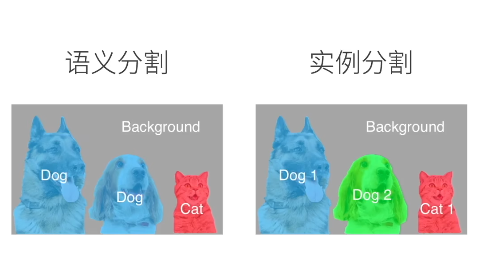


边缘白色，语义内容给RGB颜色，如下：

P1为飞机，P2为显示器等等


如每个像素的RGB对应了它属于的那个类


### dice loss

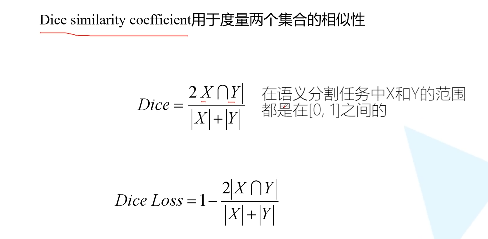

对于训练的情况：

前景（白色的）就全是1，上面就是X中是白的直接取出来求和再乘2，分母就是对两个矩阵求和再相加


对于预测的情况：

直接取大于阈值0.5的为1


## 转置卷积

用kernel分别乘特征图，然后重叠相加，下图中手写蓝色线框为stride = 1，也可以跳两格，如紫色线框，大小由input决定


### 代码

也是跟卷积一样从左上到右下，就是反过来，一个一个累加kernel的值

```python
def trans_conv(X, K):
    h, w = K.shape
    Y = torch.zeros((X.shape[0] + h - 1, X.shape[1] + w - 1))
    for i in range(X.shape[0]):
        for j in range(X.shape[1]):
            Y[i: i + h, j: j + w] += X[i, j] * K
    return Y
```


### 填充

```python
tconv = nn.ConvTranspose2d(1, 1, kernel_size=2, padding=1, bias=False)
tconv.weight.data = K
tconv(X)
```

填充在输出上，padding = 1就是让上下左右都减小一行


### 转置的另一种形式

填充0，步幅1时，等价于填k-1圈0，然后把kernel转置，再做正常卷积


情况2：

例子中p = 1


通常情况：

s = 2，p = 1


### 形状换算

高、宽（这里只举高的例子）：

$H_{out} = (H_{in} - 1) * stride - 2 * padding + kernel\_size$

即k = 2p + s时才会成倍增加（倍增stride倍）


### 双线性插值

[双线性插值(Bilinear Interpol)原理及应用_双边插值-CSDN博客](https://blog.csdn.net/lipengfei0427/article/details/108762204)

就是进行x方向后的插值后得到两个点，再进行y方向的插值（或者交换y、x顺序执行）

### FCN

前面是一个CNN（没有最后的全连接层和全局池化层）。假定输入大小是224\*224，CNN的输出大小是7\*7，用一个1\*1的卷积层融合通道，然后转置卷积，转置卷积的输出通道为k，即k个通道对应k个类别


如对于这里，把预训练的CNN得到的tensor的512层，用一个1\*1的卷积层变为21层的输出，对应类数


由于输出大小是10\*15，目标是320\*480，所以需要放大32倍，上面转置卷积那里，s需要设置成32，其它的k和p的大小凑一个就行


## 样式转移


具体看李沐的代码

### 风格损失

风格损失与内容损失类似，也通过平方误差函数衡量合成图像与风格图像在风格上的差异。
为了表达风格层输出的风格，我们先通过`extract_features`函数计算风格层的输出。
假设该输出的样本数为1，通道数为$c$，高和宽分别为$h$和$w$，我们可以将此输出转换为矩阵$\mathbf{X}$，其有$c$行和$hw$列。
这个矩阵可以被看作由$c$个长度为$hw$的向量$\mathbf{x}_1, \ldots, \mathbf{x}_c$组合而成的。其中向量$\mathbf{x}_i$代表了通道$i$上的风格特征。

在这些向量的*格拉姆矩阵*$\mathbf{X}\mathbf{X}^\top \in \mathbb{R}^{c \times c}$中，$i$行$j$列的元素$x_{ij}$即向量$\mathbf{x}_i$和$\mathbf{x}_j$的内积。它表达了通道$i$和通道$j$上风格特征的相关性。我们用这样的格拉姆矩阵来表达风格层输出的风格。
需要注意的是，当$hw$的值较大时，格拉姆矩阵中的元素容易出现较大的值。
此外，格拉姆矩阵的高和宽皆为通道数$c$。
为了让风格损失不受这些值的大小影响，下面定义的`gram`函数将格拉姆矩阵除以了矩阵中元素的个数，即$chw$。


- `torch.matmul(X, X.T)` 计算 `X` 和它的转置 `X.T` 的矩阵乘法，得到格拉姆矩阵。格拉姆矩阵是一个对称矩阵，其中每个元素 `(ij)` 是 `X` 的第 `i` 个通道和第 `j` 个通道的点积。
- `(num_channels * n)` 是归一化因子，用于将格拉姆矩阵的每个元素除以通道数和每个通道的元素数的乘积。这种归一化有助于防止数值计算中的过大或过小的值。

```python
def style_loss(Y_hat, gram_Y):
    return torch.square(gram(Y_hat) - gram_Y.detach()).mean()
```


### gram矩阵

[为什么Gram矩阵可以代表图像风格？带你揭开图像风格迁移的神秘面纱!_图像风格与gram矩阵-CSDN博客](https://blog.csdn.net/weixin_43398590/article/details/105403659)

Gram矩阵实际上可看做是不同特征之间的偏心协方差矩阵（即没有减去均值的协方差矩阵），在每一个特征层中，每一个数字都来自于一个特定卷积核在特定位置的卷积，因此每个数字就代表一个特征的强度，而Gram矩阵的计算的实际上是两两特征之间的相关性，哪两个特征是同时出现的，哪两个是此消彼长的等等，同时，Gram矩阵的对角线元素，还体现了每个特征在图像中出现的量，因此，Gram矩阵有助于把握整个图像的大体风格。有了表示风格的Gram矩阵，要度量两个图像风格的差异，只需比较他们Gram矩阵的差异即可。

### loss


计算风格、内容两种损失，还有一个TV暂时不管

### 初始化合成图像

看作是在对图片本身进行更新而不是对梯度进行更新就好(在像素上梯度下降)

```python
class SynthesizedImage(nn.Module):
    def __init__(self, img_shape, **kwargs):
        super(SynthesizedImage, self).__init__(**kwargs)
        self.weight = nn.Parameter(torch.rand(*img_shape))

    def forward(self):
        return self.weight
```


```python
def get_inits(X, device, lr, styles_Y):
    gen_img = SynthesizedImage(X.shape).to(device)
    gen_img.weight.data.copy_(X.data)
    trainer = torch.optim.Adam(gen_img.parameters(), lr=lr)
    styles_Y_gram = [gram(Y) for Y in styles_Y]
    return gen_img(), styles_Y_gram, trainer
```

也就是说，copy一张原图像，然后通过gram矩阵计算它与目标图像的风格损失，然后梯度下降，不断跑epoch，每轮来接近风格

## 序列模型

### 概率分布

[概率分布是什么——一些常见的概率分布 - 知乎 (zhihu.com)](https://zhuanlan.zhihu.com/p/615643051)

### 统计工具

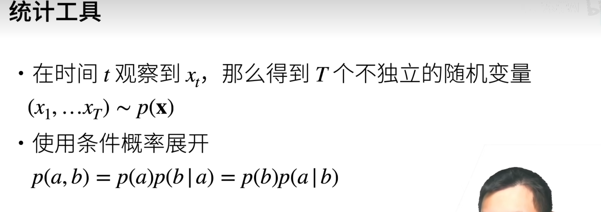

时间序列（一个向量）xt满足p（x）分布

下面的px即这个事件序列发生的概率，（一堆条件概率）


### 马尔可夫假设


### 潜变量


ht跟前一个时间的ht-1和xt-1相关

xt跟当前的潜变量ht和xt-1相关


### 总结

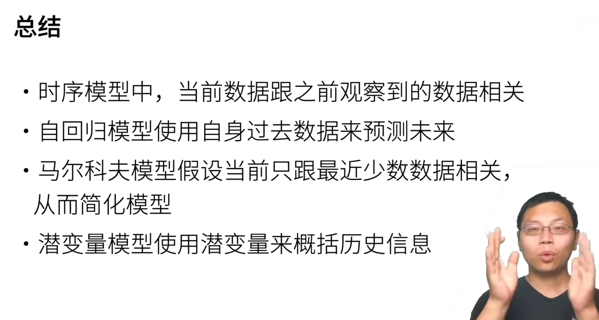

## RNN


用输出ot来匹配输入xt，但是输出ot发生在xt的输入之前，如逗号是由ht2的潜变量得到，由好字的输入和前面的ht1共同作用

### 困惑度


### 梯度裁剪

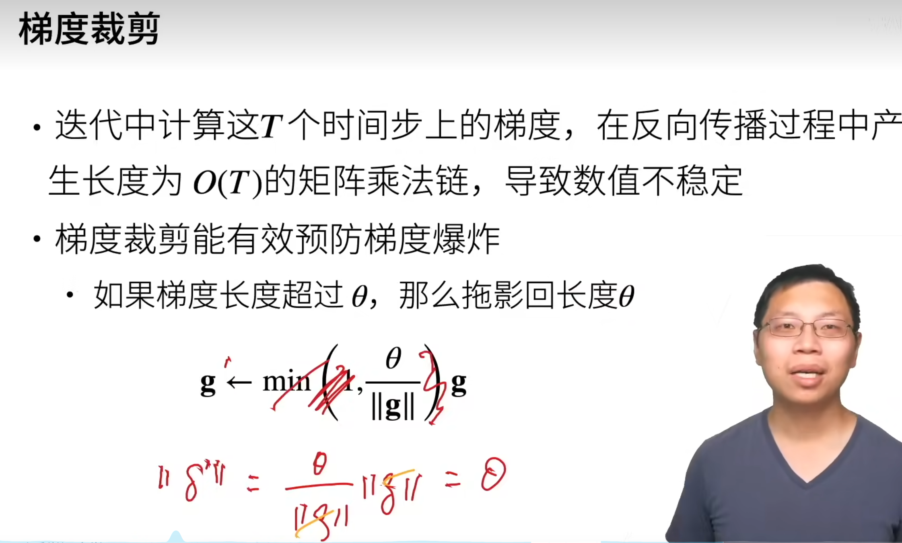

保证梯度不会超过theta

g：梯度


## attention

### 线索

随意线索：Q


### 非参注意力池化层

K是核函数，越大代表query的x与xi之间的距离越小，相当于一种权重，这样加权得到的结果，受离x距离小的xi对应的yi的影响大

有点像期望，除完之后表概率


### 核

高斯核

这里的x应该是x分布的期望


### 注意力分数

假设有m对k-v值

a是计算q和k之间距离的函数，$\alpha$是用这个距离做softmax得到的向量，再与v值相乘得到输出


### 类别

三个超参Wk，Wq，v（不是后面的value的v）

Wk和Wq分别将输入的k和q调整至大小为h的向量，然后再用tanh投射到（-1，1）之间，然后与v相乘，即等价于一个单隐藏层

k的形状：k\*1

q的形状：q\*1

#### 加性注意力


#### 缩放点积注意力

k，q大小相等的时候


总结，就是对于一个输入q，计算q与key向量的分数（反映查询与对应的键的相关性），再softmax得到注意力权重，再根据权重与value相乘做输出


[注意力机制的本质|Self-Attention|Transformer|QKV矩阵_哔哩哔哩_bilibili](https://www.bilibili.com/video/BV1dt4y1J7ov/?spm_id_from=333.337.search-card.all.click&vd_source=e0308ee1bfba7c59c7be0c563f5499c8)

### QKV

[(13 封私信 / 44 条消息) 如何理解attention中的Q,K,V？ - 知乎](https://www.zhihu.com/question/298810062)


### self attention

对于一个序列，序列中互相计算注意力分数，同时也计算自己的分数


再与v相乘


得到attention分数矩阵


attention分数再与V相乘计算结果


WQ, WK, WV是共享的参数，I是input，O是output


### 多头注意力

在原来的QKV基础上再左乘N个矩阵（N头注意力），但是每个Q只与下标对应的KV相乘。

其实感觉第一层就没必要了，因为就是两次连续的矩阵线性变换，直接用第二层矩阵就行


然后拼接两个bi12，左乘WO成为bi，然后bi作为下一层输出

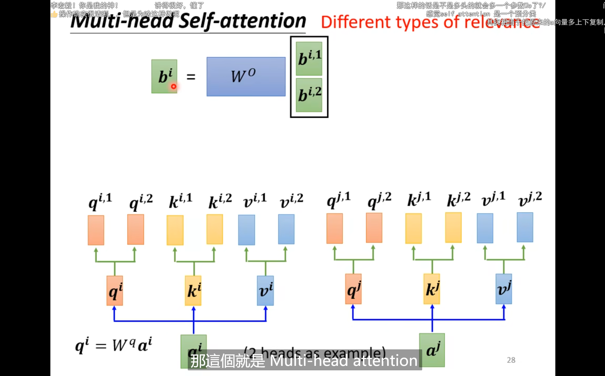

对于self-attention相当于就是一个a通过FC投射出多组qkv

注意！！！一个qi1只和对应的ki1和kj1等等算attention-score


在多头注意力中，`num_hiddens`通常被设置为可以被头的数量`num_heads`整除，这样每个头可以处理`num_hiddens / num_heads`维度的信息。

#### 代码

输入的qkv是第一层的普通的qkv

```python
#@save
class MultiHeadAttention(nn.Module):
    """多头注意力"""
    def __init__(self, key_size, query_size, value_size, num_hiddens,
                 num_heads, dropout, bias=False, **kwargs):
        super(MultiHeadAttention, self).__init__(**kwargs)
        self.num_heads = num_heads
        self.attention = d2l.DotProductAttention(dropout)
        self.W_q = nn.Linear(query_size, num_hiddens, bias=bias)
        self.W_k = nn.Linear(key_size, num_hiddens, bias=bias)
        self.W_v = nn.Linear(value_size, num_hiddens, bias=bias)
        self.W_o = nn.Linear(num_hiddens, num_hiddens, bias=bias)

    def forward(self, queries, keys, values, valid_lens):
        # queries，keys，values的形状:
        # (batch_size，查询或者“键－值”对的个数，num_hiddens)
        # 查询或者“键－值”对的个数：可以理解成序列的长度，但是有时候不是自注意力的话q和kv的长度不一样
        # valid_lens　的形状:
        # (batch_size，)或(batch_size，查询的个数)
        # 经过变换后，输出的queries，keys，values　的形状:
        # (batch_size*num_heads，查询或者“键－值”对的个数，num_hiddens/num_heads)
        
        # 这样做好处是可以并行计算head（在output那里计算）
        queries = transpose_qkv(self.W_q(queries), self.num_heads)
        keys = transpose_qkv(self.W_k(keys), self.num_heads)
        values = transpose_qkv(self.W_v(values), self.num_heads)

        if valid_lens is not None:
            # 在轴0，将第一项（标量或者矢量）复制num_heads次，
            # 然后如此复制第二项，然后诸如此类。
            valid_lens = torch.repeat_interleave(
                valid_lens, repeats=self.num_heads, dim=0)

        # output的形状:(batch_size*num_heads，查询的个数，num_hiddens/num_heads)
        output = self.attention(queries, keys, values, valid_lens)

        # output_concat的形状:(batch_size，查询的个数，num_hiddens)
        output_concat = transpose_output(output, self.num_heads)
        return self.W_o(output_concat)
```

由于在transpose_qkv中，每个头的数据已经被分组在一起，因此在计算注意力时，每个头的Q只会与对应的K和V相乘。这是因为在点积注意力的实现中，Q、K、V的计算是分开进行的，每个头只处理自己的那部分数据。

步骤：

1. 一个sequence进来，有n个a（元素）
2. 把n个a处理成3组，分别是n个qkv
3. 把n个qkv分成2组（2头），在batchsize上concat
4. 实际上一个头组的q和k还是有n/2个，这些再在内部进行self-attention操作
5. 完事了再转换形状concat回去

```python
def transpose_qkv(X, num_heads):
    """为了多注意力头的并行计算而变换形状"""
    # 输入X的形状:(batch_size，查询或者“键－值”对的个数，num_hiddens)
    # 输出X的形状:(batch_size，查询或者“键－值”对的个数，num_heads，num_hiddens/num_heads)
    X = X.reshape(X.shape[0], X.shape[1], num_heads, -1) # -1自动把数据最后一维切片成num_hiddens/num_heads个

    # 输出X的形状:(batch_size，num_heads，查询或者“键－值”对的个数,num_hiddens/num_heads)
    X = X.permute(0, 2, 1, 3)

    # 最终输出的形状:(batch_size*num_heads,查询或者“键－值”对的个数, num_hiddens/num_heads)
    return X.reshape(-1, X.shape[2], X.shape[3])


def transpose_output(X, num_heads):
    """逆转transpose_qkv函数的操作"""
    X = X.reshape(-1, num_heads, X.shape[1], X.shape[2])
    X = X.permute(0, 2, 1, 3)
    return X.reshape(X.shape[0], X.shape[1], -1)
```


先用一个矩阵把向量Q投影出来


### 位置 positional encoding


为了标识位置可以加入ei（可以学习，也可以由特殊的函数得来，后面具体了解）


### 缩放点积注意模型

#### 衡量差距的大小

缩放点积注意力机制衡量查询（Q）和键（K）之间相似度或差距的主要方式是通过点积操作。以下是衡量过程的详细步骤：

1. **点积计算**：首先，对于每个查询向量 \( Q_i \) 和每个键向量 \( K_j \)，计算它们的点积，即 \( $Q_i \cdot K_j^T$ \)。点积是一种衡量两个向量在相同维度上对应元素乘积之和的方法，可以直观地反映两个向量的相似度。

2. **缩放操作**：为了防止点积的数值过大，导致梯度消失或爆炸问题，点积结果会通过一个缩放因子进行缩放。这个缩放因子通常是键向量维度的倒数的平方根，即 \($ \frac{1}{\sqrt{d_k}}$ \)，其中 \( d_k \) 是键向量的维度。这一步确保了在不同维度的键向量之间保持一致性。

3. **Softmax 归一化**：缩放后的点积结果会通过Softmax函数进行归一化，得到每个键向量相对于当前查询向量的重要性权重。Softmax函数将任意实数向量转换为概率分布，公式为：
   \[
   $\text{softmax}(\frac{Q_i \cdot K_j^T}{\sqrt{d_k}}) = \frac{e^{\frac{Q_i \cdot K_j^T}{\sqrt{d_k}}}}{\sum_{l} e^{\frac{Q_i \cdot K_l^T}{\sqrt{d_k}}}}$
   \]
   这样，每个查询向量都会有一个对应于每个键向量的概率权重，反映了它们之间的相似度。

4. **权重求和**：最后，每个查询向量会根据其对应的权重与值向量进行加权求和，得到最终的输出向量。这个过程体现了模型对输入序列中不同部分的注意力分配。


dk是ki的维度，即2

### 加性注意力

```python
#@save
class AdditiveAttention(nn.Module):
    """加性注意力"""
    def __init__(self, key_size, query_size, num_hiddens, dropout, **kwargs):
        super(AdditiveAttention, self).__init__(**kwargs)
        self.W_k = nn.Linear(key_size, num_hiddens, bias=False)
        self.W_q = nn.Linear(query_size, num_hiddens, bias=False)
        self.w_v = nn.Linear(num_hiddens, 1, bias=False)
        self.dropout = nn.Dropout(dropout)

    def forward(self, queries, keys, values, valid_lens):
        queries, keys = self.W_q(queries), self.W_k(keys)
        # 在维度扩展后，
        # queries的形状：(batch_size，查询的个数，1，num_hidden)
        # key的形状：(batch_size，1，“键－值”对的个数，num_hiddens)
        # 使用广播方式进行求和
         # features的形状：(batch_size，查询的个数，“键－值”对的个数，num_hidden)
        features = queries.unsqueeze(2) + keys.unsqueeze(1)
        features = torch.tanh(features)
        # self.w_v仅有一个输出，因此从形状中移除最后那个维度。
        # scores的形状：(batch_size，查询的个数，“键-值”对的个数)
        scores = self.w_v(features).squeeze(-1) # 第i个batch_size对应的第j个查询的个数和第k个“键－值”对的个数，即分数
        self.attention_weights = masked_softmax(scores, valid_lens)
        # values的形状：(batch_size，“键－值”对的个数，值的维度)
        return torch.bmm(self.dropout(self.attention_weights), values)
```


1. `self.dropout(self.attention_weights)`: 这行代码首先应用了Dropout正则化到`attention_weights`上。Dropout是一种防止神经网络过拟合的技术，它随机地将一些神经元的输出置为零，从而迫使网络学习到更加鲁棒的特征表示。
2. `torch.bmm`: 这个函数是批量矩阵乘法（Batch Matrix Multiply）的缩写，它用于对两个矩阵进行批量乘法运算。在这里，它用于将`attention_weights`（注意力权重矩阵）与`values`（值矩阵）相乘。
3. `self.attention_weights`: 这是通过`masked_softmax`函数计算得到的注意力权重，它考虑了`valid_lens`参数，即有效长度，这通常是序列中非填充（padding）部分的长度。`masked_softmax`确保了在计算softmax时，填充部分的权重为零，这样它们就不会对最终的注意力权重产生影响。
4. `values`: 这是输入到注意力机制中的值矩阵，其形状通常是`(batch_size, "键-值"对的个数, 值的维度)`。
5. `torch.bmm(self.dropout(self.attention_weights), values)`: 这行代码将Dropout处理后的注意力权重与值矩阵相乘。由于`attention_weights`的形状是`(batch_size, 查询的个数, "键-值"对的个数)`，而`values`的形状是`(batch_size, "键-值"对的个数, 值的维度)`，所以它们可以通过`torch.bmm`进行批量矩阵乘法。结果是一个形状为`(batch_size, 查询的个数, 值的维度)`的矩阵，这个矩阵是加权后的值，代表了对输入序列的加权表示。


### attention变型

#### CV里面的attention

如果把每个pixel当作一个序列中的token，会非常大，计算量太大，一般不作全局self-attention

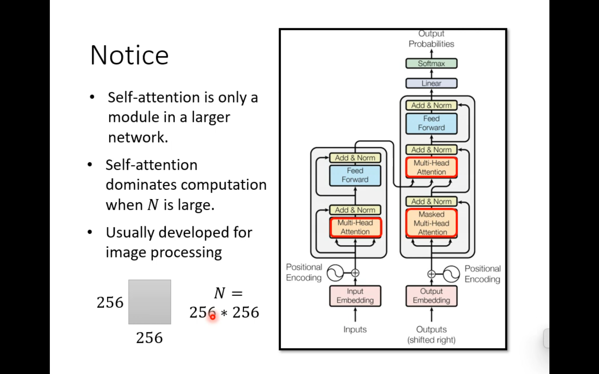

或者把高宽flatten成一维的，然后每个channel作为一个序列

CNN就是一种attention特例

#### global attention和attention matrix

row代表q，column代表kv，图中第1、2个token当作specialtoken，与所有token做attention，并且所有token都与它做attention

第一二行说明special token的q与所有token的kv做了attention，第一二列说明所有token的k都与special token的kv做了attention


#### window attention

第1张window attention：与上下的做attention

第2张：间隔2个stride做attention


#### big bird

缝合window、global、random


#### clustering

对q和kv聚类之后再算attention

（聚类方法没说啊）


#### nn学习出attention

学习到右边这个矩阵来得到左边的masked矩阵，后面也有文章直接用NN得到注意力分数的

感觉额外训练一个nn会更慢？实际上input sequence里面有的token会共用一样的mask


#### 只选有代表性的kv

选出有代表性的k和对应的v


可以用CNN或者直接把input sequence看成矩阵然后降维


如果对于input的sequence，每个都需要一个输出，那么不能选代表性的query

否则可以选有代表性的query


#### 直接把attention score作为可学习的参数


这样应该就只能处理固定长度的sequence了，而self-attention算QKV的矩阵WQ、WK、WV是共享参数，可以接收不同长度sequence

对于这张图，如果sequence长度为5个token就失效了，但是W QKV可以对每个qkv作用然后计算


### 加速算attention

可以用一个phi函数，处理q和k之后，先计算phi-k和v，然后再与phi-q相乘（矩阵乘法顺序不一样复杂度可能不一样）

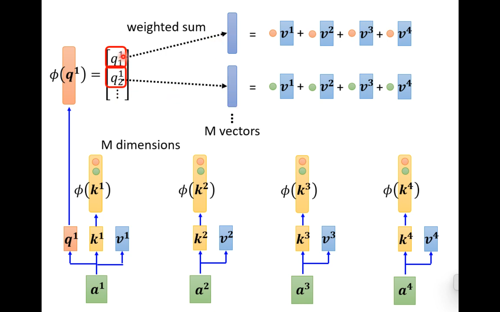


## transformer

### seq2seq

序列到序列的任务

### 结构


### encoder

例如深蓝色输入序列x，经过self-attention之后得到a，然后残差连接输入前的，然后经过一个layer norm，得到右边更深蓝的。然后经过一个全连接层，然后再残差连接，再layer norm

总之干的是就是用一个sequence产生另一个sequence


### decoder


#### masked self-attention

有点像rnn，输入b2时，q2只能考虑a1和a2产生的kv（只考虑序列左边的）


#### 输入输出

训练时输入begin符号（BOS）和机字，gt是机。

结束的时候，输入习，gt是end符号	


### Add Norm

```python
#@save
class AddNorm(nn.Module):
    """残差连接后进行层规范化"""
    def __init__(self, normalized_shape, dropout, **kwargs):
        super(AddNorm, self).__init__(**kwargs)
        self.dropout = nn.Dropout(dropout)
        self.ln = nn.LayerNorm(normalized_shape)

    def forward(self, X, Y):
        return self.ln(self.dropout(Y) + X)
```


### FFN feedforward

b：batchsize

n：序列长度

d：dimension

模型应可以处理任意长度n的序列


#### 代码

本身是两个FC

```python
#@save
class PositionWiseFFN(nn.Module):
    """基于位置的前馈网络"""
    def __init__(self, ffn_num_input, ffn_num_hiddens, ffn_num_outputs,
                 **kwargs):
        super(PositionWiseFFN, self).__init__(**kwargs)
        self.dense1 = nn.Linear(ffn_num_input, ffn_num_hiddens) # 默认对最后一维操作
        self.relu = nn.ReLU()
        self.dense2 = nn.Linear(ffn_num_hiddens, ffn_num_outputs)

    def forward(self, X):
        return self.dense2(self.relu(self.dense1(X)))
```


### cross attention

decoder中输出作q，与encoder中的输出产生的kv做attention得到中间结果（这里是3个a），然后按weight相加（可能是堆叠）


### 信息传递


## BERT

简单解释：

之前的标准语言模型是从左到右地预测。BERT改为了随机将中间的一些token来mask掉，然后将损失函数换为对这些中间token的预测效果，这样就可以从两边到中间来预测

### transformer框架复习

30k是一次输入30k个token来训练

H是hidden的大小，即每个词的维度

A是多头注意力的头的个数

L是block的层数


下面三个H\*H是QKV投影矩阵的大小（每个token是长度为H的vector，分别与H\*H的投影矩阵相乘）

上面是最后多头输出concat回去后要过的一个矩阵H\*H

再上面是feedforward层（两个FC），但是全连接层中间是4\*H大小，所以feedforward是8\*H\*H

### CLS和SEP

 

BERT输入一个序列对

CLS表示序列对的开始，在第一个句子前

SEP表示序列对分离的位置，在第二个句子前

### 预处理

 

首先把输入转成embedding

然后加上一个segment分句子的embedding

然后再加上可学习的position的embedding

### mask

 

\#\#表示原文中这个词应该接在前一个后面，但是由于出现频率太低，就分开计算


有15%的概率将embedding替换为mask的embedding，比如输入1000个词就要预测150词

被mask的有80%概率直接mask，10%标记为需要做预测，10%随机替换为别的词

mask80 10 10的解释

注意，bert仅仅是为了学习到词之间的语义信息，微调或测试的阶段可能是对文本分类等任务的，所以mask是没有必要的，剩下的20%概率则是对应这部分的工作

### 序列对

一次输入的两个句子，有50%概率是相邻的两个句子，还有50%是随机选的另一个句子

loss function也将这部分加入，将相邻的句子标记为正例，不相邻的标记为负例，把正负例的预测加入loss function


## Vit

完全没有用到CNN

这个博客很重要，比笔记好使

[深入浅出一文图解Vision in Transformer（ViT）-CSDN博客](https://blog.csdn.net/weixin_43312117/article/details/122922513)

### 标题

把图像分成很多个16\*16的patch

### introduction

直接把一个512\*512的图片展平后输入，复杂度太大不可接收

有的人把CNN的feature map展平后作为transformer的输入

有的人在一个窗口内做self-attention，类似CNN

有的人搞轴注意力，在H方向上把W当作向量作输入，在W方向上把H当作向量作输入


Vit的做法：

把图片拆成多个16\*16的patch，每个patch作为进入transformer的一个sequence中的元素

原来逐像素分n是5w多，拆之后n是14\*14 = 196


另外：

Vit只有在大规模数据集上预训练过后效果才能比resnet等网络好（因为缺乏卷积的先验信息等等）

总结：

在把图片预处理为16\*16的patch后（等于说一个sequence的其中一个元素是196长的vector），就可以当作NLP任务做了，最后分类就行

多的操作（位置编码）


### 对图片预处理


#### 图片分patch

总的来看是，对于左下角这样一个图片，假设它是3\*224\*224的，224/16=14，所以新图HW均为14

所以拆成14\*14 = 196个的16\*16的图片，每个小图片有三维通道，所以一个大图片就是196\*768的向量


#### E线性层

文中E是线性层，768\*768对输入的，除了cls外的196做一次线性

经过一个Linear Projection（映射）到指定的维度，比如1024或2048，这里仍然是768


也可以直接使用`卷积`来实现，用`16×16`大小的卷积核，步长stride=16，维度设为768，输入`[3, 224, 224]->[768, 14, 14]`，然后交换并合并一下维度不就得到结果了吗？`[196, 768]`


#### cls

然后加上cls特殊字符（1\*768），得到197\*768。由于self-attention是sequence里面全部相互学习的，就拿cls做输出

#### position embedding

最后对于图片每一个小块是有位置先后顺序的不然就是乱序的小块拼不成正常图片，所以加上position embedding，代表小图片的顺序，这个顺序如最左边的表，有位置编码对应12345这样的序号，也是768，把这样的位置编码(每个都1\*768)直接sum加到原来的197\*768上去（不是concat）


也可以2D编码，但是作者证明了效果差不多


### 输出

在标准的transformer encoder处理后是197\*768，最后跟上一个MLP分类即可


### position embedding similarity


这里反映了1D的编码也可以学到2D的特征（图中同行同列的attention分数更大）

### 代码

```python

import torch
import torch.nn as nn


class PatchEmbedding(nn.Module):
    """
    PatchEmbedding将输入图像分割成多个patch

    Parameters:
    - in_channels (int): 输入图像的通道数。
    - patch_size (int): 每个patch的大小，即边长长度。NUM_PATCHES = (IMG_SIZE // PATCH_SIZE) ** 2
    - embed_dim (int): 嵌入向量的维度。EMBED_DIM = (PATCH_SIZE ** 2) * IN_CHANNELS
    - num_patches (int): 输入图像被分割成的patch数量。

    Attributes:
    - patcher (nn.Sequential): 用于将图像分割成patch并展平的模块。
    - cls_token (nn.Parameter): 可学习参数，分类的就用它一个而不是看global的。
    - position_embedding (nn.Parameter): 可学习参数，用于给patch序列添加位置信息。
    """
    def __init__(self, in_channels, patch_size, embed_dim, num_patches, dropout):

        super(PatchEmbedding, self).__init__()

        # 定义将图像分割成patch并展平的模块
        # 使用卷积操作来提取patch，然后使用Flatten将每个patch展平成一维向量
        # 没有flatten后再linear projection，而是用卷积后再flatten代替了线性映射
        # (N, C, H, W)
        self.patcher = nn.Sequential(
            nn.Conv2d(in_channels=in_channels, out_channels=embed_dim, kernel_size=patch_size, stride=patch_size),
            # (N, C, HW)
            nn.Flatten(2)
        )

        # 可学习参数cls_token
        # (1, 1, embed_dim)，初始化为标准正态分布
        self.cls_token = nn.Parameter(torch.randn(size=(1, 1, embed_dim)), requires_grad=True)

        # (1, num_patches+1, embed_dim)，初始化为标准正态分布
        # num_patches+1是因为concat了cls_token
        self.position_embedding = nn.Parameter(torch.randn(size=(1, num_patches +1, embed_dim)), requires_grad=True)

        # Dropout层
        self.dropout = nn.Dropout(p=dropout)


    def forward(self, x):
        """

        Parameters:
        x: 输入的图像数据，形状为(batch_size, channels, height, width)

        Attributes:
        经过变换后的特征向量，形状为(batch_size, seq_length, hidden_size)
        """
        # 扩展cls_token以匹配batch_size，并保持其他维度不变
        # expand需要指定扩展的维度，所以这里每个dim都需要用-1来表示
        cls_token = self.cls_token.expand(x.shape[0], -1, -1)

        # 对输入图像进行分块，并调整维度顺序
        # (N, C, HW)
        # 即(N, embed_dim, NUM_PATCHES)，所以需要交换下维度，让NUM_PATCHES作为序列个数
        x = self.patcher(x).permute(0, 2, 1)
        # 在序列维度上连接cls_token和图像块
        x = torch.cat([cls_token, x], dim=1)
        # 添加position_embedding
        x = x + self.position_embedding

        x = self.dropout(x)
        return x


class Vit(nn.Module):
    def __init__(self, in_channels, patch_size, embed_dim, num_patches, dropout,
                 num_heads, activation, num_encoders, num_classes):
        """。
        Parameters:
        in_channels (int): 输入图像的通道数。
        patch_size (int): 图像块的大小。
        embed_dim (int): 嵌入层的维度。16*16*3=768
        num_patches (int): 图像块的数量。14*14=196
        dropout (float): Dropout的概率。
        num_heads (int): 多头注意力机制的头数。
        activation (str): 激活函数的类型。
        num_encoders (int): Encoder blocks的数量。
        num_classes (int): 分类的类别数。
        """
        super(Vit, self).__init__()

        # 初始化图像块嵌入层
        self.patch_embedding = PatchEmbedding(in_channels, patch_size, embed_dim, num_patches, dropout)

        # 初始化Transformer Encoder层
        encoder_layer = nn.TransformerEncoderLayer(
            d_model=embed_dim,  # 嵌入层的维度
            nhead=num_heads,    # 多头注意力机制的头数
            dropout=dropout,    # Dropout的概率
            activation=activation,  # 激活函数的类型
            batch_first=True,   # 输入数据的第一个维度是否为batch大小
            norm_first=True     # 是否在前馈网络之前进行归一化
        )


        # 初始化Encoder blocks
        self.encoder_blocks = nn.TransformerEncoder(encoder_layer, num_layers=num_encoders)

        # MLP
        self.MLP = nn.Sequential(
            nn.LayerNorm(normalized_shape=embed_dim),
            nn.Linear(in_features=embed_dim, out_features=num_classes)
        )

    def forward(self, x):
        # 输入shape: (batch_size, num_patches, embed_dim)
        x = self.patch_embedding(x)
        x = self.encoder_blocks(x)
        # x[:, 0, :] 选择了每个样本的第一个补丁的嵌入，即 x 的形状变为 (batch_size, embed_dim)
        # 输出shape: (batch_size, output_dim)
        x = self.MLP(x[:, 0, :])
        return x


if __name__ == "__main__":
    IMG_SIZE = 224
    IN_CHANNELS = 3
    PATCH_SIZE = 16
    NUM_PATCHES = (IMG_SIZE // PATCH_SIZE) ** 2  # 196
    EMBED_DIM = (PATCH_SIZE ** 2) * IN_CHANNELS  # 768
    DROPOUT = 0.001

    NUM_HEADS = 8
    ACTIVATION = "gelu"
    NUM_ENCODERS = 4
    NUM_CLASSES = 10
    HIDDEN_LAYER = 768

    device = "cuda" if torch.cuda.is_available() else "cpu"

    # model = PatchEmbedding(IN_CHANNELS, PATCH_SIZE, EMBED_DIM, NUM_PATCHES, DROPOUT)
    model = Vit(IN_CHANNELS, PATCH_SIZE, EMBED_DIM, NUM_PATCHES, DROPOUT, NUM_HEADS, ACTIVATION, NUM_ENCODERS,
                NUM_CLASSES).to(device)
    x = torch.randn(size=(1, 3, 224, 224)).to(device)
    prediction = model(x)
    print(prediction.shape)
```


## swin-transformer

与vit的区别是

只在窗口里做self-attention（类比卷积的感受野），减少全局计算的计算量，减少复杂度

每层要patch merging（类比CNN的池化），合并相邻的patch


### 为什么是基本框架

 

像上面这种，每个patch是4 8 16大小的，就类比卷积的通道和feature map大小，就可以拿给unet做分割

### shift

 

如图把整个图的红色window向右下移动2格得到新的window，这样有5个新的window可以互相attention

### 第一块

 

对于224\*224\*3的图片，首先将patch打成原来的1/4高宽大小，然后每个新的高宽为原来1/4的patch在通道维度上concat，通过一个48\*96的线性层映射到56\*56\*96，但是此时相当于是96个序列长度为56\*56=3136的，太长了肯定不行。这时候需要在56\*56的这个Window内部给它打成7\*7的块，再在内部进行self-attention

### patch merging

 

对一张patch进行编号，分成4种，将4种合并，然后堆叠成四个通道，然后再用1\*1卷积合为两个通道的，以此模拟卷积操作

### 过程

 

对于第一块之后的步骤，首先是打包成基本的7\*7的patch，然后在8\*8 = 64个窗口内算自注意力

### 复杂度

 

对于分窗口计算（下）和全局计算注意力（上）的复杂度对比

首先一个图片分为了h\*w个patch（patchsize大小为1）

第一行是标准自注意力

相当于是hw个q，q的长度为c

 

现在窗口大小不再是h\*w而是M\*M

所以拿M去代入上面的式子，然后再乘以(h/M)\*(w/M)，因为一共有这么多个M\*M的窗口，就得到下面的式子

### block

 

一层做一次正常窗口的self-attention

一次再做shifted-window的self-attention

### shift续


移动是将边上的patch拼接过来后重新分为4个窗口计算self-attention，但是因为语义信息不匹配，拼接形成的窗口要加mask

 

每个1\*1的格子做自注意力，他们的长度为c（channel）

假设现在这个层里面feature map是14\*14的，4个小窗口就是7\*7的

每次向右下移动窗口大小的一半，则移动7的地板除以2即3。那么对于左下角的区域，上面保留高度为4的patch，下面是高度为3的patch

### mask

 

做自注意力时将拼接来的patch做出来的自注意力mask掉

 

mask就是直接对不要的区域里面加-100，然后softmax后值就会很小忽略不计了

 

对于右上角的mask，拉平后会是几个窗口交叉的

 

所以是交叉着的条纹


## MAE

### 模型

mask掉75%的内容

 

预训练部分：将图片随机加mask，输入encoder，得到vit处理过后的patch的对应tensor，然后补上空缺的tensor，在decoder里还原出target

（不知道是不是拿还原出来的和原图的patch计算loss）


其它阶段就不会mask，得到encoder输出后再操作


### 还原效果

 


### mask

随机采样一些块（25%），剩下的全mask（75%）


### encoder：对Vit改动

vit作为它的encoder，只让没有被mask的patch进入vit，


### decoder

可以看到的信息：

1. encoder出来的
2. 把所有盖住的patch用同一个可学习的tensor表示


decoder又是一个transformer，所以要给mask的patch也加上positional embedding（不确定要不要给没有mask的加）

解码器仅在预训练过程中使用，后面要迁移学习就只要encoder


### pre-train的loss

用vit来举例

768 = 16\*16\*3（一个patch的像素数量）

196 = 14\*14（一张图的patch数量）

首先是3\*224\*224转为196\*768


解码器的最后一层是线性层，把过程中的tensor最后投影到768的维度，然后还原回16\*16的patch

loss就是mse


### 加速

直接把一个patch flatten，然后shuffle且记住shuffle，mask前面75%。只输入后25%进encoder。然后在decoder部位用可学习的tensor补上mask掉的并加上positional embedding


## GAN

### 前置

z是一个分布，这里选高斯分布，抽样出来一组3\*64\*64的tensor后放在generator里面会产生图像


discriminator：打分用的，判断一张image是否像一个二次元的脸，给分


### 步骤

#### 训练discriminator


真实图片为1，生成图片为0，训练D。训练好后定住D的weight

#### 训练generator


D定住后就训练G，让G产生更真实的图片

#### 重复

然后重复训练G和D，定住其中一个，训练另一个

### discriminator的分数


V是越高越好，P-data是D遇到真图给出的分数，P-G是D遇到G生成的图给的分数，E是期望，两个y是分属两个数据的

G D是生成和辨别器


## 知识蒸馏

https://blog.csdn.net/weixin_43694096/article/details/127505946


## 半监督学习

### pai-model

[π-model & Temporal Ensembling - 知乎 (zhihu.com)](https://zhuanlan.zhihu.com/p/144716386)

半监督深度学习（semi-supervised learning）的一类做法使用一致性正则化（Consistency Regularizition）。基本的思想是：对于一个输入，即使受到了扰动，网络仍然可以产生和原来一致的输出。这里的一致是指结果近似、或者说结果向量距离较近，是从输出的空间分布来进行比较。

一致性正则化和普通的正则化一样，可以防止网络的过拟合，使模型更加平滑。这本身是一个无监督的过程，只需要提供输入和扰动方式，然后便可以比较结果的一致性。因此，可以由此使无标签的数据参与训练。


mean-teacher

[论文阅读笔记：Mean teachers are better role models - 知乎](https://zhuanlan.zhihu.com/p/467917019)


### mean-teacher model

[【半监督学习】Π-Model、Temporal Ensembling、Mean Teacher - wuliytTaotao - 博客园](https://www.cnblogs.com/wuliytTaotao/p/12825797.html)

[论文阅读笔记：Mean teachers are better role models - 知乎](https://zhuanlan.zhihu.com/p/467917019)


## 杂

### CLAHE

限制对比度，将峰值的均分给其它的

[关于 CLAHE 的理解及实现_clahe 原理-CSDN博客](https://blog.csdn.net/j05073094/article/details/120398369)

### gamma correction


