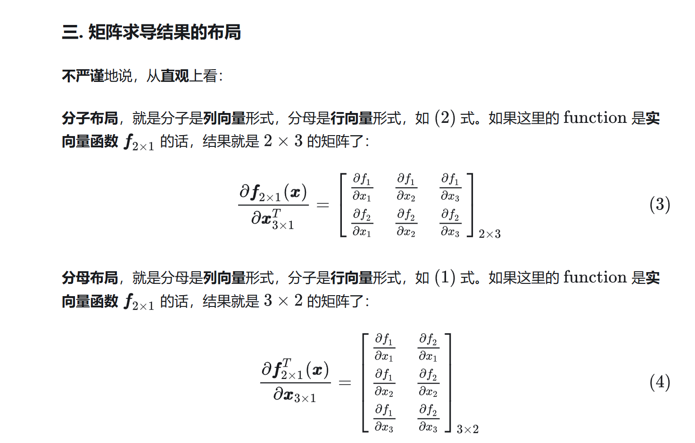

[toc]

## 范数

向量的范数：

矩阵的范数：

###  范数的展开

[范数平方的展开公式_范数的平方-CSDN博客](https://blog.csdn.net/qq_44154915/article/details/138802349)

## 特征值

[数学基础类：如何求矩阵的特征值和特征向量_矩阵的特征值和特征向量怎么求-CSDN博客](https://blog.csdn.net/weixin_41611045/article/details/102792874)

## 特殊矩阵

### 对称矩阵和反对称矩阵

对称：关于对角线相等

反对称：关于对角线相反

### 正定矩阵

正定一定对称

定义是李沐那个下面的，有向量和向量的转置相乘大于0

可以通过特征值都大于0来推

也可以各个顺序主子式大于0，就是从左上角一层一层的行列式，证明烦，不看了

### 正交矩阵 置换矩阵

### 对角矩阵

主对角线之外的元素皆为0的矩阵

假设A是向量，diag(A)就是把A的元素放到对角线上的矩阵

## 导数

### 分子布局分母布局

先看这个

[矩阵求导的本质与分子布局、分母布局的本质（矩阵求导——本质篇） - 知乎 (zhihu.com)](https://zhuanlan.zhihu.com/p/263777564)

结论就是先不管分母的形式，对分子是逐元素求导然后按照分子的形状进行拼接

### 标量对向量求导

样例

### 向量对标量求导

### 向量对向量求导

相当于每个yi取出来转置成横向量后再从上到下按y拼成一个矩阵

样例

## 协方差

[形象理解协方差矩阵 - 知乎](https://zhuanlan.zhihu.com/p/349802953)

协方差是衡量两个变量之间线性关系强度和方向的统计量。如果两个变量的协方差为正，那么这两个变量倾向于一起增加或减少；如果协方差为负，则意味着一个变量增加时，另一个变量倾向于减少。协方差为零则表明两个变量之间没有线性关系。

## 克罗内克积

[什么是克罗内克积（Kronecker积）？-CSDN博客](https://blog.csdn.net/weixin_44114030/article/details/142720297)
