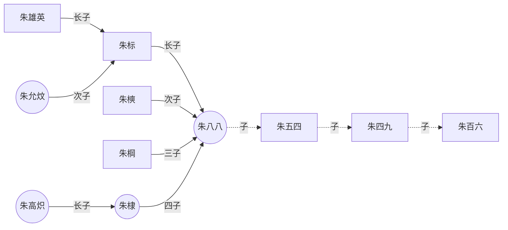
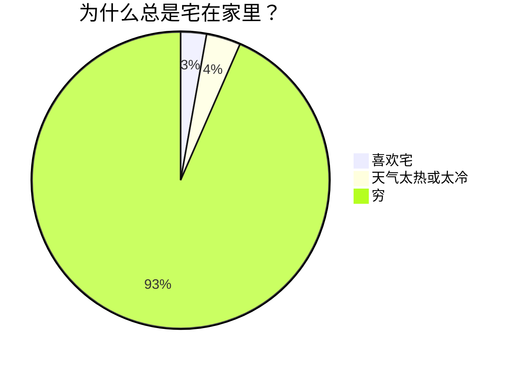

# Mermaid

[toc]

## 学习网站

+ [Mermaid从入门到入土——Markdown进阶语法 - 知乎](https://zhuanlan.zhihu.com/p/355997933)

## 实例

## 饼状图

- 语法——仅供参考，建议直接看实例

- - 从`pie`关键字开始图表

  - 然后使用`title`关键字及其在字符串中的值，为饼图赋予标题。（这是**可选的**）

  - 数据部分

  - - 在`" "`内写上分区名。
    - 分区名后使用`:`作为分隔符
    - 分隔符后写上数值，最多支持2位小数——数据会以百分比的形式展示

+ 实例

