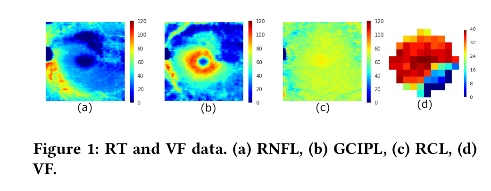

杨锦烨

[toc]

## 调研

### Humphrey视野计报告

老师发的图片中的第2、3张Humphrey视野计报告英文一般叫

1. VF（Visual Field）

2. HFA（Humphrey field analyzer）

3. HVF（Humphrey Visual Field）

4. single field analysis

#### 报告解读

然后找了两篇博客介绍视野报告的数据意义的

[计算机视野图的判读-简要解析](https://m.medlive.cn/group/topic/68131)

[手把手教你看懂视野检查报告 - 丁香园](https://ophth.dxy.cn/article/507072)

### 找到的论文

在scholar上面按照群文档能投的期刊会议列表只搜到两篇（就是搜OCT \+ humphrey，macular  \+ humphrey ）

第一篇Multi-view learning over retinal thickness and visual sensitivity on glaucomatous eyes里面提到这是第一篇基于OCT扫描出的视网膜厚度来估计视野的文章。

两篇文章数据集都不公开。

目前还没有具体看两篇文章的方法，只是大概地知道数据集和论文在干什么。

#### Multi-view learning over retinal thickness and visual sensitivity on glaucomatous eyes

[KDD '17: Proceedings of the 23rd ACM SIGKDD International Conference on Knowledge Discovery and Data Mining](https://dl.acm.org/doi/proceedings/10.1145/3097983)

目标：将OCT的视网膜厚度数据RT转换为视野数据VF

提出了两个方法，一个是传统数学方法，一个是CNN

##### abstract翻译

视觉场的密集测量对于检测青光眼至关重要，但众所周知，这种测量既昂贵又劳动密集。最近，视网膜厚度的测量成本比视觉场的测量要低。因此，人们非常希望**视网膜厚度数据能以某种方式转化为视觉敏感度数据**。在本文中，我们提出了两种新的方法，使用光学相干断层扫描（OCT）测量的视网膜厚度数据，以SITA-Standard模式10-2分辨率估计视觉场的敏感度。第一种方法称为仿射结构非负矩阵分解（ASNMF），它能够同时处理视觉场的估计和深度青光眼知识的发现。第二种方法基于卷积神经网络（CNNs），显示出非常高的估计性能。这些方法属于多视图学习方法，因为它们同时利用视觉场和视网膜厚度数据。我们从多个角度实验性地测试了我们方法的性能。我们发现ASNMF在相对较小的数据集上表现更好，而CNNs在相对较大的数据集上表现更好。此外，通过ASNMF发现了一些临床知识。据我们所知，这是第一篇基于视网膜厚度数据进行视觉场密集估计的论文。

#### Estimating glaucomatous visual sensitivity from retinal thickness with pattern-based regularization and visualization

[KDD '18: Proceedings of the 24th ACM SIGKDD International Conference on Knowledge Discovery & Data Mining](https://dl.acm.org/doi/proceedings/10.1145/3219819)

目标：将OCT的视网膜厚度数据RT转换为视野数据VF

方法：基于模式的正则化（PBR）和基于模式的可视化（PBV）与CNN结合

##### abstract翻译

传统上，青光眼的诊断是基于视野敏感度（VF）。然而，VF测试耗时、成本高且嘈杂。目前，使用视网膜厚度（RT）进行青光眼诊断是可取的。因此，我们提出了一种从青光眼患者的RT估计VF的新方法。关键思想是使用我们的新模式基于正则化（PBR）和模式基于可视化（PBV）方法，结合卷积神经网络（CNNs）。PBR有效地结合了RT-VF关系的监督学习与非配对VF数据的无监督学习。我们因此可以避免CNN对小规模数据的过拟合。PBV在保留非线性的情况下，可视化RT和VF之间的功能对应关系。我们用真实数据集经验性地证明，带有PBR的CNN实现了迄今为止最高的估计精度，并且带有PBV的CNN在眼科领域中对知识发现是有效的。

#### 两篇论文用的数据

（a）（b）为视野数据

（c）（d）（e）为OCT数据，跟报告的数据格式有点不一样，还没有细读文章里面是怎么用这个OCT数据的

##### 视野数据

视场的状态由整数值TH表示，该值范围：[0, 40]，当视场中某个局部点的光敏度增加时，TH值也随之增加。

根据检测的方式不同有10-2、24-2、30-2三种

10-2：包含68个位点，覆盖了10°的视野范围

24-2：包含54个位点，覆盖了24°的视野范围

老师给的图片中是30-2的，搜到的两篇文章中是10-2的

##### OCT扫出来的视网膜层数据

文中的视网膜厚度数据RT是使用OCT测量的，包括视网膜神经纤维层（RNFL）、神经节细胞和内层视网膜层（GCIPL）以及视杆和视锥层（RCL）。

大小：512×128

### 问题

1. 之后做的工作是医院会提供数据集还是需要从网上找数据集
2. 两篇文章中用的数据应该只有视杆和视锥层RCL能和老师给的OCT黄斑（macular ）扫描报告比较接近，如果只能用医院给的数据集就会少前面RNFL和GCIPL两项数据。目前没有细读文章，还不知道缺少前面两种数据能不能按文中方法预测出VF
3. 老师给的图片中第一张的黄斑OCT跟文中的视杆和视锥层RCL数据不一样（查了下黄斑区主要包含视锥细胞，而视杆细胞则主要分布在视网膜的周边区域）
4. 两篇文章用的数据没公开，目前还没有找到黄斑OCT和HVF配对的数据集

### 后续准备做的

1. scholar上面这两篇文章分别是12和24个引用，准备看看引用它们的文章里面还有没有也是做这个工作的
2. 文中的视网膜神经纤维层（RNFL）、神经节细胞和内层视网膜层（GCIPL）以及视杆和视锥层（RCL）三种数据的格式还没看是什么意思

### 其它

搜到的多数文章是基于当前VF预测未来几年VF

有研究验证过视野（VF）与视网膜厚度（RT）相关

## 补基础

李沐动手学AI看完了，后面准备看他讲一些经典论文（Vit等等）还有李宏毅的讲GAN等等

ps：老师辛苦了

