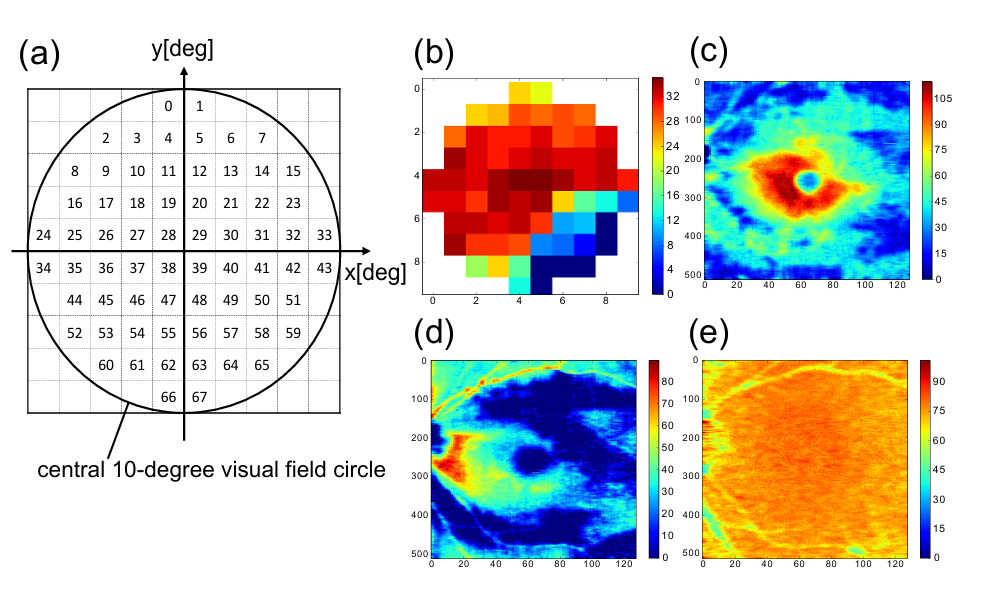
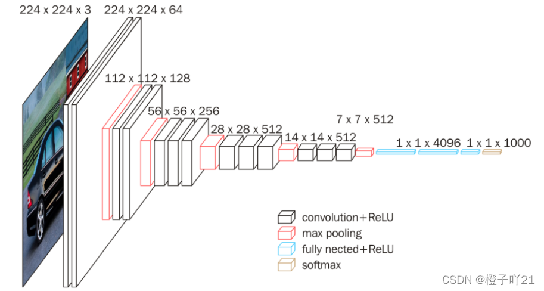

[toc]

## 数据

（a）（b）为视野数据

（c）（d）（e）为OCT数据，医院报告的只有RNFL，数据格式不一样

文中的视网膜厚度数据RT是使用OCT测量的，包括视网膜神经纤维层（RNFL）、神经节细胞和内层视网膜层（GCIPL）以及视杆和视锥层（RCL）。

大小：512×128

### 视野数据

由整数值TH表示，该值范围：[0, 40]，当视场中某个局部点的光敏度增加时，TH值也随之增加。

视野数据根据检测的方式不同有10-2、24-2、30-2三种

医院的报告里是30-2的

三种都是病人主观去点出来的

#### 有效性

训练一个SVM

1. 将测试集中的RNFL、GCIPL、RCL放入文中提出模型得到与真实值的误差

2. 设置一个误差阈值

3. 超过误差阈值的作为负例标签，低于误差阈值的作为正例标签。再把数据和对应的标签拿来训练一个SVM

如此采集到的眼睛OCT数据先用SVM分类，超过误差阈值则需要医生手动标注

分类适合预测视野的和不适合预测视野的

RMSE

### OCT数据

文中的视网膜厚度数据RT是使用OCT测量的，包括视网膜神经纤维层（RNFL）、神经节细胞和内层视网膜层（GCIPL）以及视杆和视锥层（RCL）。

值：厚度，单位没说

大小：512×128

## CNN

### 迁移学习

青光眼数据集太小，无法进行适当的训练，使用了迁移学习

VGG16 输入：224×224

水平上采样和垂直下采样将原图的RNFL、GCIPL、RCL三个图大小从512×128调整到224×224，然后作为三个通道输入

移除了最后的池化层、三个全连接层和softmax层

然后通过VGG16的前面几层直到512×14×14这一层

### 融合通道再计算

第l个通道(m, n)位置的输出

 $d_{lmn}$= D ∈ $\mathbb{R}^{512 \times 14 \times 14}$

预测的视场点 $\hat{x}_{mn}$ 在视网膜位置 $(m,n)$ 的 TH 是直接在通道上累加计算的：

$\hat{x}_{mn} = \sum_{l=1}^{512} a_{lmn} d_{lmn} + b_{mn}$

 $(a_{lmn}) = A \in \mathbb{R}^{512 \times 14 \times 14}$ 和 $(b_{mn}) = B \in \mathbb{R}^{14 \times 14}$

a、b是可学习参数，Xavier初始化

其它：

​	损失函数：RMSE

​	SGD

​	L2正则化

总共是14\*14 = 196个点，因为是10-2方法测的，所以只要中心68个点其它全部舍弃（30-2、24-2同理保留对应点即可）

OCT和VF配对数据少，VF数据多。第二篇加上了SSL

## ASNMF

### 输入数据格式

$X_{TH}$：各个眼睛的TH值组成的矩阵

$X_{THi}$：$X_{THi}$的第i行，为第i个眼睛的TH值展平后的结果

RNFL、GCIPL、RCL：全部分别展平组成矩阵，第i行为第i个眼睛的对应数据

### 非负矩阵分解

缝合了SNMF和ANMF

通过ML将X分解为YZ两个矩阵（XYZ均非负），k是超参

### 分解X

首先把$X_{TH}$、RNFL、GCIPL全部分解为对应的F矩阵，然后拼接成新的F

拼接：

其中RNFL和GCIPL的F矩阵比$X_{TH}$的多一维（多了待预测眼睛的数据），把$X_{TH}$的空缺的那一行的数据补0

> 意思是将TH、RNFL、GCIPL三个数据的二维图像视为一维向量然后展平，X_TH等三个矩阵第i行存的第i个眼睛的数据。将三个矩阵分解为对应的F、G矩阵之后，F的第i行仍然对应第i个眼睛的信息。k为三个F矩阵分别的宽，将三个F矩阵拼接起来，则第i行仍对应第i个眼睛的数据。对于RNFL和GCIPL对应的F矩阵的行数应该是比TH对应的F矩阵长一维的，多的一维对应训练眼睛的数据，所以最后一行f_TH,N留空

### 分解F

将F分解为WZ

W: 分解了F中的特征，每一列代表了更细致的特征或组件，这些特征是F中特征的构建块。

Z: 系数矩阵，描述W中的特征如何组合成F中的特征。Z的每一行表示一个更细致的特征对F中所有特征的贡献。

### 重构F-hat, X-hat

再将W和Z重构为F-hat，将F-hat重构为X-hat

X-hat多一维预测的TH值

**size：**

N = NTH + 1

l_sum = l_RNFL + l_GCIPL + l_cmn

XTH:NTH\*dTH

F:NTH\*k_sum

F-hat:N\*k_sum

G:k_sum\*dTH

W:N\*(l_sum + 1)

Z:(l_sum + 1)\*k_sum

### modify

用之前分解得到的W矩阵对预测出的$\hat{x}_{N}^\top(TH)$\[h\]修正

预测出的第h个值：

对某值q有算修正值的方法：

 delta是克罗内克积

对预测出来的矩阵XTH-hat的第N行算E然后减去：

减去偏置E是为了防止预测出的TH值应为0的大于0

## 对比

