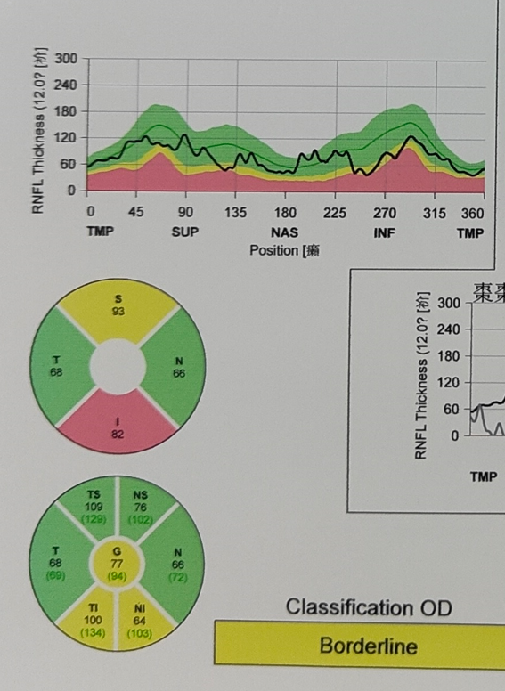
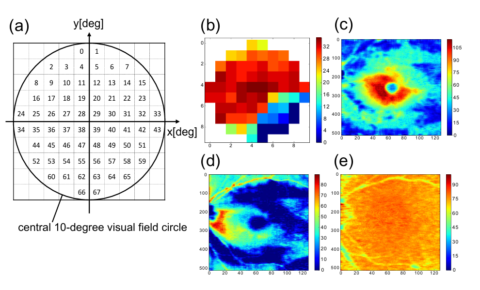
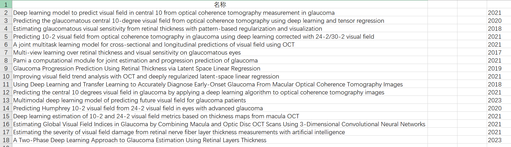
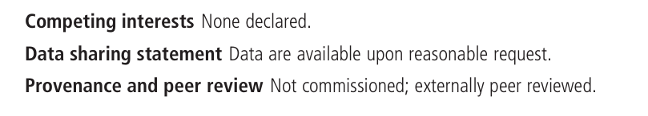
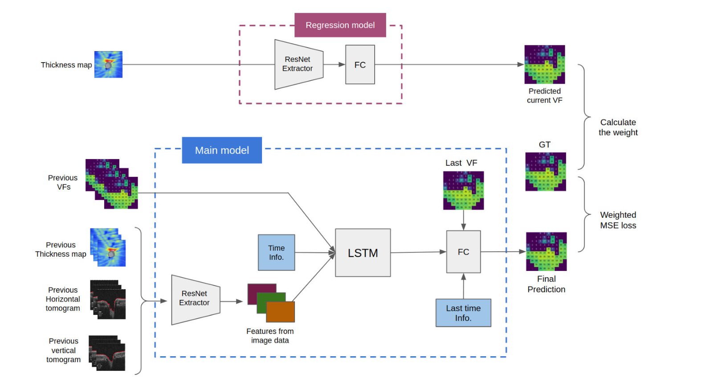
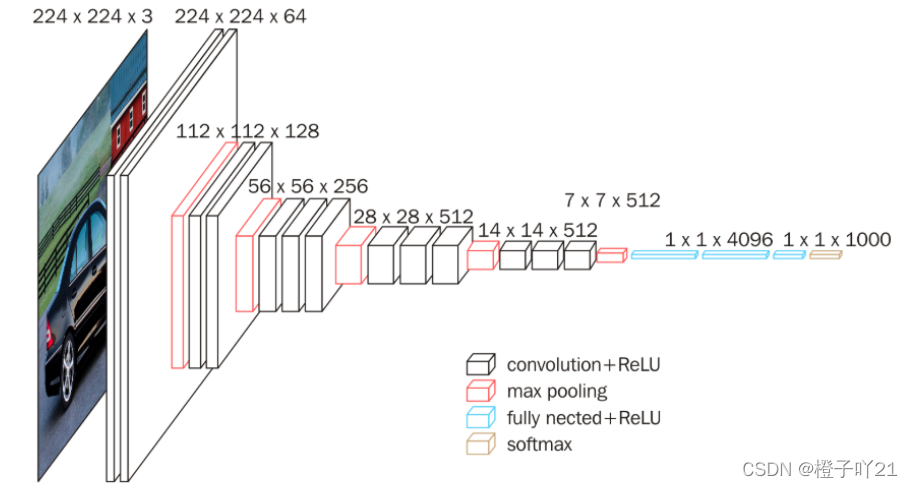
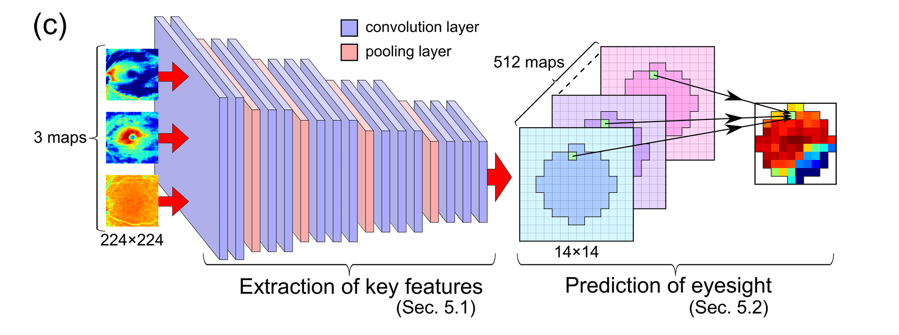
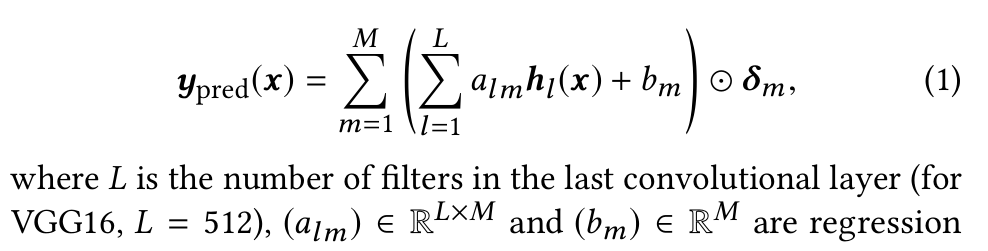
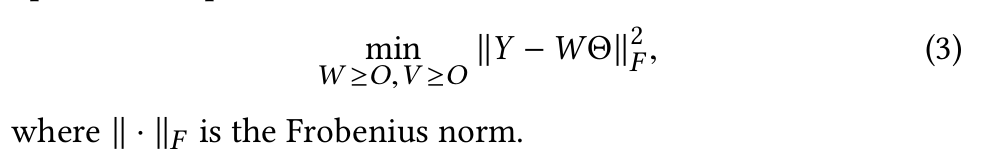

[toc]

## RNFL互转

### 已有的RNFL Thickness Profile

以视盘为中心扫一圈得到的，没有每个点的厚度值

 

视网膜神经纤维层（RNFL）厚度轮廓：黑色线条表示患者扫描围绕视盘的厚度值，从颞侧象限的9点钟位置（左眼的3点钟位置）开始，依次经过上、鼻、下象限，最后回到颞侧象限（TSNIT）。背景颜色表示规范数据范围（见分类颜色）。深绿色线条描绘了规范数据库中的平均厚度值。厚度轮廓应具有沿着颞上和颞下象限的明显隆起，并且所有象限的值应落在正常范围内。 

- 这是一种圆形的扫描模式，通常以视盘（Optic Disc，OD）为中心，覆盖一个特定的直径（如3.46毫米）。
- 它提供了围绕视盘的RNFL厚度的定量测量，通常以时间序列节点（TSNIT图）的形式展示，即从视盘的颞侧（Temporal）开始，经过上侧（Superior）、鼻侧（Nasal）、下侧（Inferior）回到颞侧。
- TSNIT的全称是“Temporal, Superior, Nasal, Inferior, Temporal”。这是一种用于描述视网膜神经纤维层（RNFL）厚度分布的方位标记系统，用于在光学相干断层扫描（OCT）中定位和评估RNFL的厚度变化。TSNIT系统按照时间钟面的方式，将视盘周围的区域分为四个象限：颞侧（Temporal）、上方（Superior）、鼻侧（Nasal）和下方（Inferior），每个象限又被进一步细分为六个部分，总共24个部分，以便于更精确地分析RNFL的厚度变化。

### 需要RNFL Thickness map

直接反映每个点的**二维的**厚度

 

1. 都是围绕视盘扫一圈。profile是360的，没有二维的位置信息，反映视盘各个方向上的厚度，未说明是最大厚度还是什么值。map是有二维图像信息的，扫一圈可以想象成一圈360度每个细线上的厚度信息，实际上是没有二维空间信息的。饼状图是大概厚度，字母代表各个部位的方向（鼻、颞等）
2. 没有找到互转的方法，因为两种报告仪器扫出来的时间成本都差不多，都远小于测VF的，profile相比热力图map少信息
3. 第一张眼底图片和第二张截面图片不包括厚度信息

## 其它

找到了其它论文

 

其中一篇论文说可以申请它的thickness map的数据集

 

还有一篇用到了医院报告截面的图，但是它目标是之前的VF来预测现在的VF

 

## 看论文

Estimating glaucomatous visual sensitivity from retinal thickness with pattern-based regularization and visualization KDD18

是上周那篇KDD17同一个实验室的续作

### 目标

 

通过c，d，e这样的视网膜厚度（RT）图得到患者的视野（VF）图a，b

### 模型结构

 

前面部分仍然是VGG16，用VGG16在Imagenet上训练的参数初始化的（上周描述有误）

VGG16 输入：224×224

水平上采样和垂直下采样将原图的RNFL、GCIPL、RCL三个图大小从512×128调整到224×224，然后作为三个通道输入

移除了最后的池化层、三个全连接层和softmax层

然后通过VGG16的前面几层直到512×14×14这一层

总共是14\*14 = 196个点只要中心68个点其它全部舍弃

### 改动

#### Pattern based regularization（PBR）

分模式来避免过拟合

##### 原来的

 

 delta_m是0 1值筛去14\*14非68个VF点中的其它点的

 

l是512的层数，mn是14\*14map的位置的idx

逐个位置地估计视野值最后一层需要：$$ML = 68 \times 512 = 34816$$个参数

配对的数据量只有600，文中认为容易过拟合

##### 改的

提出分K个模式来估计而不是逐位置估计，总组数为$$K$$，则分组估计所需的总参数数量为$$K \times 512$$

（后面有一张论证了医学角度这是合理的）

非负矩阵分解NMF：

非负矩阵分解（NMF）来对功能相似的视野位置进行分组。设$$\theta_k = [\theta_{k1}, \dots, \theta_{kM}]^\top$$是由NMF从未配对的视野数据中提取的特征视野模式。$$\theta_{km}$$中的大值倾向于分配给每个模式中的相似视野位置。因此，一个模式以软方式（即用连续值）指示一组视野位置。规范网络结构可以通过使用$$\theta_k$$代替公式(1)中的定位指示器$$\delta_m$$来实现：

$$
y_{pred}(x) = \sum_{k=1}^{K} \left( \sum_{l=1}^{L} \tilde{a}_{kl} h_l(x) + \tilde{b}_k \right) \odot \theta_k,
$$

其中$$\tilde{a}_{kl}$$和$$\tilde{b}_k$$是分配给第$$k$$个模式的参数。

**理解**

不再对每个点都设单独参数，而是通过NMF分解得出每个点属于哪些模式的权重，按视野位置的功能相似性分组

K是NMF里的超参，这里对应了每个点属于K个模式的权重

#### 给损失函数加一个正则化项

xn是输入的三张图

ypred是预测的VF

原有的损失函数是前半截

后半截的$$\beta (> 0)$$ 是一个超参数，用于调整正则化项的强度

与半监督学习类似，R是通过没有配对的RT数据的VF数据学来的

$$
\frac{1}{N} \sum_{n=1}^{N} \|y_{pred} (x_n) - y_n \|_2 +  \frac{\beta}{2} R(y_{pred}(x_n)),
$$

##### R

$y_{pred}$: M\*1，把一个眼的所有VF值展平的形式，M为VF值的数量

 

对于未配对的VF数据，通过NMF分解为$\Theta和 \omega$，bias是ANMF（一个变体NMF分解来的）

$$
\{ \Theta^\top w + b \mid w \in \mathbb{R}^K \},
$$

其中 $$\Theta \in \mathbb{R}^{K \times M}$$，$$b \in \mathbb{R}^M$$

$\Theta$用来计算一个预测出的VF值的投影（NMF的方法，细节不太明白）， $$y_{proj}$$ 是 $$y_{pred}$$ 在低维子空间上的投影：
$$
y_{proj} = \Theta^\top (\Theta \Theta^\top)^{-1} \Theta (y_{pred} - b) + b.
$$

然后计算规范项 $$R(y_{pred})$$​：

$$
R(y_{pred}) = \frac{1}{M} \|y_{pred} - y_{proj}\|^2,
$$

文中还写了通过PCA和其它机器学习的方法得到theta

