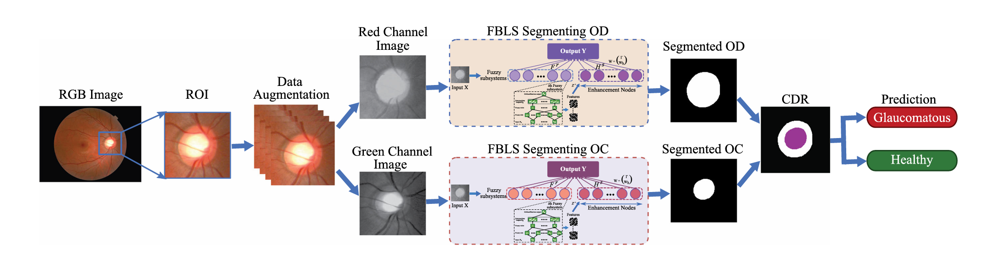
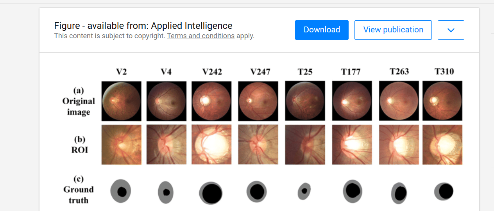
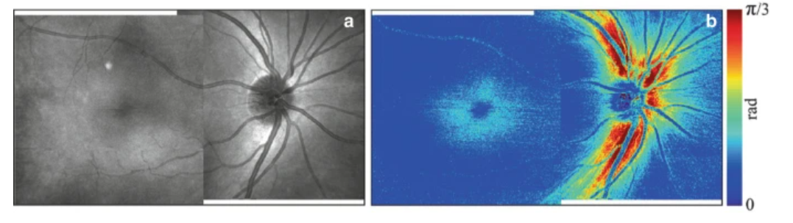

[toc]

## RNFL分割

找到有视盘视杯分割

视盘（optic disc，OD）

视杯（optic cup，OC）

视杯与视盘的直径之比就叫杯盘比，即C/D。正常C/D在0.3左右且一般不超过0.5。

 

公开数据集**RIM-ONE-r3**

数据集的ROI与RNFL区看着比较重合

##  其它

看了

1. ViT

2. swin-transformer

3. MAE

nature子刊等等没找到相关的

