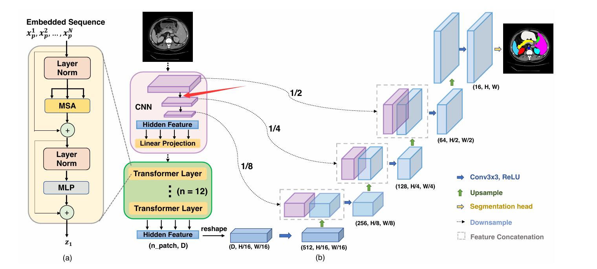

[toc]

## 学习

这周看了

1. trans-unet
2. swin-unet

## 实验练代码

### unet

DRIVE数据集在服务器上跑通，代码理解

### ViT

看pull的model的代码，跑通了一个tensor

### trans-unet

pull的项目：想先用一个tensor在本地过一遍model，一直报错，后在服务器上跑通，现成的项目配置和读预训练部分比较繁琐，没完全理解，后续改代码，让DRIVE的尺寸跑一遍

对着论文手搓的model：跑通了一个tensor，还没改到unet的框架去

### 踩坑/细节

1. 拉的源码是Linux环境下的，一开始想的是在win本地上跑通一个tensor，看看过每个层时tensor的shape再传服务器上，因为OS不一样一直报错
2. trans-unet原文没说这个卷积下采样的过程，一开始以为跟unet一样，后面发现源码是用的预训练的ResNetV2

## 后续

1. pull的trans-unet源码看完
2. 把trans-unet和swin-unet的model改到跑通了的unet框架上跑DRIVE
3. 看之前调研的剩的RNFL-VF的论文
4. 调研直接其它生成VF的方法

