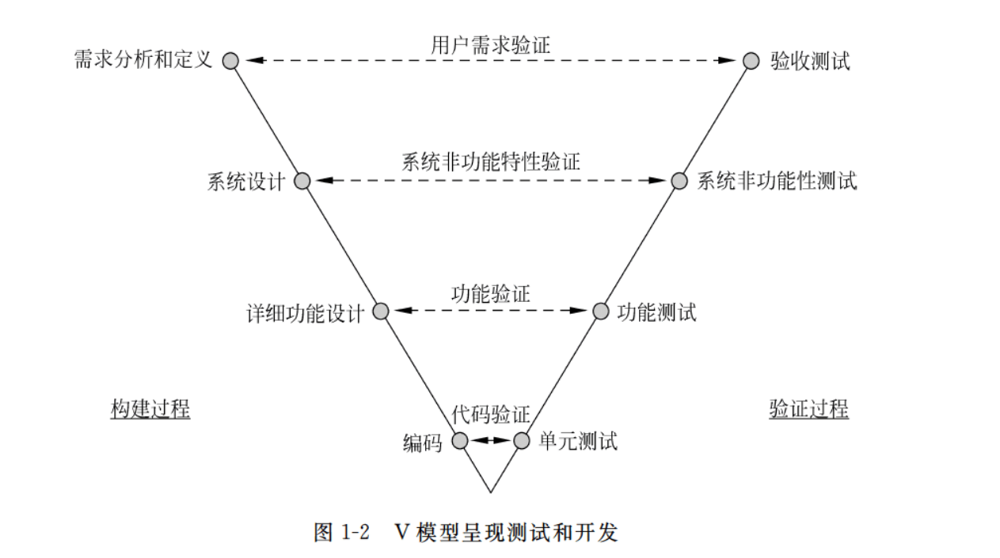

[toc]

## 软件工程

### 基本概念

#### 软件的概念和特点

概念：

软件是指计算机**程序**及其相关**文档**的集合。它是由一系列指令和数据组成，用于**实现特定的功能**或解决特定的问题。

#### 软件危机概念和原因

**什么是软件危机**：泛指在计算机软件的开发和维护过程中所遇到的一系列严重问题。

 

**出现软件危机的原因**主要有：

软件自身的特点

软件是逻辑部件，缺乏可见性

软件维护困难

软件越来越庞大和复杂，需要分工协作

#### 软件工程的定义、三要素和发展过程

软件工程是:

（**1）把系统的、规范的、可度量的方法用于软件的开发、运行和维护过程，也就是把工程应用于软件。
（2）研究（1）一中所提到的方法。**

软件工程包括三个要素：工具、方法和过程。

**工具：软件工程支撑环境
方法：怎么做
过程：工作步骤**

### 过程模型

#### 软件开发生命周期

软件开发生命周期是指软件从开始开发到最终交付使用的整个过程。它包括以下几个阶段：

需求分析：确定软件的功能需求和用户需求。
设计：设计软件的结构和模块，确定软件的架构和接口。
编码：根据设计文档编写程序代码。
测试：对程序进行测试，发现并修复错误。
部署：将程序部署到目标环境中，让用户可以使用。
维护：对软件进行修复和改进，以保证其正常运行。

#### 软件过程概念

和软件开发生命周期差不多

#### 能力成熟度模型

能力成熟度模型（Capability Maturity Model，简称CMM）是一种用于评估和改进组织软件开发过程成熟度的模型。它由美国卡内基梅隆大学软件工程研究所（SEI）开发。CMM将软件过程的成熟度分为五个等级：

1. **初始级（Initial）**：在这个阶段，软件过程是不稳定和不可预测的，缺乏定义和控制。项目的成功很大程度上依赖于个人的能力，而不是组织的过程。
2. **可管理级（Managed）**：在这个阶段，软件过程是可重复的，项目的性能和功能可以通过管理软件项目来控制。组织开始收集和使用数据来管理项目。
3. **已定义级（Defined）**：在这个阶段，软件过程是标准化的，组织有一套标准的过程来指导软件开发。这些过程被集成到组织的标准中，并且在整个组织中一致地应用。
4. **量化管理级（Quantitatively Managed）**：在这个阶段，软件过程是量化的，组织使用统计和量化技术来管理软件过程和项目。性能目标是基于量化数据来设定的，并且可以通过量化数据来控制。
5. **优化级（Optimizing）**：在这个阶段，软件过程是持续改进的，组织使用定量反馈来改进过程。组织不仅关注过程的执行，还关注过程的持续改进和创新。

#### 软件过程模型

当然，让我补充完整对这些软件过程模型的介绍：

1. **瀑布模型（Waterfall Model）**
   - **介绍：** 适合大型的，所有步骤依次来，设计、文档、编码、测试
   
2. **增量模型（Incremental Model）**
   - **介绍：** 功能慢慢增加的模型
   
3. **原型模型（Prototype Model）**
   - **介绍：** 类似敏捷开发
   
4. **螺旋模型（Spiral Model）**
   - **介绍：** 在敏捷开发的基础上，每一阶段加上风险评估
   
5. **喷泉模型（Fountain Model）**
   - **介绍：** 强调迭代和并行开发。在喷泉模型中，软件开发的各个阶段（需求、设计、实现、测试）可以重叠和并行进行，类似于喷泉中的水流。

[软件工程 -- 数据流图的画法_数据流图怎么画-CSDN博客](https://blog.csdn.net/I_r_o_n_M_a_n/article/details/121309525)

### 需求分析

#### 需求分析的过程

需求确认与需求变更

#### 需求确认的步骤

需求获取→需求提炼→需求描述→需求验证

#### 数据流图

[软件工程 -- 数据流图的画法_数据流图怎么画-CSDN博客](https://blog.csdn.net/I_r_o_n_M_a_n/article/details/121309525)

#### 用例图

### 系统设计

### 软件测试

#### V模型

1. **需求**验证对应**验收测试**,**客户需求的确认**测试
2. **系统设计**的验证对应**系统非功能性测试**
3. 产品**详细功能设计**的验证对应**功能测试**
4. **编码**阶段的**代码验证**对应**单元测试**和**集成测试**

#### 单元测试（Unit Testing）

单元测试是对软件中最小的可测试部分进行检查和验证的过程。通常，这些最小的部分是指单个函数、方法或对象。单元测试的目的是隔离代码的一部分并验证其正确性。

- **内容**：单元测试通常由开发人员编写，主要关注代码的内部结构和逻辑。
- **分类**：单元测试没有特定的分类，但可以根据测试的数据类型（如正常值、边界值、异常值）或测试的技术（如断言测试、模拟测试）来区分。

#### 集成测试（Integration Testing）

集成测试是在单元测试之后进行的，目的是检查多个单元或组件集成在一起时是否能够正常工作。

- **分类**：
  1. **自顶向下测试**：从系统的主控模块开始，逐步测试向下一层的模块。
  2. **自底向上测试**：从底层模块开始测试，逐步集成并测试向上的模块。
  3. **大批量测试**：一次性将所有模块集成在一起进行测试。
  4. **增量测试**：逐步将一个个或一组组模块集成到现有系统中并进行测试。
  5. **三明治测试**：在自顶向下和自底向上测试中，被测试模块的下层和上层模块用桩模块（Stub）和驱动模块（Driver）来代替。

#### 系统测试（System Testing）

系统测试是对完整的、集成的软件系统进行的测试，目的是检查系统作为一个整体是否满足规定的需求。

- **分类**：
  1. **功能测试**：验证系统的所有功能是否按照需求规格说明书的要求正常工作。
  2. **性能测试**：评估系统的速度、响应时间、稳定性、资源消耗等性能指标。
  3. **安全性测试**：检查系统的安全性，包括认证、授权、数据加密和防止非法入侵等。
  4. **可用性测试**：评估系统是否易于使用，包括用户界面和用户体验。
  5. **兼容性测试**：确保系统能够在不同的硬件、软件、网络环境和数据格式中正常工作。
  6. **恢复测试**：测试系统在发生故障后能否恢复正常运行。

#### 验收测试（Acceptance Testing）

验收测试是在软件开发完成后，客户或用户进行的测试，以决定软件是否满足业务需求和是否可以接受。

- **分类**：
  1. **Alpha 测试**：由开发者在内部进行的测试，模拟实际用户的使用环境。
  2. **Beta 测试**：由实际用户在开发环境之外进行的测试，通常用于测试软件的公测版本。
  3. **用户验收测试（UAT）**：由最终用户在实际的业务环境中进行的测试，以验证软件是否满足他们的业务需求。
  4. **合同测试**：根据合同中规定的测试标准和条件进行的测试，通常涉及第三方测试机构。
  5. **性能基准测试**：测试软件是否满足特定的性能标准，这些标准通常在合同中定义。

每种测试类型都关注软件的不同方面，并且在整个软件开发生命周期中发挥着重要作用，以确保最终交付的软件产品能够满足用户的需求和期望。

#### 回归测试

回归测试的目的是确认软件的修改没有引入新的错误，并且原有功能仍然按照预期工作。

#### 黑盒白盒静态分析

白盒测试、黑盒测试和静态分析是软件测试和代码分析的三种不同方法，它们从不同的角度来检查软件的质量和正确性。

##### 白盒测试（White-box Testing）

白盒测试又称为结构测试或逻辑驱动测试，测试者需要了解程序内部的逻辑和结构。白盒测试的目的是验证代码内部的操作是否按照预期执行。

**方法包括：**
1. **路径测试**：确保代码中的每条路径都至少执行一次。
2. **分支测试**：检查所有的决策点（如if语句、循环等）。
3. **条件测试**：验证每个条件表达式的结果是否正确。
4. **语句测试**：确保每条语句至少执行一次。
5. **循环测试**：检查循环结构是否正确执行，包括循环的入口和出口条件。
6. **集成测试**：在模块或组件级别上进行测试，确保它们在集成后能够正确交互。
7. **单元测试**：关注单个函数或方法的正确性。

##### 黑盒测试（Black-box Testing）

黑盒测试是功能测试的一种，测试者不需要了解程序内部的逻辑和结构，只关注程序的输入和输出。黑盒测试的目的是验证软件的功能是否满足需求规格。

**方法包括：**
1. **等价类划分**：将输入数据分为若干等价类，每个类中的值对程序的响应是相同的。
2. **边界值分析**：测试输入数据的边界值，这些值往往有更高的概率发现错误。
3. **决策表测试**：使用决策表来表示复杂的业务逻辑，并测试所有可能的条件组合。
4. **状态转换测试**：适用于有状态的系统，测试状态之间的转换是否正确。
5. **错误猜测**：基于经验和直觉来选择测试用例。
6. **随机测试**：随机选择输入数据进行测试，这种方法通常用于探索性测试。

##### 静态分析（Static Analysis）

静态分析不涉及程序的执行，而是通过分析源代码、字节码或二进制代码来发现潜在的错误、漏洞或不符合编码标准的地方。

**方法包括：**
1. **语法分析**：检查代码是否符合编程语言的语法规则。
2. **代码审查**：人工阅读代码，检查代码质量和一致性。
3. **自动化工具检查**：使用静态分析工具来识别代码中的潜在问题，如未初始化的变量、空指针引用等。
4. **复杂度分析**：评估代码的复杂度，如循环复杂度，以识别可能难以维护或测试的代码区域。
5. **规则检查**：根据编码标准或最佳实践来检查代码，例如检查是否遵循了命名约定。
6. **依赖性分析**：分析代码中的依赖关系，以识别不必要的依赖或循环依赖。
7. **数据流分析**：分析数据在程序中的流动，以检查潜在的数据竞争或死代码。

每种方法都有其优势和局限性，通常在实践中会结合使用多种方法来提高软件测试和分析的全面性和有效性。

##### 逻辑覆盖与等价类划分

见上学期笔记

### 软件维护

1. **软件维护的基本概念**
    软件维护是指在软件系统交付使用后，为了修复软件缺陷、改善性能、适应环境变化或满足新的需求而进行的修改和改进活动。维护是软件开发生命周期中持续时间最长的阶段，它包括一系列的活动，如错误修复、性能优化、功能增强、代码重构、文档更新等。

2. **软件维护的四个基本类型：**
   - **纠错性维护（Corrective Maintenance）**：修复软件中发现的错误或缺陷。这是最常见的维护类型，通常在软件交付后不久进行。
   - **适应性维护（Adaptive Maintenance）**：使软件能够适应环境变化，如操作系统升级、硬件更换或数据格式变更。
   - **完善性维护（Perfective Maintenance）**：在不影响系统现有功能的前提下，增加新的功能或提高性能，以提升软件的可用性和用户满意度。
   - **预防性维护（Preventive Maintenance）**：通过重构代码、改进设计来预防未来可能出现的错误，提高软件的可维护性和可扩展性。

   在实际的软件维护中，纠错性维护通常占比重最大，因为它是响应用户报告的错误和系统故障的必要措施。预防性维护可能占比最小，因为它是一种主动的、预防性的活动，往往需要额外的资源投入，且其效果可能不会立即显现。

3. **可维护性的决定因素**
    可维护性是指软件能够多容易地进行维护，包括理解、修改、测试和部署等。决定可维护性的因素包括：
  - **代码质量**：清晰、规范的代码更容易维护。
  - **文档完整性**：良好的文档可以帮助维护人员理解系统的设计和实现。
  - **设计质量**：模块化、松耦合的设计使得系统更容易修改和扩展。
  - **测试覆盖率**：全面的测试可以减少维护时引入新错误的风险。
  - **软件复杂度**：较低的复杂度有助于减少维护的难度。
  - **开发和维护工具**：有效的工具可以提高维护的效率。

4. **软件维护过程模型**
    软件维护过程模型描述了维护活动的组织和流程，常见的模型包括：
  - **瀑布模型**：维护活动按照严格的顺序进行，每个阶段完成后才能进入下一个阶段。
  - **迭代模型**：维护活动被组织成一系列的迭代周期，每个周期都包括需求分析、设计、实施和验证。
  - **增量模型**：软件的维护和更新是逐步进行的，每次增量都包含新的功能或改进。

5. **软件再工程（Software Reengineering）**
    软件再工程是指对现有软件系统进行分析和改造，以提高其可维护性、性能或适应性。再工程可能包括重构代码、改进架构、更新技术栈等活动。

6. **逆向工程（Reverse Engineering）**
    逆向工程是指从现有的软件系统中提取出设计信息，如数据流、架构、接口等，以便于理解、维护或重构系统。逆向工程通常用于缺乏充分文档支持的遗留系统，或者在需要集成不同系统时识别和理解现有系统的结构和功能。

### 项目管理

#### 项目管理四要素

人员、产品、项目、过程

#### 软件度量方法

生产率估计（基于规模（KLOC）、基于功能点（FP））、工作量度 量（算法成本模型、COCOMO模型）。掌握直接测量（基于规模）方法

#### 项目计划与风险管理的概念

## 计算机网络

### 计算机网络和因特网

#### 分组交换和电路交换

##### 分组交换

平时想的那种，一个包一个包地发。

##### 电路交换

P19

跟打电话一样的，提前预留好带宽。

一条链路里有多条电路。

一个时分复用算传输时间的例子P21顶

##### 二者的比较

P21

+ 电路交换

电路交换是一种建立点对点连接的通信方式。在电路交换中，通信双方需要先建立一条物理电路，然后在这条电路上进行通信。在通信过程中，整条电路都被占用，只有两端设备之间的数据才能在电路上传输，因此电路交换**需要占用大量的资源**。

电路交换的原理是**基于电路的连接**，通信双方需要占用一定的带宽和资源，因此在通信过程中可以保证传输的可靠性和实时性。

+ 分组交换

分组交换是一种将数据分成小块（数据包）进行传输的通信方式。在分组交换中，数据包在传输过程中需要经过多个网络设备（如路由器、交换机）的转发，每个设备只需要处理数据包的一部分，因此分组交换可以**更加高效地利用网络资源**。

分组交换的原理是**基于数据包的交换**，将数据分成小块进行传输，每个数据包都会携带目标地址和源地址等信息，网络设备根据这些信息来转发数据包。由于分组交换不需要占用整条电路，因此可以更加高效地利用网络资源，但也可能会出现数据丢失或延迟等问题。

