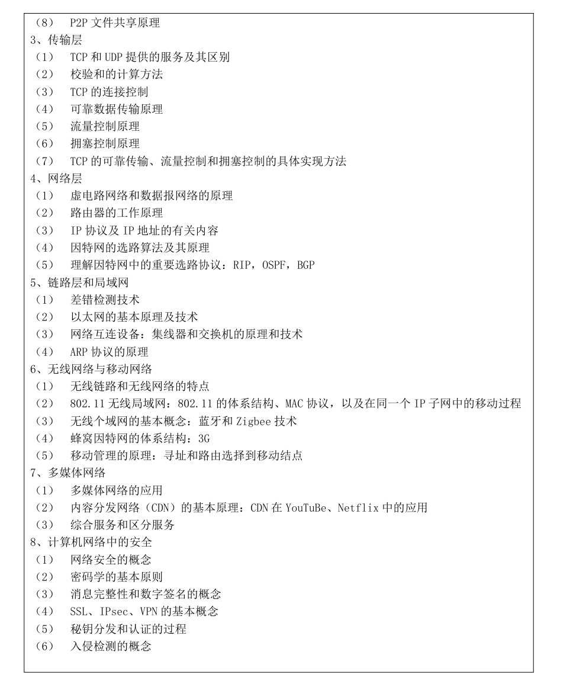

预推免

账号：20253305349

密码：TJyjy7221592

夏令营

账号：20252206792

密码：TJyjy7221592

群号：978778339

[toc]

面试流程：

（1）考生3分钟自我介绍（可外语），介绍本人学习、科研、社会实践或实际工作表现等。仅限口述表达。

（2）外语能力考查（不少于5分钟）。由面试专家组对考生的口语和听力进行测试。

（3）专业知识考查。题库中抽取题目作答，重点考查程序设计、算法设计与分析、软件工程、计算机组成原理、数据库、计算机网络、编译原理、密码学（该科目限报考083900网络空间安全专业考生）等基础知识情况。

（4）专业素质和能力考查。

每个考生面试考核时间一般不少于20分钟。

（1）复试内容：

①英语测试：包含但不限于口语、听力、阅读、翻译等形式。

②综合面试：包含专业素质和能力、综合素质和能力等方面的考察。

（2）复试流程

每个考生面试时间一般不少于20分钟。具体流程是：

①考生3分钟自我介绍（可英语），介绍本人学习、科研、社会实践或实际工作表现等。

②外语能力考查（不少于5分钟）。由复试专家组对考生的口语和听力进行测试。

③专业知识考查。题库中抽取题目作答，重点考查程序设计、算法设计与分析、软件工程、计算机组成原理、数据库、计算机网络、编译原理、密码学（该科目限报考083900网络空间安全专业考生）等基础知识情况。

④专业素质和能力考查。

（3）复试要求：

复试满分300分，外语测试满分100分，综合测试满分200分，复试各项成绩按四舍五入取整数。考生复试成绩总分须达到180分，否则复试不合格。复试成绩不合格者不予录取。

录取优先顺序为：各专业第一志愿考生优先级大于调剂考生。同一优先级按复试总成绩从高到低依次择优录取。若复试总成绩相同，依次比较综合面试成绩、英语测试成绩，从高到低择优录取。

[电子科技大学2021年计算机保研经验贴 - 知乎 (zhihu.com)](https://zhuanlan.zhihu.com/p/440421032)

[2023年（2024届）四非ACMer计算机保研 全程 0 offer上岸北航经验贴（厦大信院、西电杭AI、北邮AI、华师CS、北航SE、电科深、吉大软院） - 知乎 (zhihu.com)](https://zhuanlan.zhihu.com/p/659991998)

[2023年（2024届）计算机保研经验帖｜末2跨专业上岸东南大学PALM｜东南大学CS、北大信工CS、浙软SE、厦大MAC、北师大AI、电科CS……｜一篇非常详细的经验帖，希望能够对大家有帮助！ - 知乎 (zhihu.com)https://zhuanlan.zhihu.com/p/659869954)

[2023年（2024届）双非计算机保研经验贴（东南、成电、国防科大、浙软、湖大） - 知乎 (zhihu.com)](https://zhuanlan.zhihu.com/p/659109129)

[23(24届)计算机保研经验贴｜末流211上岸华工｜西交软、电科CS、北理前沿院、华工CS、北师大AI、川大CS、大工CS、重大CS、湖大CS - 知乎 (zhihu.com)](https://zhuanlan.zhihu.com/p/661226536)

[2022计算机保研边缘人的挣扎之路（东南、武大、国防科大、信工所、川大、西交，天大佐治亚、央音、东北大、电科深、西工大、山大）_信工所计算机什么水平-CSDN博客](https://blog.csdn.net/qq_50764810/article/details/127028093)

[保研经验分享（双非计算机上岸成电） – 码途拾遗 (fangkaipeng.com)](https://fangkaipeng.com/?p=2103)

[电子科技大学编译原理复习笔记（二）：数据类型_类型等价和名字等价-CSDN博客](https://blog.csdn.net/m0_59180666/article/details/130870876)

## A

成电是我入的第一个线下夏令营，所有费用都要自费。给我们发了校园卡，但需要自己充钱，反观其他报销食宿的学校，我只能xm了

**面试：**（20分钟）
自己打印简历，进去发给老师
自我介绍（可英文可中文）

英文提问：
如何设定baseline的？（老师声音很小，讲了好几次才听清）
介绍一下elasticsearch（简历上的）

抽题： 网络软件有哪几种架构？分别举例？（运气不好，抽到软工了，什么都不会，一开始回答到计网那边去了，结果被打断了，说再仔细看题）

中文提问： 介绍一下elasticsearch（跟英文老师问的一样）
美赛负责什么
国赛最后模型结果怎么样
Java怎么实现优先权队列（简历写的熟悉Java）
Java怎么实现堆
未来研究方向的认识

**总结：**
第一次线下，紧张，加上专业课抽的逆天，最后拿不到优营也理所应当了
宣讲时说的是夏令营100名额，预推免100名额
成电往年都是弱com，今年夏令营突然改强com，但是只发优营，不给候补很离谱。补：预推免又改成弱com，导师推荐了，逆天

## B

由于是本科学校在西南地区，因此电科和川大是我入营的首选（主要想积累一个经验），不过夏令营阶段川大CS没能入营。**夏令营前我联系了3位电科CS的强导，都没有得到邮件回复**（后续我知道了个内部消息：今年电科老师统一口径，夏令营不怎么回复同学，且强导一般收本校的学生），**但还是顺利入营了**。中间有一段小插曲，我联系了电科软院的一位老师，老师人不错，表示可以接收，但是后续我考虑到个人未来发展，还是选择放弃。

电科招生政策其实很好，夏令营给100个offer，预推免给100个offer，毕竟大部分夏令营的同学都是鸽子（事实证明，确实如此）。

第一天是CS学院的大部分课题组进行宣传，会签到，早上听的人很多，下午好像跑了不少。第二天是夏令营考核，**纯面试，1个人15min，内容包括自我介绍+英语问题+专业课+简历面**。由于是推免的第一场，我的英语口语问题没怎么准备，当时为了不让老师英语印象分打太低，我选择了用英语2min自我介绍（前一天晚上在酒店背了好久呜呜呜）。但是老师似乎看到我用英语自我介绍，说明对英语比较有信心？？？所以疯狂拷打我英语问题，大概有快8个，我只回答出了一半，有一些没听懂（英语听力渣），然后是专业题（在电脑上随机抽题），抽了一道Leetcode原题，大概Easy难度，主要考察算法逻辑。最后是老师针对我的简历提问，由于之前陶瓷过老师都经历过面试，所以这个环节自我感觉不错（仅有的）哈哈哈。

结果是G，遗憾离场，英语分太低了，而且夏令营不作候补，**如果真心想来电科的同学可以把重心放在预推免**，在预推免阶段需要有电科的老师给出推荐信，而且面试难度应该下降些。

## C

因为飞书群中，现实我的面试号码是**小组11号**，我推测是下午面试。

- 所以早上9点醒来后，洗漱后我慢悠悠先去吃了**早餐**
- 9点四十修改了下简历后，去打印店打印了面试需要的**简历**。
- 回到酒店10点半，**突然飞书收到消息，下下个到我面试了？**
- 我**原本还打算中午复习一段时间的**呢，**没想到鸽子这么多啊**

好在酒店就在电科对面，飞奔到面试教室的时候

**刚好叫到我了**

- **英语**

- - 先是自我介绍，厦大、北航的时候我已经背了很多遍了，即使当天没看我也能背出来。

  - - 不过感觉我自我介绍的口语发音和流利度还是很好的，感觉每次这一栏老师们都一直点头很满意。

  - （英文提问）我们实验室界面有很多方向，你最感兴趣的是哪一个方向？

  - （英文问的）说一下你最感兴趣的一个方向的算法？并告诉我具体思想是什么？

- **综合面试**

- - JAVA中的序列化和反序列化的作用是什么？不可以直接传字节流吗？
  - 其余时间全部都在问我的校级大创项目，没有问任何专业课。

感觉英语和项目表现的都不错，拟录取应该是有戏

早早面完之后，**预推免所有能参加的面试就已经结束**了，于是我回到宾馆就继续放松摆烂了。

9月27日下午，我坐飞机回到了厦门，打车回学校水群的同时，发现**电科深的面试结果出了**。

- 官网公布预推免的考核通过名单！我的名字后面，跟着“**通过**”二字，

## D

**笔试经验**

**无笔试**

**面试经验**

一、面试形式

1.由于电子大学基础院计科专业的老师相对较少，一般面试的老师较为固定，五位老师，可能还会有一位记录员。

2.首先会让同学进行简短的英文自我介绍，大概准备一分钟的自我介绍就行了。自我介绍完之后，老师可能会问一些简单的英语问题，不要过于紧张，都是一些比较基础的，说出你的想法就行了。

3.自我介绍完之后，就是专业知识问答。

信息学，可以准备一下相关的小知识点，不能直接给出答案也没关系，你可以主动说说你的思路，老师可能会给你一些引导。其他老师会问一些专业知识上的小问题，比如Linux的命令等。

4. 除了专业知识以外，老师会提出一些开放性问题。有些是关于政治的，这类问题只要思想正确，一般是没有问题的，有些是关于同学自身的，真诚地回答内心的想法就可以。

二、面试真题

1. 真题列举

(1).Linux文件系统的命令

(2).学过Java的话，java中equals()和==的区别

(3).找到8个物品中最轻的最少找几次？

(4).一些专业词汇用英语怎么说，比如算法的英文是algorithms

(5).自己的优缺点

(6).读研的规划，打算读博吗？

(7).怎么理解绿水青山就是金山银山？

一般来讲,考核题目不会太偏,大多是大家接触过的内容,所以当场不能紧张，就按部就班地答题就好。具体回答过程中，要注意的就是:①逻辑顺畅，不要出现明显漏洞，能够自圆其说;②要点清晰，突出要点;③适当展开和发散，讲得具体生动。

2.面试注意事项。

①不要紧张，老师都比较友好，记得保持微笑。

②态度谦和，一定听完老师的问题之后再回答。

③有来有往，注意和老师保持友好互动。

**其他考核部分**

每年参加夏令营的人数比较多，竞争也比较大。如果能够获得夏令营的入场券还是很不错的，很幸运的也是自己实力的体现，自身实力也强。

夏令营的活动大多是学院了解，专业介绍以及导师介绍，最后进行夏令营面试，选拔优秀营员，有些导师还会组织一些相关的学术面试。

**英语面试：**最主要考察自身的英语水平，问的都是一些相对简单的问题，考察面对英语问题时的处理能力，大多都是日常交流的问题，以及一些简单的提问，沉着冷静回答问题就行，不用过于紧张，好好表现就行，好好的发挥。

**专业课面试：**主要涉及一些专业核心基础知识以及专业前沿知识方面的提问，老师会根据你说的进行深入挖掘，目的就是让你回答不上来，直到你答不上为止。考验了你对专业知识的掌握能力，以及分析问题的能力。当遇到不会的问题的时候，如实的回答就行，切忌不懂装懂，这是不行的。

**综合面试：**主要是问一些关于读研以后的规划，想不想读博，以及怎么在实验室跟师兄师姐相处，还有就是考察你一些为人处世的能力，品行等。只要好好的表现，结果都不会太差，相信自己是最棒的。

**讲座形式：**各个老师也会给你介绍自己的研究方向，会留下自己的一些联系方式，如果你比较兴趣的话，可以去找老师在详细的聊一聊，了解老师的一些最新研究方向，最终确定自己的未来想从事的研究方向，最终确定自己的意向导师，多跟师兄师姐以及老师聊聊，增加对你的印象。

**送给学弟学妹的话**

如果想要保研，本科前三年的绩点一定不能落下，其次就是要多参加学术比赛，有意识地去关注学术研究，培养学术自身的素养。

其次是保研择校时，要清晰定位，切忌把目标定得太高，毕竟保研竞争也很激烈， 保研是一个漫长的过程，需要我们从大一开始就认真刷绩点和排名，努力学习，同时注重各种软实力的提升。在这个过程中，我们会逐渐认清自己的实力与不足，痛苦着也成长着。

无论是保研前的准备、笔试或面试技巧还是最后的择校，都需要大家提前的了解，因此信息的搜集十分重要，赶早不赶晚，对于心仪的学校一定要提前了解并做好准备，不要错过而留下遗憾。另外，要有短期和长期的计划，短期内计划好学习什么科目，阅读什么书籍，有针对性地根据学校要求来准备，长期来看要了解自己是想走学术还是实务，这一点会直接影响到学校的选择。

祝各位学弟学妹心想事成，去到自己想去的学校！

## E

- **入营bar**：好像是第一年强com，1400进450左右，竞争还是很激烈的，学校稍差的同学应该要很卡rk，另外应该也卡英语，碰到了很多西电的同学

- **夏令营流程**：7月4日，7月5日，一天宣讲+一天考核（只有面试）

- **宣讲**：感觉电科的老师和团队都太强了，组里资源很多（好多卡），产出恐怖，很羡慕但鼠鼠不配，宣讲很热情认真

- **考核**：面试，先是自我介绍3分钟内，然后是英语面试（100分），然后是专业抽题回答+简历面（200分）

- **英语面试**：常规的日常口语，**估计是因为我写了口语B+的原因**，面试老师直接猛问，但是是第一场面试，又没准备好，答的稀巴烂

- - 你的家乡在哪里？描述一下家乡的特点？
  - 描述一下你的学校特点？
  - 你最喜欢的书是？为什么？作者是？（作者是俄国人我真的要哭啦）
  - 你最喜欢的电影是？作者是？情节是？作者是哪个国家的？
  - 你的最好的朋友是谁？为什么？
  - 你的爱好是什么？
  - 你最喜欢的课程是？（注意不要给自己挖坑啊，我这里说的xxxxx课程（虽然确实菜），但是后面问到有个知识点忘了，被质疑前面说最喜欢的是xxxx了）；
  - 讲讲研究生规划？
  - 你感兴趣的方向是什么？

- **专业抽题**：是**真的硬核**，题库包括408（无OS）+数据库+软件工程+编译原理，网安同学还有密码学，我抽的是计网的大题，是真的硬核，给出字母要你在黑板上画图计算，问我 有关传输时延和传播时延非常细节的计算题，及其在各种特殊情况下的计算（不方便细说）；鼠鼠真的菜，只会最简单的第一问，后面把图画到黑板上就摆烂了

- **简历面**：一些常规问题，比如项目所使用model的输入输出是怎样的，蓝桥杯为什么国赛没有奖（艹），科研经历的主要承担工作等，科研经历预测的效果等

- **考核结果**：自然是寄了，英语炸的很惨，综合面出乎意料的还行，但也不理想，电科不给wl；鼠鼠还是菜了；考核给分相对公平，有给出两项的得分，相对透明，获得优营的同学需要在一定时间内双选

## F

预推免的过程还是有点波折的。因为，我4月份就进组学习了，虽然没有啥成果产出，但也和一个博士学长定了研究方向，也做了一些工作。所以，我也算对实验室的整体情况和科研的过程有了大致的了解，然后导师有次问我有没有直博的想法，考虑了一天我也就同意了。我是觉得，直博5年也就多2年，我们组也基本不怕毕不了业，并且直博的话整个科研的时间和环境和更好一点，不会受到很多外界因素的干扰。而且，成电面试是分直博和硕士两个的，可以同时参加，到时候可以选择，所以也不至于没书读。然后就准备面试，成电面试主要分为：自我介绍、英文考察、算法能力考察、简历和专业知识提问。下面分点介绍：

- 自我介绍，直博5分钟需要PPT（今年刚有的），硕士3分钟，可以中文可以英文，推荐有能力的上英文。
- 英文考察可能问生活问题（所在城市、喜欢的电影、喜欢的运动等），也可能问简历上的项目问题。我直博的时候问的是简历问题，硕士面试是生活问题，但也有同学硕士面试的是简历问题，所有都需要好好准备。
- 算法能力考查，现场抽一道题，给你一分钟左右思考，然后口述实现方法。ACMer直接手撕啦，直博面试一道DP题，硕士面试一道数据结构题。推荐看Acwing课+LeetCode刷题（可以不写代码，口述思路）。
- 简历和专业知识提问，我被问的都是简历上的内容，如果简历的东西比较少，可能会问专业课的知识。

报名预推免的时候，导师还建议我报电子信息的直博（比较容易一点），是工程类博士，虽然基本没啥差别，但是我看了培养方案里的课程，都是一些通信、光电之类的课程，果断放弃。当时就想着试试计算机的直博，要是没通过，读个硕士再努力转博吧（虽然，听说我们组里转博的竞争很大很大）。准备面试的时候，导师和带我的博士学长也给了我很多帮助。我一个刚入门的科研小白，用词表述都不是很 academic，PPT里写的科研进展和未来计划表达都不是很好。然后学长给了我一个比较好的模板（一位学姐硕博连读的答辩模板），然后最后又帮我在一些用词上完善了一下，整个逼格都高了几个档次，再次感谢学长！！

面试表现也很不错，最担心的英语也都回答上来了，没有尬住。最后顺利直博，还是唯一的本科来自双非的（小小的骄傲一下）。现在想想，我之所以能成功通过，**提前套磁** 非常重要。不仅仅是因为成电弱com，还是因为可以提早进组学习，弥补我在科研上的短板。要是没有这段时间的科研学习经历，我都不知道在直博面试上说点啥了（有专门的科研工作介绍环节）。

最后，还有个提醒的点是，不建议大家学我的破釜沉舟，还是要**多报几个保底学校**，即使是成电这样的弱com学校，我们导师今年也有学生在面试的时候被刷了，今年预推免报名的人实在太多了，还有很多都是成电本校的（包括很多跨专业的同学）。

## G预推免

电子科大预推免面试
线下面试在电科清水河校区，分为英语自我介绍三分钟+英语问答（英语一共要8分钟）+综合问答（不需要ppt）
三分钟英语自我介绍
英语问答（5分钟）问了两个
1、看简历上你参加了全国大学生英语能力大赛，请讲一下比赛的内容和你的收获
2、看简历上你有一篇论文在投，请讲一下你这篇论文的的核心（摘要）
抽题 ：1-22选一个序号 抽到了 头节点头指针首节点的区别（有问前面的同学 有考前序中序后序在黑板上写出 还有给你图考prim算法在黑板上画图 还有考迪杰斯特拉的画图）然后前面同学选过的序号就没有了 所以感觉随机排名排在前面可能选择性多一些
根据简历回答问题：前后端是你自己全部做完的吗？你做了哪些工作呢？论文的改进点在哪？yolo的项目做了哪些工作？有哪些收获？二维的图像转三维空间坐标有哪些问题需要解决 等等 全是简历问题 （不过我问前面的姐妹好像简历不够丰富的 还问了个毫无相关的朴素贝叶斯的公式要求写在黑板上）
PS：
1、成电今年很不一样，首先是夏令营面试考核，优营有了效力，然后学硕90名额，夏令营优营70，所以预推免学硕只录20个，并且今年不允许调剂学硕不能调剂到专硕，当时去成都的路上真的慌了，很害怕没书读，当时其实有点后悔报学硕，专硕要稳一些。

2、总之到这个面试的前一天仍然非常刻苦的背英语，复习c语言+数据结构+算法，从下午到成都一直复习到了凌晨，睡前又背了英文自我介绍，当天面试的问题都回答上了，还算很不错，最后取得了很靠前的面试成绩，拟录取！！

## H预推免

电子科技大学
当时八月底联系了一位导师，因为电科是必须要联系导师的，要拿到导师的推荐信才能进入九月复试，所以建议学弟学妹还是尽早联系，我当时联系已经算是很晚了，有名额的导师已经不算很多了。

跟老师的第一次交流是对着简历提问，当时老师还算是比较满意，说还有一轮，给了我一篇ECCV的论文，说看完了做个PPT汇报讲给他听。然后就开始啃论文了，花了四天的时间把论文的内容基本看完了，做了个PPT给老师汇报，汇报的时候因为提前自己大概演练了七八遍，感觉讲的还不错，但在提问环节还是有一些不足，老师对实验部分有个提问，没有解释清楚，当时以为自己凉了，最后结果是排第二。当时老师说他只有一个名额，我排第二，大概率是前面那个同学，我还是找老师给我写了推荐信。

当时已经对电科不抱有希望了，感觉自己很难争取到电科的机会了，也做好去西工大的准备了。

到了复试，复试算是面试里面比较正规的，用飞书打卡，先是3分钟自我介绍，然后是英文提问，再然后抽签答专业课（主要考算法），最后是自由提问环节。

到了26号出结果，我在复试名单排在十几名的位置，算是比较靠前的名次，又联系了导师，导师决定要我，至此决定去成电。

最终结果：通过

## I

[电子科技大学 计算机 保研分享_电子科技大学计算机保研夏令营-CSDN博客](https://blog.csdn.net/qq_36183881/article/details/101524861)

## xhs1

电子科技大学夏令营面试经验

电子科技大学计算机学院夏令营考核形式
今年的电科夏令营是强com。
夏令营有两天，第一天宣讲第二天面试。
面试的时候不能在面试教室旁边逗留，有志愿者在门口守着。
每个教室都有接待志愿者和主持人。每个环节都有严格的计时，每个人面试时间实际上是15min左右。
先是自我介绍3min，可以选择英语，如果大家英语好的话就英语吧。
然后是5分钟英语问题，问的都是一些很常规的问题，之前找的英语面试资料看过，自己也都准备过。比如介绍一下你的大学，介绍一下你的专业，说下你的意向研究方向之类的。
另外如果他对你自我介绍的一些东西有兴趣的话还会问你一些个性化的问题。英语问答也是严格计时的！甚至还会有最后十秒的倒计时，计时结束就最好不要再说了。
之后专业课考察。专业课考察本来应该是按照不同的报名方向考察内容也不同的。不过电科后来决定全都合并在一起了，所以就只考察了计算机专业的核心课程专业内容。
问题是在电脑上盲抽一个编号，然后他会给你看相应的问题，然后就自己回答吧。一般是一个简述题，可以多说一点的那种，抽到的是动态规划和分治。也有人考查到迪杰斯特拉算法或者计算机网络分层结构。
再之后就是老师提问，他会根据你的简历问你一些他对你感兴趣的问题。比如介绍一下简历上的项目和比赛，会问印象最深刻的项目是什么，会问数学类课程成绩之类的。

