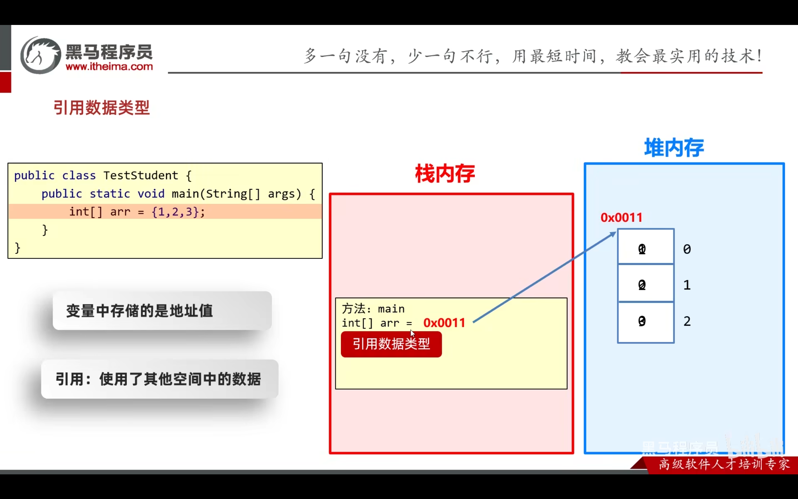
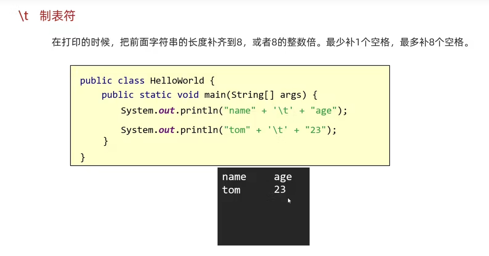
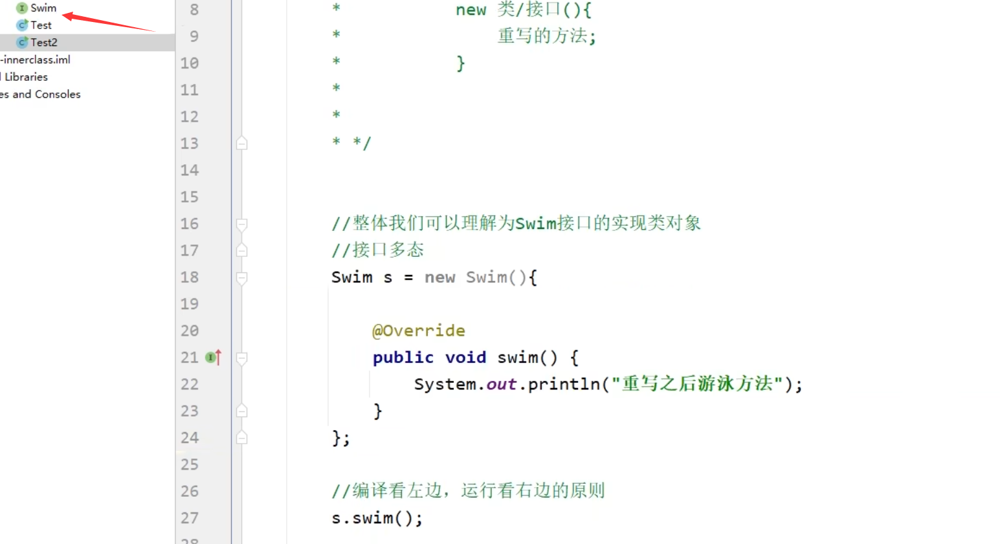

[toc]

## 变量

### 进制

java7之后的特性

 

### 变量范围

 

### 驼峰命名

 

### 引用数据类型

 

变量存放的不是栈中的值，而是指向堆中的地址，那么就是引用数据

 


## 数组

### 数组的静态初始化

 


 

### 数组的动态初始化

 

虚拟机会给出arr的默认初始化值

 


### 地址

```java
int [] a1 = {1,2,3,4,5,6,7,8,9};
System.out.println(a1);
```

```
[I@b4c966a
```

I:int类型

@是at

后面是数组地址值

### 获取长度

```java
arr.length
```

### 数组内存

 


 

两个指向同一空间


### 二维数组

 

内存：

 


 


## 字符串

### 制表符



### 加号拼接

 

### String初始化

 


### 串池StringTable

 

专门保存直接赋值类型的String，在堆中

两个String都是直接赋值的话会指向串池中同一个地址，节约了内存空间

### new出来的String

 

### 字符串比较

==是比较引用地址

用equals完全地比较

用equalsIgnoreCase忽略大小写比较（验证码）

### 遍历快捷键

 

IDEA中.length().fori

### 返回索引对应字符

```java
String str = "123a";
char c = str.CharAt(3);
```

c的值是a

### StringBuilder

提高字符串操作效率

 

普通的s6的计算逻辑是先把s1和s2拼成临时的，然后占掉一块内存，又去和剩下的拼

 

StringBuilder直接在容器内操作

方法：

 


### subString

```java
public String substring(int beginIndex)

public String substring(int beginIndex, int endIndex)
```

### StringJoiner

 

可以指定间隔、开始、结束符号

### 字符串拼接底层逻辑

三个全是串池的：

 

有变量参与拼接：

JDK自动搞出StringBuilder然后append得来

 

### 字符串扩容底层原理


### 隐式转换/强制转换

#### 隐式转换

 

取值范围小的直接给取值范围大的

 


对于规则2：

  

#### 强制转换

  

直接把大范围赋给小范围会报错


## 包装类


## ArrayList

自动扩容

只能存引用数据类型，不能存int等基本数据类型，但是Integer可以

### 方法

 

E：泛型

```java
ArrayList<String> list = new ArrayList<>();
```

后面这个泛型可以省略不写

### 快捷键遍历

```java
ArrayList<String> list = new ArrayList<>();

list.fori
```

直接遍历出现

```java
for (int i = 0; i < list.size(); i++) {}
```


 


## 运算符

### 逻辑运算符

 

Java中只有一个符号也可以判断

### 短路逻辑运算符

 

把&改成&&

把|改成||

这样就会先判断左边，如果左边已经达成true或false的条件就短路，跳过右边

### 三目运算符


### ==比较基本数据类型和引用数据类型

 

 

 

## 流程控制

### switch

 

也可以是字符串等

 

#### default

 

#### case穿透

 

 

不加break全执行

#### jdk12新特性

 

指针+大括号代替break

可以省略

 


## 输入

### 输入int

 


## 方法

### 形参、实参

 


### 重载

 

功能一样的方法可以取一样的方法名，但是形参要不一样


### 值传递

 

传递基本数据类型时，传递的是真实的数据，形参的改变，不影响实际参数的值

 

传递引用数据类型时，传递的是地址值，形参的改变，影响实际参数的值 


## 面向对象

### JavaBean

 

### 权限修饰符

private：这种变量只能在类内部访问

| 修饰符    | 同一个类中 | 同一个包中其他类 | 不同包下的子类 | 不同包下的无关类 |
| --------- | ---------- | ---------------- | -------------- | ---------------- |
| private   | √          |                  |                |                  |
| 空着不写  | √          | √                |                |                  |
| protected | √          | √                | √              |                  |
| public    | √          | √                | √              | √                |


### 就近原则

 


### this关键字

指向对象自己


### 构造方法

 

如果没有定义构造方法， 系统将给出一个默认的无参数构造方法

如果定义了构造方法，系统将不再提供默认的构造方法

推荐无论是否使用，都手动书写无参数构造方法，和带全部参数的构造方法


### 标准JavaBean

包含

1. private的各种属性
2. 属性对应的get、set方法
3. 有参构造器
4. 无参构造器

#### 快捷键

IDEA里面，对着其中一个属性用alt + insert

 

选constructor

 

属性全选然后OK，就是有参构造器

选select none就是无参构造器


选getter and setter就是全生成对应的get、set方法

#### PTG

下了PTG插件后直接空白处右键就可以找选项生成

 

### 对象内存图

 

方法放栈，new出的在堆

 

就是把main加载进来后逐个执行，遇到方法就入栈，先执行栈顶的

 

this的指向，哪个对象调用指向哪个


### 成员变量、局部变量

 

一个放堆一个放栈

### 构造代码块


```java
public class Student {
    private String name;
    private int age;

    // 构造代码块
    // 1. 写在成员位置的代码块
    // 2. 作用：可以把多个构造方法中重复的代码抽取出来
    // 3. 执行时机：我们在创建本类对象的时候会先执行构造代码块再执行构造方法
    {
        System.out.println("开始创建对象了");
    }

    public Student() {
        // 默认构造方法
    }

    public Student(String name, int age) {
        this.name = name;
        this.age = age;
    }
}
```

这段代码定义了一个`Student`类，其中包含两个私有成员变量`name`和`age`。类中还包含了一个构造代码块，它在创建对象时首先执行，用于打印一条消息。此外，类中定义了两个构造方法：一个是无参构造方法，另一个是带有`name`和`age`参数的构造方法，后者用于初始化对象的`name`和`age`属性。

### 静态代码块


只随着类的加载而加载

### 工具类

 

用private修饰构造函数，防止这个对象被创建

类中有静态方法，外部直接调用静态方法即可


### static静态变量

 

只要一次设置静态变量，后面所有该类的对象的对应静态变量都一样

 

存在于堆空间，类加载就出现，比对象先出现

### static静态方法


### static注意

 

### 继承

 

关键字：extends 

子类extends父类

Java只支持单继承，不能多继承

可以多层继承


子类可以继承的内容：

 

直接用父类的private变量报错

 


#### 虚方法表

 

子类调用父类方法理论上是逐级往上找的，但是很费事，所以有虚方法表可以提高性能

虚方法是继承的时候，往下传的

 

#### 重写

重写是重写父类的方法

区别于重载，重载是参数不一样的同名函数

 

#### 调用父类构造

 

### 多态

 

同一个父类的对象，表现出的多种形态

就是多个对象去实现父类接口

然后接口参数为父类


#### 多态调用成员

- 变量调用：编译看左边，运行也看左边。
- 方法调用：编译看左边，运行看右边。

即左边代码，a.name输出“动物”

a.show()输出“Dog---show方法”

 

#### 优势

多态的优势

- 在多态形式下，右边对象可以实现解耦合，便于扩展和维护。

```java
Person p = new Student();
p.work(); // 业务逻辑发生改变时，后续代码无需修改
```

定义方法的时候，使用父类型作为参数,可以接收所有子类对象,体现多态的扩展性与便利

如：

 

所有对象都能用Object这个态，其它的是基本数据类型

#### 弊端

不能用子类特殊功能

 

解决：

 

### instanceof

```java
a instanceof Dog
```

返回bool值，即a是不是Dog类型的对象

```java
// 新特性
// 先判断a是否为Dog类型，如果是，则强转成Dog类型，转换之后变量名为d
// 如果不是，则不强转，结果直接是false
if(a instanceof Dog d){
    d.lookHome();
} else if(a instanceof Cat c){
    c.catchMouse();
} else {
    System.out.println("没有这个类型，无法转换");
}
```

### 抽象类

 

抽象方法没有方法体，只能被继承实现

### 接口

 

如：

 

或者不加public abstract，java自动加上：

 

成员变量是public static final修饰的：

 

细节：


#### 新特性default

 

如：

 

实现类不必重写default方法：

 

#### 接口的静态方法

 

#### 接口的私有方法

默认方法调用private

 

#### 适配器设计模式

首先是一个interface

 

然后用一个抽象的adapter去实现

 

然后去实现这个抽象类


### 内部类

engine依赖于car

还有例子如ArrayList的itr

 

#### 外部类内部类互相访问

内部类可以直接访问外部类

 

外部类访问内部类要创建对象

 

#### 静态内部类

 

#### 匿名内部类

 

没有名字的类实现一个接口

 

实际上是匿名内部类的对象

 

使用场景：

 

method函数传参一个匿名类，就省去新建一个dog类的工作，有点像lambda


可以用匿名内部类实例化一个接口

 


 

## 包

一般是公司域名反写\+对应的包名

com.baidu.test


### final关键字

final用在：

- 方法：表明该方法是最终方法，不能被重写。
- 类：表明该类是最终类，不能被继承。
- 变量：叫做常量，只能被赋值一次。

其它：

- final修饰的变量是基本类型：那么变量存储的数据值不能发生改变。
- final修饰的变量是引用类型：那么变量存储的地址值不能发生改变，对象内部的可以改变。

这段描述解释了在编程中使用`final`关键字修饰变量时的行为差异，取决于变量是基本数据类型还是引用类型。对于基本类型，`final`意味着一旦赋值，其值就不能被改变。而对于引用类型，`final`意味着引用本身（即变量存储的地址）不能改变，指向的对象内部的属性仍然可以被修改。

### native

 

表示这个getClass方法是调用本地C或汇编等的，方法体不由Java语言实现

前面final表示这个方法不需要其它实现


## IDEA快捷键

### fori

```
arr.length.fori
```

生成i的for遍历

### getter setter constructor

对一个变量alt \+ insert

### 竖着多选

鼠标滚轮 \+ 拖曳

或者

alt \+ 鼠标左键

 

### 报错快速解决

用鼠标点红色波浪线

alt\+enter

 

点击直接转成抽象方法和抽象类

### 快速main类

psvm

### 选jdk版本

下一个高版本jdk可以切成低版本的

 

