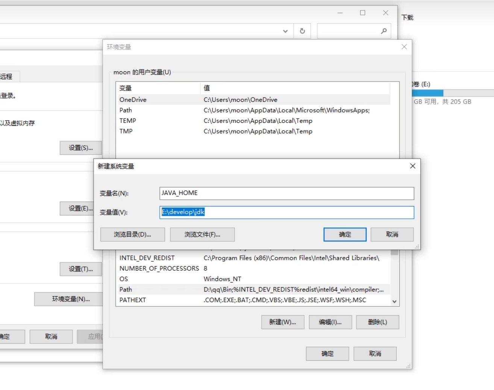

[toc]

## 环境变量

直接在一个路径不对的地方启动不在这的exe是不行的，但是把对应的exe加入环境变量即可

Windows下：

 

在**系统**环境变量的PATH里面加对应的exe路径，这样当前路径下没有对应exe，就从环境变量从上到下依次找

 

### 引用环境变量

新建一个系统变量和对应的路径



 再在path里面引用

 

相当于C:\Program Files\Java\jdk-21\bin

重新配是因为JDK自动给的路径工具包不是很全

## java和javac

`javac` 和 `java` 是Java编程语言中两个非常重要的命令，它们分别用于编译和运行Java程序。

1. **javac**：
   - `javac` 是Java编译器的命令行工具，用于将Java源代码（通常是`.java`文件）编译成Java字节码（`.class`文件）。字节码是一种中间形式，它不能直接在操作系统上运行，但是可以被Java虚拟机（JVM）执行。
   
   - 例如，如果你有一个名为`HelloWorld.java`的Java源文件，你可以使用以下命令来编译它：
     ```
     javac HelloWorld.java
     ```
     这将生成一个名为`HelloWorld.class`的字节码文件。

2. **java**：
   - `java` 是Java运行时环境（JRE）的一部分，用于运行编译后的Java字节码文件。它启动Java虚拟机（JVM），JVM负责加载字节码文件，并在计算机上执行它们。
   
   - 例如，一旦你编译了`HelloWorld.java`文件并得到了`HelloWorld.class`文件，你可以使用以下命令来运行这个程序：
     ```
     java HelloWorld
     ```
     这将执行`HelloWorld.class`文件中的代码。

简而言之，`javac`用于编译Java程序，而`java`用于运行编译后的Java程序。